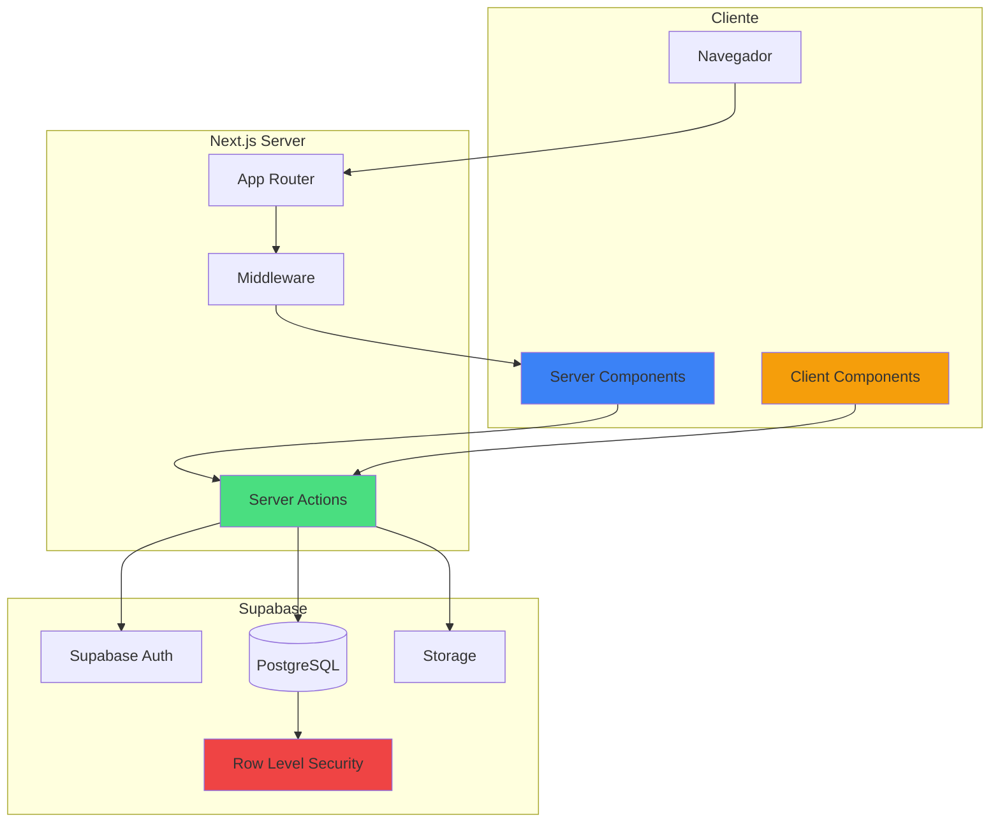

# Arquitetura da Plataforma de Advocate Marketing

## Visão Geral

Esta plataforma foi desenvolvida para gerenciar e engajar advocates de marca, permitindo que eles participem de desafios, eventos, criem posts, e sejam recompensados por suas contribuições. A arquitetura foi projetada para ser moderna, escalável e segura, utilizando as melhores práticas de desenvolvimento com Next.js e Supabase.

## Stack Tecnológica

### Frontend
- **Next.js 14** - Framework React com App Router
  - Server Components por padrão para melhor performance
  - Client Components quando necessário para interatividade
  - Renderização híbrida (SSR, SSG, ISR)
- **React 18** - Biblioteca para construção de interfaces
- **TypeScript 5** - Tipagem estática para maior segurança no código
- **Tailwind CSS 3** - Framework de estilização utilitária

### Backend & Database
- **Supabase** - Backend as a Service
  - PostgreSQL como banco de dados
  - Autenticação integrada (OAuth com Google)
  - Row Level Security (RLS) para segurança granular
  - Storage para arquivos
  - Real-time subscriptions (quando necessário)

### Ferramentas e Bibliotecas
- **@supabase/ssr** - Integração do Supabase com Next.js App Router
- **clsx** e **tailwind-merge** - Utilitários para classes CSS
- **ESLint** - Linting e qualidade de código

## Princípios Arquiteturais

### 1. Server-First Architecture
Por padrão, todos os componentes são **Server Components**, que:
- Executam no servidor
- Não incluem JavaScript no bundle do cliente
- Têm acesso direto ao banco de dados
- Melhoram performance e SEO

**Client Components** são usados apenas quando necessário para:
- Interatividade do usuário (formulários complexos)
- Hooks do React (useState, useEffect, etc.)
- Eventos do navegador (onClick, onChange, etc.)
- APIs do navegador (localStorage, etc.)

### 2. Server Actions
Toda a lógica de negócios e manipulação de dados é implementada em **Server Actions**:
- Funções assíncronas marcadas com `'use server'`
- Executam no servidor de forma segura
- Validação de dados no servidor
- Integração direta com Supabase
- Tratamento de erros consistente

### 3. Segurança em Camadas
- **Row Level Security (RLS)** obrigatório em todas as tabelas
- Políticas de acesso granulares por role (admin, advocate)
- Autenticação via Supabase Auth
- Validação de dados no servidor
- Não exposição de chaves ou dados sensíveis no cliente

### 4. Separação de Responsabilidades
- **Componentes**: Apenas UI e composição
- **Server Actions**: Lógica de negócios e dados
- **Types**: Contratos de dados entre camadas
- **Hooks**: Lógica reutilizável do cliente
- **Contexts**: Estado global quando necessário

## Estrutura de Diretórios

```
advocate-platform/
├── src/
│   ├── app/                        # Estrutura de rotas (App Router)
│   │   ├── (auth)/                 # Grupo de rotas de autenticação
│   │   │   ├── registro/           # Página de registro
│   │   │   └── layout.tsx          # Layout para rotas de auth
│   │   ├── (dashboard)/            # Grupo de rotas protegidas
│   │   │   ├── desafios/           # Listagem e detalhes de desafios
│   │   │   ├── perfil/             # Perfil do usuário
│   │   │   └── admin/              # Área administrativa
│   │   │       ├── desafios/       # Gestão de desafios
│   │   │       ├── posts/          # Moderação de posts
│   │   │       ├── usuarios/       # Gestão de usuários
│   │   │       ├── premios/        # Gestão de recompensas
│   │   │       └── eventos/        # Gestão de eventos
│   │   ├── auth/                   # Callbacks de autenticação
│   │   ├── admin/                  # Login administrativo
│   │   ├── login/                  # Login de advocates
│   │   └── layout.tsx              # Layout root da aplicação
│   │
│   ├── components/                 # Componentes React reutilizáveis
│   │   ├── ui/                     # Componentes de UI base
│   │   ├── home/                   # Componentes da home page
│   │   ├── posts/                  # Componentes relacionados a posts
│   │   ├── auth/                   # Componentes de autenticação
│   │   ├── layout/                 # Componentes de layout (Header, etc.)
│   │   ├── challenges/             # Componentes de desafios
│   │   └── events/                 # Componentes de eventos
│   │
│   ├── actions/                    # Server Actions (lógica de negócios)
│   │   ├── admin.ts                # Ações administrativas
│   │   ├── auth.ts                 # Ações de autenticação
│   │   ├── challenges.ts           # Lógica de desafios
│   │   ├── events.ts               # Lógica de eventos
│   │   ├── posts.ts                # Lógica de posts
│   │   ├── profile.ts              # Lógica de perfil
│   │   ├── rewards.ts              # Lógica de recompensas
│   │   ├── migrations.ts           # Migrações de dados
│   │   └── index.ts                # Exportações centralizadas
│   │
│   ├── lib/                        # Bibliotecas e utilitários
│   │   ├── supabase/               # Configurações do Supabase
│   │   │   ├── client.ts           # Cliente Supabase para Client Components
│   │   │   ├── server.ts           # Cliente Supabase para Server Components
│   │   │   └── ...                 # Outros utilitários Supabase
│   │   ├── constants.ts            # Constantes da aplicação
│   │   ├── gemini.ts               # Integração com Gemini AI
│   │   └── utils.ts                # Funções utilitárias gerais
│   │
│   ├── types/                      # Definições de tipos TypeScript
│   │   ├── index.ts                # Tipos gerais e exportações
│   │   ├── post.ts                 # Tipos relacionados a posts
│   │   └── profile.ts              # Tipos relacionados a perfis
│   │
│   ├── contexts/                   # React Contexts
│   │   └── AuthContext.tsx         # Contexto de autenticação
│   │
│   ├── hooks/                      # Custom React Hooks
│   │
│   └── middleware.ts               # Middleware do Next.js (proteção de rotas)
│
├── docs/                           # Documentação da arquitetura
│   ├── ARCHITECTURE.md             # Este arquivo (visão geral)
│   ├── flows/                      # Diagramas de fluxo de dados
│   ├── COMPONENTS.md               # Padrões de componentes
│   ├── SERVER_ACTIONS.md           # Documentação de Server Actions
│   ├── SECURITY_RLS.md             # Políticas de segurança RLS
│   ├── DATABASE.md                 # Modelo de dados e ERD
│   └── README.md                   # Índice da documentação
│
├── migrations/                     # Scripts SQL de migração
├── public/                         # Arquivos estáticos
├── .env.local                      # Variáveis de ambiente (não versionado)
└── package.json                    # Dependências do projeto
```

## Módulos Principais

### 1. Autenticação (Auth)
- Login via OAuth (Google)
- Gestão de sessões com Supabase Auth
- Middleware para proteção de rotas
- Diferenciação entre roles: `admin` e `advocate`

**Documentação detalhada:** [flows/DATA_FLOW_AUTH.md](./flows/DATA_FLOW_AUTH.md)

### 2. Posts e Feed
- Criação de posts por advocates
- Moderação de posts por admins
- Sistema de likes e comentários
- Feed personalizado

**Documentação detalhada:** [flows/DATA_FLOW_POSTS.md](./flows/DATA_FLOW_POSTS.md)

### 3. Desafios (Challenges)
- Criação e gestão de desafios por admins
- Participação de advocates
- Submissão de evidências
- Seleção de vencedores
- Sistema de recompensas

**Documentação detalhada:** [flows/DATA_FLOW_CHALLENGES.md](./flows/DATA_FLOW_CHALLENGES.md)

### 4. Eventos (Events)
- Criação e gestão de eventos por admins
- Registro de participação
- Verificação de nível de advocate
- Histórico de participações

**Documentação detalhada:** [flows/DATA_FLOW_EVENTS.md](./flows/DATA_FLOW_EVENTS.md)

### 5. Perfil e Recompensas
- Gestão de perfil do usuário
- Sistema de níveis de advocate
- Resgate de recompensas
- Histórico de participações e conquistas

**Documentação detalhada:** [flows/DATA_FLOW_PROFILE_REWARDS.md](./flows/DATA_FLOW_PROFILE_REWARDS.md)

### 6. Administração
- Dashboard administrativo
- Gestão de usuários
- Moderação de conteúdo
- Gestão de desafios, eventos e recompensas
- Análise de métricas

## Fluxo de Dados Geral



### Legenda:
- 🟦 **Server Components** - Renderização no servidor
- 🟧 **Client Components** - Interatividade no cliente
- 🟩 **Server Actions** - Lógica de negócios
- 🟥 **RLS** - Camada de segurança

## Padrões de Desenvolvimento

### Nomenclatura
- **Componentes**: PascalCase (`UserProfile`, `PostCard`)
- **Funções**: camelCase (`getUserProfile`, `createPost`)
- **Arquivos**: kebab-case para páginas, PascalCase para componentes
- **Tipos**: PascalCase com interfaces (`User`, `Post`, `Challenge`)

### Comentários e Documentação
- **Comentários em português** para descrever lógica de negócio
- **Nomes de variáveis e funções em inglês** (padrão da indústria)
- **Documentação inline** para decisões arquiteturais importantes
- **JSDoc** para funções públicas e APIs

### TypeScript
- Tipagem estrita (`strict: true`)
- Evitar `any`, preferir `unknown` quando necessário
- Interfaces para objetos, Types para uniões e composições
- Tipos compartilhados na pasta `src/types`

## Segurança

### Row Level Security (RLS)
Todas as tabelas do Supabase possuem políticas RLS ativas:
- **Leitura**: Baseada em role e ownership
- **Escrita**: Validação de permissões por role
- **Atualização**: Apenas owner ou admin
- **Deleção**: Apenas owner ou admin

**Documentação detalhada:** [SECURITY_RLS.md](./SECURITY_RLS.md)

### Autenticação e Autorização
- Autenticação via Supabase Auth (OAuth Google)
- Middleware verifica sessão em rotas protegidas
- Server Actions validam permissões antes de executar
- Não há exposição de lógica sensível no cliente

**Documentação detalhada:** [flows/DATA_FLOW_AUTH.md](./flows/DATA_FLOW_AUTH.md) e [AUTHORIZATION.md](./AUTHORIZATION.md)

## Banco de Dados

O banco de dados utiliza PostgreSQL através do Supabase com as seguintes tabelas principais:
- `profiles` - Perfis de usuários (advocates e admins)
- `posts` - Posts criados por advocates
- `challenges` - Desafios criados por admins
- `challenge_participations` - Participações em desafios
- `events` - Eventos criados por admins
- `event_participations` - Participações em eventos
- `rewards` - Recompensas disponíveis
- `reward_claims` - Resgates de recompensas

**Documentação detalhada:** [DATABASE.md](./DATABASE.md)

## Performance

### Otimizações Implementadas
- **Server Components** por padrão (menos JavaScript no cliente)
- **Lazy Loading** de Client Components quando apropriado
- **Caching** de dados no servidor via React Cache
- **Streaming** de UI com Suspense
- **Imagens otimizadas** com next/image

### Monitoramento
- Logs de erros em Server Actions
- Métricas de performance do Next.js
- Monitoramento do Supabase Dashboard

## Testes

### Estratégia de Testes
- **Testes unitários** para funções utilitárias
- **Testes de integração** para Server Actions
- **Testes E2E** para fluxos críticos (em planejamento)

## Deploy

### Ambiente de Produção
- **Frontend**: Vercel (recomendado para Next.js)
- **Backend/Database**: Supabase Cloud
- **CI/CD**: GitHub Actions (a ser configurado)

### Variáveis de Ambiente
```env
NEXT_PUBLIC_SUPABASE_URL=sua_url_supabase
NEXT_PUBLIC_SUPABASE_ANON_KEY=sua_chave_anonima
SUPABASE_SERVICE_ROLE_KEY=sua_chave_servico (apenas servidor)
```

## Recursos Adicionais

### Documentação Complementar
- [Padrões de Componentes](./COMPONENTS.md)
- [Server Actions](./SERVER_ACTIONS.md)
- [Segurança e RLS](./SECURITY_RLS.md)
- [Modelo de Dados](./DATABASE.md)
- [Dependências entre Módulos](./MODULE_DEPENDENCIES.md)
- [Índice Completo](./README.md)

### Recursos Externos
- [Documentação Next.js 14](https://nextjs.org/docs)
- [Documentação Supabase](https://supabase.com/docs)
- [Documentação React Server Components](https://react.dev/blog/2023/03/22/react-labs-what-we-have-been-working-on-march-2023#react-server-components)
- [Tailwind CSS](https://tailwindcss.com/docs)

## Contribuindo

Para contribuir com o projeto:
1. Leia esta documentação de arquitetura
2. Familiarize-se com [CLAUDE.md](../CLAUDE.md) para padrões de código
3. Siga os princípios arquiteturais estabelecidos
4. Mantenha a documentação atualizada ao fazer mudanças significativas
5. Adicione testes para novas funcionalidades

## Changelog da Documentação

- **2026-01-07**: Criação da documentação inicial de arquitetura

---

**Manutenção**: Este documento deve ser atualizado sempre que houver mudanças arquiteturais significativas no projeto.
