# Autorização: Admin vs Advocate

## 📋 Índice

1. [Visão Geral](#visão-geral)
2. [Roles e Hierarquia](#roles-e-hierarquia)
3. [Comparação Visual](#comparação-visual)
4. [Matriz de Funcionalidades](#matriz-de-funcionalidades)
5. [Funcionalidades Admin](#funcionalidades-admin)
6. [Funcionalidades Advocate](#funcionalidades-advocate)
7. [Fluxo de Autorização](#fluxo-de-autorização)
8. [Implementação Técnica](#implementação-técnica)
9. [Controle de Rotas](#controle-de-rotas)
10. [Diferenças de UI/UX](#diferenças-de-uiux)
11. [Exemplos de Código](#exemplos-de-código)

---

## Visão Geral

A plataforma de Advocate Marketing possui **dois perfis de acesso** com permissões distintas:

### 🎯 Roles Disponíveis

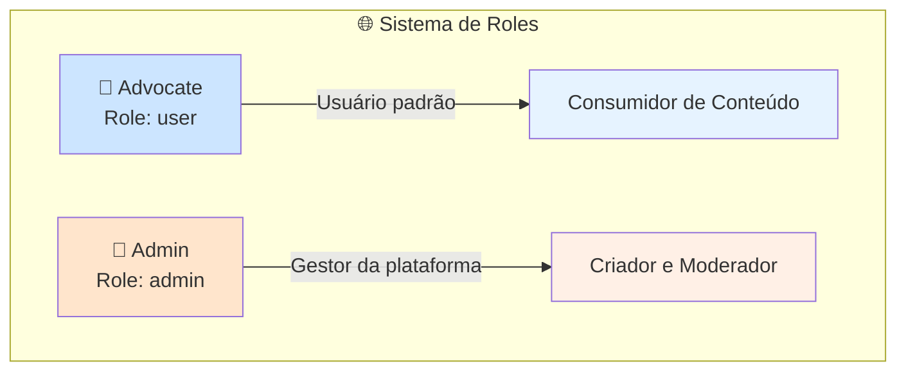
```mermaid
graph TB
    subgraph "🌐 Sistema de Roles"
        A[👤 Advocate<br/>Role: user] --> |Usuário padrão| B[Consumidor de Conteúdo]
        C[👑 Admin<br/>Role: admin] --> |Gestor da plataforma| D[Criador e Moderador]
    end

    style A fill:#cce5ff
    style C fill:#ffe5cc
    style B fill:#e6f3ff
    style D fill:#fff0e6
```

### 📊 Estatísticas de Autorização

- **Perfis de Acesso**: 2 (Advocate, Admin)
- **Rotas Públicas**: 3 (/login, /cadastro, páginas marketing)
- **Rotas Protegidas**: 15+ (requerem autenticação)
- **Rotas Admin**: 6 (/admin/*)
- **Validações de Role**: 3 camadas (UI, Server Actions, RLS)

---

## Roles e Hierarquia

### 🏗️ Estrutura Hierárquica

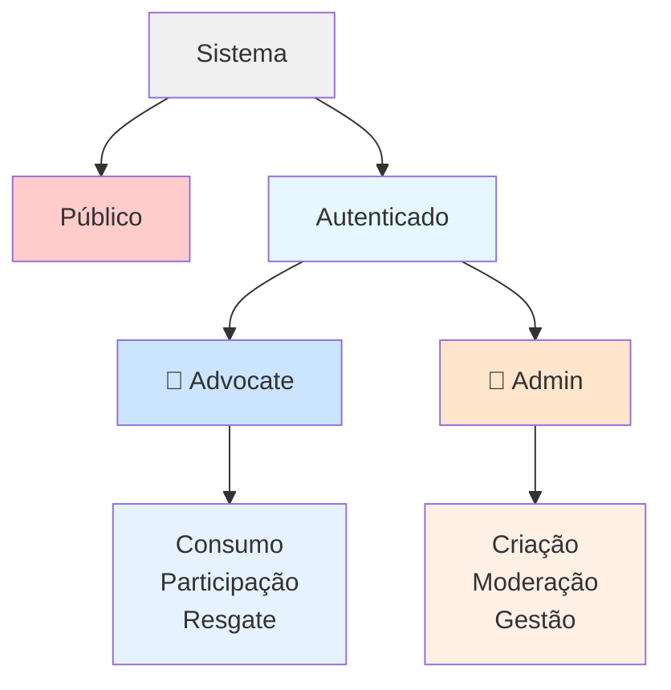
```mermaid
graph TD
    A[Sistema] --> B[Público]
    A --> C[Autenticado]
    C --> D[👤 Advocate]
    C --> E[👑 Admin]

    D --> F[Consumo<br/>Participação<br/>Resgate]
    E --> G[Criação<br/>Moderação<br/>Gestão]

    style A fill:#f0f0f0
    style B fill:#ffcccc
    style C fill:#e6f7ff
    style D fill:#cce5ff
    style E fill:#ffe5cc
    style F fill:#e6f3ff
    style G fill:#fff0e6
```

### 📋 Definição de Roles

#### 👤 Advocate (Role: `user`)

**Definição**: Usuário padrão da plataforma que participa das atividades, acumula pontos e resgata recompensas.

**Características**:
- Role padrão ao criar conta
- Foco em participação e engajamento
- Acesso limitado a funcionalidades de criação
- Não pode moderar conteúdo de terceiros

#### 👑 Admin (Role: `admin`)

**Definição**: Gestor da plataforma com poderes de criação, moderação e gestão de todos os recursos.

**Características**:
- Role definido manualmente no banco de dados
- Acesso total a todas funcionalidades
- Pode criar desafios, eventos e recompensas
- Pode moderar posts e participações
- Dashboard administrativo exclusivo

---

## Comparação Visual

### 🎨 Visão Geral Comparativa

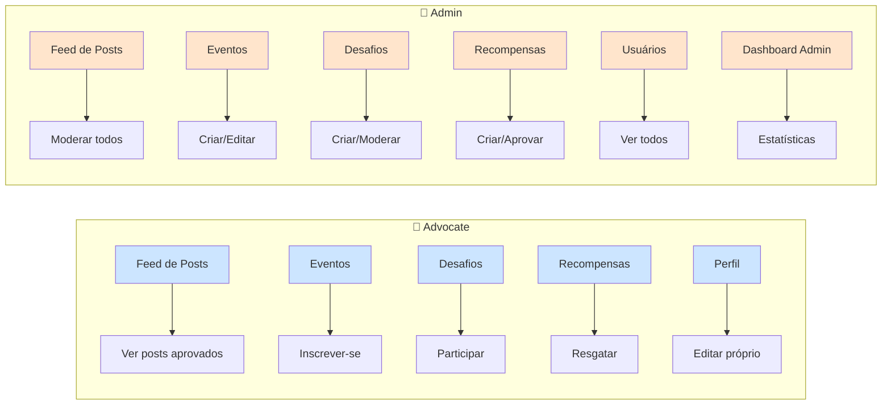
```mermaid
graph LR
    subgraph "👤 Advocate"
        A1[Feed de Posts] --> A2[Ver posts aprovados]
        A3[Eventos] --> A4[Inscrever-se]
        A5[Desafios] --> A6[Participar]
        A7[Recompensas] --> A8[Resgatar]
        A9[Perfil] --> A10[Editar próprio]
    end

    subgraph "👑 Admin"
        B1[Feed de Posts] --> B2[Moderar todos]
        B3[Eventos] --> B4[Criar/Editar]
        B5[Desafios] --> B6[Criar/Moderar]
        B7[Recompensas] --> B8[Criar/Aprovar]
        B9[Usuários] --> B10[Ver todos]
        B11[Dashboard Admin] --> B12[Estatísticas]
    end

    style A1 fill:#cce5ff
    style A3 fill:#cce5ff
    style A5 fill:#cce5ff
    style A7 fill:#cce5ff
    style A9 fill:#cce5ff

    style B1 fill:#ffe5cc
    style B3 fill:#ffe5cc
    style B5 fill:#ffe5cc
    style B7 fill:#ffe5cc
    style B9 fill:#ffe5cc
    style B11 fill:#ffe5cc
```

### 📊 Capacidades por Role

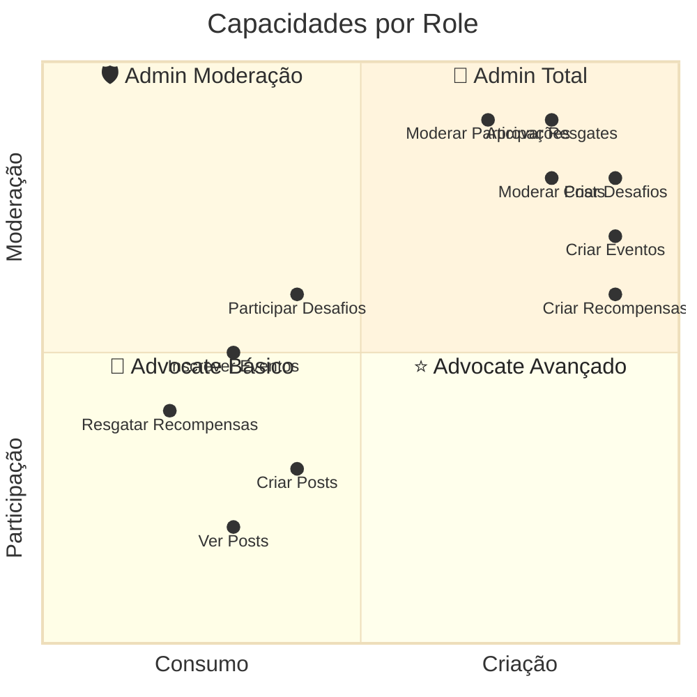
```mermaid
%%{init: {'theme':'base'}}%%
quadrantChart
    title Capacidades por Role
    x-axis Consumo --> Criação
    y-axis Participação --> Moderação
    quadrant-1 "👑 Admin Total"
    quadrant-2 "🛡️ Admin Moderação"
    quadrant-3 "👤 Advocate Básico"
    quadrant-4 "⭐ Advocate Avançado"

    Ver Posts: [0.3, 0.2]
    Criar Posts: [0.4, 0.3]
    Moderar Posts: [0.8, 0.8]

    Inscrever Eventos: [0.3, 0.5]
    Criar Eventos: [0.9, 0.7]

    Participar Desafios: [0.4, 0.6]
    Criar Desafios: [0.9, 0.8]
    Moderar Participações: [0.7, 0.9]

    Resgatar Recompensas: [0.2, 0.4]
    Criar Recompensas: [0.9, 0.6]
    Aprovar Resgates: [0.8, 0.9]
```

---

## Matriz de Funcionalidades

### 📋 Tabela Completa de Permissões

| Funcionalidade | 👤 Advocate | 👑 Admin | Observações |
|----------------|-------------|----------|-------------|
| **Posts** |
| Ver posts aprovados | ✅ | ✅ | Todos veem posts aprovados |
| Ver próprios posts | ✅ | ✅ | Independente do status |
| Criar posts | ✅ | ✅ | Todos podem criar |
| Editar próprios posts | ✅ | ✅ | Antes da aprovação |
| Deletar próprios posts | ✅ | ✅ | Antes da aprovação |
| **Ver posts pendentes** | ❌ | ✅ | Apenas admin |
| **Aprovar posts** | ❌ | ✅ | Apenas admin |
| **Rejeitar posts** | ❌ | ✅ | Apenas admin |
| **Deletar posts de terceiros** | ❌ | ✅ | Apenas admin |
| Dar likes | ✅ | ✅ | Em posts aprovados |
| Comentar | ✅ | ✅ | Em posts aprovados |
| **Eventos** |
| Ver eventos ativos | ✅ | ✅ | Eventos com `is_active=true` |
| Ver detalhes de evento | ✅ | ✅ | Informações completas |
| Inscrever-se em evento | ✅ | ✅ | Com validação de nível |
| Cancelar própria inscrição | ✅ | ✅ | Antes do evento |
| **Ver todos eventos** | ❌ | ✅ | Incluindo inativos |
| **Criar eventos** | ❌ | ✅ | Apenas admin |
| **Editar eventos** | ❌ | ✅ | Apenas admin |
| **Ativar/desativar eventos** | ❌ | ✅ | Toggle `is_active` |
| **Ver todas inscrições** | ❌ | ✅ | De todos usuários |
| **Confirmar presença** | ❌ | ✅ | Check-in no evento |
| **Desafios** |
| Ver desafios ativos | ✅ | ✅ | Desafios com `is_active=true` |
| Ver ranking | ✅ | ✅ | Participações aprovadas |
| Participar de desafio | ✅ | ✅ | Com validações |
| Enviar evidências | ✅ | ✅ | Vídeo + resultado |
| Ver próprias participações | ✅ | ✅ | Todas as próprias |
| **Ver todos desafios** | ❌ | ✅ | Incluindo inativos |
| **Criar desafios** | ❌ | ✅ | Apenas admin |
| **Editar desafios** | ❌ | ✅ | Apenas admin |
| **Ativar/desativar desafios** | ❌ | ✅ | Toggle `is_active` |
| **Ver todas participações** | ❌ | ✅ | Status: pending, approved, rejected |
| **Aprovar participações** | ❌ | ✅ | Credita moedas |
| **Rejeitar participações** | ❌ | ✅ | Com razão |
| **Registrar vencedores** | ❌ | ✅ | Para desafios de sorteio |
| **Marcar prêmio como enviado** | ❌ | ✅ | Controle de PIX |
| **Recompensas** |
| Ver recompensas ativas | ✅ | ✅ | Com `is_active=true` |
| Ver estoque disponível | ✅ | ✅ | Quantidade disponível |
| Resgatar recompensa | ✅ | ✅ | Com saldo suficiente |
| Ver próprios resgates | ✅ | ✅ | Histórico pessoal |
| Cancelar resgate pendente | ✅ | ✅ | Apenas status `pending` |
| **Ver todas recompensas** | ❌ | ✅ | Incluindo inativas |
| **Criar recompensas** | ❌ | ✅ | Apenas admin |
| **Editar recompensas** | ❌ | ✅ | Apenas admin |
| **Ativar/desativar recompensas** | ❌ | ✅ | Toggle `is_active` |
| **Ver todos resgates** | ❌ | ✅ | De todos usuários |
| **Aprovar resgates** | ❌ | ✅ | Status: pending → approved |
| **Marcar como enviado** | ❌ | ✅ | Status: approved → shipped |
| **Confirmar entrega** | ❌ | ✅ | Status: shipped → delivered |
| **Perfil e Moedas** |
| Ver próprio perfil | ✅ | ✅ | Estatísticas completas |
| Editar próprio perfil | ✅ | ✅ | Nome, bio, redes sociais |
| Ver perfis públicos | ✅ | ✅ | De outros usuários |
| Ver próprio saldo de moedas | ✅ | ✅ | Em `user_coins` |
| Ver próprias transações | ✅ | ✅ | Histórico de moedas |
| **Ver todos perfis** | ❌ | ✅ | Lista completa |
| **Ver todos saldos** | ❌ | ✅ | Relatórios |
| **Adicionar moedas manualmente** | ❌ | ✅ | Apenas via admin RPC |
| **Dashboard Admin** |
| **Acessar /admin** | ❌ | ✅ | Rota protegida |
| **Ver estatísticas gerais** | ❌ | ✅ | Posts, eventos, usuários |
| **Gerar relatórios** | ❌ | ✅ | Analytics |

### 🎯 Resumo de Permissões

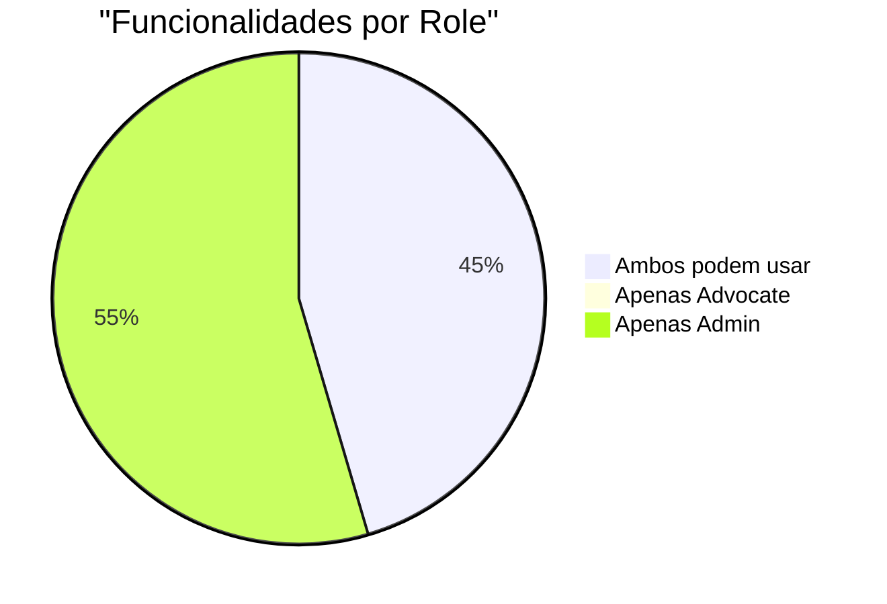
```mermaid
pie title "Funcionalidades por Role"
    "Ambos podem usar" : 25
    "Apenas Advocate" : 0
    "Apenas Admin" : 30
```

**Observações**:
- **Advocate**: 25 funcionalidades (foco em consumo e participação)
- **Admin**: 55 funcionalidades (25 comuns + 30 exclusivas)
- **Admin tem 2.2x mais permissões** que Advocate

---

## Funcionalidades Admin

### 👑 Poderes Administrativos

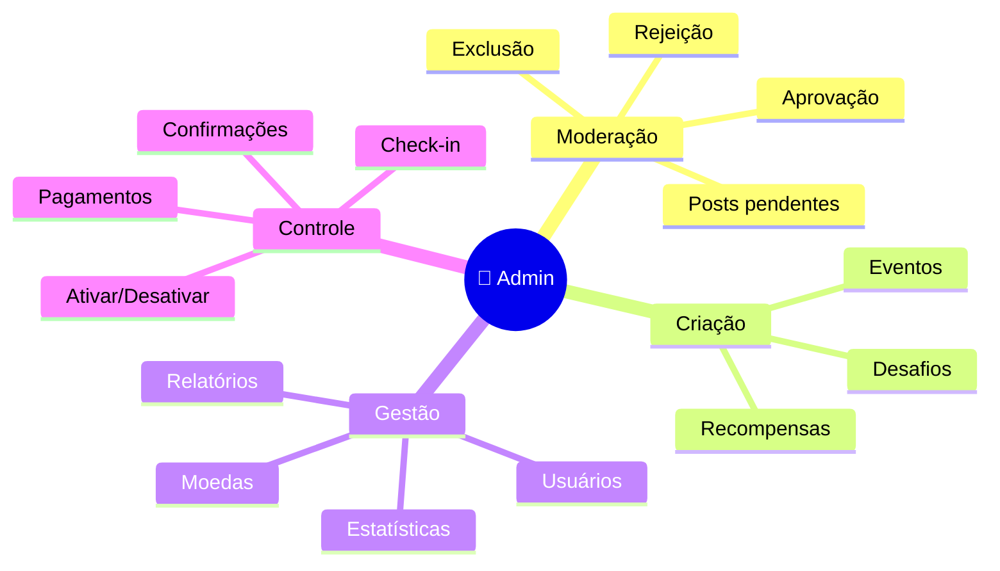
```mermaid
mindmap
  root((👑 Admin))
    Moderação
      Posts pendentes
      Aprovação
      Rejeição
      Exclusão
    Criação
      Eventos
      Desafios
      Recompensas
    Gestão
      Usuários
      Moedas
      Estatísticas
      Relatórios
    Controle
      Ativar/Desativar
      Check-in
      Confirmações
      Pagamentos
```

### 📋 Detalhamento de Funcionalidades Admin

#### 1. 📝 Moderação de Posts

**Rotas Admin**: `/admin/posts`

**Funcionalidades**:
- Ver todos posts (pending, approved, rejected)
- Aprovar posts pendentes
- Rejeitar posts com razão
- Deletar qualquer post

**Diagrama de Fluxo**:

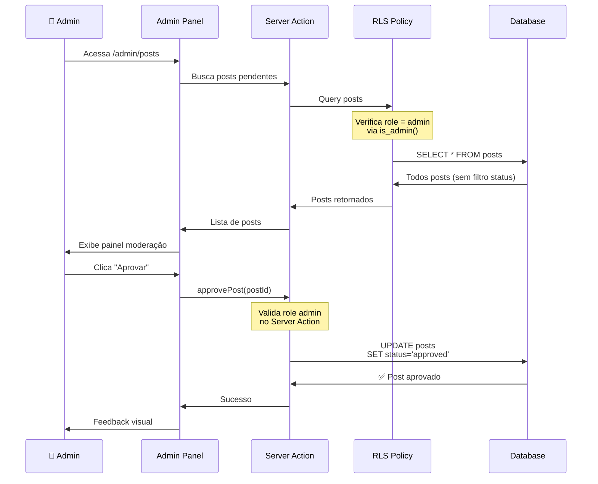
```mermaid
sequenceDiagram
    participant A as 👑 Admin
    participant UI as Admin Panel
    participant SA as Server Action
    participant RLS as RLS Policy
    participant DB as Database

    A->>UI: Acessa /admin/posts
    UI->>SA: Busca posts pendentes
    SA->>RLS: Query posts

    Note over RLS: Verifica role = admin<br/>via is_admin()

    RLS->>DB: SELECT * FROM posts
    DB->>RLS: Todos posts (sem filtro status)
    RLS->>SA: Posts retornados
    SA->>UI: Lista de posts
    UI->>A: Exibe painel moderação

    A->>UI: Clica "Aprovar"
    UI->>SA: approvePost(postId)

    Note over SA: Valida role admin<br/>no Server Action

    SA->>DB: UPDATE posts<br/>SET status='approved'
    DB->>SA: ✅ Post aprovado
    SA->>UI: Sucesso
    UI->>A: Feedback visual
```

**Server Action**:
```typescript
// src/actions/posts.ts
export async function approvePost(postId: string): Promise<ActionResponse> {
  const supabase = await createClient();
  const { data: { user } } = await supabase.auth.getUser();

  if (!user) {
    return { error: 'Usuário não autenticado' };
  }

  // ✅ Validação de role no Server Action
  const { data: userData } = await supabase
    .from('users')
    .select('role')
    .eq('id', user.id)
    .single();

  if (userData?.role !== 'admin') {
    return { error: 'Apenas admins podem aprovar' };
  }

  const { error } = await supabase
    .from('posts')
    .update({
      status: 'approved',
      approved_by: user.id,
      approved_at: new Date().toISOString(),
    })
    .eq('id', postId);

  if (error) return { error: 'Erro ao aprovar post' };

  revalidatePath('/feed');
  return { success: true };
}
```

#### 2. 📅 Gestão de Eventos

**Rotas Admin**: `/admin/eventos`, `/admin/eventos/novo`

**Funcionalidades**:
- Criar novos eventos (virtual, presencial, híbrido)
- Editar eventos existentes
- Ativar/desativar eventos via toggle
- Ver todas inscrições
- Confirmar presença (check-in)

**Fluxo de Criação**:

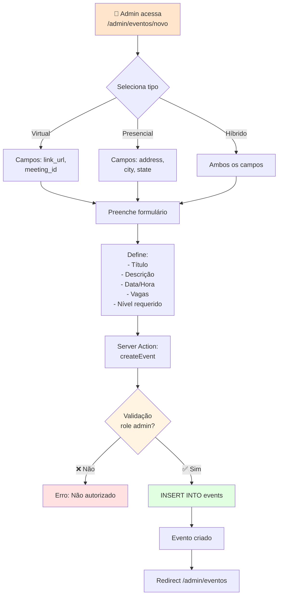
```mermaid
flowchart TD
    A[👑 Admin acessa<br/>/admin/eventos/novo] --> B{Seleciona tipo}
    B -->|Virtual| C[Campos: link_url,<br/>meeting_id]
    B -->|Presencial| D[Campos: address,<br/>city, state]
    B -->|Híbrido| E[Ambos os campos]

    C --> F[Preenche formulário]
    D --> F
    E --> F

    F --> G[Define:<br/>- Título<br/>- Descrição<br/>- Data/Hora<br/>- Vagas<br/>- Nível requerido]

    G --> H[Server Action:<br/>createEvent]

    H --> I{Validação<br/>role admin?}
    I -->|❌ Não| J[Erro: Não autorizado]
    I -->|✅ Sim| K[INSERT INTO events]

    K --> L[Evento criado]
    L --> M[Redirect /admin/eventos]

    style A fill:#ffe5cc
    style I fill:#fff4e1
    style K fill:#e1ffe1
    style J fill:#ffe1e1
```

#### 3. 🎯 Gestão de Desafios

**Rotas Admin**: `/admin/desafios`, `/admin/desafios/novo`, `/admin/desafios/[id]`

**Funcionalidades**:
- Criar desafios (físico, engajamento, participe)
- Editar desafios existentes
- Ativar/desativar desafios
- Ver todas participações (pending, approved, rejected)
- Aprovar/rejeitar participações
- Creditar moedas customizadas
- Registrar vencedores (sorteios)
- Marcar prêmios como pagos

**Fluxo de Moderação**:

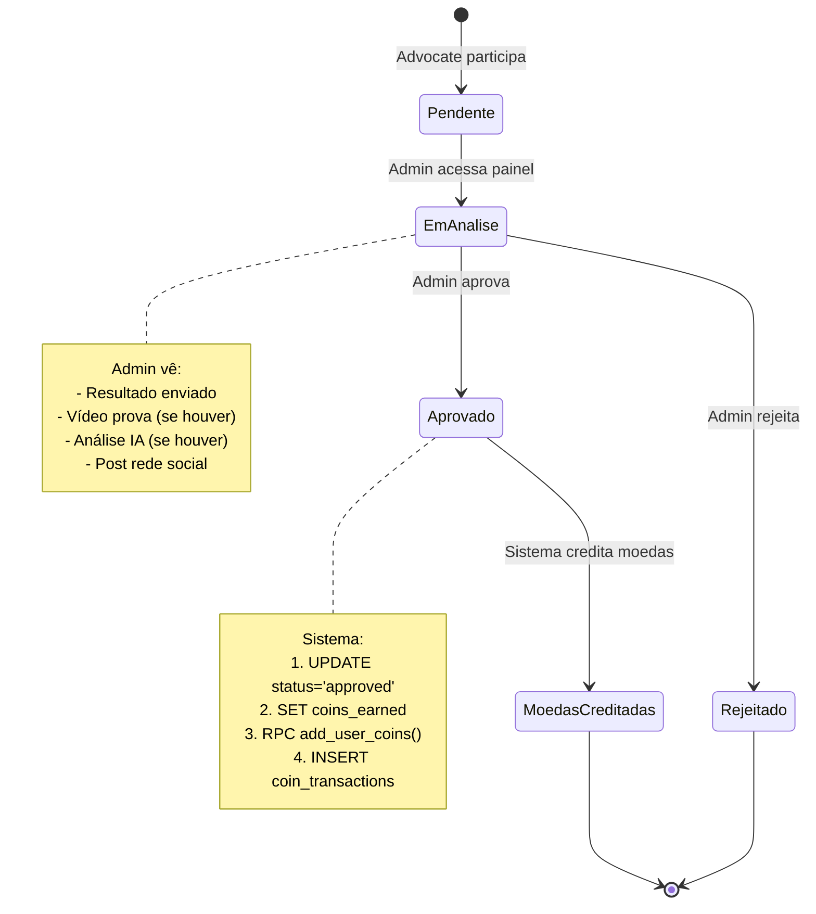
```mermaid
stateDiagram-v2
    [*] --> Pendente: Advocate participa

    Pendente --> EmAnalise: Admin acessa painel

    EmAnalise --> Aprovado: Admin aprova
    EmAnalise --> Rejeitado: Admin rejeita

    Aprovado --> MoedasCreditadas: Sistema credita moedas
    MoedasCreditadas --> [*]

    Rejeitado --> [*]

    note right of EmAnalise
        Admin vê:
        - Resultado enviado
        - Vídeo prova (se houver)
        - Análise IA (se houver)
        - Post rede social
    end note

    note right of Aprovado
        Sistema:
        1. UPDATE status='approved'
        2. SET coins_earned
        3. RPC add_user_coins()
        4. INSERT coin_transactions
    end note
```

#### 4. 🎁 Gestão de Recompensas

**Rotas Admin**: `/admin/premios`

**Funcionalidades**:
- Criar novas recompensas
- Editar recompensas existentes
- Ativar/desativar recompensas
- Controlar estoque
- Ver todos resgates
- Aprovar resgates pendentes
- Marcar como enviado (com tracking)
- Confirmar entrega

**Pipeline de Resgate**:

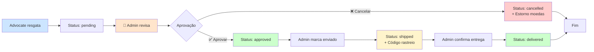
```mermaid
graph LR
    A[Advocate resgata] --> B[Status: pending]
    B --> C[👑 Admin revisa]
    C --> D{Aprovação}
    D -->|✅ Aprovar| E[Status: approved]
    D -->|❌ Cancelar| F[Status: cancelled<br/>+ Estorno moedas]

    E --> G[Admin marca enviado]
    G --> H[Status: shipped<br/>+ Código rastreio]

    H --> I[Admin confirma entrega]
    I --> J[Status: delivered]

    F --> K[Fim]
    J --> K

    style A fill:#cce5ff
    style C fill:#ffe5cc
    style E fill:#ccffcc
    style F fill:#ffcccc
    style H fill:#fff4cc
    style J fill:#ccffcc
```

#### 5. 👥 Gestão de Usuários

**Rotas Admin**: `/admin/usuarios`

**Funcionalidades**:
- Ver lista de todos usuários
- Ver perfis completos
- Ver estatísticas por usuário
- Ver saldos de moedas
- Ver histórico de atividades

**Dashboard Admin**:

```mermaid
graph TB
    subgraph "Dashboard Admin /admin"
        A[📊 Estatísticas Gerais]

        B[📝 Posts Pendentes<br/>Aguardando moderação]
        C[🎯 Desafios Ativos<br/>Participações pendentes]
        D[📅 Eventos<br/>Próximos eventos]
        E[🎁 Recompensas<br/>Resgates pendentes]
        F[👥 Usuários<br/>Total cadastrados]

        A --> B
        A --> C
        A --> D
        A --> E
        A --> F

        B -->|Click| G[/admin/posts]
        C -->|Click| H[/admin/desafios]
        D -->|Click| I[/admin/eventos]
        E -->|Click| J[/admin/premios]
        F -->|Click| K[/admin/usuarios]
    end

    style A fill:#ffe5cc
    style B fill:#fff9e6
    style C fill:#e6f7ff
    style D fill:#e6ffe6
    style E fill:#ffe6f7
    style F fill:#f0e6ff
```

---

## Funcionalidades Advocate

### 👤 Capacidades do Advocate

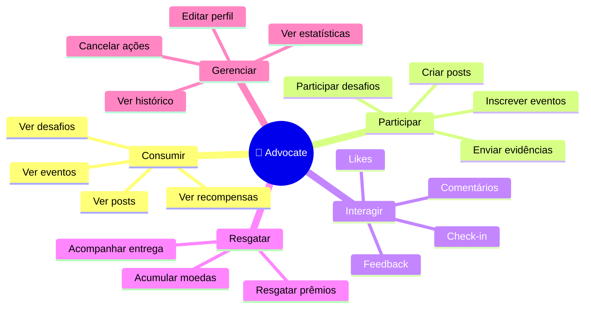
```mermaid
mindmap
  root((👤 Advocate))
    Consumir
      Ver posts
      Ver eventos
      Ver desafios
      Ver recompensas
    Participar
      Criar posts
      Inscrever eventos
      Participar desafios
      Enviar evidências
    Interagir
      Likes
      Comentários
      Check-in
      Feedback
    Resgatar
      Acumular moedas
      Resgatar prêmios
      Acompanhar entrega
    Gerenciar
      Editar perfil
      Ver histórico
      Ver estatísticas
      Cancelar ações
```

### 📋 Detalhamento de Funcionalidades Advocate

#### 1. 📝 Posts e Feed

**Rotas**: `/feed`, `/dashboard`

**O que pode fazer**:
- ✅ Ver todos posts aprovados
- ✅ Ver próprios posts (qualquer status)
- ✅ Criar novos posts
- ✅ Dar likes em posts
- ✅ Comentar posts

**O que NÃO pode fazer**:
- ❌ Ver posts pendentes de outros
- ❌ Aprovar/rejeitar posts
- ❌ Deletar posts de outros

**Fluxo de Criação**:

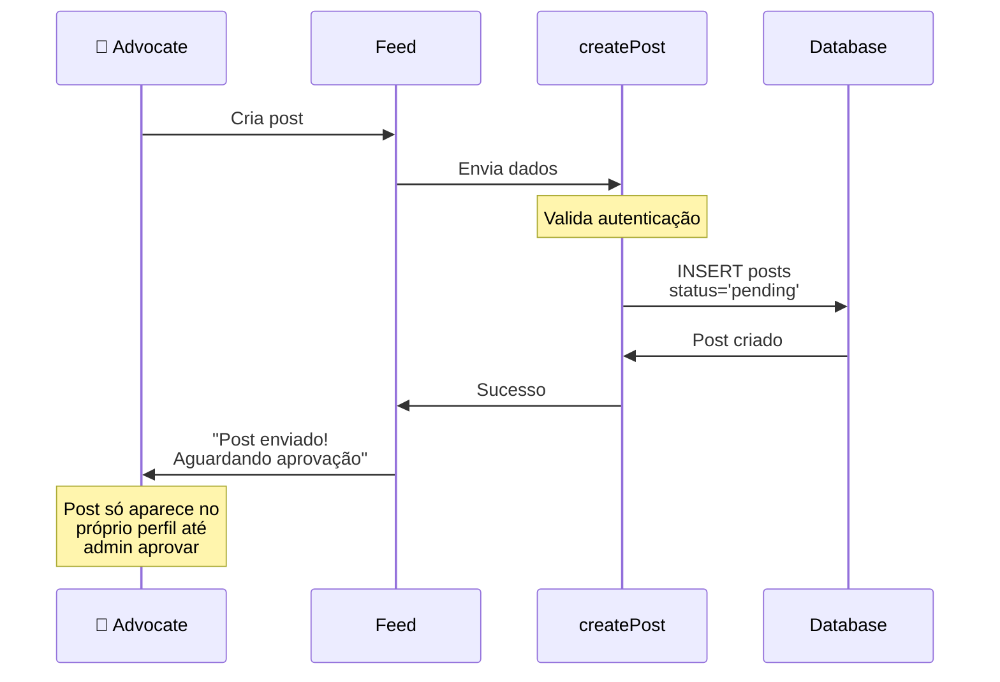
```mermaid
sequenceDiagram
    participant U as 👤 Advocate
    participant UI as Feed
    participant SA as createPost
    participant DB as Database

    U->>UI: Cria post
    UI->>SA: Envia dados

    Note over SA: Valida autenticação

    SA->>DB: INSERT posts<br/>status='pending'
    DB->>SA: Post criado
    SA->>UI: Sucesso
    UI->>U: "Post enviado!<br/>Aguardando aprovação"

    Note over U: Post só aparece no<br/>próprio perfil até<br/>admin aprovar
```

#### 2. 📅 Eventos

**Rotas**: `/eventos`, `/eventos/[id]`

**O que pode fazer**:
- ✅ Ver eventos ativos
- ✅ Ver detalhes de evento
- ✅ Inscrever-se (se nível suficiente)
- ✅ Cancelar própria inscrição
- ✅ Ver próprias inscrições

**O que NÃO pode fazer**:
- ❌ Ver eventos inativos
- ❌ Criar eventos
- ❌ Editar eventos
- ❌ Ver inscrições de outros

**Validações na Inscrição**:

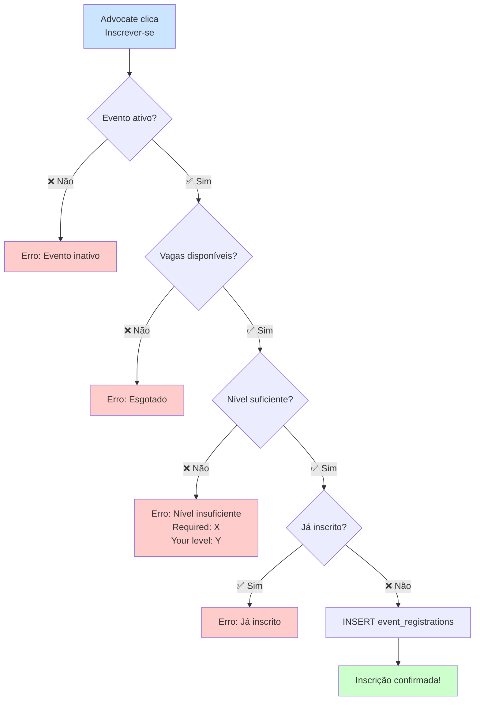
```mermaid
flowchart TD
    A[Advocate clica<br/>Inscrever-se] --> B{Evento ativo?}
    B -->|❌ Não| C[Erro: Evento inativo]
    B -->|✅ Sim| D{Vagas disponíveis?}

    D -->|❌ Não| E[Erro: Esgotado]
    D -->|✅ Sim| F{Nível suficiente?}

    F -->|❌ Não| G[Erro: Nível insuficiente<br/>Required: X<br/>Your level: Y]
    F -->|✅ Sim| H{Já inscrito?}

    H -->|✅ Sim| I[Erro: Já inscrito]
    H -->|❌ Não| J[INSERT event_registrations]

    J --> K[Inscrição confirmada!]

    style A fill:#cce5ff
    style C fill:#ffcccc
    style E fill:#ffcccc
    style G fill:#ffcccc
    style I fill:#ffcccc
    style K fill:#ccffcc
```

#### 3. 🎯 Desafios

**Rotas**: `/desafios`

**O que pode fazer**:
- ✅ Ver desafios ativos
- ✅ Ver ranking público
- ✅ Participar de desafios
- ✅ Enviar evidências (vídeo + resultado)
- ✅ Ver próprias participações
- ✅ Ver status (pending, approved, rejected)

**O que NÃO pode fazer**:
- ❌ Ver desafios inativos
- ❌ Criar desafios
- ❌ Moderar participações
- ❌ Ver participações de outros (status pending)

**Fluxo de Participação**:

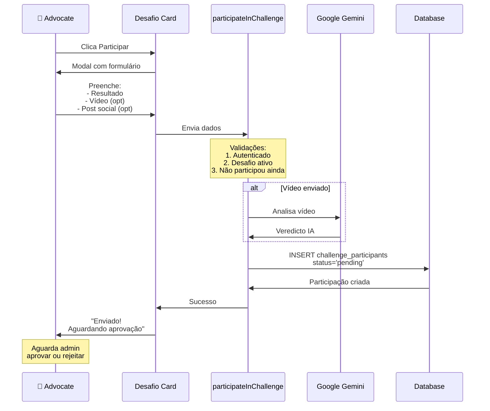
```mermaid
sequenceDiagram
    participant U as 👤 Advocate
    participant UI as Desafio Card
    participant SA as participateInChallenge
    participant AI as Google Gemini
    participant DB as Database

    U->>UI: Clica Participar
    UI->>U: Modal com formulário

    U->>UI: Preenche:<br/>- Resultado<br/>- Vídeo (opt)<br/>- Post social (opt)

    UI->>SA: Envia dados

    Note over SA: Validações:<br/>1. Autenticado<br/>2. Desafio ativo<br/>3. Não participou ainda

    alt Vídeo enviado
        SA->>AI: Analisa vídeo
        AI->>SA: Veredicto IA
    end

    SA->>DB: INSERT challenge_participants<br/>status='pending'
    DB->>SA: Participação criada

    SA->>UI: Sucesso
    UI->>U: "Enviado!<br/>Aguardando aprovação"

    Note over U: Aguarda admin<br/>aprovar ou rejeitar
```

#### 4. 🎁 Recompensas

**Rotas**: `/premios`

**O que pode fazer**:
- ✅ Ver recompensas ativas
- ✅ Ver estoque disponível
- ✅ Resgatar com moedas
- ✅ Ver próprios resgates
- ✅ Cancelar resgate pendente
- ✅ Acompanhar status de entrega

**O que NÃO pode fazer**:
- ❌ Ver recompensas inativas
- ❌ Criar recompensas
- ❌ Aprovar próprio resgate
- ❌ Manipular estoque

**Fluxo de Resgate**:

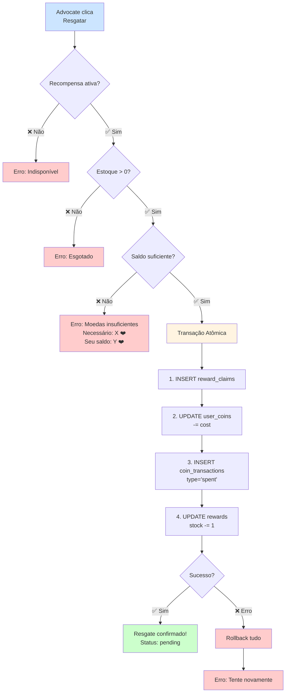
```mermaid
flowchart TD
    A[Advocate clica<br/>Resgatar] --> B{Recompensa ativa?}
    B -->|❌ Não| C[Erro: Indisponível]
    B -->|✅ Sim| D{Estoque > 0?}

    D -->|❌ Não| E[Erro: Esgotado]
    D -->|✅ Sim| F{Saldo suficiente?}

    F -->|❌ Não| G[Erro: Moedas insuficientes<br/>Necessário: X ❤️<br/>Seu saldo: Y ❤️]
    F -->|✅ Sim| H[Transação Atômica]

    H --> I[1. INSERT reward_claims]
    I --> J[2. UPDATE user_coins<br/>-= cost]
    J --> K[3. INSERT coin_transactions<br/>type='spent']
    K --> L[4. UPDATE rewards<br/>stock -= 1]

    L --> M{Sucesso?}
    M -->|✅ Sim| N[Resgate confirmado!<br/>Status: pending]
    M -->|❌ Erro| O[Rollback tudo]

    O --> P[Erro: Tente novamente]

    style A fill:#cce5ff
    style C fill:#ffcccc
    style E fill:#ffcccc
    style G fill:#ffcccc
    style H fill:#fff4e1
    style N fill:#ccffcc
    style O fill:#ffcccc
    style P fill:#ffcccc
```

#### 5. 👤 Perfil e Moedas

**Rotas**: `/perfil`, `/perfil/editar`

**O que pode fazer**:
- ✅ Ver próprio perfil completo
- ✅ Ver estatísticas (posts, eventos, desafios)
- ✅ Ver saldo de moedas (❤️)
- ✅ Ver histórico de transações
- ✅ Editar próprio perfil
- ✅ Ver perfis públicos de outros
- ✅ Ver próprio nível de advocate

**O que NÃO pode fazer**:
- ❌ Ver lista de todos usuários
- ❌ Editar perfis de outros
- ❌ Adicionar moedas manualmente
- ❌ Ver transações de outros

**Sistema de Níveis**:

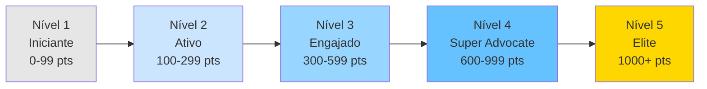
```mermaid
graph LR
    A[Nível 1<br/>Iniciante<br/>0-99 pts] --> B[Nível 2<br/>Ativo<br/>100-299 pts]
    B --> C[Nível 3<br/>Engajado<br/>300-599 pts]
    C --> D[Nível 4<br/>Super Advocate<br/>600-999 pts]
    D --> E[Nível 5<br/>Elite<br/>1000+ pts]

    style A fill:#e6e6e6
    style B fill:#cce5ff
    style C fill:#99d6ff
    style D fill:#66c2ff
    style E fill:#ffd700
```

**Pontuação por Ação**:
- Post aprovado: **+10 pts**
- Evento attended: **+20 pts**
- Desafio aprovado: **+50 pts**

---

## Fluxo de Autorização

### 🔐 Verificação de Autorização

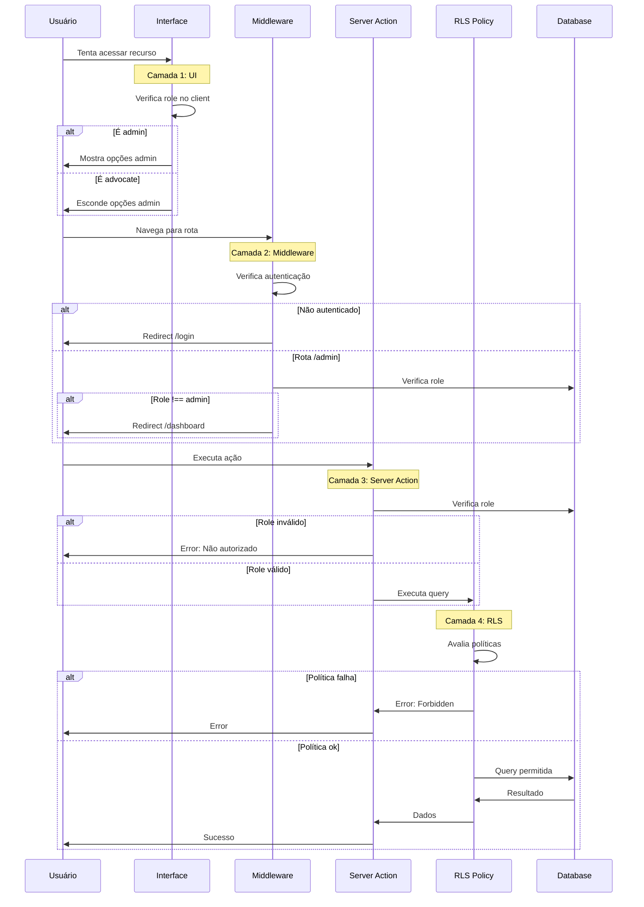
```mermaid
sequenceDiagram
    participant U as Usuário
    participant UI as Interface
    participant MW as Middleware
    participant SA as Server Action
    participant RLS as RLS Policy
    participant DB as Database

    U->>UI: Tenta acessar recurso

    Note over UI: Camada 1: UI

    UI->>UI: Verifica role no client

    alt É admin
        UI->>U: Mostra opções admin
    else É advocate
        UI->>U: Esconde opções admin
    end

    U->>MW: Navega para rota

    Note over MW: Camada 2: Middleware

    MW->>MW: Verifica autenticação

    alt Não autenticado
        MW->>U: Redirect /login
    else Rota /admin
        MW->>DB: Verifica role
        alt Role !== admin
            MW->>U: Redirect /dashboard
        end
    end

    U->>SA: Executa ação

    Note over SA: Camada 3: Server Action

    SA->>DB: Verifica role

    alt Role inválido
        SA->>U: Error: Não autorizado
    else Role válido
        SA->>RLS: Executa query
    end

    Note over RLS: Camada 4: RLS

    RLS->>RLS: Avalia políticas

    alt Política falha
        RLS->>SA: Error: Forbidden
        SA->>U: Error
    else Política ok
        RLS->>DB: Query permitida
        DB->>RLS: Resultado
        RLS->>SA: Dados
        SA->>U: Sucesso
    end
```

### 🛡️ Camadas de Proteção

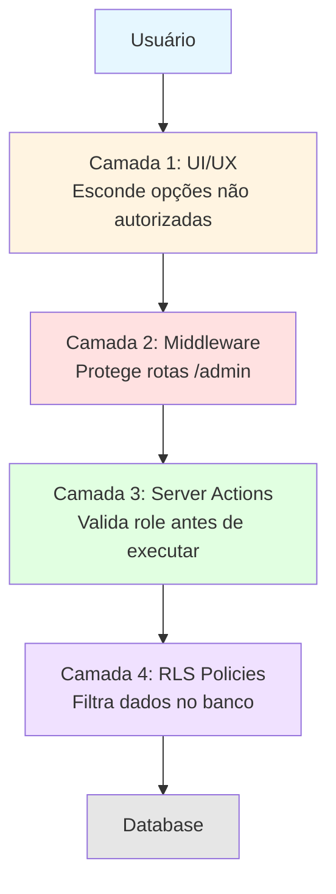
```mermaid
graph TB
    A[Usuário] --> B[Camada 1: UI/UX<br/>Esconde opções não autorizadas]
    B --> C[Camada 2: Middleware<br/>Protege rotas /admin]
    C --> D[Camada 3: Server Actions<br/>Valida role antes de executar]
    D --> E[Camada 4: RLS Policies<br/>Filtra dados no banco]
    E --> F[Database]

    style A fill:#e6f7ff
    style B fill:#fff4e1
    style C fill:#ffe1e1
    style D fill:#e1ffe1
    style E fill:#f0e1ff
    style F fill:#e6e6e6
```

### 🔍 Verificação em Cada Camada

#### Camada 1: UI/UX (Client-Side)

**Objetivo**: Melhorar experiência, esconder opções não disponíveis

```typescript
// src/components/Navigation.tsx
'use client';

export function Navigation({ userRole }: { userRole: string }) {
  return (
    <nav>
      <Link href="/feed">Feed</Link>
      <Link href="/eventos">Eventos</Link>
      <Link href="/desafios">Desafios</Link>
      <Link href="/premios">Recompensas</Link>

      {/* ✅ Conditional rendering baseado em role */}
      {userRole === 'admin' && (
        <Link href="/admin">
          <span className="text-amber-500">👑 Admin</span>
        </Link>
      )}
    </nav>
  );
}
```

**⚠️ IMPORTANTE**: Esta camada é apenas UX. Um hacker pode manipular o client e ver elementos admin, mas **não consegue executar ações** devido às camadas 2, 3 e 4.

#### Camada 2: Middleware (Route Protection)

**Objetivo**: Proteger rotas admin no servidor

```typescript
// src/middleware.ts
import { createMiddlewareClient } from '@supabase/auth-helpers-nextjs';
import { NextResponse } from 'next/server';
import type { NextRequest } from 'next/server';

export async function middleware(req: NextRequest) {
  const res = NextResponse.next();
  const supabase = createMiddlewareClient({ req, res });

  const { data: { session } } = await supabase.auth.getSession();

  // Proteger rotas /admin
  if (req.nextUrl.pathname.startsWith('/admin')) {
    if (!session) {
      // Não autenticado -> login
      return NextResponse.redirect(new URL('/login', req.url));
    }

    // Verificar role
    const { data: user } = await supabase
      .from('users')
      .select('role')
      .eq('id', session.user.id)
      .single();

    if (user?.role !== 'admin') {
      // Autenticado mas não é admin -> dashboard
      return NextResponse.redirect(new URL('/dashboard', req.url));
    }
  }

  return res;
}

export const config = {
  matcher: ['/admin/:path*', '/dashboard/:path*']
};
```

#### Camada 3: Server Actions (Authorization Check)

**Objetivo**: Validar permissões antes de executar lógica de negócio

```typescript
// src/actions/posts.ts
'use server';

export async function approvePost(postId: string): Promise<ActionResponse> {
  const supabase = await createClient();

  // 1️⃣ Verificar autenticação
  const { data: { user } } = await supabase.auth.getUser();
  if (!user) {
    return { error: 'Usuário não autenticado' };
  }

  // 2️⃣ Verificar role (CRÍTICO!)
  const { data: userData } = await supabase
    .from('users')
    .select('role')
    .eq('id', user.id)
    .single();

  if (userData?.role !== 'admin') {
    return { error: 'Apenas admins podem aprovar posts' };
  }

  // 3️⃣ Executar ação
  const { error } = await supabase
    .from('posts')
    .update({ status: 'approved' })
    .eq('id', postId);

  if (error) return { error: 'Erro ao aprovar' };

  return { success: true };
}
```

#### Camada 4: RLS Policies (Database Level)

**Objetivo**: Última linha de defesa, garante segurança no banco

```sql
-- Política para posts: Admin vê todos, advocate só aprovados + próprios
CREATE POLICY "View posts based on role"
ON posts FOR SELECT
USING (
  -- Admin vê todos
  is_admin(auth.uid())
  OR
  -- Advocate vê aprovados
  status = 'approved'
  OR
  -- Autor vê próprios
  auth.uid() = user_id
);

-- Política para atualização: Apenas admin pode moderar
CREATE POLICY "Only admins can moderate posts"
ON posts FOR UPDATE
USING (is_admin(auth.uid()));

-- Função auxiliar is_admin
CREATE OR REPLACE FUNCTION is_admin(user_id UUID)
RETURNS BOOLEAN AS $$
BEGIN
  RETURN EXISTS (
    SELECT 1 FROM users
    WHERE id = user_id
    AND role = 'admin'
  );
END;
$$ LANGUAGE plpgsql SECURITY DEFINER;
```

---

## Implementação Técnica

### 🛠️ Verificação de Role

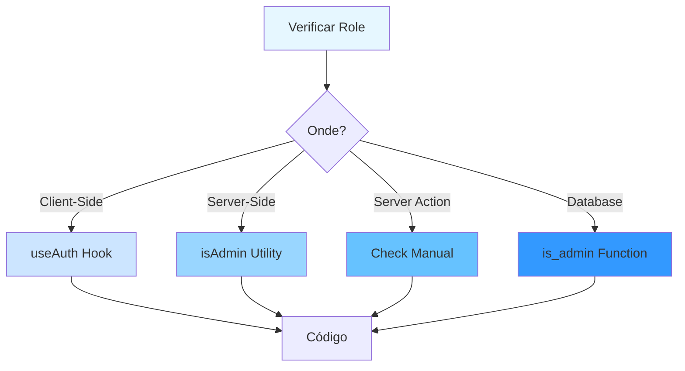
```mermaid
graph TD
    A[Verificar Role] --> B{Onde?}

    B -->|Client-Side| C[useAuth Hook]
    B -->|Server-Side| D[isAdmin Utility]
    B -->|Server Action| E[Check Manual]
    B -->|Database| F[is_admin Function]

    C --> G[Código]
    D --> G
    E --> G
    F --> G

    style A fill:#e6f7ff
    style C fill:#cce5ff
    style D fill:#99d6ff
    style E fill:#66c2ff
    style F fill:#3399ff
```

### 📝 Código de Verificação

#### 1. Função Utilitária `isAdmin()`

```typescript
// src/lib/supabase/utils.ts

/**
 * Verifica se o usuário é admin
 * @returns boolean
 */
export async function isAdmin(): Promise<boolean> {
  const supabase = await createClient();
  const { data: { session } } = await supabase.auth.getSession();

  if (!session) {
    return false;
  }

  const { data: user } = await supabase
    .from('users')
    .select('role')
    .eq('id', session.user.id)
    .single();

  return user?.role === 'admin';
}
```

**Uso**:
```typescript
// Em Server Components
import { isAdmin } from '@/lib/supabase/utils';

export default async function DashboardPage() {
  const admin = await isAdmin();

  return (
    <div>
      {admin && <AdminPanel />}
      <UserContent />
    </div>
  );
}
```

#### 2. Hook de Autenticação (Client)

```typescript
// src/hooks/useAuth.ts
'use client';

import { useEffect, useState } from 'react';
import { createClientComponentClient } from '@supabase/auth-helpers-nextjs';

export function useAuth() {
  const [user, setUser] = useState(null);
  const [role, setRole] = useState<'admin' | 'user' | null>(null);
  const supabase = createClientComponentClient();

  useEffect(() => {
    const getUser = async () => {
      const { data: { session } } = await supabase.auth.getSession();

      if (session) {
        setUser(session.user);

        // Buscar role
        const { data } = await supabase
          .from('users')
          .select('role')
          .eq('id', session.user.id)
          .single();

        setRole(data?.role || 'user');
      }
    };

    getUser();

    const { data: { subscription } } = supabase.auth.onAuthStateChange(() => {
      getUser();
    });

    return () => subscription.unsubscribe();
  }, [supabase]);

  return {
    user,
    role,
    isAdmin: role === 'admin',
    isAuthenticated: !!user,
  };
}
```

**Uso**:
```typescript
'use client';

import { useAuth } from '@/hooks/useAuth';

export function Navigation() {
  const { isAdmin, isAuthenticated } = useAuth();

  return (
    <nav>
      {isAuthenticated && (
        <>
          <Link href="/feed">Feed</Link>
          {isAdmin && (
            <Link href="/admin">👑 Admin</Link>
          )}
        </>
      )}
    </nav>
  );
}
```

#### 3. Função RLS no Banco

```sql
-- database/functions/is_admin.sql

/**
 * Verifica se usuário é admin
 * Usada em RLS policies
 */
CREATE OR REPLACE FUNCTION is_admin(user_id UUID)
RETURNS BOOLEAN
LANGUAGE plpgsql
SECURITY DEFINER
AS $$
BEGIN
  RETURN EXISTS (
    SELECT 1
    FROM users
    WHERE id = user_id
    AND role = 'admin'
  );
END;
$$;

-- Garantir que a função pode ser usada em RLS
GRANT EXECUTE ON FUNCTION is_admin(UUID) TO authenticated;
```

**Uso em Políticas RLS**:
```sql
-- Política usando is_admin()
CREATE POLICY "Admins can view all posts"
ON posts FOR SELECT
TO authenticated
USING (is_admin(auth.uid()));

CREATE POLICY "Admins can update posts"
ON posts FOR UPDATE
TO authenticated
USING (is_admin(auth.uid()));

CREATE POLICY "Admins can delete posts"
ON posts FOR DELETE
TO authenticated
USING (is_admin(auth.uid()));
```

---

## Controle de Rotas

### 🗺️ Mapa de Rotas por Role

```mermaid
graph TB
    subgraph "🌐 Público"
        P1[/login]
        P2[/cadastro]
        P3[/ landing page]
    end

    subgraph "👤 Autenticado"
        A1[/dashboard]
        A2[/feed]
        A3[/eventos]
        A4[/desafios]
        A5[/premios]
        A6[/perfil]
    end

    subgraph "👑 Admin Only"
        AD1[/admin]
        AD2[/admin/posts]
        AD3[/admin/eventos]
        AD4[/admin/desafios]
        AD5[/admin/premios]
        AD6[/admin/usuarios]
    end

    P1 -.->|Login| A1
    A1 --> A2
    A1 --> A3
    A1 --> A4
    A1 --> A5
    A1 --> A6

    A1 -.->|Se admin| AD1
    AD1 --> AD2
    AD1 --> AD3
    AD1 --> AD4
    AD1 --> AD5
    AD1 --> AD6

    style P1 fill:#ffcccc
    style P2 fill:#ffcccc
    style P3 fill:#ffcccc

    style A1 fill:#cce5ff
    style A2 fill:#cce5ff
    style A3 fill:#cce5ff
    style A4 fill:#cce5ff
    style A5 fill:#cce5ff
    style A6 fill:#cce5ff

    style AD1 fill:#ffe5cc
    style AD2 fill:#ffe5cc
    style AD3 fill:#ffe5cc
    style AD4 fill:#ffe5cc
    style AD5 fill:#ffe5cc
    style AD6 fill:#ffe5cc
```

### 📋 Tabela de Rotas

| Rota | Público | Advocate | Admin | Redirect se não autorizado |
|------|---------|----------|-------|---------------------------|
| `/` | ✅ | ✅ | ✅ | - |
| `/login` | ✅ | ✅ | ✅ | - |
| `/cadastro` | ✅ | ✅ | ✅ | - |
| `/dashboard` | ❌ | ✅ | ✅ | `/login` |
| `/feed` | ❌ | ✅ | ✅ | `/login` |
| `/eventos` | ❌ | ✅ | ✅ | `/login` |
| `/eventos/[id]` | ❌ | ✅ | ✅ | `/login` |
| `/desafios` | ❌ | ✅ | ✅ | `/login` |
| `/premios` | ❌ | ✅ | ✅ | `/login` |
| `/perfil` | ❌ | ✅ | ✅ | `/login` |
| `/perfil/editar` | ❌ | ✅ | ✅ | `/login` |
| **`/admin`** | ❌ | ❌ | ✅ | `/login` ou `/dashboard` |
| **`/admin/posts`** | ❌ | ❌ | ✅ | `/login` ou `/dashboard` |
| **`/admin/eventos`** | ❌ | ❌ | ✅ | `/login` ou `/dashboard` |
| **`/admin/eventos/novo`** | ❌ | ❌ | ✅ | `/login` ou `/dashboard` |
| **`/admin/desafios`** | ❌ | ❌ | ✅ | `/login` ou `/dashboard` |
| **`/admin/desafios/novo`** | ❌ | ❌ | ✅ | `/login` ou `/dashboard` |
| **`/admin/desafios/[id]`** | ❌ | ❌ | ✅ | `/login` ou `/dashboard` |
| **`/admin/premios`** | ❌ | ❌ | ✅ | `/login` ou `/dashboard` |
| **`/admin/usuarios`** | ❌ | ❌ | ✅ | `/login` ou `/dashboard` |

### 🔒 Proteção de Rotas

#### Estrutura de Diretórios

```
src/app/
├── (marketing)/          # Público
│   ├── page.tsx         # Landing page
│   ├── login/
│   └── cadastro/
│
├── (dashboard)/         # Autenticado
│   ├── layout.tsx       # Requer autenticação
│   ├── dashboard/
│   ├── feed/
│   ├── eventos/
│   ├── desafios/
│   ├── premios/
│   ├── perfil/
│   │
│   └── admin/           # Admin only
│       ├── layout.tsx   # AdminAuthCheck
│       ├── AdminAuthCheck.tsx
│       ├── page.tsx
│       ├── posts/
│       ├── eventos/
│       ├── desafios/
│       ├── premios/
│       └── usuarios/
```

#### Layout Admin (Proteção)

```typescript
// src/app/(dashboard)/admin/layout.tsx

import { AdminAuthCheck, AdminLogoutButton } from './AdminAuthCheck';

export default function AdminLayout({
  children,
}: {
  children: React.ReactNode;
}) {
  return (
    <AdminAuthCheck>
      <div className="space-y-6">
        {/* Header Admin */}
        <div className="bg-gradient-to-r from-indigo-600 to-purple-600 rounded-xl p-4 text-white">
          <div className="flex items-center justify-between">
            <div className="flex items-center gap-3">
              <div className="p-2 bg-white/20 rounded-lg">
                👑
              </div>
              <div>
                <h1 className="text-xl font-bold">Painel Administrativo</h1>
                <p className="text-indigo-100 text-sm">Gerencie sua plataforma</p>
              </div>
            </div>
            <AdminLogoutButton />
          </div>
        </div>

        {children}
      </div>
    </AdminAuthCheck>
  );
}
```

#### Componente AdminAuthCheck

```typescript
// src/app/(dashboard)/admin/AdminAuthCheck.tsx
'use client';

import { useEffect, useState } from 'react';
import { useRouter } from 'next/navigation';

export function AdminAuthCheck({ children }: { children: React.ReactNode }) {
  const router = useRouter();
  const [isAuthenticated, setIsAuthenticated] = useState<boolean | null>(null);

  useEffect(() => {
    const checkAuth = () => {
      const isAuth = localStorage.getItem('admin_authenticated') === 'true';
      const loginTime = localStorage.getItem('admin_login_time');

      // Verificar se a sessão expirou (24 horas)
      if (isAuth && loginTime) {
        const loginDate = new Date(loginTime);
        const now = new Date();
        const hoursDiff = (now.getTime() - loginDate.getTime()) / (1000 * 60 * 60);

        if (hoursDiff > 24) {
          // Sessão expirada
          localStorage.removeItem('admin_authenticated');
          localStorage.removeItem('admin_login_time');
          setIsAuthenticated(false);
          router.push('/admin/login');
          return;
        }
      }

      if (!isAuth) {
        setIsAuthenticated(false);
        router.push('/admin/login');
      } else {
        setIsAuthenticated(true);
      }
    };

    checkAuth();
  }, [router]);

  if (isAuthenticated === null) {
    return (
      <div className="flex items-center justify-center min-h-[50vh]">
        <div className="animate-spin w-8 h-8 border-4 border-indigo-500 border-t-transparent rounded-full"></div>
      </div>
    );
  }

  if (!isAuthenticated) {
    return null;
  }

  return <>{children}</>;
}
```

---

## Diferenças de UI/UX

### 🎨 Experiência Visual por Role

```mermaid
graph TB
    subgraph "👤 Advocate Dashboard"
        A1[📊 Estatísticas Pessoais]
        A2[📝 Meus Posts]
        A3[📅 Próximos Eventos]
        A4[🎯 Desafios Ativos]
        A5[❤️ Saldo de Moedas]

        A1 --> A6[Ver perfil]
        A2 --> A7[Criar post]
        A3 --> A8[Inscrever-se]
        A4 --> A9[Participar]
        A5 --> A10[Resgatar prêmios]
    end

    subgraph "👑 Admin Dashboard"
        B1[📊 Estatísticas Gerais]
        B2[📝 Posts Pendentes: 5]
        B3[🎯 Participações: 12]
        B4[📅 Eventos: 3 ativos]
        B5[🎁 Resgates: 8 pendentes]
        B6[👥 Total Usuários: 150]

        B2 --> B7[Moderar]
        B3 --> B8[Aprovar/Rejeitar]
        B4 --> B9[Criar/Editar]
        B5 --> B10[Processar]
        B6 --> B11[Gerenciar]
    end

    style A1 fill:#cce5ff
    style A2 fill:#cce5ff
    style A3 fill:#cce5ff
    style A4 fill:#cce5ff
    style A5 fill:#cce5ff

    style B1 fill:#ffe5cc
    style B2 fill:#fff9e6
    style B3 fill:#fff9e6
    style B4 fill:#fff9e6
    style B5 fill:#fff9e6
    style B6 fill:#fff9e6
```

### 🔍 Elementos Visuais Exclusivos

#### Admin-Only UI Elements

| Elemento | Onde Aparece | Função |
|----------|-------------|--------|
| 👑 Badge "Admin" | Navbar | Indica role admin |
| Link "Painel Admin" | Sidebar | Acesso ao `/admin` |
| Botão "Aprovar" | Cards de posts | Aprovar post pendente |
| Botão "Rejeitar" | Cards de posts | Rejeitar post com razão |
| Toggle "Ativo/Inativo" | Admin eventos/desafios | Ativar/desativar |
| Botão "Criar Novo" | Admin páginas | Criar evento/desafio/recompensa |
| Badge "Pendente" | Admin listas | Destaca itens para moderar |
| Input "Moedas Customizadas" | Aprovar participação | Modificar recompensa |
| Código de Rastreio | Marcar como enviado | Tracking de entrega |
| Tabela de Inscritos | Admin eventos | Ver todos registrados |

#### Advocate-Only UI Elements

| Elemento | Onde Aparece | Função |
|----------|-------------|--------|
| Barra de Progresso de Nível | Dashboard | Mostrar progresso para próximo nível |
| Badge de Nível | Perfil, Cards | Nível 1-5 |
| Saldo de Moedas ❤️ | Header, Perfil | Mostrar moedas disponíveis |
| Botão "Participar" | Cards de desafios | Abrir modal de participação |
| Botão "Inscrever-se" | Cards de eventos | Inscrever-se em evento |
| Botão "Resgatar" | Cards de recompensas | Resgatar com moedas |
| Badge "Aguardando Aprovação" | Meus posts | Status pending |
| Histórico de Atividades | Perfil | Timeline pessoal |
| Badge "Nível Requerido" | Cards de eventos | Requisito de nível |

### 📱 Navegação por Role

#### Advocate Navigation

```
┌─────────────────────────────────────┐
│  Logo    [Feed] [Eventos] [Desafios] [Recompensas]    👤 Perfil ❤️ 150  │
└─────────────────────────────────────┘
```

#### Admin Navigation

```
┌─────────────────────────────────────┐
│  Logo    [Feed] [Eventos] [Desafios] [Recompensas]  👑 [Admin]  👤 Perfil  │
└─────────────────────────────────────┘
                                                 ↓
                                      ┌──────────────────┐
                                      │ Dashboard Admin   │
                                      │ Moderar Posts     │
                                      │ Gerenciar Eventos │
                                      │ Gerenciar Desafios│
                                      │ Gerenciar Prêmios │
                                      │ Usuários          │
                                      └──────────────────┘
```

---

## Exemplos de Código

### 📝 Exemplo 1: Conditional Rendering (Client)

```typescript
// src/components/PostCard.tsx
'use client';

import { useAuth } from '@/hooks/useAuth';

export function PostCard({ post }: { post: Post }) {
  const { isAdmin, user } = useAuth();
  const isAuthor = user?.id === post.user_id;

  return (
    <div className="post-card">
      <h3>{post.title}</h3>
      <p>{post.content}</p>

      {/* Status visível para autor ou admin */}
      {(isAuthor || isAdmin) && post.status === 'pending' && (
        <Badge color="yellow">Aguardando Aprovação</Badge>
      )}

      {/* Botões de moderação apenas para admin */}
      {isAdmin && post.status === 'pending' && (
        <div className="admin-actions">
          <Button onClick={() => approvePost(post.id)}>
            ✅ Aprovar
          </Button>
          <Button onClick={() => rejectPost(post.id)}>
            ❌ Rejeitar
          </Button>
        </div>
      )}

      {/* Botões de edição apenas para autor (antes da aprovação) */}
      {isAuthor && post.status === 'pending' && (
        <Button onClick={() => editPost(post.id)}>
          ✏️ Editar
        </Button>
      )}
    </div>
  );
}
```

### 📝 Exemplo 2: Server Component com Role Check

```typescript
// src/app/(dashboard)/eventos/page.tsx

import { createClient } from '@/lib/supabase/server';
import { isAdmin } from '@/lib/supabase/utils';
import { CreateEventButton } from './CreateEventButton';

export default async function EventosPage() {
  const supabase = await createClient();
  const admin = await isAdmin();

  // Admin vê todos eventos, advocate só ativos
  const query = supabase
    .from('events')
    .select('*')
    .order('starts_at', { ascending: true });

  if (!admin) {
    query.eq('is_active', true);
  }

  const { data: events } = await query;

  return (
    <div>
      <div className="header">
        <h1>Eventos</h1>

        {/* Botão criar apenas para admin */}
        {admin && <CreateEventButton />}
      </div>

      <div className="events-grid">
        {events?.map(event => (
          <EventCard
            key={event.id}
            event={event}
            showAdminActions={admin}
          />
        ))}
      </div>
    </div>
  );
}
```

### 📝 Exemplo 3: Server Action com Validação

```typescript
// src/actions/challenges.ts
'use server';

export async function toggleChallengeActive(
  challengeId: string
): Promise<ActionResponse> {
  const supabase = await createClient();

  // 1️⃣ Verificar autenticação
  const { data: { user } } = await supabase.auth.getUser();
  if (!user) {
    return { error: 'Não autenticado' };
  }

  // 2️⃣ Verificar role admin (CRÍTICO!)
  const { data: userData } = await supabase
    .from('users')
    .select('role')
    .eq('id', user.id)
    .single();

  if (userData?.role !== 'admin') {
    return { error: 'Apenas admins podem ativar/desativar desafios' };
  }

  // 3️⃣ Buscar desafio atual
  const { data: challenge } = await supabase
    .from('challenges')
    .select('is_active')
    .eq('id', challengeId)
    .single();

  if (!challenge) {
    return { error: 'Desafio não encontrado' };
  }

  // 4️⃣ Toggle is_active
  const { error } = await supabase
    .from('challenges')
    .update({ is_active: !challenge.is_active })
    .eq('id', challengeId);

  if (error) {
    return { error: 'Erro ao atualizar desafio' };
  }

  revalidatePath('/admin/desafios');
  revalidatePath('/desafios');

  return {
    success: true,
    data: { is_active: !challenge.is_active }
  };
}
```

### 📝 Exemplo 4: RLS Policy com is_admin

```sql
-- Política para tabela events

-- SELECT: Admin vê todos, advocate só ativos
CREATE POLICY "View events based on role"
ON events FOR SELECT
TO authenticated
USING (
  -- Admin vê todos
  is_admin(auth.uid())
  OR
  -- Advocate vê apenas ativos
  is_active = true
);

-- INSERT: Apenas admin pode criar
CREATE POLICY "Only admins can create events"
ON events FOR INSERT
TO authenticated
WITH CHECK (is_admin(auth.uid()));

-- UPDATE: Apenas admin pode editar
CREATE POLICY "Only admins can update events"
ON events FOR UPDATE
TO authenticated
USING (is_admin(auth.uid()));

-- DELETE: Apenas admin pode deletar
CREATE POLICY "Only admins can delete events"
ON events FOR DELETE
TO authenticated
USING (is_admin(auth.uid()));
```

### 📝 Exemplo 5: Middleware de Proteção

```typescript
// src/middleware.ts

import { createMiddlewareClient } from '@supabase/auth-helpers-nextjs';
import { NextResponse } from 'next/server';
import type { NextRequest } from 'next/server';

export async function middleware(req: NextRequest) {
  const res = NextResponse.next();
  const supabase = createMiddlewareClient({ req, res });

  const { data: { session } } = await supabase.auth.getSession();
  const pathname = req.nextUrl.pathname;

  // 🔐 Proteger rotas /dashboard/* (requer autenticação)
  if (pathname.startsWith('/dashboard') ||
      pathname.startsWith('/feed') ||
      pathname.startsWith('/eventos') ||
      pathname.startsWith('/desafios') ||
      pathname.startsWith('/premios') ||
      pathname.startsWith('/perfil')) {

    if (!session) {
      // Não autenticado -> redirect login
      const redirectUrl = new URL('/login', req.url);
      redirectUrl.searchParams.set('redirect', pathname);
      return NextResponse.redirect(redirectUrl);
    }
  }

  // 👑 Proteger rotas /admin/* (requer role admin)
  if (pathname.startsWith('/admin')) {
    if (!session) {
      // Não autenticado -> redirect login
      return NextResponse.redirect(new URL('/login', req.url));
    }

    // Verificar role
    const { data: user } = await supabase
      .from('users')
      .select('role')
      .eq('id', session.user.id)
      .single();

    if (user?.role !== 'admin') {
      // Autenticado mas não é admin -> redirect dashboard
      return NextResponse.redirect(new URL('/dashboard', req.url));
    }
  }

  return res;
}

export const config = {
  matcher: [
    '/dashboard/:path*',
    '/feed/:path*',
    '/eventos/:path*',
    '/desafios/:path*',
    '/premios/:path*',
    '/perfil/:path*',
    '/admin/:path*'
  ]
};
```

---

## 📊 Resumo Comparativo

### Comparação Final: Admin vs Advocate

```mermaid
%%{init: {'theme':'base', 'themeVariables': { 'fontSize':'16px'}}}%%
quadrantChart
    title Permissões: Admin vs Advocate
    x-axis "Consumo" --> "Criação"
    y-axis "Visualização" --> "Moderação"

    quadrant-1 "👑 Admin Exclusivo"
    quadrant-2 "🛡️ Moderação"
    quadrant-3 "👤 Advocate Padrão"
    quadrant-4 "⭐ Criação Advocate"

    "Ver Posts Aprovados": [0.2, 0.3]
    "Criar Posts": [0.5, 0.3]
    "Moderar Posts": [0.8, 0.8]

    "Ver Eventos Ativos": [0.3, 0.4]
    "Inscrever-se": [0.4, 0.5]
    "Criar Eventos": [0.9, 0.7]

    "Ver Desafios": [0.3, 0.4]
    "Participar": [0.5, 0.5]
    "Criar Desafios": [0.9, 0.6]
    "Moderar Participações": [0.8, 0.9]

    "Ver Recompensas": [0.2, 0.4]
    "Resgatar": [0.4, 0.4]
    "Criar Recompensas": [0.9, 0.6]
    "Aprovar Resgates": [0.8, 0.8]
```

### 🎯 Principais Diferenças

| Aspecto | 👤 Advocate | 👑 Admin |
|---------|-------------|----------|
| **Foco** | Participar e acumular recompensas | Criar conteúdo e moderar |
| **Dashboard** | Estatísticas pessoais | Estatísticas gerais da plataforma |
| **Posts** | Criar e ver aprovados | Moderar todos |
| **Eventos** | Inscrever-se | Criar e gerenciar |
| **Desafios** | Participar | Criar e aprovar participações |
| **Recompensas** | Resgatar | Criar e aprovar resgates |
| **Rotas** | 10 rotas | 16 rotas (10 + 6 admin) |
| **Permissões** | 25 funcionalidades | 55 funcionalidades |
| **RLS Policies** | Filtradas por status/ownership | Acesso total via is_admin() |
| **UI Elements** | Foco em ação (Participar, Resgatar) | Foco em gestão (Aprovar, Criar) |

### 📈 Estatísticas Finais

```mermaid
pie title "Distribuição de Funcionalidades"
    "Comuns (Ambos)" : 25
    "Exclusivas Admin" : 30
```

**Análise**:
- **Advocate**: Usuário comum com **25 funcionalidades** focadas em participação
- **Admin**: Gestor com **55 funcionalidades totais** (25 comuns + 30 exclusivas)
- **Admin tem 120% mais funcionalidades** que Advocate
- **Proporção**: 45% comuns, 55% exclusivas admin

---

## 🔗 Documentos Relacionados

- [SECURITY_RLS.md](./SECURITY_RLS.md) - Políticas RLS detalhadas
- [ARCHITECTURE.md](./ARCHITECTURE.md) - Arquitetura geral
- [SERVER_ACTIONS.md](./SERVER_ACTIONS.md) - Todas Server Actions
- [DATA_FLOW_AUTH.md](./flows/DATA_FLOW_AUTH.md) - Fluxo de autenticação

---

## 📚 Referências

- [Supabase Row Level Security](https://supabase.com/docs/guides/auth/row-level-security)
- [Next.js Middleware](https://nextjs.org/docs/app/building-your-application/routing/middleware)
- [PostgreSQL Row Security Policies](https://www.postgresql.org/docs/current/ddl-rowsecurity.html)

---

**Última atualização**: 2026-01-07
**Versão**: 1.0
**Autor**: Documentação Técnica - Advocate Marketing Platform
