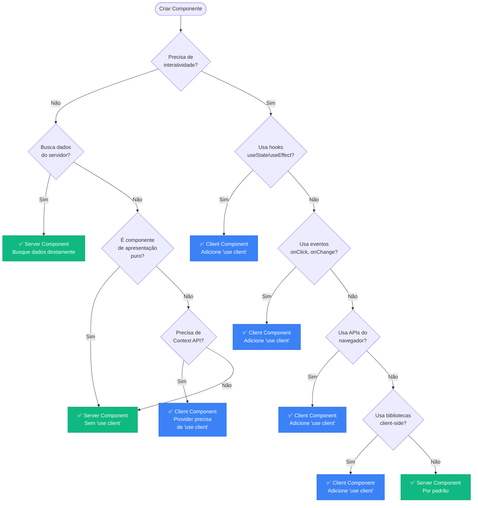
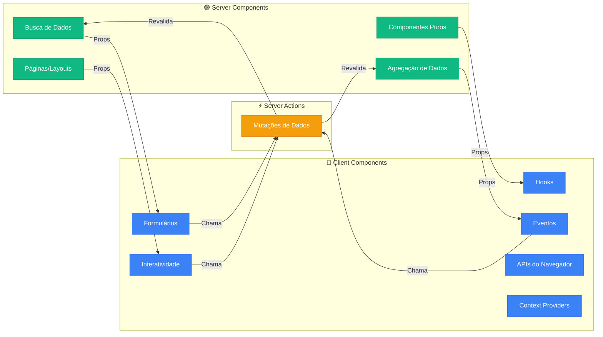

# Server Components vs Client Components

## 📋 Índice

1. [Visão Geral](#visão-geral)
2. [Quando Usar Server Components](#quando-usar-server-components)
3. [Quando Usar Client Components](#quando-usar-client-components)
4. [Diagrama de Decisão](#diagrama-de-decisão)
5. [Exemplos do Código Existente](#exemplos-do-código-existente)
6. [Padrões e Boas Práticas](#padrões-e-boas-práticas)
7. [Comunicação Entre Componentes](#comunicação-entre-componentes)

---

## Visão Geral

O Next.js 15 utiliza **Server Components por padrão**, o que significa que todos os componentes são renderizados no servidor, a menos que explicitamente marcados com a diretiva `'use client'`.

### 🎯 Princípio Fundamental

> **Utilize Server Components por padrão. Use Client Components apenas quando necessário para interatividade.**

### Benefícios dos Server Components

- ✅ **Performance**: Reduz o bundle JavaScript enviado ao cliente
- ✅ **Segurança**: Acesso direto a APIs e bancos de dados sem expor credenciais
- ✅ **SEO**: Renderização completa no servidor melhora indexação
- ✅ **Carregamento**: Dados carregados no servidor antes do envio ao cliente
- ✅ **Cache**: Melhor aproveitamento de cache do Next.js

### Benefícios dos Client Components

- ✅ **Interatividade**: Acesso a hooks do React (useState, useEffect, etc.)
- ✅ **Eventos**: Manipulação de eventos do navegador (onClick, onChange, etc.)
- ✅ **APIs do Cliente**: Acesso a APIs do navegador (localStorage, window, etc.)
- ✅ **Bibliotecas**: Uso de bibliotecas que dependem do navegador

---

## Quando Usar Server Components

### ✅ Use Server Components Para:

#### 1. **Busca de Dados (Data Fetching)**

Server Components podem buscar dados diretamente do banco de dados ou APIs externas de forma segura.

```tsx
// ✅ BOM: Server Component buscando dados
export default async function EventosPage() {
  const supabase = await createClient();

  // Busca dados diretamente no servidor
  const { data: events } = await supabase
    .from('events')
    .select('*')
    .eq('is_active', true)
    .order('start_time', { ascending: true });

  return (
    <div>
      {events.map(event => (
        <EventCard key={event.id} event={event} />
      ))}
    </div>
  );
}
```

**Vantagens:**
- Não expõe credenciais do banco ao cliente
- Reduz latência (servidor → banco é mais rápido que cliente → servidor → banco)
- Aproveita cache do servidor

#### 2. **Páginas e Layouts**

Páginas que apenas exibem conteúdo sem interatividade complexa.

```tsx
// ✅ BOM: Server Component para página de perfil
export default async function PerfilPage() {
  const supabase = await createClient();
  const { data: { user } } = await supabase.auth.getUser();

  if (!user) {
    redirect('/login');
  }

  // Buscar dados do perfil
  const { data: profile } = await supabase
    .from('users')
    .select('*')
    .eq('id', user.id)
    .single();

  return (
    <div>
      <h1>{profile.full_name}</h1>
      <p>{profile.bio}</p>
      {/* Componentes de exibição */}
    </div>
  );
}
```

#### 3. **Componentes de Apresentação Puros**

Componentes que apenas recebem props e renderizam UI, sem estado ou eventos.

```tsx
// ✅ BOM: Server Component puro
interface PageHeaderProps {
  title: string;
  description?: string;
}

export function PageHeader({ title, description }: PageHeaderProps) {
  return (
    <div className="mb-8">
      <h1 className="text-3xl font-bold text-gray-900">{title}</h1>
      {description && (
        <p className="text-gray-600 mt-2">{description}</p>
      )}
    </div>
  );
}
```

#### 4. **Composição de Layouts**

Estruturas de página que organizam outros componentes.

```tsx
// ✅ BOM: Server Component para layout
export default async function DashboardLayout({
  children,
}: {
  children: React.ReactNode;
}) {
  const supabase = await createClient();
  const { data: { user } } = await supabase.auth.getUser();

  if (!user) {
    redirect('/login');
  }

  return (
    <div className="min-h-screen bg-gray-50">
      <Sidebar user={user} />
      <main className="ml-64 p-8">
        {children}
      </main>
    </div>
  );
}
```

#### 5. **Agregação de Dados**

Componentes que combinam dados de múltiplas fontes.

```tsx
// ✅ BOM: Server Component agregando dados
export default async function DashboardStats() {
  const supabase = await createClient();
  const { data: { user } } = await supabase.auth.getUser();

  // Buscar dados de múltiplas tabelas
  const [posts, events, challenges] = await Promise.all([
    supabase.from('posts').select('*').eq('user_id', user.id),
    supabase.from('event_registrations').select('*').eq('user_id', user.id),
    supabase.from('challenge_participants').select('*').eq('user_id', user.id),
  ]);

  return (
    <div className="grid grid-cols-3 gap-4">
      <StatCard title="Posts" count={posts.data?.length || 0} />
      <StatCard title="Eventos" count={events.data?.length || 0} />
      <StatCard title="Desafios" count={challenges.data?.length || 0} />
    </div>
  );
}
```

---

## Quando Usar Client Components

### ✅ Use Client Components Para:

#### 1. **Interatividade com Estado (useState, useReducer)**

Componentes que precisam manter estado local.

```tsx
// ✅ BOM: Client Component com estado
'use client';

import { useState } from 'react';

export function CreatePostForm() {
  const [formData, setFormData] = useState({
    title: '',
    content: '',
    media_url: '',
  });

  const [isExpanded, setIsExpanded] = useState(false);

  const handleChange = (e) => {
    setFormData(prev => ({ ...prev, [e.target.name]: e.target.value }));
  };

  return (
    <form onSubmit={handleSubmit}>
      {/* Campos do formulário */}
    </form>
  );
}
```

**Quando usar:**
- Formulários com validação em tempo real
- Modais, dropdowns, tooltips
- Componentes com estado de UI (aberto/fechado, ativo/inativo)

#### 2. **Efeitos Colaterais (useEffect)**

Componentes que precisam executar lógica após renderização.

```tsx
// ✅ BOM: Client Component com efeito
'use client';

import { useEffect, useState } from 'react';
import { createClient } from '@/lib/supabase/client';

export function AuthContext({ children }) {
  const [user, setUser] = useState(null);
  const supabase = createClient();

  useEffect(() => {
    // Listener para mudanças de autenticação
    const { data: { subscription } } = supabase.auth.onAuthStateChange(
      (event, session) => {
        setUser(session?.user ?? null);
      }
    );

    return () => {
      subscription.unsubscribe();
    };
  }, []);

  return (
    <AuthContext.Provider value={{ user }}>
      {children}
    </AuthContext.Provider>
  );
}
```

**Quando usar:**
- Subscriptions em tempo real (Supabase Realtime)
- Tracking de eventos (analytics)
- Sincronização com localStorage
- Integração com bibliotecas externas

#### 3. **Eventos do Navegador (onClick, onChange, onSubmit)**

Componentes que respondem a ações do usuário.

```tsx
// ✅ BOM: Client Component com eventos
'use client';

import { useState } from 'react';

export function PostCard({ post }) {
  const [isLiked, setIsLiked] = useState(false);
  const [likesCount, setLikesCount] = useState(post.likes_count || 0);

  const handleLike = async () => {
    // Otimistic update
    setIsLiked(!isLiked);
    setLikesCount(prev => isLiked ? prev - 1 : prev + 1);

    // Server Action
    await likePost(post.id);
  };

  return (
    <div>
      <h3>{post.title}</h3>
      <button onClick={handleLike}>
        {isLiked ? '❤️' : '🤍'} {likesCount}
      </button>
    </div>
  );
}
```

**Quando usar:**
- Botões com ações interativas
- Toggle de likes, favoritos
- Sistema de comentários com edição inline
- Drag & drop

#### 4. **Hooks Customizados**

Componentes que utilizam hooks personalizados.

```tsx
// ✅ BOM: Client Component usando hook customizado
'use client';

import { usePosts } from '@/hooks';

export function PostList() {
  const { posts, isLoading, error } = usePosts();

  if (isLoading) return <Skeleton />;
  if (error) return <ErrorMessage error={error} />;

  return (
    <div>
      {posts.map(post => (
        <PostCard key={post.id} post={post} />
      ))}
    </div>
  );
}
```

#### 5. **APIs do Navegador**

Componentes que precisam acessar APIs específicas do navegador.

```tsx
// ✅ BOM: Client Component usando APIs do navegador
'use client';

import { useEffect, useState } from 'react';

export function GeolocationComponent() {
  const [location, setLocation] = useState(null);

  useEffect(() => {
    if ('geolocation' in navigator) {
      navigator.geolocation.getCurrentPosition((position) => {
        setLocation({
          lat: position.coords.latitude,
          lng: position.coords.longitude,
        });
      });
    }
  }, []);

  return <div>Localização: {location?.lat}, {location?.lng}</div>;
}
```

**Quando usar:**
- Geolocalização
- Camera/Microfone
- Notificações do navegador
- File API
- localStorage/sessionStorage

#### 6. **Context Providers**

Provedores de contexto que compartilham estado globalmente.

```tsx
// ✅ BOM: Client Component para Context Provider
'use client';

import { createContext, useContext, useState } from 'react';

const ToastContext = createContext();

export function ToastProvider({ children }) {
  const [toasts, setToasts] = useState([]);

  const addToast = (message, type) => {
    setToasts(prev => [...prev, { id: Date.now(), message, type }]);
  };

  return (
    <ToastContext.Provider value={{ addToast }}>
      {children}
      <ToastContainer toasts={toasts} />
    </ToastContext.Provider>
  );
}
```

---

## Diagrama de Decisão



---

## Exemplos do Código Existente

### 🟢 Server Components na Base de Código

#### 1. Páginas de Listagem (`eventos/page.tsx`)

```tsx
// ✅ Server Component - Busca dados diretamente
export default async function EventosPage() {
  const supabase = await createClient();
  const { data: { user } } = await supabase.auth.getUser();

  // Verificação de autenticação no servidor
  if (!user) {
    redirect('/login');
  }

  // Busca eventos ativos
  const { data: events } = await supabase
    .from('events')
    .select('*')
    .eq('is_active', true)
    .gte('end_time', new Date().toISOString())
    .order('start_time', { ascending: true });

  // Busca inscrições do usuário
  const { data: registrations } = await supabase
    .from('event_registrations')
    .select('event_id, status')
    .eq('user_id', user.id)
    .neq('status', 'cancelled');

  return (
    <div>
      {events.map(event => (
        <EventCard
          key={event.id}
          event={event}
          registrationStatus={registrationMap.get(event.id)}
        />
      ))}
    </div>
  );
}
```

**Por que Server Component?**
- ✅ Busca dados diretamente do Supabase
- ✅ Verificação de autenticação no servidor
- ✅ Não precisa de interatividade nesta camada
- ✅ SEO-friendly (renderizado no servidor)

#### 2. Página de Perfil (`perfil/page.tsx`)

```tsx
// ✅ Server Component - Agregação de dados
export default async function PerfilPage() {
  const supabase = await createClient();
  const { data: { user } } = await supabase.auth.getUser();

  if (!user) {
    redirect('/login');
  }

  // Buscar múltiplas fontes de dados em paralelo
  const [profile, userCoins, stats, posts] = await Promise.all([
    supabase.from('users').select('*').eq('id', user.id).single(),
    supabase.from('user_coins').select('balance').eq('user_id', user.id).single(),
    getUserStats(user.id),
    getPosts({ userId: user.id }),
  ]);

  return (
    <div>
      <ProfileHeader profile={profile.data} />
      <CoinsBalance balance={userCoins.data?.balance || 0} />
      <StatsCard stats={stats} />
      <PostsList posts={posts} />
    </div>
  );
}
```

**Por que Server Component?**
- ✅ Agregação eficiente de dados no servidor
- ✅ Promise.all para requests paralelos
- ✅ Reduz waterfalls de requisições
- ✅ Dados já carregados antes do envio ao cliente

### 🔵 Client Components na Base de Código

#### 1. Formulário de Criação (`CreatePostForm.tsx`)

```tsx
// ✅ Client Component - Formulário interativo
'use client';

import { useState } from 'react';
import { usePosts } from '@/hooks';

export function CreatePostForm() {
  // Estado local para controlar formulário
  const [isExpanded, setIsExpanded] = useState(false);
  const [formData, setFormData] = useState({
    title: '',
    content: '',
    media_url: '',
    type: 'community',
  });

  const { create, isPending, error } = usePosts();

  const handleSubmit = async (e) => {
    e.preventDefault();
    const result = await create(formData);

    if (result.success) {
      // Limpar formulário após sucesso
      setFormData({ title: '', content: '', media_url: '', type: 'community' });
      setIsExpanded(false);
    }
  };

  const handleChange = (e) => {
    setFormData(prev => ({ ...prev, [e.target.name]: e.target.value }));
  };

  return (
    <form onSubmit={handleSubmit}>
      {/* Campos do formulário */}
    </form>
  );
}
```

**Por que Client Component?**
- ✅ Usa `useState` para estado do formulário
- ✅ Usa hook customizado `usePosts`
- ✅ Precisa de `handleSubmit` e `handleChange` (eventos)
- ✅ Estado de UI (isExpanded)

#### 2. Card de Post Interativo (`PostCard.tsx`)

```tsx
// ✅ Client Component - Interatividade complexa
'use client';

import { useState } from 'react';
import { usePosts } from '@/hooks';

export function PostCard({ post, isLiked: initialIsLiked }) {
  // Estado local para otimistic updates
  const [isLiked, setIsLiked] = useState(initialIsLiked);
  const [likesCount, setLikesCount] = useState(post.likes_count || 0);

  const { like, approve, reject, delete: deletePost } = usePosts();

  const handleLike = async () => {
    // Atualização otimista da UI
    setIsLiked(!isLiked);
    setLikesCount(prev => isLiked ? prev - 1 : prev + 1);

    // Chamada ao servidor
    await like(post.id);
  };

  const handleDelete = async () => {
    if (confirm('Tem certeza que deseja deletar este post?')) {
      await deletePost(post.id);
    }
  };

  return (
    <div>
      <h3>{post.title}</h3>
      <button onClick={handleLike}>
        {isLiked ? '❤️' : '🤍'} {likesCount}
      </button>
      <button onClick={handleDelete}>Deletar</button>
    </div>
  );
}
```

**Por que Client Component?**
- ✅ Usa `useState` para estado de likes
- ✅ Atualização otimista da UI
- ✅ Múltiplos event handlers (onClick)
- ✅ Confirmação com `window.confirm` (API do navegador)

#### 3. Card de Evento (`EventCard.tsx`)

```tsx
// ✅ Client Component - Ações interativas
'use client';

import { useState } from 'react';
import { registerForEvent, cancelEventRegistration } from '@/actions/events';

export function EventCard({ event, userLevel, registrationStatus }) {
  const [isLoading, setIsLoading] = useState(false);
  const [status, setStatus] = useState(registrationStatus);

  const handleRegister = async () => {
    setIsLoading(true);
    const result = await registerForEvent(event.id);
    if (result.success) {
      setStatus('registered');
    }
    setIsLoading(false);
  };

  const handleCancel = async () => {
    setIsLoading(true);
    const result = await cancelEventRegistration(event.id);
    if (result.success) {
      setStatus('cancelled');
    }
    setIsLoading(false);
  };

  return (
    <div>
      <h3>{event.title}</h3>
      {status === 'registered' ? (
        <button onClick={handleCancel} disabled={isLoading}>
          Cancelar
        </button>
      ) : (
        <button onClick={handleRegister} disabled={isLoading}>
          Inscrever-se
        </button>
      )}
    </div>
  );
}
```

**Por que Client Component?**
- ✅ Estado de loading para feedback visual
- ✅ Estado local para status de inscrição
- ✅ Event handlers para ações
- ✅ Chama Server Actions do cliente

#### 4. Context de Autenticação (`AuthContext.tsx`)

```tsx
// ✅ Client Component - Context Provider
'use client';

import { createContext, useContext, useEffect, useState } from 'react';
import { createClient } from '@/lib/supabase/client';

const AuthContext = createContext();

export function AuthProvider({ children }) {
  const [user, setUser] = useState(null);
  const [session, setSession] = useState(null);
  const [isLoading, setIsLoading] = useState(true);

  const supabase = createClient();

  useEffect(() => {
    // Obtém sessão inicial
    const getInitialSession = async () => {
      const { data: { session: initialSession } } = await supabase.auth.getSession();
      setSession(initialSession);
      setUser(initialSession?.user ?? null);
      setIsLoading(false);
    };

    getInitialSession();

    // Listener para mudanças de autenticação
    const { data: { subscription } } = supabase.auth.onAuthStateChange(
      (event, currentSession) => {
        setSession(currentSession);
        setUser(currentSession?.user ?? null);
      }
    );

    return () => {
      subscription.unsubscribe();
    };
  }, []);

  return (
    <AuthContext.Provider value={{ user, session, isLoading }}>
      {children}
    </AuthContext.Provider>
  );
}
```

**Por que Client Component?**
- ✅ Context Provider (precisa de 'use client')
- ✅ Usa `useState` para estado global
- ✅ Usa `useEffect` para subscriptions
- ✅ Listener em tempo real (onAuthStateChange)

---

## Padrões e Boas Práticas

### 🎯 Padrão: Composição de Server e Client Components

```tsx
// ✅ MELHOR PRÁTICA: Server Component como wrapper
// app/feed/page.tsx (Server Component)
export default async function FeedPage() {
  const supabase = await createClient();
  const { data: { user } } = await supabase.auth.getUser();

  // Buscar dados no servidor
  const { data: posts } = await supabase
    .from('posts')
    .select('*, author:users(*)')
    .eq('status', 'approved')
    .order('created_at', { ascending: false });

  return (
    <div>
      <PageHeader title="Feed" />

      {/* Client Component para formulário */}
      <CreatePostForm />

      {/* Mapear posts e usar Client Component para cada um */}
      {posts.map(post => (
        <PostCard
          key={post.id}
          post={post}
          isLiked={post.user_likes?.length > 0}
        />
      ))}
    </div>
  );
}
```

**Por que este padrão é bom?**
- ✅ Server Component busca dados (seguro, eficiente)
- ✅ Client Components apenas para interatividade
- ✅ Reduz JavaScript enviado ao cliente
- ✅ Melhor performance geral

### 🚫 Anti-Padrão: Tudo Client Component

```tsx
// ❌ EVITE: Tornar tudo Client Component desnecessariamente
'use client';

export default function FeedPage() {
  const [posts, setPosts] = useState([]);

  useEffect(() => {
    // Buscar dados no cliente
    fetch('/api/posts')
      .then(res => res.json())
      .then(data => setPosts(data));
  }, []);

  return <div>{/* ... */}</div>;
}
```

**Por que evitar?**
- ❌ Mais JavaScript no bundle
- ❌ Loading state adicional
- ❌ Pior para SEO
- ❌ Mais complexidade

### 🎯 Padrão: Passar Props de Server para Client

```tsx
// ✅ BOM: Server Component passa dados para Client Component
// app/eventos/page.tsx (Server Component)
export default async function EventosPage() {
  const events = await fetchEvents();
  const userLevel = await getUserLevel();

  return (
    <div>
      {events.map(event => (
        <EventCard
          key={event.id}
          event={event}
          userLevel={userLevel}
        />
      ))}
    </div>
  );
}

// components/events/EventCard.tsx (Client Component)
'use client';

export function EventCard({ event, userLevel }) {
  // Recebe dados via props
  const canRegister = userLevel >= event.required_level;

  return <div>{/* ... */}</div>;
}
```

**Vantagens:**
- ✅ Dados buscados no servidor (eficiente)
- ✅ Interatividade no cliente (EventCard)
- ✅ Melhor separação de responsabilidades

### 🎯 Padrão: Server Actions para Mutações

```tsx
// ✅ BOM: Client Component chama Server Action
'use client';

import { createPost } from '@/actions/posts';

export function CreatePostForm() {
  const handleSubmit = async (e) => {
    e.preventDefault();

    // Chamar Server Action
    const result = await createPost(formData);

    if (result.success) {
      // Feedback ao usuário
    }
  };

  return <form onSubmit={handleSubmit}>{/* ... */}</form>;
}
```

**Por que este padrão?**
- ✅ Lógica de negócios no servidor
- ✅ Validação server-side
- ✅ Acesso seguro ao banco
- ✅ Revalidação automática de cache

### 🚫 Anti-Padrão: Lógica de Negócios no Client

```tsx
// ❌ EVITE: Lógica complexa no Client Component
'use client';

import { createClient } from '@/lib/supabase/client';

export function CreatePostForm() {
  const handleSubmit = async (e) => {
    e.preventDefault();

    // ❌ Lógica de negócios no cliente
    const supabase = createClient();
    const { data, error } = await supabase
      .from('posts')
      .insert([formData]);

    // ❌ RLS pode bloquear, melhor usar Server Action
  };

  return <form onSubmit={handleSubmit}>{/* ... */}</form>;
}
```

---

## Comunicação Entre Componentes

### 📡 Server → Client: Props

```tsx
// Server Component
export default async function Page() {
  const data = await fetchData();

  return <ClientComponent data={data} />;
}

// Client Component
'use client';

export function ClientComponent({ data }) {
  return <div>{data.title}</div>;
}
```

### 📡 Client → Server: Server Actions

```tsx
// Server Action (app/actions/posts.ts)
'use server';

export async function createPost(formData) {
  const supabase = await createClient();
  // Lógica no servidor
  return { success: true };
}

// Client Component
'use client';

import { createPost } from '@/actions/posts';

export function Form() {
  const handleSubmit = async () => {
    await createPost(data);
  };

  return <form onSubmit={handleSubmit}>{/* ... */}</form>;
}
```

### 📡 Client ↔ Client: Context/Props

```tsx
// Context Provider (Client)
'use client';

export function ToastProvider({ children }) {
  const [toasts, setToasts] = useState([]);

  return (
    <ToastContext.Provider value={{ toasts, addToast }}>
      {children}
    </ToastContext.Provider>
  );
}

// Consumidor (Client)
'use client';

export function Component() {
  const { addToast } = useToast();

  return <button onClick={() => addToast('Sucesso!')}>Click</button>;
}
```

---

## Checklist de Decisão

Ao criar um novo componente, pergunte-se:

### Server Component ✅

- [ ] Busca dados do banco de dados?
- [ ] Busca dados de APIs externas?
- [ ] É apenas apresentação (sem estado)?
- [ ] Não precisa de eventos do navegador?
- [ ] Não usa hooks (useState, useEffect)?
- [ ] Pode ser renderizado no servidor?

### Client Component ✅

- [ ] Usa `useState`, `useReducer`, ou outros hooks?
- [ ] Usa `useEffect` ou `useLayoutEffect`?
- [ ] Precisa de event handlers (onClick, onChange)?
- [ ] Usa APIs do navegador (localStorage, geolocation)?
- [ ] É um Context Provider?
- [ ] Usa bibliotecas client-side?
- [ ] Precisa de subscriptions em tempo real?

---

## Resumo Visual



---

## Próximos Passos

- 📖 [Server Actions](./SERVER_ACTIONS.md) - Entenda como implementar lógica de negócios
- 📖 [Data Flows](./flows/) - Veja fluxos completos de dados
- 📖 [Architecture](./ARCHITECTURE.md) - Visão geral da arquitetura

---

## Referências

- [Next.js 15 Documentation - Server Components](https://nextjs.org/docs/app/building-your-application/rendering/server-components)
- [Next.js 15 Documentation - Client Components](https://nextjs.org/docs/app/building-your-application/rendering/client-components)
- [React Documentation - Server Components](https://react.dev/reference/react/use-client)
