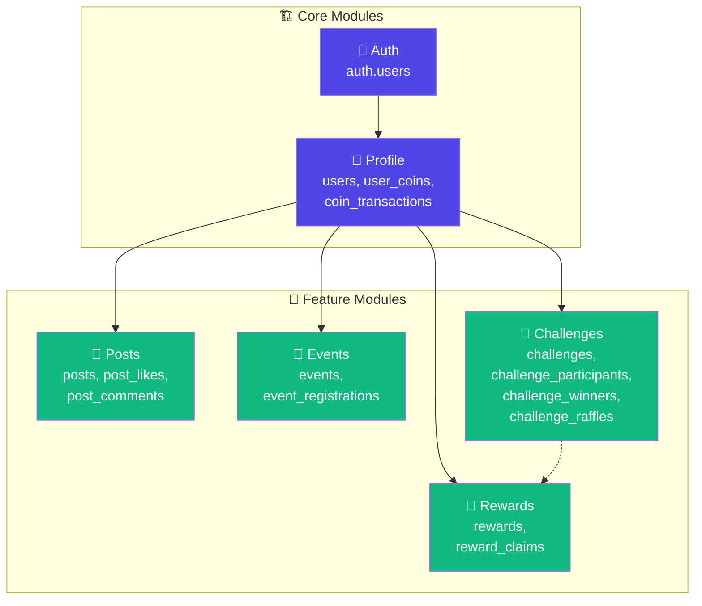
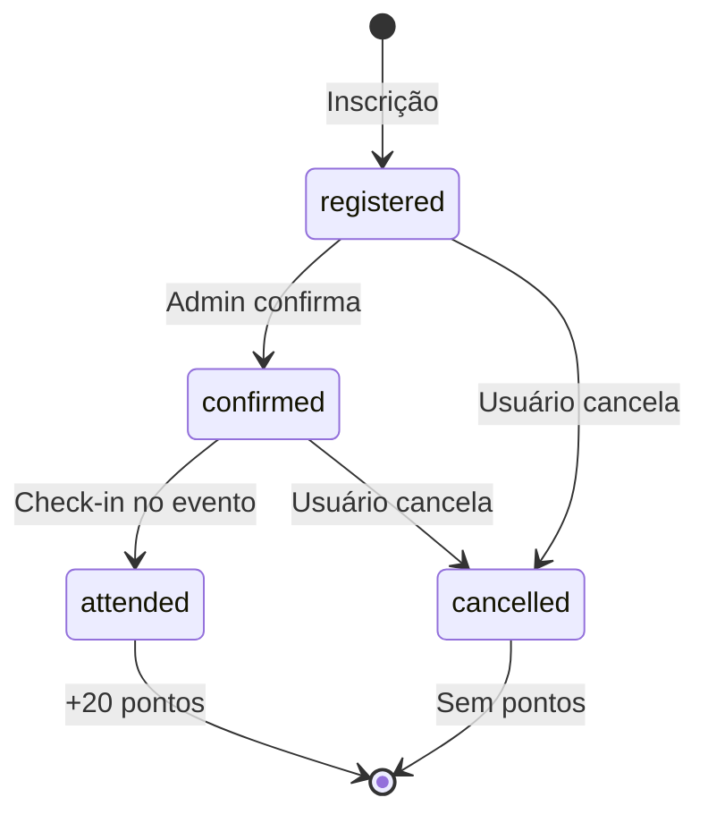
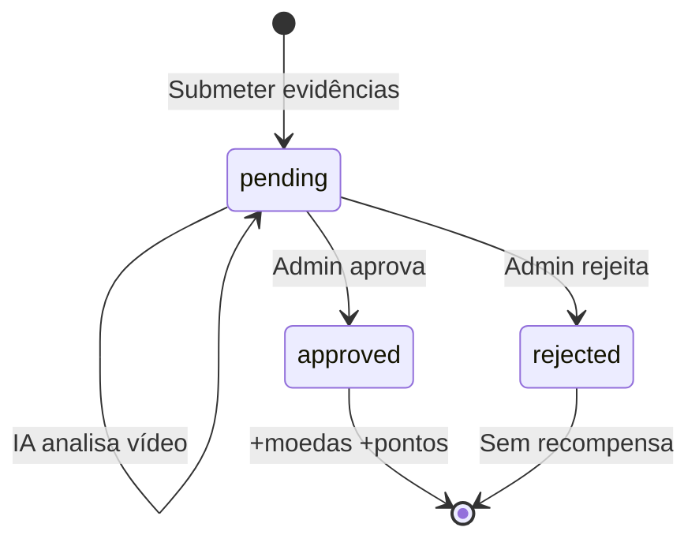
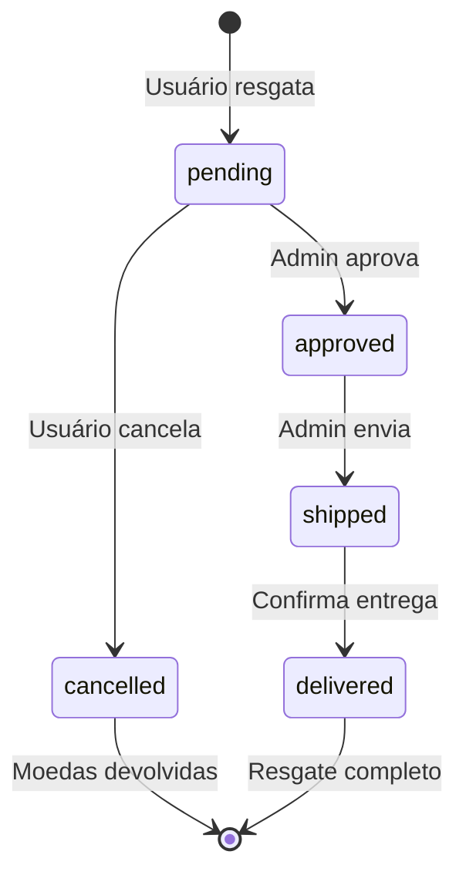
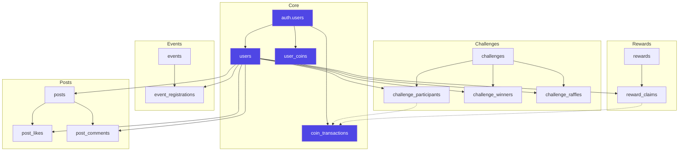

# 💾 Modelo de Dados - Database

## 📋 Índice

- [Visão Geral](#visão-geral)
- [Diagrama ERD Completo](#diagrama-erd-completo)
- [Tabelas do Sistema](#tabelas-do-sistema)
  - [Módulo Auth](#módulo-auth)
  - [Módulo Profile](#módulo-profile)
  - [Módulo Posts](#módulo-posts)
  - [Módulo Events](#módulo-events)
  - [Módulo Challenges](#módulo-challenges)
  - [Módulo Rewards](#módulo-rewards)
- [Relacionamentos](#relacionamentos)
- [Índices e Performance](#índices-e-performance)
- [Funções e Triggers](#funções-e-triggers)
- [Constraints e Validações](#constraints-e-validações)
- [Segurança (RLS)](#segurança-rls)

---

## Visão Geral

### Arquitetura do Banco de Dados

O banco de dados da plataforma é construído sobre **PostgreSQL via Supabase**, utilizando as seguintes características:

- ✅ **15 tabelas principais** organizadas em 6 módulos
- ✅ **Row Level Security (RLS)** habilitado em todas as tabelas
- ✅ **Foreign Keys** garantindo integridade referencial
- ✅ **Triggers** para automação de tarefas (ex: criação automática de saldo de moedas)
- ✅ **Índices otimizados** para queries frequentes
- ✅ **Funções customizadas** para operações complexas (ex: incrementar moedas)
- ✅ **UUIDs** como identificadores únicos
- ✅ **Timestamps** automáticos para auditoria

### Módulos do Sistema



### Estatísticas

| Métrica | Valor |
|---------|-------|
| Total de Tabelas | 15 |
| Tabelas Core | 4 (Auth + Profile) |
| Tabelas Feature | 11 |
| Foreign Keys | 25+ |
| RLS Policies | 60+ |
| Índices | 20+ |
| Triggers | 3 |
| Funções Customizadas | 5 |

---

## Diagrama ERD Completo

### Entity Relationship Diagram

Este diagrama mostra todas as tabelas, colunas principais e relacionamentos do banco de dados:

```mermaid
erDiagram
    %% =============================================
    %% MÓDULO AUTH
    %% =============================================

    AUTH_USERS {
        uuid id PK "Managed by Supabase"
        string email UK
        string encrypted_password
        timestamp created_at
        timestamp updated_at
    }

    %% =============================================
    %% MÓDULO PROFILE
    %% =============================================

    USERS {
        uuid id PK "FK to auth.users"
        string email UK
        string full_name
        string avatar_url
        text bio
        string instagram_handle
        string tiktok_handle
        string youtube_handle
        string twitter_handle
        string website_url
        string role "creator | fan"
        boolean is_creator
        int advocate_level "1-5"
        int advocate_points "For leveling"
        timestamp created_at
        timestamp updated_at
    }

    USER_COINS {
        uuid id PK
        uuid user_id FK "UK"
        int balance "CHECK >= 0"
        timestamp updated_at
    }

    COIN_TRANSACTIONS {
        uuid id PK
        uuid user_id FK
        int amount
        string type "earned | spent"
        text description
        uuid reference_id "FK to various"
        timestamp created_at
    }

    %% =============================================
    %% MÓDULO POSTS
    %% =============================================

    POSTS {
        uuid id PK
        uuid user_id FK
        string title
        text content
        string_array media_url
        string type "creator | community"
        string status "pending | approved | rejected"
        int likes_count
        int comments_count
        boolean is_featured
        text rejection_reason
        uuid approved_by FK
        timestamp approved_at
        timestamp created_at
        timestamp updated_at
    }

    POST_LIKES {
        uuid id PK
        uuid post_id FK
        uuid user_id FK
        timestamp created_at
        unique post_id_user_id "UK(post_id, user_id)"
    }

    POST_COMMENTS {
        uuid id PK
        uuid post_id FK
        uuid user_id FK
        text content
        boolean is_deleted
        timestamp created_at
    }

    %% =============================================
    %% MÓDULO EVENTS
    %% =============================================

    EVENTS {
        uuid id PK
        string title
        text description
        string location
        timestamp start_time
        timestamp end_time
        int max_participants
        int required_level "1-5"
        boolean is_virtual
        string meeting_url
        string image_url
        boolean is_active
        timestamp created_at
        timestamp updated_at
    }

    EVENT_REGISTRATIONS {
        uuid id PK
        uuid event_id FK
        uuid user_id FK
        string status "registered | confirmed | attended | cancelled"
        timestamp registration_time
        timestamp check_in_time
        text feedback
        unique event_id_user_id "UK(event_id, user_id)"
    }

    %% =============================================
    %% MÓDULO CHALLENGES
    %% =============================================

    CHALLENGES {
        uuid id PK
        string title
        text description
        string type "engajamento | fisico"
        string icon
        boolean is_active
        string instagram_embed_url "For engajamento"
        decimal prize_amount "For engajamento"
        int num_winners "For engajamento"
        string goal_type "repetitions | time"
        int goal_value "Target to beat"
        string record_video_url "Creator record"
        string hashtag "Required hashtag"
        string profile_to_tag "Profile to tag"
        int coins_reward "Hearts earned"
        boolean raffle_enabled
        decimal raffle_prize_amount
        int raffle_num_winners
        int raffle_frequency_days
        timestamp starts_at
        timestamp ends_at
        string status "active | closed | finished"
        timestamp created_at
    }

    CHALLENGE_PARTICIPANTS {
        uuid id PK
        uuid challenge_id FK
        uuid user_id FK
        int result_value "Reps or seconds"
        string video_proof_url
        string social_media_url
        string status "pending | approved | rejected"
        uuid approved_by FK
        timestamp approved_at
        int coins_earned
        jsonb ai_verdict "Google Gemini"
        boolean is_raffle_eligible
        text rejection_reason
        timestamp created_at
        unique challenge_id_user_id "UK(challenge_id, user_id)"
    }

    CHALLENGE_WINNERS {
        uuid id PK
        uuid challenge_id FK
        uuid user_id FK "Nullable"
        string instagram_username "For non-users"
        decimal prize_amount
        boolean pix_sent
        string proof_image_url "PIX receipt"
        timestamp created_at
    }

    CHALLENGE_RAFFLES {
        uuid id PK
        uuid challenge_id FK
        uuid winner_user_id FK
        decimal prize_amount
        timestamp drawn_at
        boolean pix_sent
        timestamp created_at
    }

    %% =============================================
    %% MÓDULO REWARDS
    %% =============================================

    REWARDS {
        uuid id PK
        string name
        text description
        string image_url
        int coins_required "CHECK > 0"
        int quantity_available
        boolean is_active
        timestamp created_at
    }

    REWARD_CLAIMS {
        uuid id PK
        uuid user_id FK
        uuid reward_id FK
        string status "pending | approved | shipped | delivered | cancelled"
        int coins_spent "CHECK > 0"
        timestamp created_at
    }

    %% =============================================
    %% RELACIONAMENTOS
    %% =============================================

    %% Auth -> Profile
    AUTH_USERS ||--|| USERS : "has one"
    AUTH_USERS ||--|| USER_COINS : "has one"
    AUTH_USERS ||--o{ COIN_TRANSACTIONS : "has many"

    %% Profile -> Features
    USERS ||--o{ POSTS : "creates"
    USERS ||--o{ POST_LIKES : "gives"
    USERS ||--o{ POST_COMMENTS : "writes"
    USERS ||--o{ EVENT_REGISTRATIONS : "registers"
    USERS ||--o{ CHALLENGE_PARTICIPANTS : "participates"
    USERS ||--o{ CHALLENGE_WINNERS : "wins"
    USERS ||--o{ CHALLENGE_RAFFLES : "wins"
    USERS ||--o{ REWARD_CLAIMS : "claims"

    %% Posts
    POSTS ||--o{ POST_LIKES : "has"
    POSTS ||--o{ POST_COMMENTS : "has"
    POSTS }o--|| USERS : "approved by"

    %% Events
    EVENTS ||--o{ EVENT_REGISTRATIONS : "has"

    %% Challenges
    CHALLENGES ||--o{ CHALLENGE_PARTICIPANTS : "has"
    CHALLENGES ||--o{ CHALLENGE_WINNERS : "has"
    CHALLENGES ||--o{ CHALLENGE_RAFFLES : "has"
    CHALLENGE_PARTICIPANTS }o--|| USERS : "approved by"

    %% Rewards
    REWARDS ||--o{ REWARD_CLAIMS : "has"

    %% Transactions references
    COIN_TRANSACTIONS }o--o| CHALLENGE_PARTICIPANTS : "references"
    COIN_TRANSACTIONS }o--o| REWARD_CLAIMS : "references"
```



### Legenda de Cardinalidade

| Símbolo | Significado |
|---------|-------------|
| `||--||` | Um para Um (One-to-One) |
| `||--o{` | Um para Muitos (One-to-Many) |
| `}o--||` | Muitos para Um (Many-to-One) |
| `}o--o{` | Muitos para Muitos (Many-to-Many) |

---

## Tabelas do Sistema

### Módulo Auth

#### `auth.users` (Supabase Auth)

Tabela gerenciada pelo Supabase Auth para autenticação.

| Coluna | Tipo | Descrição |
|--------|------|-----------|
| `id` | `uuid` | 🔑 **PK** - Identificador único |
| `email` | `string` | 🔒 **UK** - Email do usuário |
| `encrypted_password` | `string` | Senha criptografada |
| `email_confirmed_at` | `timestamp` | Data de confirmação do email |
| `created_at` | `timestamp` | Data de criação |
| `updated_at` | `timestamp` | Data de atualização |

**Observações**:
- ✅ Gerenciada automaticamente pelo Supabase
- ✅ Integração com Google OAuth
- ✅ Sessões e refresh tokens gerenciados
- ✅ Não modificar diretamente, usar Supabase Auth API

**Políticas RLS**: Ver [SECURITY_RLS.md](./SECURITY_RLS.md#auth-users)

---

### Módulo Profile

#### `users` (também chamada `profiles`)

Tabela principal de perfis de usuários (advocates).

| Coluna | Tipo | Constraints | Descrição |
|--------|------|-------------|-----------|
| `id` | `uuid` | 🔑 **PK**, FK → `auth.users.id` | Identificador (mesmo do auth.users) |
| `email` | `string` | 🔒 **UK**, NOT NULL | Email do usuário |
| `full_name` | `string` | NULL | Nome completo |
| `avatar_url` | `string` | NULL | URL do avatar |
| `bio` | `text` | NULL | Biografia |
| `instagram_handle` | `string` | NULL | @ do Instagram |
| `tiktok_handle` | `string` | NULL | @ do TikTok |
| `youtube_handle` | `string` | NULL | @ do YouTube |
| `twitter_handle` | `string` | NULL | @ do Twitter (X) |
| `website_url` | `string` | NULL | Site pessoal |
| `role` | `string` | DEFAULT `'fan'` | `'creator'` ou `'fan'` |
| `is_creator` | `boolean` | DEFAULT `false` | Se é o criador da comunidade |
| `advocate_level` | `integer` | DEFAULT `1`, CHECK (1-5) | Nível do advocate (1-5) |
| `advocate_points` | `integer` | DEFAULT `0` | Pontos para progressão |
| `created_at` | `timestamp` | DEFAULT `now()` | Data de criação |
| `updated_at` | `timestamp` | DEFAULT `now()` | Data de atualização |

**Sistema de Níveis**:

| Nível | Pontos Necessários | Nome |
|-------|-------------------|------|
| 1 | 0-99 | Iniciante |
| 2 | 100-299 | Ativo |
| 3 | 300-599 | Engajado |
| 4 | 600-999 | Super Advocate |
| 5 | 1000+ | Elite |

**Pontuação por Ação**:
- 📝 Post aprovado: **+10 pontos**
- 📅 Evento concluído: **+20 pontos**
- 🎯 Desafio aprovado: **+50 pontos**

**Políticas RLS**: Ver [SECURITY_RLS.md](./SECURITY_RLS.md#users)

---

#### `user_coins`

Saldo de moedas virtuais (corações ❤️) de cada usuário.

| Coluna | Tipo | Constraints | Descrição |
|--------|------|-------------|-----------|
| `id` | `uuid` | 🔑 **PK** | Identificador único |
| `user_id` | `uuid` | 🔒 **UK**, FK → `users.id`, NOT NULL | Usuário dono das moedas |
| `balance` | `integer` | DEFAULT `0`, CHECK `>= 0` | Saldo atual de moedas |
| `updated_at` | `timestamp` | DEFAULT `now()` | Última atualização |

**Observações**:
- ✅ Um registro por usuário (UNIQUE constraint)
- ✅ Criado automaticamente via trigger quando usuário é criado
- ✅ Balance nunca pode ser negativo (CHECK constraint)
- ✅ Atualizado por Server Actions ao ganhar/gastar moedas
- ✅ Apenas service_role pode atualizar (RLS)

**Políticas RLS**: Ver [SECURITY_RLS.md](./SECURITY_RLS.md#user-coins)

---

#### `coin_transactions`

Histórico de transações de moedas (earned e spent).

| Coluna | Tipo | Constraints | Descrição |
|--------|------|-------------|-----------|
| `id` | `uuid` | 🔑 **PK** | Identificador único |
| `user_id` | `uuid` | FK → `users.id`, NOT NULL | Usuário da transação |
| `amount` | `integer` | NOT NULL | Quantidade de moedas (positivo ou negativo) |
| `type` | `string` | CHECK `IN ('earned', 'spent')` | Tipo de transação |
| `description` | `text` | NULL | Descrição da transação |
| `reference_id` | `uuid` | NULL | FK para `challenge_participants` ou `reward_claims` |
| `created_at` | `timestamp` | DEFAULT `now()` | Data da transação |

**Tipos de Transação**:
- `earned`: Moedas ganhas (desafios aprovados)
- `spent`: Moedas gastas (resgates de recompensas)

**Referências**:
- `reference_id` aponta para `challenge_participants.id` quando `type = 'earned'`
- `reference_id` aponta para `reward_claims.id` quando `type = 'spent'`

**Observações**:
- ✅ Imutável (INSERT only, sem UPDATE/DELETE)
- ✅ Auditoria completa de moedas
- ✅ Apenas service_role pode inserir (RLS)

**Políticas RLS**: Ver [SECURITY_RLS.md](./SECURITY_RLS.md#coin-transactions)

---

### Módulo Posts

#### `posts`

Posts criados por usuários (advocates) e pelo criador.

| Coluna | Tipo | Constraints | Descrição |
|--------|------|-------------|-----------|
| `id` | `uuid` | 🔑 **PK** | Identificador único |
| `user_id` | `uuid` | FK → `users.id`, NOT NULL | Autor do post |
| `title` | `string` | NOT NULL | Título do post |
| `content` | `text` | NULL | Conteúdo/descrição |
| `media_url` | `string[]` | NULL | Array de URLs de mídia |
| `type` | `string` | DEFAULT `'community'`, CHECK | `'creator'` ou `'community'` |
| `status` | `string` | DEFAULT `'pending'`, CHECK | `'pending'`, `'approved'`, `'rejected'` |
| `likes_count` | `integer` | DEFAULT `0` | Contador de likes |
| `comments_count` | `integer` | DEFAULT `0` | Contador de comentários |
| `is_featured` | `boolean` | DEFAULT `false` | Se está em destaque |
| `rejection_reason` | `text` | NULL | Motivo de rejeição (se aplicável) |
| `approved_by` | `uuid` | FK → `users.id`, NULL | Admin que aprovou/rejeitou |
| `approved_at` | `timestamp` | NULL | Data de aprovação/rejeição |
| `created_at` | `timestamp` | DEFAULT `now()` | Data de criação |
| `updated_at` | `timestamp` | DEFAULT `now()` | Data de atualização |

**Tipos de Post**:
- `creator`: Post do criador da comunidade (sem moderação)
- `community`: Post de advocate (requer aprovação admin)

**Fluxo de Status**:
```
pending → approved (admin) → visível no feed
pending → rejected (admin) → não visível
```

**Observações**:
- ✅ Posts do criador (`type = 'creator'`) são automaticamente `approved`
- ✅ Posts de advocates (`type = 'community'`) iniciam como `pending`
- ✅ Ao aprovar post de advocate: +10 pontos no perfil

**Políticas RLS**: Ver [SECURITY_RLS.md](./SECURITY_RLS.md#posts)

---

#### `post_likes`

Likes dados em posts.

| Coluna | Tipo | Constraints | Descrição |
|--------|------|-------------|-----------|
| `id` | `uuid` | 🔑 **PK** | Identificador único |
| `post_id` | `uuid` | FK → `posts.id`, NOT NULL | Post curtido |
| `user_id` | `uuid` | FK → `users.id`, NOT NULL | Usuário que curtiu |
| `created_at` | `timestamp` | DEFAULT `now()` | Data do like |

**Constraints**:
- 🔒 **UK(post_id, user_id)**: Um usuário pode curtir um post apenas uma vez

**Observações**:
- ✅ Ao inserir: incrementa `posts.likes_count` (via trigger ou function)
- ✅ Ao deletar (unlike): decrementa `posts.likes_count`
- ✅ Soft delete não é usado (DELETE direto)

**Políticas RLS**: Ver [SECURITY_RLS.md](./SECURITY_RLS.md#post-likes)

---

#### `post_comments`

Comentários em posts.

| Coluna | Tipo | Constraints | Descrição |
|--------|------|-------------|-----------|
| `id` | `uuid` | 🔑 **PK** | Identificador único |
| `post_id` | `uuid` | FK → `posts.id`, NOT NULL | Post comentado |
| `user_id` | `uuid` | FK → `users.id`, NOT NULL | Autor do comentário |
| `content` | `text` | NOT NULL | Conteúdo do comentário |
| `is_deleted` | `boolean` | DEFAULT `false` | Se foi deletado (soft delete) |
| `created_at` | `timestamp` | DEFAULT `now()` | Data do comentário |

**Observações**:
- ✅ Soft delete: `is_deleted = true` ao invés de DELETE
- ✅ Ao inserir: incrementa `posts.comments_count`
- ✅ Ao deletar: decrementa `posts.comments_count`

**Políticas RLS**: Ver [SECURITY_RLS.md](./SECURITY_RLS.md#post-comments)

---

### Módulo Events

#### `events`

Eventos criados por admins.

| Coluna | Tipo | Constraints | Descrição |
|--------|------|-------------|-----------|
| `id` | `uuid` | 🔑 **PK** | Identificador único |
| `title` | `string` | NOT NULL | Título do evento |
| `description` | `text` | NULL | Descrição detalhada |
| `location` | `string` | NULL | Local (se presencial) |
| `start_time` | `timestamp` | NOT NULL | Data/hora de início |
| `end_time` | `timestamp` | NOT NULL | Data/hora de término |
| `max_participants` | `integer` | NULL | Vagas disponíveis (NULL = ilimitado) |
| `required_level` | `integer` | DEFAULT `1`, CHECK (1-5) | Nível mínimo de advocate |
| `is_virtual` | `boolean` | DEFAULT `false` | Se é evento virtual |
| `meeting_url` | `string` | NULL | Link da reunião (se virtual) |
| `image_url` | `string` | NULL | Imagem do evento |
| `is_active` | `boolean` | DEFAULT `true` | Se está ativo |
| `created_at` | `timestamp` | DEFAULT `now()` | Data de criação |
| `updated_at` | `timestamp` | DEFAULT `now()` | Data de atualização |

**Validações na Inscrição**:
1. ✅ Evento deve estar ativo (`is_active = true`)
2. ✅ Não pode ter passado (`start_time > now()`)
3. ✅ Deve ter vagas (`max_participants` não atingido)
4. ✅ Usuário deve ter nível suficiente (`user.advocate_level >= required_level`)
5. ✅ Não pode estar já inscrito

**Políticas RLS**: Ver [SECURITY_RLS.md](./SECURITY_RLS.md#events)

---

#### `event_registrations`

Inscrições de usuários em eventos.

| Coluna | Tipo | Constraints | Descrição |
|--------|------|-------------|-----------|
| `id` | `uuid` | 🔑 **PK** | Identificador único |
| `event_id` | `uuid` | FK → `events.id`, NOT NULL | Evento inscrito |
| `user_id` | `uuid` | FK → `users.id`, NOT NULL | Usuário inscrito |
| `status` | `string` | DEFAULT `'registered'`, CHECK | Status da inscrição |
| `registration_time` | `timestamp` | DEFAULT `now()` | Data de inscrição |
| `check_in_time` | `timestamp` | NULL | Data de check-in |
| `feedback` | `text` | NULL | Feedback pós-evento |

**Constraints**:
- 🔒 **UK(event_id, user_id)**: Um usuário pode se inscrever apenas uma vez por evento

**Status Possíveis**:
- `registered`: Inscrito (inicial)
- `confirmed`: Confirmado pelo admin
- `attended`: Participou (check-in feito)
- `cancelled`: Cancelou inscrição

**Fluxo de Status**:


**Pontuação**:
- ✅ Ao atingir `status = 'attended'`: +20 pontos no perfil

**Políticas RLS**: Ver [SECURITY_RLS.md](./SECURITY_RLS.md#event-registrations)

---

### Módulo Challenges

#### `challenges`

Desafios criados por admins (físicos e de engajamento).

| Coluna | Tipo | Constraints | Descrição |
|--------|------|-------------|-----------|
| `id` | `uuid` | 🔑 **PK** | Identificador único |
| `title` | `string` | NOT NULL | Título do desafio |
| `description` | `text` | NULL | Descrição detalhada |
| `type` | `string` | CHECK `IN ('engajamento', 'fisico')` | Tipo de desafio |
| `icon` | `string` | DEFAULT `'🎯'` | Emoji do desafio |
| `is_active` | `boolean` | DEFAULT `true` | Se está ativo |
| **Engajamento** | | | |
| `instagram_embed_url` | `string` | NULL | URL do post do Instagram |
| `prize_amount` | `decimal` | NULL | Valor do prêmio (R$) |
| `num_winners` | `integer` | DEFAULT `1` | Quantidade de ganhadores |
| **Físico** | | | |
| `goal_type` | `string` | CHECK `IN ('repetitions', 'time')` | Tipo de meta |
| `goal_value` | `integer` | NULL | Meta a bater (reps ou segundos) |
| `record_video_url` | `string` | NULL | Vídeo do recorde do criador |
| `hashtag` | `string` | NULL | Hashtag obrigatória |
| `profile_to_tag` | `string` | NULL | Perfil para marcar |
| `coins_reward` | `integer` | DEFAULT `0` | Corações ganhos |
| **Sorteio (Físico)** | | | |
| `raffle_enabled` | `boolean` | DEFAULT `false` | Se tem sorteio adicional |
| `raffle_prize_amount` | `decimal` | NULL | Valor do prêmio do sorteio |
| `raffle_num_winners` | `integer` | DEFAULT `1` | Ganhadores do sorteio |
| `raffle_frequency_days` | `integer` | DEFAULT `30` | Frequência do sorteio (dias) |
| **Controle** | | | |
| `starts_at` | `timestamp` | DEFAULT `now()` | Data de início |
| `ends_at` | `timestamp` | NULL | Data de término |
| `status` | `string` | DEFAULT `'active'`, CHECK | `'active'`, `'closed'`, `'finished'` |
| `created_at` | `timestamp` | DEFAULT `now()` | Data de criação |

**Tipos de Desafio**:

1. **Engajamento** (`type = 'engajamento'`):
   - Participar comentando no post do Instagram
   - Sorteio de prêmio em dinheiro (PIX)
   - Campos usados: `instagram_embed_url`, `prize_amount`, `num_winners`

2. **Físico** (`type = 'fisico'`):
   - Bater meta de repetições ou tempo
   - Submeter resultado + vídeo prova + post social
   - Verificação por IA (Google Gemini)
   - Moderação admin
   - Recompensa em moedas virtuais
   - Opcional: sorteio adicional de prêmio em dinheiro
   - Campos usados: `goal_type`, `goal_value`, `record_video_url`, `hashtag`, `profile_to_tag`, `coins_reward`, `raffle_*`

**Políticas RLS**: Ver [SECURITY_RLS.md](./SECURITY_RLS.md#challenges)

---

#### `challenge_participants`

Participações em desafios físicos.

| Coluna | Tipo | Constraints | Descrição |
|--------|------|-------------|-----------|
| `id` | `uuid` | 🔑 **PK** | Identificador único |
| `challenge_id` | `uuid` | FK → `challenges.id`, NOT NULL | Desafio participado |
| `user_id` | `uuid` | FK → `users.id`, NOT NULL | Participante |
| `result_value` | `integer` | NULL | Resultado (reps ou segundos) |
| `video_proof_url` | `string` | NULL | URL do vídeo de prova |
| `social_media_url` | `string` | NULL | URL do post nas redes |
| `status` | `string` | DEFAULT `'pending'`, CHECK | `'pending'`, `'approved'`, `'rejected'` |
| `approved_by` | `uuid` | FK → `users.id`, NULL | Admin que aprovou/rejeitou |
| `approved_at` | `timestamp` | NULL | Data de aprovação/rejeição |
| `coins_earned` | `integer` | DEFAULT `0` | Moedas ganhas |
| `ai_verdict` | `jsonb` | NULL | Veredicto da IA (Google Gemini) |
| `is_raffle_eligible` | `boolean` | DEFAULT `false` | Se é elegível para sorteio |
| `rejection_reason` | `text` | NULL | Motivo de rejeição |
| `created_at` | `timestamp` | DEFAULT `now()` | Data de participação |

**Constraints**:
- 🔒 **UK(challenge_id, user_id)**: Um usuário participa uma vez por desafio

**Fluxo de Participação**:


**AI Verdict (Google Gemini)**:
```typescript
{
  "approved": true,
  "count": 52,
  "confidence": 0.95,
  "reasoning": "Vídeo mostra 52 flexões com boa forma"
}
```

**Recompensas ao Aprovar**:
- ✅ Credita moedas em `user_coins` (quantidade definida em `challenges.coins_reward`)
- ✅ Registra em `coin_transactions` (`type = 'earned'`)
- ✅ Adiciona +50 pontos em `users.advocate_points`
- ✅ Se `raffle_enabled = true`, torna elegível para sorteio

**Políticas RLS**: Ver [SECURITY_RLS.md](./SECURITY_RLS.md#challenge-participants)

---

#### `challenge_winners`

Ganhadores de sorteios de desafios de engajamento.

| Coluna | Tipo | Constraints | Descrição |
|--------|------|-------------|-----------|
| `id` | `uuid` | 🔑 **PK** | Identificador único |
| `challenge_id` | `uuid` | FK → `challenges.id`, NOT NULL | Desafio do sorteio |
| `user_id` | `uuid` | FK → `users.id`, NULL | Usuário ganhador (se cadastrado) |
| `instagram_username` | `string` | NULL | @ do Instagram (se não cadastrado) |
| `prize_amount` | `decimal` | NULL | Valor do prêmio (R$) |
| `pix_sent` | `boolean` | DEFAULT `false` | Se o PIX foi enviado |
| `proof_image_url` | `string` | NULL | Comprovante do PIX |
| `created_at` | `timestamp` | DEFAULT `now()` | Data do sorteio |

**Observações**:
- ✅ `user_id` pode ser NULL (ganhador pode não estar cadastrado)
- ✅ `instagram_username` identifica o ganhador não cadastrado
- ✅ Admin marca `pix_sent = true` após enviar prêmio
- ✅ Admin pode fazer upload de `proof_image_url`

**Políticas RLS**: Ver [SECURITY_RLS.md](./SECURITY_RLS.md#challenge-winners)

---

#### `challenge_raffles`

Sorteios de prêmios para desafios físicos (recurso adicional).

| Coluna | Tipo | Constraints | Descrição |
|--------|------|-------------|-----------|
| `id` | `uuid` | 🔑 **PK** | Identificador único |
| `challenge_id` | `uuid` | FK → `challenges.id`, NOT NULL | Desafio do sorteio |
| `winner_user_id` | `uuid` | FK → `users.id`, NOT NULL | Usuário ganhador |
| `prize_amount` | `decimal` | NULL | Valor do prêmio (R$) |
| `drawn_at` | `timestamp` | DEFAULT `now()` | Data do sorteio |
| `pix_sent` | `boolean` | DEFAULT `false` | Se o PIX foi enviado |
| `created_at` | `timestamp` | DEFAULT `now()` | Data de criação |

**Observações**:
- ✅ Usado quando `challenges.raffle_enabled = true`
- ✅ Sorteado apenas entre participações aprovadas (`is_raffle_eligible = true`)
- ✅ Frequência definida em `challenges.raffle_frequency_days`

**Políticas RLS**: Ver [SECURITY_RLS.md](./SECURITY_RLS.md#challenge-raffles)

---

### Módulo Rewards

#### `rewards`

Recompensas disponíveis no marketplace.

| Coluna | Tipo | Constraints | Descrição |
|--------|------|-------------|-----------|
| `id` | `uuid` | 🔑 **PK** | Identificador único |
| `name` | `string` | NOT NULL | Nome da recompensa |
| `description` | `text` | NULL | Descrição detalhada |
| `image_url` | `string` | NULL | Imagem da recompensa |
| `coins_required` | `integer` | NOT NULL, CHECK `> 0` | Moedas necessárias |
| `quantity_available` | `integer` | DEFAULT `0` | Estoque disponível |
| `is_active` | `boolean` | DEFAULT `true` | Se está ativa |
| `created_at` | `timestamp` | DEFAULT `now()` | Data de criação |

**Validações no Resgate**:
1. ✅ Recompensa deve estar ativa (`is_active = true`)
2. ✅ Deve ter estoque (`quantity_available > 0`)
3. ✅ Usuário deve ter moedas suficientes (`user_coins.balance >= coins_required`)

**Políticas RLS**: Ver [SECURITY_RLS.md](./SECURITY_RLS.md#rewards)

---

#### `reward_claims`

Resgates de recompensas por usuários.

| Coluna | Tipo | Constraints | Descrição |
|--------|------|-------------|-----------|
| `id` | `uuid` | 🔑 **PK** | Identificador único |
| `user_id` | `uuid` | FK → `users.id`, NOT NULL | Usuário que resgatou |
| `reward_id` | `uuid` | FK → `rewards.id`, NOT NULL | Recompensa resgatada |
| `status` | `string` | DEFAULT `'pending'`, CHECK | Status do resgate |
| `coins_spent` | `integer` | NOT NULL, CHECK `> 0` | Moedas gastas |
| `created_at` | `timestamp` | DEFAULT `now()` | Data do resgate |

**Status Possíveis**:
- `pending`: Aguardando aprovação admin
- `approved`: Aprovado, aguardando envio
- `shipped`: Enviado, em trânsito
- `delivered`: Entregue
- `cancelled`: Cancelado (devolve moedas)

**Fluxo de Status**:


**Transação de Resgate**:
1. ✅ INSERT em `reward_claims` (`status = 'pending'`)
2. ✅ UPDATE em `user_coins` (decrementa saldo)
3. ✅ INSERT em `coin_transactions` (`type = 'spent'`, `reference_id = claim.id`)
4. ✅ UPDATE em `rewards` (decrementa estoque)

**Cancelamento** (apenas se `status = 'pending'`):
1. ✅ UPDATE `reward_claims` SET `status = 'cancelled'`
2. ✅ UPDATE em `user_coins` (incrementa saldo)
3. ✅ INSERT em `coin_transactions` (`type = 'earned'`, description: "Estorno de resgate cancelado")
4. ✅ UPDATE em `rewards` (incrementa estoque)

**Políticas RLS**: Ver [SECURITY_RLS.md](./SECURITY_RLS.md#reward-claims)

---

## Relacionamentos

### Diagrama de Dependências



### Foreign Keys

| Tabela Child | Coluna | Tabela Parent | Coluna Parent | On Delete |
|--------------|--------|---------------|---------------|-----------|
| `users` | `id` | `auth.users` | `id` | CASCADE |
| `user_coins` | `user_id` | `users` | `id` | CASCADE |
| `coin_transactions` | `user_id` | `users` | `id` | CASCADE |
| `posts` | `user_id` | `users` | `id` | CASCADE |
| `posts` | `approved_by` | `users` | `id` | SET NULL |
| `post_likes` | `post_id` | `posts` | `id` | CASCADE |
| `post_likes` | `user_id` | `users` | `id` | CASCADE |
| `post_comments` | `post_id` | `posts` | `id` | CASCADE |
| `post_comments` | `user_id` | `users` | `id` | CASCADE |
| `event_registrations` | `event_id` | `events` | `id` | CASCADE |
| `event_registrations` | `user_id` | `users` | `id` | CASCADE |
| `challenge_participants` | `challenge_id` | `challenges` | `id` | CASCADE |
| `challenge_participants` | `user_id` | `users` | `id` | CASCADE |
| `challenge_participants` | `approved_by` | `users` | `id` | SET NULL |
| `challenge_winners` | `challenge_id` | `challenges` | `id` | CASCADE |
| `challenge_winners` | `user_id` | `users` | `id` | SET NULL |
| `challenge_raffles` | `challenge_id` | `challenges` | `id` | CASCADE |
| `challenge_raffles` | `winner_user_id` | `users` | `id` | SET NULL |
| `reward_claims` | `user_id` | `users` | `id` | CASCADE |
| `reward_claims` | `reward_id` | `rewards` | `id` | CASCADE |

---

## Índices e Performance

### Índices Criados

```sql
-- Posts
CREATE INDEX idx_posts_user_id ON posts(user_id);
CREATE INDEX idx_posts_status ON posts(status);
CREATE INDEX idx_posts_created_at ON posts(created_at DESC);

-- Post Likes
CREATE INDEX idx_post_likes_post_id ON post_likes(post_id);
CREATE INDEX idx_post_likes_user_id ON post_likes(user_id);

-- Post Comments
CREATE INDEX idx_post_comments_post_id ON post_comments(post_id);
CREATE INDEX idx_post_comments_user_id ON post_comments(user_id);

-- Events
CREATE INDEX idx_events_start_time ON events(start_time);
CREATE INDEX idx_events_is_active ON events(is_active);

-- Event Registrations
CREATE INDEX idx_event_registrations_event_id ON event_registrations(event_id);
CREATE INDEX idx_event_registrations_user_id ON event_registrations(user_id);
CREATE INDEX idx_event_registrations_status ON event_registrations(status);

-- Challenges
CREATE INDEX idx_challenges_type ON challenges(type);
CREATE INDEX idx_challenges_status ON challenges(status);

-- Challenge Participants
CREATE INDEX idx_challenge_participants_challenge_id ON challenge_participants(challenge_id);
CREATE INDEX idx_challenge_participants_user_id ON challenge_participants(user_id);
CREATE INDEX idx_challenge_participants_ranking ON challenge_participants(challenge_id, result_value DESC);
CREATE INDEX idx_challenge_participants_status ON challenge_participants(status);

-- Challenge Winners
CREATE INDEX idx_challenge_winners_challenge_id ON challenge_winners(challenge_id);

-- Challenge Raffles
CREATE INDEX idx_challenge_raffles_challenge_id ON challenge_raffles(challenge_id);

-- Reward Claims
CREATE INDEX idx_reward_claims_user_id ON reward_claims(user_id);
CREATE INDEX idx_reward_claims_reward_id ON reward_claims(reward_id);
CREATE INDEX idx_reward_claims_status ON reward_claims(status);

-- Coin Transactions
CREATE INDEX idx_coin_transactions_user_id ON coin_transactions(user_id);
CREATE INDEX idx_coin_transactions_created_at ON coin_transactions(created_at DESC);
```

### Queries Otimizadas

**Feed de Posts (com autor)**:
```sql
SELECT
  posts.*,
  users.full_name,
  users.avatar_url,
  users.is_creator
FROM posts
INNER JOIN users ON posts.user_id = users.id
WHERE posts.status = 'approved'
ORDER BY posts.created_at DESC
LIMIT 20;
-- Usa: idx_posts_status, idx_posts_created_at
```

**Ranking de Desafio**:
```sql
SELECT
  cp.*,
  users.full_name,
  users.avatar_url
FROM challenge_participants cp
INNER JOIN users ON cp.user_id = users.id
WHERE cp.challenge_id = $1
  AND cp.status = 'approved'
ORDER BY cp.result_value DESC
LIMIT 10;
-- Usa: idx_challenge_participants_ranking
```

**Histórico de Transações de Usuário**:
```sql
SELECT *
FROM coin_transactions
WHERE user_id = $1
ORDER BY created_at DESC
LIMIT 50;
-- Usa: idx_coin_transactions_user_id, idx_coin_transactions_created_at
```

---

## Funções e Triggers

### Funções SQL

#### `increment_likes(post_id uuid)`

Incrementa o contador de likes de um post.

```sql
CREATE OR REPLACE FUNCTION increment_likes(p_post_id UUID)
RETURNS VOID AS $$
BEGIN
  UPDATE posts
  SET likes_count = likes_count + 1
  WHERE id = p_post_id;
END;
$$ LANGUAGE plpgsql;
```

**Uso**: Chamado via Server Action ao dar like.

---

#### `decrement_likes(post_id uuid)`

Decrementa o contador de likes de um post.

```sql
CREATE OR REPLACE FUNCTION decrement_likes(p_post_id UUID)
RETURNS VOID AS $$
BEGIN
  UPDATE posts
  SET likes_count = GREATEST(likes_count - 1, 0)
  WHERE id = p_post_id;
END;
$$ LANGUAGE plpgsql;
```

**Uso**: Chamado via Server Action ao remover like.

---

#### `add_user_coins(user_id uuid, amount integer)`

Adiciona moedas ao saldo de um usuário.

```sql
CREATE OR REPLACE FUNCTION add_user_coins(p_user_id UUID, p_amount INTEGER)
RETURNS VOID AS $$
BEGIN
  INSERT INTO user_coins (user_id, balance, updated_at)
  VALUES (p_user_id, p_amount, NOW())
  ON CONFLICT (user_id)
  DO UPDATE SET
    balance = user_coins.balance + p_amount,
    updated_at = NOW();
END;
$$ LANGUAGE plpgsql SECURITY DEFINER;
```

**Uso**: Chamado ao aprovar participação em desafio.

**Observações**:
- ✅ SECURITY DEFINER permite bypass de RLS (necessário)
- ✅ ON CONFLICT garante que sempre existe um registro

---

#### `is_admin()`

Verifica se o usuário atual é admin.

```sql
CREATE OR REPLACE FUNCTION is_admin()
RETURNS BOOLEAN AS $$
BEGIN
  RETURN EXISTS (
    SELECT 1 FROM users
    WHERE id = auth.uid()
    AND (role = 'creator' OR is_creator = true)
  );
END;
$$ LANGUAGE plpgsql SECURITY DEFINER;
```

**Uso**: Usado em RLS policies para verificar permissão admin.

---

### Triggers

#### `on_user_created_coins`

Cria saldo inicial de moedas quando usuário é criado.

```sql
CREATE OR REPLACE FUNCTION handle_new_user_coins()
RETURNS TRIGGER AS $$
BEGIN
  INSERT INTO user_coins (user_id, balance)
  VALUES (NEW.id, 0)
  ON CONFLICT (user_id) DO NOTHING;
  RETURN NEW;
END;
$$ LANGUAGE plpgsql SECURITY DEFINER;

CREATE TRIGGER on_user_created_coins
  AFTER INSERT ON users
  FOR EACH ROW
  EXECUTE FUNCTION handle_new_user_coins();
```

**Funcionamento**:
- ✅ Dispara automaticamente ao inserir novo usuário
- ✅ Cria registro em `user_coins` com saldo inicial = 0
- ✅ ON CONFLICT previne duplicação

---

## Constraints e Validações

### Check Constraints

```sql
-- Users
ALTER TABLE users ADD CONSTRAINT check_advocate_level
  CHECK (advocate_level BETWEEN 1 AND 5);

-- User Coins
ALTER TABLE user_coins ADD CONSTRAINT check_balance_non_negative
  CHECK (balance >= 0);

-- Posts
ALTER TABLE posts ADD CONSTRAINT check_post_type
  CHECK (type IN ('creator', 'community'));
ALTER TABLE posts ADD CONSTRAINT check_post_status
  CHECK (status IN ('pending', 'approved', 'rejected'));

-- Events
ALTER TABLE events ADD CONSTRAINT check_required_level
  CHECK (required_level BETWEEN 1 AND 5);

-- Event Registrations
ALTER TABLE event_registrations ADD CONSTRAINT check_event_status
  CHECK (status IN ('registered', 'confirmed', 'attended', 'cancelled'));

-- Challenges
ALTER TABLE challenges ADD CONSTRAINT check_challenge_type
  CHECK (type IN ('engajamento', 'fisico'));
ALTER TABLE challenges ADD CONSTRAINT check_challenge_status
  CHECK (status IN ('active', 'closed', 'finished'));
ALTER TABLE challenges ADD CONSTRAINT check_goal_type
  CHECK (goal_type IN ('repetitions', 'time'));

-- Challenge Participants
ALTER TABLE challenge_participants ADD CONSTRAINT check_participation_status
  CHECK (status IN ('pending', 'approved', 'rejected'));

-- Rewards
ALTER TABLE rewards ADD CONSTRAINT check_coins_required_positive
  CHECK (coins_required > 0);

-- Reward Claims
ALTER TABLE reward_claims ADD CONSTRAINT check_reward_claim_status
  CHECK (status IN ('pending', 'approved', 'shipped', 'delivered', 'cancelled'));
ALTER TABLE reward_claims ADD CONSTRAINT check_coins_spent_positive
  CHECK (coins_spent > 0);

-- Coin Transactions
ALTER TABLE coin_transactions ADD CONSTRAINT check_transaction_type
  CHECK (type IN ('earned', 'spent'));
```

### Unique Constraints

```sql
-- Users
ALTER TABLE users ADD CONSTRAINT unique_email UNIQUE (email);

-- User Coins
ALTER TABLE user_coins ADD CONSTRAINT unique_user_coins UNIQUE (user_id);

-- Post Likes (um usuário curte uma vez apenas)
ALTER TABLE post_likes ADD CONSTRAINT unique_post_like UNIQUE (post_id, user_id);

-- Event Registrations (um usuário se inscreve uma vez apenas)
ALTER TABLE event_registrations ADD CONSTRAINT unique_event_registration
  UNIQUE (event_id, user_id);

-- Challenge Participants (um usuário participa uma vez apenas)
ALTER TABLE challenge_participants ADD CONSTRAINT unique_challenge_participation
  UNIQUE (challenge_id, user_id);
```

---

## Segurança (RLS)

### Habilitação de RLS

Todas as tabelas têm Row Level Security habilitado:

```sql
ALTER TABLE users ENABLE ROW LEVEL SECURITY;
ALTER TABLE user_coins ENABLE ROW LEVEL SECURITY;
ALTER TABLE coin_transactions ENABLE ROW LEVEL SECURITY;
ALTER TABLE posts ENABLE ROW LEVEL SECURITY;
ALTER TABLE post_likes ENABLE ROW LEVEL SECURITY;
ALTER TABLE post_comments ENABLE ROW LEVEL SECURITY;
ALTER TABLE events ENABLE ROW LEVEL SECURITY;
ALTER TABLE event_registrations ENABLE ROW LEVEL SECURITY;
ALTER TABLE challenges ENABLE ROW LEVEL SECURITY;
ALTER TABLE challenge_participants ENABLE ROW LEVEL SECURITY;
ALTER TABLE challenge_winners ENABLE ROW LEVEL SECURITY;
ALTER TABLE challenge_raffles ENABLE ROW LEVEL SECURITY;
ALTER TABLE rewards ENABLE ROW LEVEL SECURITY;
ALTER TABLE reward_claims ENABLE ROW LEVEL SECURITY;
```

### Resumo de Políticas

Para documentação completa de todas as políticas RLS, consulte: **[SECURITY_RLS.md](./SECURITY_RLS.md)**

**Padrões Comuns**:

1. **SELECT público** (aprovados/ativos):
   ```sql
   CREATE POLICY "nome_policy" ON tabela
     FOR SELECT USING (is_active = true AND status = 'approved');
   ```

2. **Ownership** (usuário vê/edita próprios dados):
   ```sql
   CREATE POLICY "nome_policy" ON tabela
     FOR ALL USING (auth.uid() = user_id);
   ```

3. **Admin-only** (apenas admins gerenciam):
   ```sql
   CREATE POLICY "nome_policy" ON tabela
     FOR ALL USING (is_admin());
   ```

### Matriz de Permissões

| Tabela | Público | Autenticado | Owner | Admin |
|--------|---------|-------------|-------|-------|
| `users` | SELECT (profiles) | SELECT | UPDATE próprio | ALL |
| `user_coins` | ❌ | ❌ | SELECT próprio | SELECT all |
| `coin_transactions` | ❌ | ❌ | SELECT próprios | SELECT all |
| `posts` | SELECT (approved) | SELECT (approved) | INSERT, UPDATE próprio | ALL |
| `post_likes` | ❌ | INSERT, DELETE próprio | - | ALL |
| `post_comments` | SELECT | INSERT, UPDATE próprio | - | ALL |
| `events` | SELECT (active) | SELECT (active) | ❌ | ALL |
| `event_registrations` | ❌ | INSERT, SELECT próprios | - | ALL |
| `challenges` | SELECT (active) | SELECT (active) | ❌ | ALL |
| `challenge_participants` | SELECT (approved) | INSERT, SELECT próprio | - | ALL |
| `challenge_winners` | SELECT all | SELECT all | ❌ | ALL |
| `challenge_raffles` | SELECT all | SELECT all | ❌ | ALL |
| `rewards` | SELECT (active) | SELECT (active) | ❌ | ALL |
| `reward_claims` | ❌ | INSERT, SELECT próprios | - | ALL |

---

## 📚 Documentos Relacionados

- [ARCHITECTURE.md](./ARCHITECTURE.md) - Visão geral da arquitetura
- [SECURITY_RLS.md](./SECURITY_RLS.md) - Políticas de segurança detalhadas
- [SERVER_ACTIONS.md](./SERVER_ACTIONS.md) - Server Actions que manipulam o banco
- [MODULE_DEPENDENCIES.md](./MODULE_DEPENDENCIES.md) - Dependências entre módulos

---

## 🔄 Próximas Etapas

1. ✅ **Subtask 5.2**: Documentar mapeamento de tipos TypeScript para tabelas do banco
2. 📝 Criar índice navegável em `docs/README.md`
3. 📝 Atualizar `CLAUDE.md` com referência à documentação

---

**Documentação criada em**: 2026-01-07
**Última atualização**: 2026-01-07
