# 🔗 Dependências Entre Módulos

Este documento visualiza as dependências e relacionamentos entre os diferentes módulos da Plataforma de Advocate Marketing, mostrando como `auth`, `posts`, `events`, `challenges`, `rewards` e `profile` interagem entre si.

## 📋 Índice

1. [Visão Geral dos Módulos](#visão-geral-dos-módulos)
2. [Diagrama de Dependências](#diagrama-de-dependências)
3. [Dependências Detalhadas por Módulo](#dependências-detalhadas-por-módulo)
4. [Fluxo de Dados Entre Módulos](#fluxo-de-dados-entre-módulos)
5. [Tabelas e Relacionamentos](#tabelas-e-relacionamentos)
6. [Módulos Core vs Feature](#módulos-core-vs-feature)
7. [Ordem de Inicialização](#ordem-de-inicialização)

---

## Visão Geral dos Módulos

A plataforma é organizada em **6 módulos principais**:

| Módulo | Descrição | Tipo | Dependencies |
|--------|-----------|------|--------------|
| 🔐 **Auth** | Autenticação e sessões | Core | Nenhuma |
| 👤 **Profile** | Perfis de usuário e níveis | Core | Auth |
| 📝 **Posts** | Feed de posts e interações | Feature | Auth, Profile |
| 📅 **Events** | Eventos e participação | Feature | Auth, Profile |
| 🎯 **Challenges** | Desafios e participações | Feature | Auth, Profile, Rewards |
| 🎁 **Rewards** | Moedas e recompensas | Feature | Auth, Profile |

---

## Diagrama de Dependências

### Visão de Alto Nível

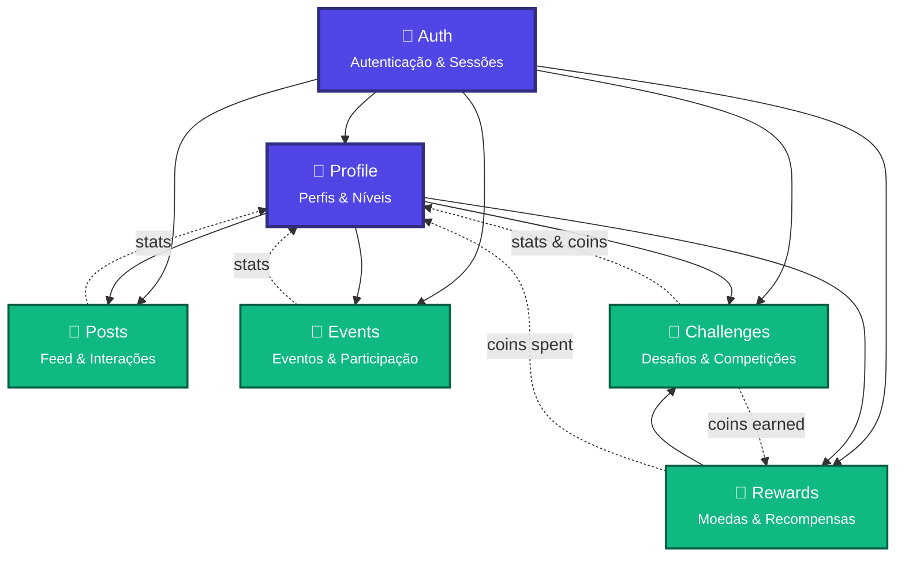
```mermaid
graph TB
    %% Módulos Core
    AUTH["🔐 Auth<br/><small>Autenticação & Sessões</small>"]
    PROFILE["👤 Profile<br/><small>Perfis & Níveis</small>"]

    %% Módulos Feature
    POSTS["📝 Posts<br/><small>Feed & Interações</small>"]
    EVENTS["📅 Events<br/><small>Eventos & Participação</small>"]
    CHALLENGES["🎯 Challenges<br/><small>Desafios & Competições</small>"]
    REWARDS["🎁 Rewards<br/><small>Moedas & Recompensas</small>"]

    %% Dependências diretas
    AUTH --> PROFILE
    AUTH --> POSTS
    AUTH --> EVENTS
    AUTH --> CHALLENGES
    AUTH --> REWARDS

    PROFILE --> POSTS
    PROFILE --> EVENTS
    PROFILE --> CHALLENGES
    PROFILE --> REWARDS

    REWARDS --> CHALLENGES

    %% Feedback loops (dados fluem de volta)
    POSTS -.->|"stats"| PROFILE
    EVENTS -.->|"stats"| PROFILE
    CHALLENGES -.->|"stats & coins"| PROFILE
    CHALLENGES -.->|"coins earned"| REWARDS
    REWARDS -.->|"coins spent"| PROFILE

    %% Estilos
    classDef core fill:#4f46e5,stroke:#312e81,stroke-width:3px,color:#fff
    classDef feature fill:#10b981,stroke:#065f46,stroke-width:2px,color:#fff

    class AUTH,PROFILE core
    class POSTS,EVENTS,CHALLENGES,REWARDS feature
```

### Grafo de Dependências Completo

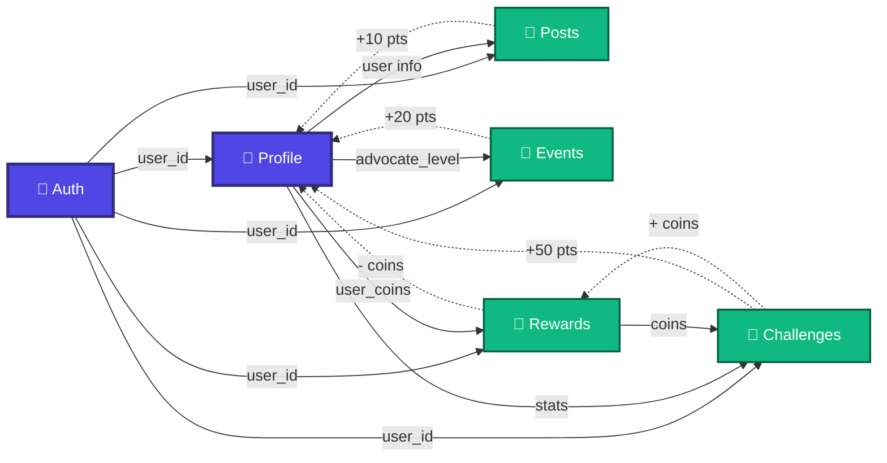
```mermaid
graph LR
    %% Nós dos módulos
    AUTH["🔐 Auth"]
    PROFILE["👤 Profile"]
    POSTS["📝 Posts"]
    EVENTS["📅 Events"]
    CHALLENGES["🎯 Challenges"]
    REWARDS["🎁 Rewards"]

    %% Dependências hard (não pode funcionar sem)
    AUTH -->|"user_id"| PROFILE
    AUTH -->|"user_id"| POSTS
    AUTH -->|"user_id"| EVENTS
    AUTH -->|"user_id"| CHALLENGES
    AUTH -->|"user_id"| REWARDS

    PROFILE -->|"advocate_level"| EVENTS
    PROFILE -->|"user_coins"| REWARDS
    PROFILE -->|"user info"| POSTS
    PROFILE -->|"stats"| CHALLENGES

    REWARDS -->|"coins"| CHALLENGES

    %% Dependências soft (dados fluem de volta)
    POSTS -.->|"+10 pts"| PROFILE
    EVENTS -.->|"+20 pts"| PROFILE
    CHALLENGES -.->|"+50 pts"| PROFILE

    CHALLENGES -.->|"+ coins"| REWARDS
    REWARDS -.->|"- coins"| PROFILE

    %% Estilos
    classDef core fill:#4f46e5,stroke:#312e81,stroke-width:3px,color:#fff
    classDef feature fill:#10b981,stroke:#065f46,stroke-width:2px,color:#fff

    class AUTH,PROFILE core
    class POSTS,EVENTS,CHALLENGES,REWARDS feature
```

---

## Dependências Detalhadas por Módulo

### 🔐 Auth (Módulo Fundacional)

**Descrição**: Gerencia autenticação, sessões e autorização.

**Dependencies**: ❌ Nenhuma (módulo raiz)

**Dependents**: ✅ Todos os outros módulos

**Fornece**:
- `user_id` - Identificador único do usuário autenticado
- `user.role` - Role do usuário (admin ou advocate)
- `session` - Sessão ativa do usuário
- Middleware de proteção de rotas
- Context de autenticação no cliente

**Server Actions**:
- `login()` - Login com email/senha
- `loginWithGoogle()` - OAuth Google
- `logout()` - Encerrar sessão
- `register()` - Registro de novo usuário

**Tabelas**:
- `auth.users` (Supabase Auth)

**Não depende de**:
- ❌ Profile
- ❌ Posts
- ❌ Events
- ❌ Challenges
- ❌ Rewards

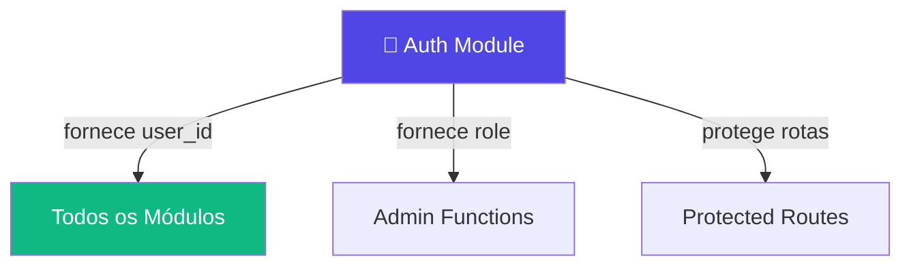
```mermaid
graph TB
    AUTH["🔐 Auth Module"]

    AUTH -->|"fornece user_id"| ALL["Todos os Módulos"]
    AUTH -->|"fornece role"| ADMIN["Admin Functions"]
    AUTH -->|"protege rotas"| ROUTES["Protected Routes"]

    style AUTH fill:#4f46e5,color:#fff
    style ALL fill:#10b981,color:#fff
```

---

### 👤 Profile (Módulo Core)

**Descrição**: Gerencia perfis de usuários, níveis de advocate e estatísticas.

**Dependencies**:
- ✅ **Auth** - Requer `user_id` autenticado

**Dependents**:
- ✅ Posts - Usa informações do perfil
- ✅ Events - Valida `advocate_level`
- ✅ Challenges - Usa stats e nível
- ✅ Rewards - Usa saldo de moedas

**Fornece**:
- `advocate_level` (1-5) - Nível do usuário baseado em pontos
- `advocate_points` - Pontuação acumulada
- `user_coins` - Saldo de moedas virtuais
- Informações do perfil (nome, bio, redes sociais)
- Estatísticas agregadas (posts, eventos, desafios)

**Recebe de outros módulos**:
- Posts: +10 pontos por post aprovado
- Events: +20 pontos por evento concluído (status: attended)
- Challenges: +50 pontos por desafio aprovado
- Challenges: + moedas virtuais (corações ❤️)
- Rewards: - moedas ao resgatar recompensas

**Server Actions**:
- `updateProfile()` - Atualizar dados do perfil
- `getCurrentProfile()` - Obter perfil atual
- `getProfileStats()` - Obter estatísticas agregadas
- `getPublicProfile()` - Visualizar perfil público

**Tabelas**:
- `profiles` - Dados do perfil e nível
- `user_coins` - Saldo de moedas virtuais
- `coin_transactions` - Histórico de transações

**Sistema de Níveis**:
```typescript
Nível 1: 0-99 pontos    (Iniciante)
Nível 2: 100-299 pontos (Ativo)
Nível 3: 300-599 pontos (Engajado)
Nível 4: 600-999 pontos (Super Advocate)
Nível 5: 1000+ pontos   (Elite)
```

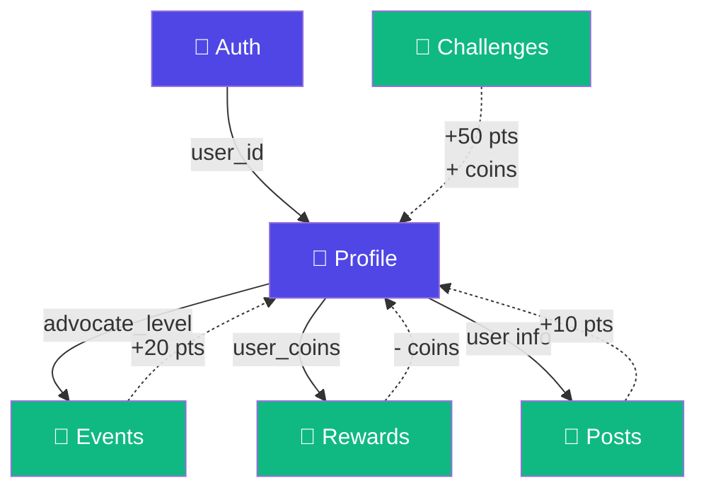
```mermaid
graph TB
    AUTH["🔐 Auth"]
    PROFILE["👤 Profile"]

    POSTS["📝 Posts"]
    EVENTS["📅 Events"]
    CHALLENGES["🎯 Challenges"]
    REWARDS["🎁 Rewards"]

    %% Dependencies
    AUTH -->|"user_id"| PROFILE

    %% Profile fornece para módulos feature
    PROFILE -->|"advocate_level"| EVENTS
    PROFILE -->|"user_coins"| REWARDS
    PROFILE -->|"user info"| POSTS

    %% Módulos feature atualizam Profile
    POSTS -.->|"+10 pts"| PROFILE
    EVENTS -.->|"+20 pts"| PROFILE
    CHALLENGES -.->|"+50 pts<br/>+ coins"| PROFILE
    REWARDS -.->|"- coins"| PROFILE

    style AUTH fill:#4f46e5,color:#fff
    style PROFILE fill:#4f46e5,color:#fff
    style POSTS fill:#10b981,color:#fff
    style EVENTS fill:#10b981,color:#fff
    style CHALLENGES fill:#10b981,color:#fff
    style REWARDS fill:#10b981,color:#fff
```

---

### 📝 Posts (Módulo Feature)

**Descrição**: Sistema de feed de posts, moderação e interações sociais.

**Dependencies**:
- ✅ **Auth** - Requer `user_id` autenticado
- ✅ **Profile** - Usa informações do perfil para exibição

**Dependents**: ❌ Nenhum (não é dependência de outros módulos)

**Fornece**:
- Feed de posts aprovados
- Sistema de likes
- Sistema de comentários
- Moderação admin (aprovar/rejeitar)

**Atualiza em outros módulos**:
- **Profile**: +10 pontos quando post é aprovado

**Server Actions**:
- `createPost()` - Criar novo post
- `approvePost()` - Aprovar post (admin)
- `rejectPost()` - Rejeitar post (admin)
- `likePost()` - Curtir/descurtir post
- `commentPost()` - Comentar em post
- `deletePost()` - Deletar próprio post
- `getPostComments()` - Listar comentários

**Tabelas**:
- `posts` - Posts criados
- `post_likes` - Curtidas
- `post_comments` - Comentários

**Estados do Post**:
```typescript
pending  → aprovado pelo admin → approved
pending  → rejeitado pelo admin → rejected
```

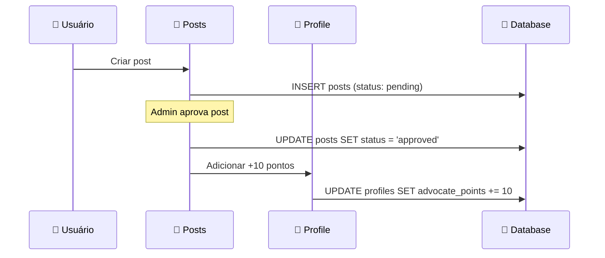
```mermaid
sequenceDiagram
    participant U as 👤 Usuário
    participant PM as 📝 Posts
    participant PR as 👤 Profile
    participant DB as 💾 Database

    U->>PM: Criar post
    PM->>DB: INSERT posts (status: pending)

    Note over PM: Admin aprova post

    PM->>DB: UPDATE posts SET status = 'approved'
    PM->>PR: Adicionar +10 pontos
    PR->>DB: UPDATE profiles SET advocate_points += 10
```

---

### 📅 Events (Módulo Feature)

**Descrição**: Sistema de eventos, inscrições e check-ins.

**Dependencies**:
- ✅ **Auth** - Requer `user_id` autenticado
- ✅ **Profile** - Valida `advocate_level` para eventos exclusivos

**Dependents**: ❌ Nenhum (não é dependência de outros módulos)

**Fornece**:
- Listagem de eventos (virtual, presencial, híbrido)
- Sistema de inscrições com validação de nível
- Check-in para confirmação de presença
- Feedback pós-evento

**Valida**:
- `required_level` vs `advocate_level` do usuário
- Vagas disponíveis
- Evento ativo

**Atualiza em outros módulos**:
- **Profile**: +20 pontos quando evento é concluído (status: attended)

**Server Actions**:
- `registerForEvent()` - Inscrever em evento
- `cancelEventRegistration()` - Cancelar inscrição
- `checkInEvent()` - Fazer check-in (admin)
- `submitEventFeedback()` - Enviar feedback
- `createEvent()` - Criar evento (admin)
- `toggleEventActive()` - Ativar/desativar evento (admin)
- `confirmEventRegistration()` - Confirmar inscrição (admin)

**Tabelas**:
- `events` - Eventos criados
- `event_registrations` - Inscrições de usuários

**Estados da Inscrição**:
```typescript
registered → confirmado pelo admin → confirmed
confirmed  → fez check-in → attended
registered → cancelado → cancelled
```

**Fluxo de Validação de Nível**:
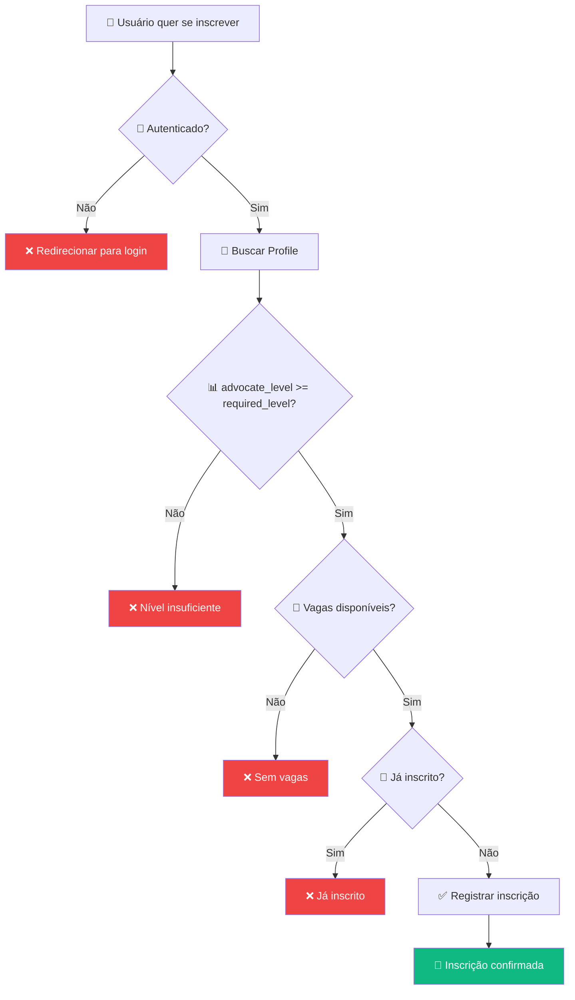
```mermaid
flowchart TD
    Start["👤 Usuário quer se inscrever"] --> CheckAuth{"🔐 Autenticado?"}
    CheckAuth -->|Não| Error1["❌ Redirecionar para login"]
    CheckAuth -->|Sim| GetProfile["👤 Buscar Profile"]

    GetProfile --> CheckLevel{"📊 advocate_level >= required_level?"}
    CheckLevel -->|Não| Error2["❌ Nível insuficiente"]
    CheckLevel -->|Sim| CheckVagas{"🎫 Vagas disponíveis?"}

    CheckVagas -->|Não| Error3["❌ Sem vagas"]
    CheckVagas -->|Sim| CheckDuplicate{"🔄 Já inscrito?"}

    CheckDuplicate -->|Sim| Error4["❌ Já inscrito"]
    CheckDuplicate -->|Não| Register["✅ Registrar inscrição"]

    Register --> Success["🎉 Inscrição confirmada"]

    style Error1 fill:#ef4444,color:#fff
    style Error2 fill:#ef4444,color:#fff
    style Error3 fill:#ef4444,color:#fff
    style Error4 fill:#ef4444,color:#fff
    style Success fill:#10b981,color:#fff
```

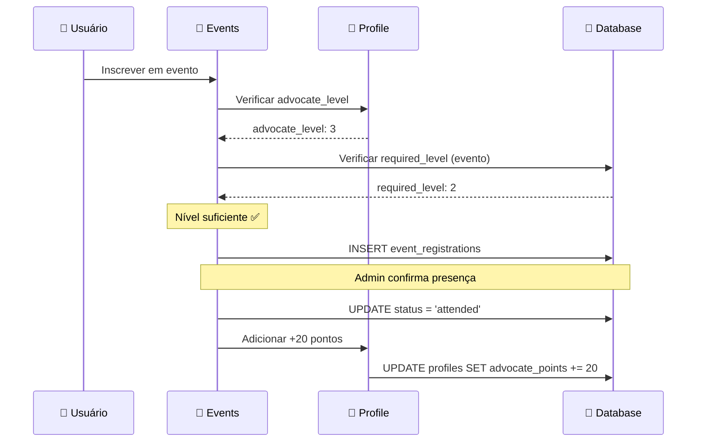
```mermaid
sequenceDiagram
    participant U as 👤 Usuário
    participant EV as 📅 Events
    participant PR as 👤 Profile
    participant DB as 💾 Database

    U->>EV: Inscrever em evento
    EV->>PR: Verificar advocate_level
    PR-->>EV: advocate_level: 3

    EV->>DB: Verificar required_level (evento)
    DB-->>EV: required_level: 2

    Note over EV: Nível suficiente ✅

    EV->>DB: INSERT event_registrations

    Note over EV,DB: Admin confirma presença

    EV->>DB: UPDATE status = 'attended'
    EV->>PR: Adicionar +20 pontos
    PR->>DB: UPDATE profiles SET advocate_points += 20
```

---

### 🎯 Challenges (Módulo Feature)

**Descrição**: Sistema de desafios físicos e de engajamento com recompensas.

**Dependencies**:
- ✅ **Auth** - Requer `user_id` autenticado
- ✅ **Profile** - Usa stats e nível para validações
- ✅ **Rewards** - Credita moedas ao aprovar participações

**Dependents**: ❌ Nenhum (não é dependência de outros módulos)

**Fornece**:
- Listagem de desafios (físico, engajamento, participe)
- Participação com submissão de evidências
- Verificação por IA (Google Gemini)
- Moderação admin
- Seleção de vencedores (sorteio)
- Recompensas duais (moedas + PIX)

**Atualiza em outros módulos**:
- **Profile**: +50 pontos quando participação é aprovada
- **Rewards**: + moedas virtuais (quantidade configurável por desafio)

**Tipos de Desafios**:
1. **Físico**: Requer resultado numérico + vídeo opcional + post social opcional
2. **Engajamento**: Participação em post do Instagram + sorteio de prêmio
3. **Participe**: Simplesmente participar + sorteio de prêmio

**Server Actions**:
- `participateInChallenge()` - Participar de desafio
- `updateParticipation()` - Atualizar evidências
- `approveParticipation()` - Aprovar participação (admin) → credita moedas
- `rejectParticipation()` - Rejeitar participação (admin)
- `createChallenge()` - Criar desafio (admin)
- `toggleChallengeActive()` - Ativar/desativar (admin)
- `closeChallenge()` - Encerrar desafio (admin)
- `registerWinner()` - Registrar vencedor (admin)
- `markPrizeSent()` - Marcar prêmio enviado (admin)

**Tabelas**:
- `challenges` - Desafios criados
- `challenge_participants` - Participações
- `challenge_winners` - Vencedores de sorteios

**Integração com IA**:
- **Google Gemini** para análise de vídeos de evidência
- Veredicto: approved, count, confidence, reasoning
- Decisão final sempre com admin

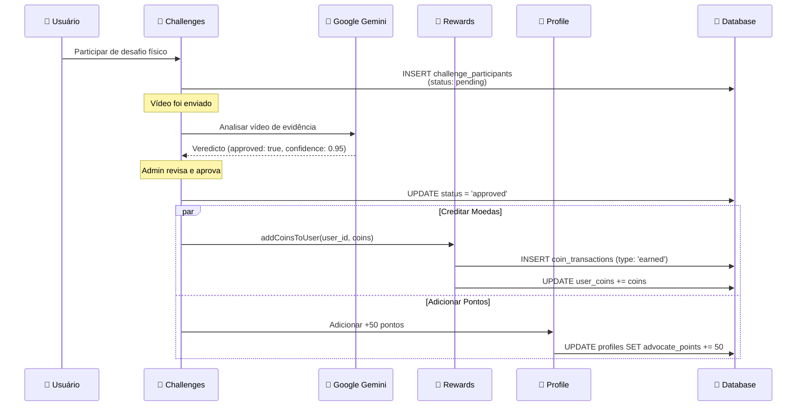
```mermaid
sequenceDiagram
    participant U as 👤 Usuário
    participant CH as 🎯 Challenges
    participant AI as 🤖 Google Gemini
    participant RW as 🎁 Rewards
    participant PR as 👤 Profile
    participant DB as 💾 Database

    U->>CH: Participar de desafio físico
    CH->>DB: INSERT challenge_participants<br/>(status: pending)

    Note over CH: Vídeo foi enviado

    CH->>AI: Analisar vídeo de evidência
    AI-->>CH: Veredicto (approved: true, confidence: 0.95)

    Note over CH: Admin revisa e aprova

    CH->>DB: UPDATE status = 'approved'

    par Creditar Moedas
        CH->>RW: addCoinsToUser(user_id, coins)
        RW->>DB: INSERT coin_transactions (type: 'earned')
        RW->>DB: UPDATE user_coins += coins
    and Adicionar Pontos
        CH->>PR: Adicionar +50 pontos
        PR->>DB: UPDATE profiles SET advocate_points += 50
    end
```

---

### 🎁 Rewards (Módulo Feature)

**Descrição**: Sistema de moedas virtuais e resgate de recompensas.

**Dependencies**:
- ✅ **Auth** - Requer `user_id` autenticado
- ✅ **Profile** - Usa `user_coins` para validar saldo

**Dependents**:
- ✅ **Challenges** - Recebe moedas ao aprovar participações

**Fornece**:
- Sistema de moedas virtuais (corações ❤️)
- Marketplace de recompensas físicas e digitais
- Resgate com validação de saldo e estoque
- Histórico de transações
- Tracking de entrega

**Recebe de outros módulos**:
- **Challenges**: + moedas ao aprovar participação

**Atualiza em outros módulos**:
- **Profile**: - moedas ao resgatar recompensa

**Server Actions**:
- `claimReward()` - Resgatar recompensa
- `cancelClaim()` - Cancelar resgate (devolve moedas)
- `toggleRewardActive()` - Ativar/desativar recompensa (admin)
- `approveClaim()` - Aprovar resgate (admin)
- `markClaimShipped()` - Marcar como enviado (admin)
- `markClaimDelivered()` - Marcar como entregue (admin)
- `createReward()` - Criar recompensa (admin)
- `updateReward()` - Atualizar recompensa (admin)
- `addCoinsToUser()` - Adicionar moedas (usado por Challenges)

**Tabelas**:
- `rewards` - Recompensas disponíveis
- `reward_claims` - Resgates de usuários
- `user_coins` - Saldo de moedas (gerenciado por Profile)
- `coin_transactions` - Histórico de transações (gerenciado por Profile)

**Estados do Resgate**:
```typescript
pending → aprovado pelo admin → approved
approved → enviado pelo admin → shipped
shipped → entregue → delivered
pending → cancelado pelo usuário → cancelled (devolve moedas)
```

**Fluxo de Resgate com Validações**:
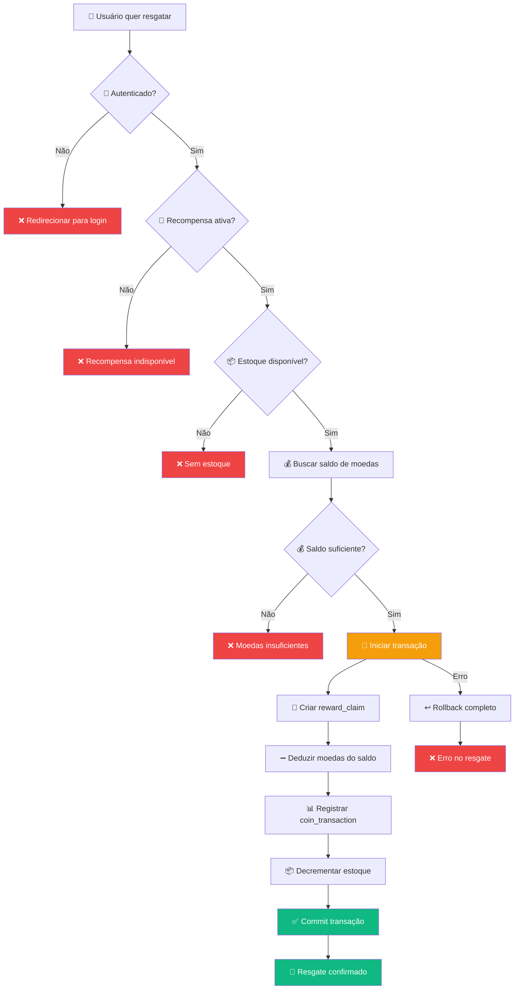
```mermaid
flowchart TD
    Start["👤 Usuário quer resgatar"] --> CheckAuth{"🔐 Autenticado?"}
    CheckAuth -->|Não| Error1["❌ Redirecionar para login"]
    CheckAuth -->|Sim| CheckReward{"🎁 Recompensa ativa?"}

    CheckReward -->|Não| Error2["❌ Recompensa indisponível"]
    CheckReward -->|Sim| CheckStock{"📦 Estoque disponível?"}

    CheckStock -->|Não| Error3["❌ Sem estoque"]
    CheckStock -->|Sim| GetCoins["💰 Buscar saldo de moedas"]

    GetCoins --> CheckBalance{"💰 Saldo suficiente?"}
    CheckBalance -->|Não| Error4["❌ Moedas insuficientes"]
    CheckBalance -->|Sim| Transaction["🔄 Iniciar transação"]

    Transaction --> CreateClaim["📝 Criar reward_claim"]
    CreateClaim --> DeductCoins["➖ Deduzir moedas do saldo"]
    DeductCoins --> LogTransaction["📊 Registrar coin_transaction"]
    LogTransaction --> DecrementStock["📦 Decrementar estoque"]
    DecrementStock --> Commit["✅ Commit transação"]

    Commit --> Success["🎉 Resgate confirmado"]

    Transaction -->|Erro| Rollback["↩️ Rollback completo"]
    Rollback --> Error5["❌ Erro no resgate"]

    style Error1 fill:#ef4444,color:#fff
    style Error2 fill:#ef4444,color:#fff
    style Error3 fill:#ef4444,color:#fff
    style Error4 fill:#ef4444,color:#fff
    style Error5 fill:#ef4444,color:#fff
    style Success fill:#10b981,color:#fff
    style Transaction fill:#f59e0b,color:#fff
    style Commit fill:#10b981,color:#fff
```

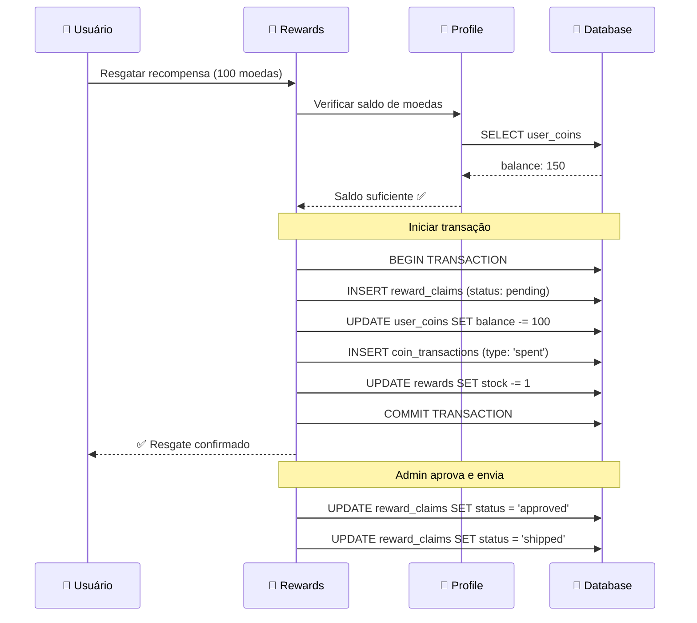
```mermaid
sequenceDiagram
    participant U as 👤 Usuário
    participant RW as 🎁 Rewards
    participant PR as 👤 Profile
    participant DB as 💾 Database

    U->>RW: Resgatar recompensa (100 moedas)
    RW->>PR: Verificar saldo de moedas
    PR->>DB: SELECT user_coins
    DB-->>PR: balance: 150
    PR-->>RW: Saldo suficiente ✅

    Note over RW,DB: Iniciar transação

    RW->>DB: BEGIN TRANSACTION
    RW->>DB: INSERT reward_claims (status: pending)
    RW->>DB: UPDATE user_coins SET balance -= 100
    RW->>DB: INSERT coin_transactions (type: 'spent')
    RW->>DB: UPDATE rewards SET stock -= 1
    RW->>DB: COMMIT TRANSACTION

    RW-->>U: ✅ Resgate confirmado

    Note over RW,DB: Admin aprova e envia

    RW->>DB: UPDATE reward_claims SET status = 'approved'
    RW->>DB: UPDATE reward_claims SET status = 'shipped'
```

---

## Fluxo de Dados Entre Módulos

### Visão Consolidada

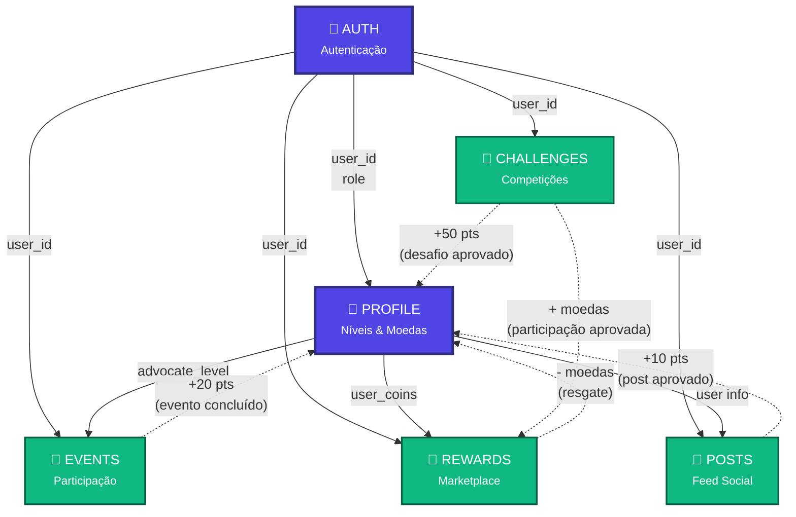
```mermaid
flowchart TB
    %% Módulos
    AUTH["🔐 AUTH<br/><small>Autenticação</small>"]
    PROFILE["👤 PROFILE<br/><small>Níveis & Moedas</small>"]

    POSTS["📝 POSTS<br/><small>Feed Social</small>"]
    EVENTS["📅 EVENTS<br/><small>Participação</small>"]
    CHALLENGES["🎯 CHALLENGES<br/><small>Competições</small>"]
    REWARDS["🎁 REWARDS<br/><small>Marketplace</small>"]

    %% Fluxo de autenticação (base)
    AUTH -->|"user_id<br/>role"| PROFILE
    AUTH -->|"user_id"| POSTS
    AUTH -->|"user_id"| EVENTS
    AUTH -->|"user_id"| CHALLENGES
    AUTH -->|"user_id"| REWARDS

    %% Fluxo de Profile para Features
    PROFILE -->|"advocate_level"| EVENTS
    PROFILE -->|"user_coins"| REWARDS
    PROFILE -->|"user info"| POSTS

    %% Fluxo de Features para Profile (feedback)
    POSTS -.->|"+10 pts<br/>(post aprovado)"| PROFILE
    EVENTS -.->|"+20 pts<br/>(evento concluído)"| PROFILE
    CHALLENGES -.->|"+50 pts<br/>(desafio aprovado)"| PROFILE

    %% Fluxo entre Challenges e Rewards
    CHALLENGES -.->|"+ moedas<br/>(participação aprovada)"| REWARDS
    REWARDS -.->|"- moedas<br/>(resgate)"| PROFILE

    %% Estilos
    classDef core fill:#4f46e5,stroke:#312e81,stroke-width:3px,color:#fff
    classDef feature fill:#10b981,stroke:#065f46,stroke-width:2px,color:#fff

    class AUTH,PROFILE core
    class POSTS,EVENTS,CHALLENGES,REWARDS feature
```

### Timeline de Interações


```mermaid
gantt
    title Jornada Completa de um Advocate
    dateFormat X
    axisFormat %s

    section 🔐 Auth
    Registro na plataforma           :milestone, m1, 0, 0
    Login inicial                    :a1, 0, 1

    section 👤 Profile
    Criação de perfil (Nível 1)     :p1, 1, 2
    Edição de perfil                 :p2, 10, 11

    section 📝 Posts
    Criar primeiro post              :po1, 2, 3
    Post aprovado (+10 pts)          :milestone, m2, 3, 0
    Curtir posts de outros           :po2, 4, 6
    Comentar posts                   :po3, 6, 8

    section 📅 Events
    Inscrever em evento (Nível 1 OK) :e1, 5, 6
    Participar do evento             :e2, 12, 13
    Evento concluído (+20 pts)       :milestone, m3, 13, 0

    section 🎯 Challenges
    Participar de desafio físico     :c1, 8, 9
    Submeter evidências              :c2, 9, 10
    IA analisa vídeo                 :c3, 10, 11
    Admin aprova (+50 pts + moedas)  :milestone, m4, 11, 0

    section 👤 Profile
    Subir para Nível 2 (100+ pts)    :milestone, m5, 13, 0

    section 🎁 Rewards
    Resgatar recompensa (50 moedas)  :r1, 14, 15
    Receber prêmio                   :r2, 16, 17
```

### Diagrama de Sequência - Fluxo Integrado

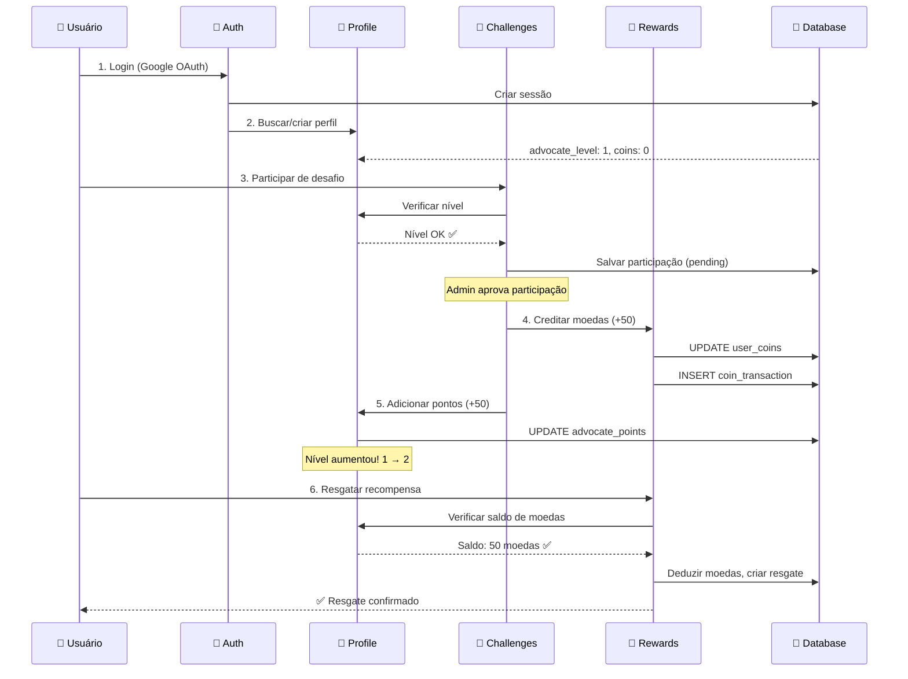
```mermaid
sequenceDiagram
    participant U as 👤 Usuário
    participant A as 🔐 Auth
    participant P as 👤 Profile
    participant C as 🎯 Challenges
    participant R as 🎁 Rewards
    participant DB as 💾 Database

    U->>A: 1. Login (Google OAuth)
    A->>DB: Criar sessão
    A->>P: 2. Buscar/criar perfil
    DB-->>P: advocate_level: 1, coins: 0

    U->>C: 3. Participar de desafio
    C->>P: Verificar nível
    P-->>C: Nível OK ✅
    C->>DB: Salvar participação (pending)

    Note over C: Admin aprova participação

    C->>R: 4. Creditar moedas (+50)
    R->>DB: UPDATE user_coins
    R->>DB: INSERT coin_transaction
    C->>P: 5. Adicionar pontos (+50)
    P->>DB: UPDATE advocate_points

    Note over P: Nível aumentou! 1 → 2

    U->>R: 6. Resgatar recompensa
    R->>P: Verificar saldo de moedas
    P-->>R: Saldo: 50 moedas ✅
    R->>DB: Deduzir moedas, criar resgate
    R-->>U: ✅ Resgate confirmado
```

---

## Tabelas e Relacionamentos

### Entity Relationship Diagram (ERD)

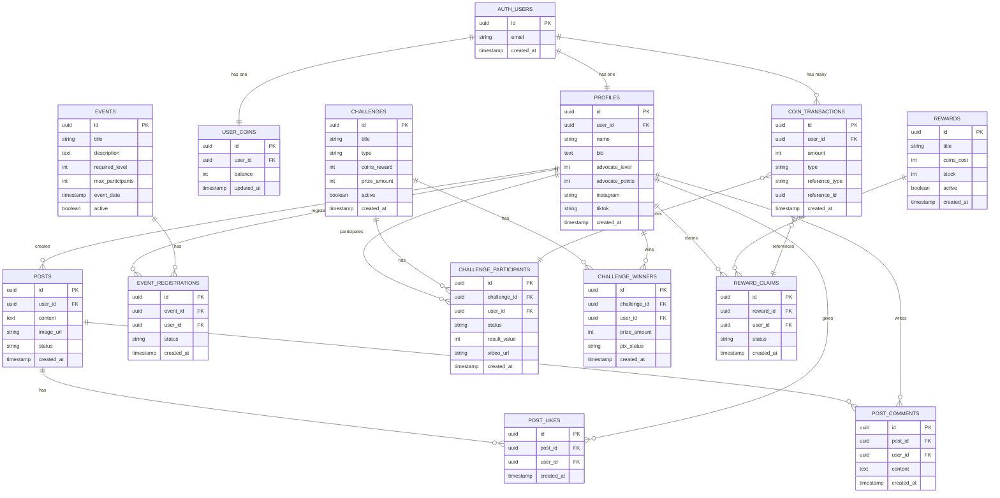
```mermaid
erDiagram
    %% Módulo Auth
    AUTH_USERS {
        uuid id PK
        string email
        timestamp created_at
    }

    %% Módulo Profile
    PROFILES {
        uuid id PK
        uuid user_id FK
        string name
        text bio
        int advocate_level
        int advocate_points
        string instagram
        string tiktok
        timestamp created_at
    }

    USER_COINS {
        uuid id PK
        uuid user_id FK
        int balance
        timestamp updated_at
    }

    COIN_TRANSACTIONS {
        uuid id PK
        uuid user_id FK
        int amount
        string type
        string reference_type
        uuid reference_id
        timestamp created_at
    }

    %% Módulo Posts
    POSTS {
        uuid id PK
        uuid user_id FK
        text content
        string image_url
        string status
        timestamp created_at
    }

    POST_LIKES {
        uuid id PK
        uuid post_id FK
        uuid user_id FK
        timestamp created_at
    }

    POST_COMMENTS {
        uuid id PK
        uuid post_id FK
        uuid user_id FK
        text content
        timestamp created_at
    }

    %% Módulo Events
    EVENTS {
        uuid id PK
        string title
        text description
        int required_level
        int max_participants
        timestamp event_date
        boolean active
    }

    EVENT_REGISTRATIONS {
        uuid id PK
        uuid event_id FK
        uuid user_id FK
        string status
        timestamp created_at
    }

    %% Módulo Challenges
    CHALLENGES {
        uuid id PK
        string title
        string type
        int coins_reward
        int prize_amount
        boolean active
        timestamp created_at
    }

    CHALLENGE_PARTICIPANTS {
        uuid id PK
        uuid challenge_id FK
        uuid user_id FK
        string status
        int result_value
        string video_url
        timestamp created_at
    }

    CHALLENGE_WINNERS {
        uuid id PK
        uuid challenge_id FK
        uuid user_id FK
        int prize_amount
        string pix_status
        timestamp created_at
    }

    %% Módulo Rewards
    REWARDS {
        uuid id PK
        string title
        int coins_cost
        int stock
        boolean active
        timestamp created_at
    }

    REWARD_CLAIMS {
        uuid id PK
        uuid reward_id FK
        uuid user_id FK
        string status
        timestamp created_at
    }

    %% Relacionamentos Auth
    AUTH_USERS ||--|| PROFILES : "has one"
    AUTH_USERS ||--|| USER_COINS : "has one"
    AUTH_USERS ||--o{ COIN_TRANSACTIONS : "has many"

    %% Relacionamentos Profile
    PROFILES ||--o{ POSTS : "creates"
    PROFILES ||--o{ EVENT_REGISTRATIONS : "registers"
    PROFILES ||--o{ CHALLENGE_PARTICIPANTS : "participates"
    PROFILES ||--o{ REWARD_CLAIMS : "claims"

    %% Relacionamentos Posts
    POSTS ||--o{ POST_LIKES : "has"
    POSTS ||--o{ POST_COMMENTS : "has"
    PROFILES ||--o{ POST_LIKES : "gives"
    PROFILES ||--o{ POST_COMMENTS : "writes"

    %% Relacionamentos Events
    EVENTS ||--o{ EVENT_REGISTRATIONS : "has"

    %% Relacionamentos Challenges
    CHALLENGES ||--o{ CHALLENGE_PARTICIPANTS : "has"
    CHALLENGES ||--o{ CHALLENGE_WINNERS : "has"
    PROFILES ||--o{ CHALLENGE_WINNERS : "wins"

    %% Relacionamentos Rewards
    REWARDS ||--o{ REWARD_CLAIMS : "has"
    COIN_TRANSACTIONS }o--|| CHALLENGE_PARTICIPANTS : "references"
    COIN_TRANSACTIONS }o--|| REWARD_CLAIMS : "references"
```

### Matriz de Relacionamentos

| Tabela | Módulo | Depende de (FK) | Atualizado por |
|--------|--------|-----------------|----------------|
| `auth.users` | Auth | - | Supabase Auth |
| `profiles` | Profile | `auth.users` | Auth, Posts, Events, Challenges |
| `user_coins` | Profile | `auth.users` | Challenges, Rewards |
| `coin_transactions` | Profile | `auth.users` | Challenges, Rewards |
| `posts` | Posts | `profiles` | Posts |
| `post_likes` | Posts | `posts`, `profiles` | Posts |
| `post_comments` | Posts | `posts`, `profiles` | Posts |
| `events` | Events | - | Events (admin) |
| `event_registrations` | Events | `events`, `profiles` | Events |
| `challenges` | Challenges | - | Challenges (admin) |
| `challenge_participants` | Challenges | `challenges`, `profiles` | Challenges |
| `challenge_winners` | Challenges | `challenges`, `profiles` | Challenges (admin) |
| `rewards` | Rewards | - | Rewards (admin) |
| `reward_claims` | Rewards | `rewards`, `profiles` | Rewards |

---

## Módulos Core vs Feature

### Módulos Core (Fundacionais)

Módulos que **outros módulos dependem** para funcionar:

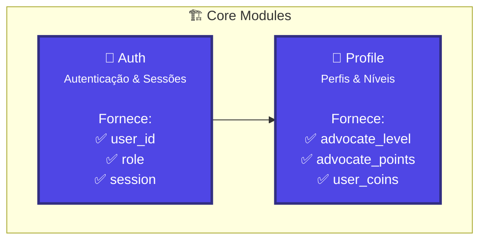
```mermaid
graph TB
    subgraph "🏗️ Core Modules"
        AUTH["🔐 Auth<br/><small>Autenticação & Sessões</small><br/><br/>Fornece:<br/>✅ user_id<br/>✅ role<br/>✅ session"]
        PROFILE["👤 Profile<br/><small>Perfis & Níveis</small><br/><br/>Fornece:<br/>✅ advocate_level<br/>✅ advocate_points<br/>✅ user_coins"]
    end

    AUTH --> PROFILE

    style AUTH fill:#4f46e5,color:#fff,stroke:#312e81,stroke-width:3px
    style PROFILE fill:#4f46e5,color:#fff,stroke:#312e81,stroke-width:3px
```

**Características**:
- ❌ Não dependem de módulos feature
- ✅ São dependências de todos os outros módulos
- 🔒 Obrigatórios para funcionamento da plataforma
- 🏗️ Devem ser inicializados primeiro

### Módulos Feature (Funcionais)

Módulos que **implementam funcionalidades** da plataforma:

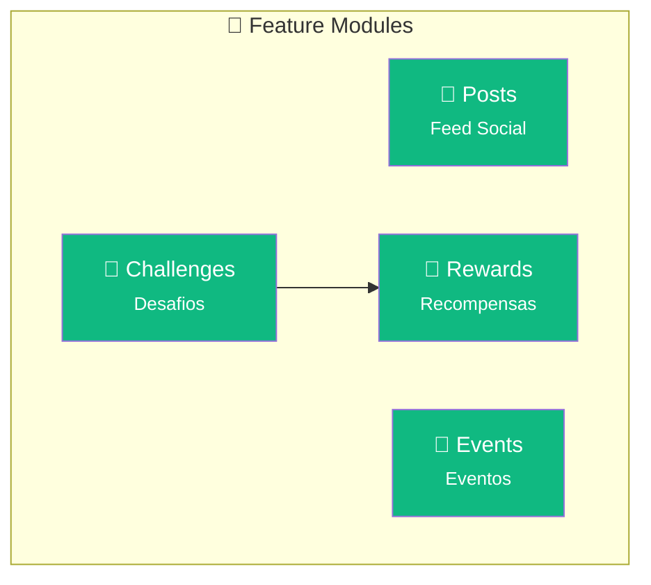
```mermaid
graph TB
    subgraph "🎨 Feature Modules"
        POSTS["📝 Posts<br/><small>Feed Social</small>"]
        EVENTS["📅 Events<br/><small>Eventos</small>"]
        CHALLENGES["🎯 Challenges<br/><small>Desafios</small>"]
        REWARDS["🎁 Rewards<br/><small>Recompensas</small>"]
    end

    CHALLENGES --> REWARDS

    style POSTS fill:#10b981,color:#fff
    style EVENTS fill:#10b981,color:#fff
    style CHALLENGES fill:#10b981,color:#fff
    style REWARDS fill:#10b981,color:#fff
```

**Características**:
- ✅ Dependem de módulos core (Auth, Profile)
- ✅ Podem depender uns dos outros (ex: Challenges → Rewards)
- 🔄 Atualizam dados dos módulos core (pontos, moedas)
- 🎯 Implementam lógica de negócio específica

---

## Ordem de Inicialização

### Grafo de Dependências para Deploy

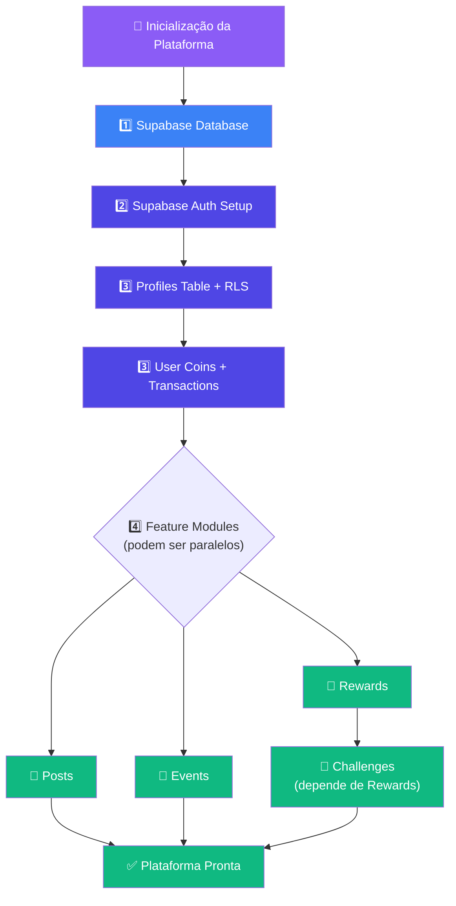
```mermaid
graph TD
    Start["🚀 Inicialização da Plataforma"] --> DB["1️⃣ Supabase Database"]
    DB --> AuthSetup["2️⃣ Supabase Auth Setup"]
    AuthSetup --> ProfileSetup["3️⃣ Profiles Table + RLS"]
    ProfileSetup --> CoinsSetup["3️⃣ User Coins + Transactions"]

    CoinsSetup --> ParallelFeatures{"4️⃣ Feature Modules<br/>(podem ser paralelos)"}

    ParallelFeatures --> Posts["📝 Posts"]
    ParallelFeatures --> Events["📅 Events"]
    ParallelFeatures --> Rewards["🎁 Rewards"]

    Rewards --> Challenges["🎯 Challenges<br/>(depende de Rewards)"]

    Posts --> Ready["✅ Plataforma Pronta"]
    Events --> Ready
    Challenges --> Ready

    style Start fill:#8b5cf6,color:#fff
    style DB fill:#3b82f6,color:#fff
    style AuthSetup fill:#4f46e5,color:#fff
    style ProfileSetup fill:#4f46e5,color:#fff
    style CoinsSetup fill:#4f46e5,color:#fff
    style Posts fill:#10b981,color:#fff
    style Events fill:#10b981,color:#fff
    style Challenges fill:#10b981,color:#fff
    style Rewards fill:#10b981,color:#fff
    style Ready fill:#10b981,color:#fff
```

### Ordem de Criação de Tabelas

```sql
-- 1. Core: Auth (gerenciado pelo Supabase)
CREATE TABLE auth.users (...);

-- 2. Core: Profile
CREATE TABLE profiles (...);
CREATE TABLE user_coins (...);
CREATE TABLE coin_transactions (...);

-- 3. Features: Posts (independente)
CREATE TABLE posts (...);
CREATE TABLE post_likes (...);
CREATE TABLE post_comments (...);

-- 4. Features: Events (independente)
CREATE TABLE events (...);
CREATE TABLE event_registrations (...);

-- 5. Features: Rewards (independente)
CREATE TABLE rewards (...);
CREATE TABLE reward_claims (...);

-- 6. Features: Challenges (depende de Rewards para moedas)
CREATE TABLE challenges (...);
CREATE TABLE challenge_participants (...);
CREATE TABLE challenge_winners (...);
```

### Checklist de Inicialização

- [ ] **1. Supabase Database**
  - [ ] Criar projeto no Supabase
  - [ ] Configurar variáveis de ambiente

- [ ] **2. Auth Module**
  - [ ] Configurar Supabase Auth
  - [ ] Habilitar Google OAuth
  - [ ] Configurar callback URLs
  - [ ] Criar middleware de proteção

- [ ] **3. Profile Module**
  - [ ] Criar tabela `profiles`
  - [ ] Criar tabela `user_coins`
  - [ ] Criar tabela `coin_transactions`
  - [ ] Configurar políticas RLS
  - [ ] Criar trigger de criação de perfil automático
  - [ ] Criar função de cálculo de nível

- [ ] **4. Posts Module** (pode ser paralelo)
  - [ ] Criar tabelas `posts`, `post_likes`, `post_comments`
  - [ ] Configurar políticas RLS
  - [ ] Criar Server Actions

- [ ] **5. Events Module** (pode ser paralelo)
  - [ ] Criar tabelas `events`, `event_registrations`
  - [ ] Configurar políticas RLS
  - [ ] Criar Server Actions com validação de nível

- [ ] **6. Rewards Module** (pode ser paralelo)
  - [ ] Criar tabelas `rewards`, `reward_claims`
  - [ ] Configurar políticas RLS
  - [ ] Criar Server Actions com transações

- [ ] **7. Challenges Module** (após Rewards)
  - [ ] Criar tabelas `challenges`, `challenge_participants`, `challenge_winners`
  - [ ] Configurar políticas RLS
  - [ ] Configurar Google Gemini API
  - [ ] Criar Server Actions integradas com Rewards

---

## Resumo Visual - Mapa Mental

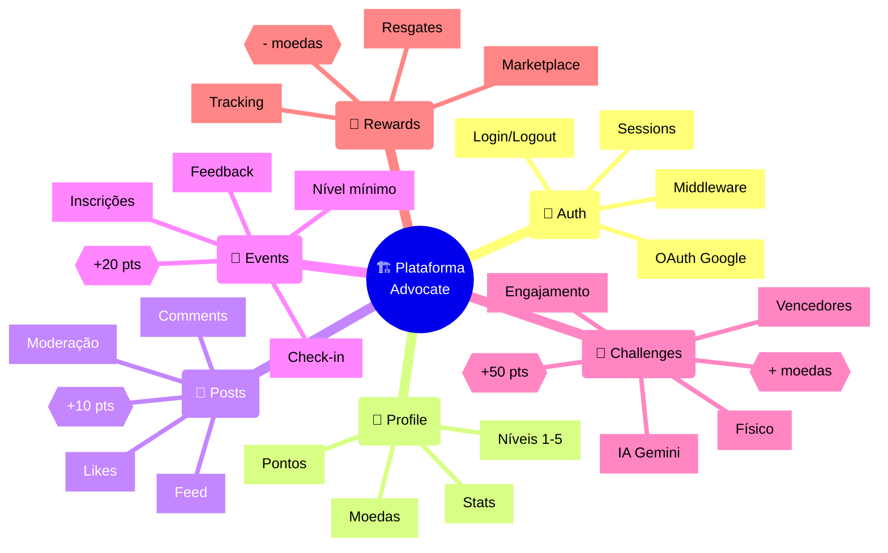
```mermaid
mindmap
  root((🏗️ Plataforma<br/>Advocate))
    (🔐 Auth)
      [Login/Logout]
      [OAuth Google]
      [Sessions]
      [Middleware]
    (👤 Profile)
      [Níveis 1-5]
      [Pontos]
      [Moedas]
      [Stats]
    (📝 Posts)
      [Feed]
      [Likes]
      [Comments]
      [Moderação]
      {{+10 pts}}
    (📅 Events)
      [Inscrições]
      [Check-in]
      [Feedback]
      [Nível mínimo]
      {{+20 pts}}
    (🎯 Challenges)
      [Físico]
      [Engajamento]
      [IA Gemini]
      [Vencedores]
      {{+50 pts}}
      {{+ moedas}}
    (🎁 Rewards)
      [Marketplace]
      [Resgates]
      [Tracking]
      {{- moedas}}
```

---

## Conclusão

Este documento apresentou uma visão completa das **dependências entre módulos** da Plataforma de Advocate Marketing:

### Principais Aprendizados:

1. **Auth** é o módulo raiz - todos os outros dependem dele
2. **Profile** é o módulo central - armazena níveis, pontos e moedas
3. **Posts, Events, Challenges** atualizam Profile com pontos
4. **Challenges** credita moedas via módulo **Rewards**
5. **Rewards** deduz moedas do Profile ao resgatar recompensas
6. **Events** valida `advocate_level` do Profile antes de permitir inscrição

### Fluxo de Valor:

```
Usuário → Participa (Posts/Events/Challenges)
       → Ganha Pontos + Moedas
       → Sobe de Nível
       → Acessa Eventos Exclusivos
       → Resgata Recompensas
```

### Próximos Passos:

- [SECURITY_RLS.md](./SECURITY_RLS.md) - Políticas de segurança por tabela
- [DATABASE.md](./DATABASE.md) - Estrutura completa do banco de dados
- [ARCHITECTURE.md](./ARCHITECTURE.md) - Visão geral da arquitetura

---

**Documentação criada em**: 2026-01-07
**Última atualização**: 2026-01-07
