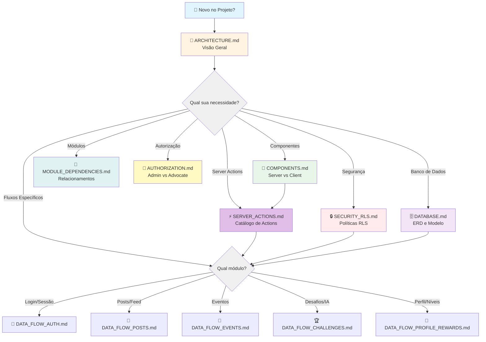

# 📚 Documentação de Arquitetura - Plataforma de Advocate Marketing

Bem-vindo à documentação técnica completa da Plataforma de Advocate Marketing! Esta documentação foi criada para facilitar o onboarding de novos desenvolvedores e fornecer uma visão clara da arquitetura do sistema.

## 🎯 Visão Geral

Esta plataforma é construída com **Next.js 15**, **Supabase** e **TypeScript**, utilizando uma arquitetura moderna baseada em Server Components, Client Components, Server Actions e Row Level Security (RLS) para garantir segurança e performance.

### 📊 Estatísticas da Documentação

- **12 documentos** de arquitetura
- **100+ diagramas** Mermaid
- **15 tabelas** de banco de dados documentadas
- **45+ Server Actions** catalogadas
- **60+ políticas RLS** explicadas
- **6 módulos** principais (Auth, Profile, Posts, Events, Challenges, Rewards)

---

## 🚀 Por Onde Começar?

### Para Novos Desenvolvedores
1. 📖 Comece com **[ARCHITECTURE.md](./ARCHITECTURE.md)** - Visão geral da arquitetura
2. 🧩 Entenda **[COMPONENTS.md](./COMPONENTS.md)** - Server vs Client Components
3. ⚡ Explore **[SERVER_ACTIONS.md](./SERVER_ACTIONS.md)** - Todas as ações disponíveis
4. 🔐 Revise **[SECURITY_RLS.md](./SECURITY_RLS.md)** - Políticas de segurança

### Para Arquitetos de Software
1. 🏗️ **[ARCHITECTURE.md](./ARCHITECTURE.md)** - Decisões arquiteturais
2. 🔗 **[MODULE_DEPENDENCIES.md](./MODULE_DEPENDENCIES.md)** - Relacionamentos entre módulos
3. 🗄️ **[DATABASE.md](./DATABASE.md)** - Modelo de dados e ERD
4. 👥 **[AUTHORIZATION.md](./AUTHORIZATION.md)** - Controle de acesso

### Para Entender Fluxos de Dados
1. 🔑 **[Autenticação](./flows/DATA_FLOW_AUTH.md)** - Login, OAuth, middleware
2. 📝 **[Posts e Feed](./flows/DATA_FLOW_POSTS.md)** - Publicações e interações
3. 📅 **[Eventos](./flows/DATA_FLOW_EVENTS.md)** - Sistema de eventos
4. 🏆 **[Desafios](./flows/DATA_FLOW_CHALLENGES.md)** - Desafios e gamificação
5. 🎁 **[Perfil e Recompensas](./flows/DATA_FLOW_PROFILE_REWARDS.md)** - Níveis e marketplace

---

## 📂 Índice de Documentos

### 🏗️ Arquitetura Geral

#### [ARCHITECTURE.md](./ARCHITECTURE.md)
Documento principal contendo a visão geral completa da arquitetura da plataforma.

**Conteúdo:**
- Stack tecnológica (Next.js 15, Supabase, Tailwind CSS, TypeScript)
- Estrutura de diretórios explicada
- Princípios arquiteturais (Server-first, RLS, validação multi-camada)
- Diagrama de alto nível do sistema
- Fluxo de dados entre camadas
- Módulos principais e suas responsabilidades
- Padrões de desenvolvimento

**Quando consultar:** Primeiro documento a ler para entender a visão geral do projeto.

---

### 🧩 Componentes e Camadas

#### [COMPONENTS.md](./COMPONENTS.md)
Guia completo sobre quando usar Server Components vs Client Components.

**Conteúdo:**
- Princípios fundamentais de Server vs Client Components
- Casos de uso detalhados com exemplos
- Diagrama de decisão interativo
- Exemplos do código real da base
- Padrões de composição e boas práticas
- Comunicação entre componentes
- Checklist de decisão prático

**Quando consultar:** Antes de criar novos componentes ou refatorar existentes.

---

#### [SERVER_ACTIONS.md](./SERVER_ACTIONS.md)
Catálogo completo de todas as Server Actions da plataforma.

**Conteúdo:**
- 45+ Server Actions documentadas
- Parâmetros e tipos de retorno
- Queries Supabase utilizadas
- Validações e autorizações
- Efeitos colaterais (revalidação, redirecionamento)
- Diagramas de relacionamentos
- Matriz de dependências Actions x Tabelas
- Padrões de uso (transações, rollback, validação multi-camada)

**Quando consultar:** Ao implementar funcionalidades que requerem comunicação com o servidor.

---

#### [MODULE_DEPENDENCIES.md](./MODULE_DEPENDENCIES.md)
Mapa de relacionamentos e dependências entre módulos.

**Conteúdo:**
- 6 módulos principais (Auth, Profile, Posts, Events, Challenges, Rewards)
- Grafo de dependências entre módulos
- Fluxo de dados (user_id, advocate_level, user_coins, pontos)
- Distinção Core vs Feature modules
- Ordem de inicialização para deploy
- Timeline da jornada do advocate
- ERD completo com 15 tabelas
- Checklist de inicialização do sistema

**Quando consultar:** Ao entender como os módulos se relacionam ou planejar novos recursos.

---

### 🔒 Segurança e Autorização

#### [SECURITY_RLS.md](./SECURITY_RLS.md)
Documentação completa de todas as políticas de Row Level Security (RLS).

**Conteúdo:**
- Matriz de permissões de todas as 15 tabelas
- Políticas RLS detalhadas por tabela
- Diagramas de fluxo de permissões (SELECT, INSERT, UPDATE, DELETE)
- Código SQL completo das policies
- 6 padrões de segurança documentados
- Validação em múltiplas camadas (Client → Server Actions → RLS)
- Testes de RLS com queries SQL
- Troubleshooting de problemas comuns
- 31 diagramas Mermaid

**Quando consultar:** Ao criar novas tabelas, modificar permissões ou debugar acesso negado.

---

#### [AUTHORIZATION.md](./AUTHORIZATION.md)
Diferenças de acesso entre roles Admin e Advocate.

**Conteúdo:**
- Hierarquia de roles (admin vs advocate)
- Matriz completa de 50+ funcionalidades por role
- Funcionalidades exclusivas admin (moderação, gestão)
- Funcionalidades advocate (posts, eventos, desafios, recompensas)
- Fluxo de autorização em 4 camadas (UI → Middleware → Server Actions → RLS)
- Implementação técnica (isAdmin(), useAuth(), RLS functions)
- Controle de rotas por role
- Diferenças de UI/UX entre roles
- Exemplos de código práticos
- 30+ diagramas incluindo quadrant charts e flowcharts

**Quando consultar:** Ao implementar funcionalidades restritas a admins ou validar permissões.

---

### 🗄️ Banco de Dados

#### [DATABASE.md](./DATABASE.md)
Modelo de dados completo com ERD e relacionamentos.

**Conteúdo:**
- Diagrama ERD completo com 15 tabelas
- Documentação detalhada tabela por tabela
- 25+ Foreign Keys com ações ON DELETE
- 20+ índices para performance
- Funções e triggers customizados
- Constraints e validações (CHECK, UNIQUE)
- Resumo de segurança RLS por tabela
- Mapeamento de Tipos TypeScript (src/types → tabelas)
- Tipos base, de operação e estendidos
- Enums e padrões de uso

**Quando consultar:** Ao trabalhar com queries, criar migrations ou entender o modelo de dados.

---

### 🔄 Fluxos de Dados

#### [flows/DATA_FLOW_AUTH.md](./flows/DATA_FLOW_AUTH.md)
Fluxo completo de autenticação e autorização.

**Conteúdo:**
- Login OAuth com Google (diagrama de sequência completo)
- Callback OAuth com fluxo de decisão
- 3 tipos de clientes Supabase (browser, server, middleware)
- Ciclo de vida da sessão
- Middleware de proteção de rotas
- AuthContext e listeners
- Fluxo integrado de login ponta-a-ponta
- Logout e cleanup
- Timeline com tempos de execução
- Estrutura de arquivos

**Quando consultar:** Ao trabalhar com login, logout, sessões ou proteção de rotas.

---

#### [flows/DATA_FLOW_POSTS.md](./flows/DATA_FLOW_POSTS.md)
Sistema completo de posts, feed e interações.

**Conteúdo:**
- Arquitetura do sistema de posts
- Criação de post (Client → Server Actions → Supabase)
- Sistema de moderação admin (aprovar/rejeitar)
- Exibição no feed com Server Components
- Sistema de likes com atualização otimista
- Sistema de comentários com validação
- Deleção de posts
- Fluxo completo de dados entre todas as camadas
- Diagramas de estado e timeline
- Políticas RLS para posts, likes e comentários
- 15+ diagramas Mermaid

**Quando consultar:** Ao trabalhar com publicações, feed, moderação ou interações sociais.

---

#### [flows/DATA_FLOW_EVENTS.md](./flows/DATA_FLOW_EVENTS.md)
Sistema de eventos e participações.

**Conteúdo:**
- Arquitetura do sistema de eventos
- Listagem de eventos (acontecendo agora, próximos, passados)
- Registro de participação com validações multi-camada
  - Evento ativo
  - Nível de advocate requerido
  - Vagas disponíveis
  - Inscrição única
- Verificação de nível de advocate
- Fluxo admin para criação de eventos
  - Campos dinâmicos por tipo (virtual, presencial, híbrido)
- Gestão de eventos por status
- Sistema de check-in para eventos ao vivo
- Sistema de feedback pós-evento
- Timeline Gantt do ciclo de vida
- Diagramas de estado de inscrições
- Políticas RLS para events e event_registrations
- Diagrama ERD de relacionamentos
- 20+ diagramas Mermaid

**Quando consultar:** Ao trabalhar com eventos, inscrições, check-in ou validação de níveis.

---

#### [flows/DATA_FLOW_CHALLENGES.md](./flows/DATA_FLOW_CHALLENGES.md)
Sistema completo de desafios, gamificação e recompensas.

**Conteúdo:**
- 3 tipos de desafios (físico, engajamento, participe)
- Listagem e agrupamento por tipo/status
- Participação em desafios físicos
- Submissão de evidências:
  - Resultado numérico obrigatório
  - Vídeo prova opcional
  - Post em rede social opcional
- **Verificação automática por IA** usando Google Gemini
  - Análise multimodal de vídeos
  - Veredicto estruturado (approved, count, confidence, reasoning)
- Moderação admin de participações
- Seleção de vencedores para sorteios
- Sistema dual de recompensas:
  - **Moedas virtuais** (corações ❤️) com transações
  - **Prêmios em dinheiro** via PIX com controle de pagamento
- Gestão admin de desafios
- Timeline Gantt completa
- Diagramas de estado (participações e vencedores)
- Políticas RLS para 5 tabelas
- ERD completo
- 30+ diagramas Mermaid
- 2640 linhas de documentação

**Quando consultar:** Ao trabalhar com desafios, gamificação, IA, moedas virtuais ou prêmios.

---

#### [flows/DATA_FLOW_PROFILE_REWARDS.md](./flows/DATA_FLOW_PROFILE_REWARDS.md)
Sistema de perfil, níveis de advocate e marketplace de recompensas.

**Conteúdo:**
- Gestão de perfil (visualização, edição, perfil público)
- Sistema de redes sociais (Instagram, TikTok, YouTube, Twitter)
- **Sistema de níveis de advocate:**
  - 5 níveis progressivos (Iniciante → Elite)
  - Pontuação por ação (posts +10, eventos +20, desafios +50)
  - Benefícios crescentes por nível
  - Validação de nível para eventos exclusivos
- **Sistema de resgate de recompensas:**
  - Marketplace de prêmios físicos e digitais
  - Validações multi-camada (ativa, estoque, saldo)
  - Fluxo transacional com rollback
  - Estados de resgate (pending → approved → shipped → delivered)
  - Cancelamento com estorno
- **Histórico de participações:**
  - Timeline consolidada (posts, eventos, desafios, recompensas)
  - Agregação de estatísticas multi-fonte
  - Visualização com filtros
- Gestão admin de recompensas e resgates
- Sistema de moedas virtuais (corações ❤️)
  - Saldo em user_coins
  - Histórico em coin_transactions
  - Total earned vs spent
- Fluxo completo de dados entre todas as camadas
- Timeline Gantt da jornada do advocate
- Diagramas de estado para resgates
- Políticas RLS para 5 tabelas
- ERD completo
- Progressão gamificada
- Código de exemplo completo
- 20+ diagramas Mermaid

**Quando consultar:** Ao trabalhar com perfis, níveis, moedas, marketplace ou sistema de recompensas.

---

## 🗺️ Mapa de Navegação



---

## 📋 Matriz de Documentação por Caso de Uso

| Caso de Uso | Documentos Relevantes | Ordem Sugerida |
|-------------|----------------------|----------------|
| **Criar novo componente** | COMPONENTS.md → SERVER_ACTIONS.md → SECURITY_RLS.md | 1 → 2 → 3 |
| **Implementar nova feature** | ARCHITECTURE.md → MODULE_DEPENDENCIES.md → SERVER_ACTIONS.md → DATABASE.md | 1 → 2 → 3 → 4 |
| **Debugar permissões** | AUTHORIZATION.md → SECURITY_RLS.md → SERVER_ACTIONS.md | 1 → 2 → 3 |
| **Entender fluxo existente** | Escolher DATA_FLOW_*.md relevante → SERVER_ACTIONS.md → DATABASE.md | 1 → 2 → 3 |
| **Criar nova tabela** | DATABASE.md → SECURITY_RLS.md → SERVER_ACTIONS.md | 1 → 2 → 3 |
| **Onboarding geral** | ARCHITECTURE.md → COMPONENTS.md → Todos os DATA_FLOW_*.md | 1 → 2 → 3+ |
| **Trabalhar com autenticação** | DATA_FLOW_AUTH.md → AUTHORIZATION.md → SECURITY_RLS.md | 1 → 2 → 3 |
| **Implementar gamificação** | DATA_FLOW_CHALLENGES.md → DATA_FLOW_PROFILE_REWARDS.md → MODULE_DEPENDENCIES.md | 1 → 2 → 3 |
| **Integrar IA** | DATA_FLOW_CHALLENGES.md (seção Google Gemini) → SERVER_ACTIONS.md | 1 → 2 |
| **Deploy/Setup inicial** | MODULE_DEPENDENCIES.md → DATABASE.md → SECURITY_RLS.md | 1 → 2 → 3 |

---

## 🎨 Convenções de Documentação

### Diagramas
Todos os diagramas são criados usando **Mermaid** e incluem:
- 🎨 Cores para facilitar visualização
- 😊 Emojis para identificação rápida
- 📝 Legendas e explicações
- 🔗 Relacionamentos claros

### Código
Exemplos de código seguem estas convenções:
- **Comentários em português** (seguindo CLAUDE.md)
- **Nomenclatura em inglês** (padrão de desenvolvimento)
- **Tipagem estrita** com TypeScript
- **Código real** extraído da base sempre que possível

### Estrutura
Cada documento segue uma estrutura consistente:
1. 📖 **Visão Geral** - Contexto e objetivos
2. 🏗️ **Arquitetura** - Estrutura e componentes
3. 🔄 **Fluxos** - Diagramas de sequência e decisão
4. 💻 **Código** - Exemplos práticos
5. 🔒 **Segurança** - Políticas RLS relevantes
6. 🗂️ **Estrutura de Arquivos** - Organização do código
7. 🔗 **Links Relacionados** - Navegação para outros documentos

---

## 🔍 Busca Rápida

### Por Tecnologia
- **Next.js 15:** ARCHITECTURE.md, COMPONENTS.md
- **Supabase:** DATABASE.md, SECURITY_RLS.md, todos os DATA_FLOW_*.md
- **TypeScript:** DATABASE.md (seção de tipos), SERVER_ACTIONS.md
- **Row Level Security:** SECURITY_RLS.md, AUTHORIZATION.md
- **Google Gemini AI:** DATA_FLOW_CHALLENGES.md

### Por Conceito
- **Server Components:** COMPONENTS.md
- **Client Components:** COMPONENTS.md
- **Server Actions:** SERVER_ACTIONS.md
- **Autenticação:** DATA_FLOW_AUTH.md, AUTHORIZATION.md
- **Autorização:** AUTHORIZATION.md, SECURITY_RLS.md
- **Validação:** SERVER_ACTIONS.md, SECURITY_RLS.md
- **Transações:** SERVER_ACTIONS.md, DATA_FLOW_CHALLENGES.md, DATA_FLOW_PROFILE_REWARDS.md
- **Gamificação:** DATA_FLOW_CHALLENGES.md, DATA_FLOW_PROFILE_REWARDS.md
- **Moedas virtuais:** DATA_FLOW_CHALLENGES.md, DATA_FLOW_PROFILE_REWARDS.md
- **Moderação:** DATA_FLOW_POSTS.md, DATA_FLOW_CHALLENGES.md

### Por Tabela
Consulte **DATABASE.md** para ERD completo e documentação de cada tabela:
- `users` / `profiles` - AUTH, PROFILE
- `user_coins`, `coin_transactions` - PROFILE, CHALLENGES, REWARDS
- `posts`, `post_likes`, `post_comments` - POSTS
- `events`, `event_registrations` - EVENTS
- `challenges`, `challenge_participants`, `challenge_winners` - CHALLENGES
- `rewards`, `reward_claims` - REWARDS

### Por Server Action
Consulte **SERVER_ACTIONS.md** para catálogo completo das 45+ actions organizadas por módulo.

---

## 💡 Dicas de Navegação

### 🆕 Primeiro Dia no Projeto
```
1. Leia ARCHITECTURE.md (30 min)
2. Explore COMPONENTS.md (20 min)
3. Navegue pelos DATA_FLOW_*.md do seu módulo (40 min)
4. Revise SECURITY_RLS.md para entender permissões (20 min)
```

### 🐛 Debugando um Problema
```
1. Identifique o módulo afetado
2. Leia o DATA_FLOW_*.md correspondente
3. Verifique SERVER_ACTIONS.md para validações
4. Consulte SECURITY_RLS.md se for problema de permissão
5. Revise DATABASE.md se for relacionado a dados
```

### 🚀 Implementando Nova Feature
```
1. Planeje com ARCHITECTURE.md e MODULE_DEPENDENCIES.md
2. Decida componentes com COMPONENTS.md
3. Implemente Server Actions conforme SERVER_ACTIONS.md
4. Crie migrations seguindo DATABASE.md
5. Configure RLS baseado em SECURITY_RLS.md
6. Teste autorização conforme AUTHORIZATION.md
```

### 📚 Aprendizado Contínuo
- Leia um documento de fluxo (DATA_FLOW_*.md) por dia
- Compare o código real com os diagramas
- Contribua com melhorias na documentação quando encontrar gaps

---

## 🤝 Contribuindo com a Documentação

Esta documentação é viva e deve evoluir com o projeto!

### Quando Atualizar
- ✅ Ao adicionar novas Server Actions
- ✅ Ao criar novas tabelas ou modificar schema
- ✅ Ao implementar novos fluxos de dados
- ✅ Ao adicionar políticas RLS
- ✅ Ao mudar padrões arquiteturais
- ✅ Ao descobrir informações importantes não documentadas

### Como Atualizar
1. Edite o documento relevante (Markdown + Mermaid)
2. Mantenha a estrutura e convenções existentes
3. Adicione exemplos de código real
4. Atualize diagramas se necessário
5. Revise links e referências cruzadas
6. Commit com mensagem descritiva em português

### Checklist de Qualidade
- [ ] Comentários em português
- [ ] Código em inglês
- [ ] Diagramas Mermaid renderizam corretamente
- [ ] Links internos funcionam
- [ ] Exemplos são do código real
- [ ] Estrutura consistente com outros documentos

---

## 📞 Recursos Adicionais

### Documentação Externa
- [Next.js 15 Documentation](https://nextjs.org/docs)
- [Supabase Documentation](https://supabase.com/docs)
- [TypeScript Handbook](https://www.typescriptlang.org/docs/)
- [Mermaid Diagram Syntax](https://mermaid.js.org/intro/)
- [Tailwind CSS](https://tailwindcss.com/docs)

### Arquivos de Configuração do Projeto
- `CLAUDE.md` - Regras e princípios do projeto
- `package.json` - Dependências e scripts
- `tsconfig.json` - Configuração TypeScript
- `next.config.js` - Configuração Next.js
- `.env.local` - Variáveis de ambiente (não versionado)

---

## 📈 Estatísticas da Documentação

| Categoria | Documentos | Diagramas | Linhas |
|-----------|------------|-----------|--------|
| **Arquitetura Geral** | 1 | 10+ | 1.000+ |
| **Componentes e Camadas** | 3 | 30+ | 4.000+ |
| **Segurança** | 2 | 40+ | 5.000+ |
| **Banco de Dados** | 1 | 15+ | 1.500+ |
| **Fluxos de Dados** | 5 | 100+ | 10.000+ |
| **TOTAL** | **12** | **195+** | **21.500+** |

---

## 🎯 Roadmap da Documentação

### ✅ Completo
- [x] Arquitetura geral do sistema
- [x] Fluxos de dados de todos os módulos
- [x] Documentação de componentes
- [x] Catálogo de Server Actions
- [x] Políticas RLS completas
- [x] Modelo de dados e ERD
- [x] Sistema de autorização
- [x] Dependências entre módulos
- [x] Índice navegável

### 🔄 Em Progresso
- [ ] Adicionar exemplos de testes
- [ ] Documentar estratégias de cache
- [ ] Guia de troubleshooting expandido

### 📅 Planejado
- [ ] Guia de deployment passo-a-passo
- [ ] Performance benchmarks
- [ ] Guia de migração de versões
- [ ] Video walkthroughs dos fluxos principais

---

## 🏁 Conclusão

Esta documentação foi criada para ser sua **fonte única de verdade** sobre a arquitetura da Plataforma de Advocate Marketing. Não hesite em consultá-la frequentemente e contribuir com melhorias!

### 🎓 Próximos Passos Sugeridos

1. **Iniciantes:** Comece por [ARCHITECTURE.md](./ARCHITECTURE.md)
2. **Desenvolvedores:** Mergulhe em [COMPONENTS.md](./COMPONENTS.md) e [SERVER_ACTIONS.md](./SERVER_ACTIONS.md)
3. **Arquitetos:** Explore [MODULE_DEPENDENCIES.md](./MODULE_DEPENDENCIES.md) e [DATABASE.md](./DATABASE.md)
4. **DevOps:** Foque em [SECURITY_RLS.md](./SECURITY_RLS.md) e [AUTHORIZATION.md](./AUTHORIZATION.md)

### 💬 Feedback

Encontrou algo confuso? Faltando informação? Sugestões de melhoria?
- Abra uma issue no repositório
- Faça uma contribuição direta
- Converse com o time de arquitetura

---

**Documentação criada em:** Janeiro 2026
**Última atualização:** 2026-01-07
**Versão da plataforma:** Next.js 15 + Supabase
**Status:** ✅ Completa e atualizada

---

<div align="center">

**Bons estudos e bom desenvolvimento! 🚀**

Made with ❤️ by the Advocate Marketing Team

</div>
