# Segurança e Row Level Security (RLS)

## 📋 Índice

1. [Visão Geral](#visão-geral)
2. [O Que é Row Level Security](#o-que-é-row-level-security)
3. [Matriz de Permissões Consolidada](#matriz-de-permissões-consolidada)
4. [Fluxo de Autorização por Perfil](#fluxo-de-autorização-por-perfil)
5. [Políticas RLS por Tabela](#políticas-rls-por-tabela)
   - [Módulo Auth](#módulo-auth)
   - [Módulo Posts](#módulo-posts)
   - [Módulo Events](#módulo-events)
   - [Módulo Challenges](#módulo-challenges)
   - [Módulo Rewards](#módulo-rewards)
   - [Módulo Profile](#módulo-profile)
6. [Padrões de Segurança](#padrões-de-segurança)
7. [Validação em Múltiplas Camadas](#validação-em-múltiplas-camadas)
8. [Testes de RLS](#testes-de-rls)
9. [Troubleshooting](#troubleshooting)

---

## Visão Geral

A plataforma de Advocate Marketing utiliza **Row Level Security (RLS)** do Supabase como camada fundamental de segurança. RLS garante que cada usuário só possa acessar dados autorizados, independentemente de bugs na aplicação.

### 🎯 Princípios de Segurança

1. **Defense in Depth**: Múltiplas camadas de segurança (Client-side, Server Actions, RLS)
2. **Least Privilege**: Usuários têm apenas permissões necessárias
3. **Zero Trust**: Toda operação é validada no banco de dados
4. **Auditabilidade**: Políticas claras e documentadas

### 📊 Estatísticas de Segurança

- **Total de Tabelas com RLS**: 15
- **Políticas RLS Ativas**: 40+
- **Perfis de Acesso**: 3 (Público, Autenticado, Admin)
- **Tabelas Públicas**: 0 (todas protegidas por autenticação)

### 🔐 Arquitetura de Segurança

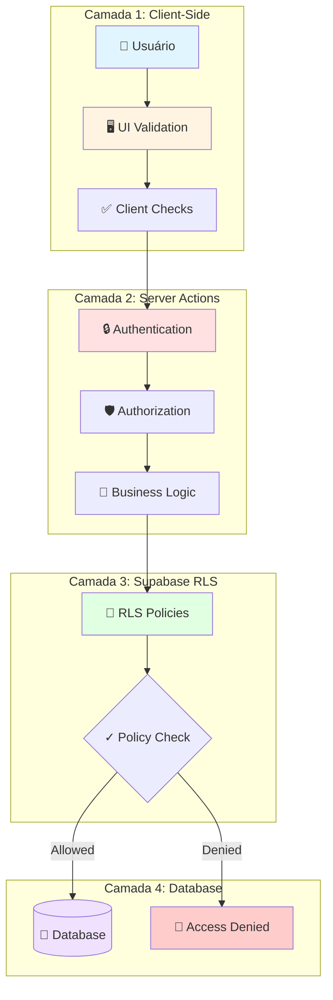

---

## O Que é Row Level Security

### Definição

**Row Level Security (RLS)** é um sistema de segurança a nível de linha do PostgreSQL/Supabase que:
- Restringe quais linhas um usuário pode ver/modificar
- Executa no banco de dados (camada mais segura)
- É independente do código da aplicação
- Previne acessos não autorizados mesmo com bugs no código

### Como Funciona

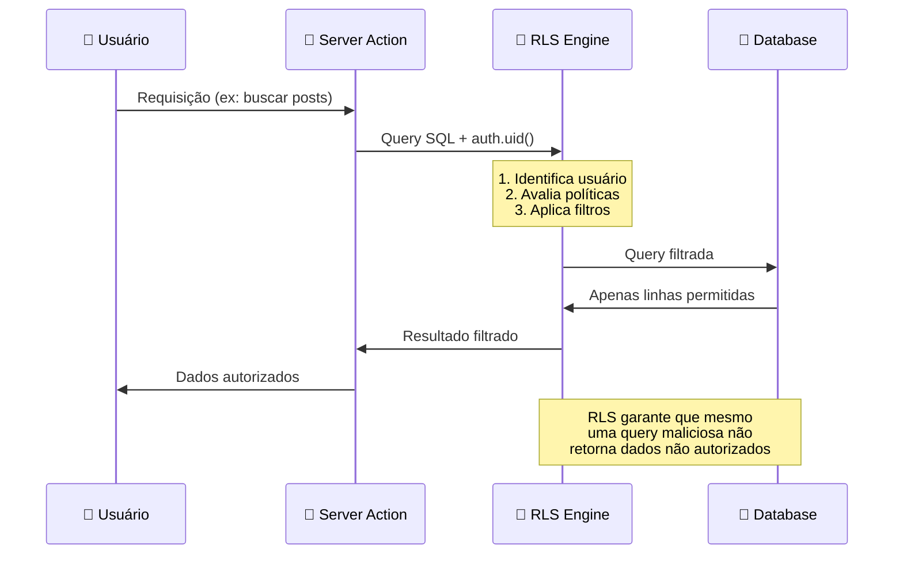

### Funções Especiais do Supabase

O RLS utiliza funções especiais para identificar o usuário:

```sql
-- Retorna UUID do usuário autenticado
auth.uid()

-- Retorna JWT completo
auth.jwt()

-- Verifica se usuário está autenticado
auth.role() = 'authenticated'
```

### Exemplo Prático

```sql
-- ❌ SEM RLS: Qualquer usuário pode ver TODOS os posts
SELECT * FROM posts;

-- ✅ COM RLS: Usuário só vê posts permitidos
CREATE POLICY "Users view allowed posts"
ON posts FOR SELECT
USING (
  status = 'approved'           -- Todos veem aprovados
  OR auth.uid() = user_id       -- Autor vê próprios
  OR is_admin(auth.uid())       -- Admin vê todos
);

-- A query continua simples no código
SELECT * FROM posts;  -- RLS filtra automaticamente!
```

---

## Matriz de Permissões Consolidada

### Visão Geral de Permissões

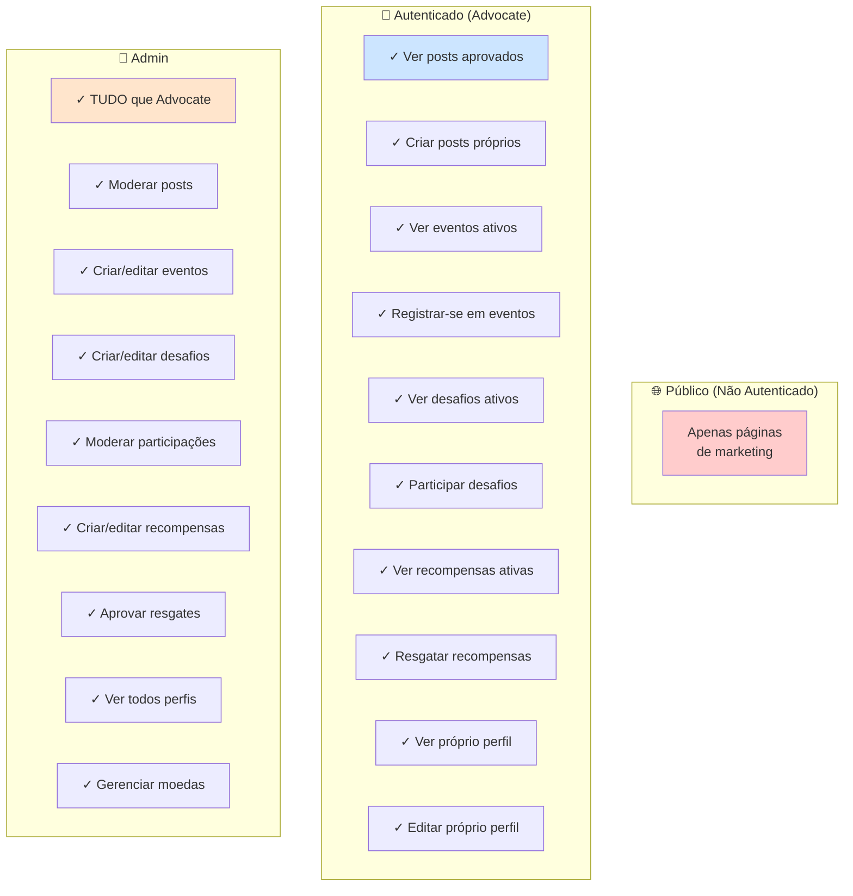

### Tabela de Permissões Detalhada

| Tabela | Público | Autenticado | Admin |
|--------|---------|-------------|-------|
| **profiles** | ❌ Nenhum | 👀 Todos (leitura)<br/>✏️ Próprio (edição) | 👀 Todos<br/>✏️ Todos |
| **user_coins** | ❌ Nenhum | 👀 Próprio saldo | 👀 Todos<br/>📊 Relatórios |
| **coin_transactions** | ❌ Nenhum | 👀 Próprias transações | 👀 Todas transações<br/>✅ Criar (via RPC) |
| **posts** | ❌ Nenhum | 👀 Aprovados + próprios<br/>➕ Criar próprios | 👀 Todos<br/>✏️ Moderar<br/>🗑️ Deletar |
| **post_likes** | ❌ Nenhum | 👀 Todos<br/>➕ Criar próprios<br/>🗑️ Remover próprios | 👀 Todos |
| **post_comments** | ❌ Nenhum | 👀 Todos<br/>➕ Criar próprios<br/>🗑️ Remover próprios | 👀 Todos<br/>🗑️ Deletar qualquer |
| **events** | ❌ Nenhum | 👀 Ativos | 👀 Todos<br/>➕ Criar<br/>✏️ Editar |
| **event_registrations** | ❌ Nenhum | 👀 Próprias<br/>➕ Criar<br/>✏️ Cancelar próprias | 👀 Todas<br/>✏️ Gerenciar |
| **challenges** | ❌ Nenhum | 👀 Ativos | 👀 Todos<br/>➕ Criar<br/>✏️ Editar |
| **challenge_participants** | ❌ Nenhum | 👀 Próprias + aprovadas<br/>➕ Participar | 👀 Todas<br/>✏️ Aprovar/Rejeitar |
| **challenge_winners** | ❌ Nenhum | 👀 Todos | 👀 Todos<br/>➕ Registrar<br/>✏️ Marcar pago |
| **rewards** | ❌ Nenhum | 👀 Ativos | 👀 Todos<br/>➕ Criar<br/>✏️ Editar |
| **reward_claims** | ❌ Nenhum | 👀 Próprios<br/>➕ Criar<br/>✏️ Cancelar (pending) | 👀 Todos<br/>✏️ Aprovar/Enviar |

### Legenda

- 👀 **SELECT**: Visualizar dados
- ➕ **INSERT**: Criar novos registros
- ✏️ **UPDATE**: Atualizar registros
- 🗑️ **DELETE**: Deletar registros
- ❌ **Nenhum**: Sem acesso

---

## Fluxo de Autorização por Perfil

### Diagrama de Decisão: Quem Pode Acessar?

```mermaid
flowchart TD
    START([Requisição ao Banco]) --> AUTH{Usuário<br/>autenticado?}

    AUTH -->|❌ Não| DENY1[🚫 Acesso Negado]
    AUTH -->|✅ Sim| ROLE{Qual o role?}

    ROLE -->|👑 Admin| ADMIN_CHECK{Verificar<br/>is_admin/role}
    ROLE -->|👤 Advocate| USER_CHECK{Qual operação?}

    ADMIN_CHECK -->|✅ É Admin| GRANT_ADMIN[✅ Acesso Total<br/>Ver/Editar/Deletar]
    ADMIN_CHECK -->|❌ Não é Admin| USER_CHECK

    USER_CHECK -->|SELECT| READ_CHECK{O que ler?}
    USER_CHECK -->|INSERT| WRITE_CHECK{O que criar?}
    USER_CHECK -->|UPDATE| UPDATE_CHECK{O que atualizar?}
    USER_CHECK -->|DELETE| DELETE_CHECK{O que deletar?}

    READ_CHECK -->|Posts| READ_POSTS{Status?}
    READ_CHECK -->|Events| READ_EVENTS{Ativo?}
    READ_CHECK -->|Challenges| READ_CHAL{Ativo?}
    READ_CHECK -->|Rewards| READ_REW{Ativo?}
    READ_CHECK -->|Profile| READ_PROF[✅ Qualquer perfil]
    READ_CHECK -->|Own Data| READ_OWN[✅ Próprios dados]

    READ_POSTS -->|approved| GRANT1[✅ Permitido]
    READ_POSTS -->|pending/rejected| OWN_POST{É autor?}
    OWN_POST -->|✅ Sim| GRANT2[✅ Permitido]
    OWN_POST -->|❌ Não| DENY2[🚫 Negado]

    READ_EVENTS -->|✅ Sim| GRANT3[✅ Permitido]
    READ_EVENTS -->|❌ Não| DENY3[🚫 Negado]

    READ_CHAL -->|✅ Sim| GRANT4[✅ Permitido]
    READ_CHAL -->|❌ Não| DENY4[🚫 Negado]

    READ_REW -->|✅ Sim| GRANT5[✅ Permitido]
    READ_REW -->|❌ Não| DENY5[🚫 Negado]

    WRITE_CHECK -->|Own Resource| OWN_WRITE{user_id =<br/>auth.uid()?}
    OWN_WRITE -->|✅ Sim| GRANT6[✅ Permitido]
    OWN_WRITE -->|❌ Não| DENY6[🚫 Negado]

    UPDATE_CHECK -->|Own Resource| OWN_UPDATE{user_id =<br/>auth.uid()?}
    OWN_UPDATE -->|✅ Sim| GRANT7[✅ Permitido]
    OWN_UPDATE -->|❌ Não| DENY7[🚫 Negado]

    DELETE_CHECK -->|Own Resource| OWN_DELETE{user_id =<br/>auth.uid()?}
    OWN_DELETE -->|✅ Sim| GRANT8[✅ Permitido]
    OWN_DELETE -->|❌ Não| DENY8[🚫 Negado]

    style START fill:#e1f5ff
    style GRANT_ADMIN fill:#ccffcc
    style GRANT1 fill:#ccffcc
    style GRANT2 fill:#ccffcc
    style GRANT3 fill:#ccffcc
    style GRANT4 fill:#ccffcc
    style GRANT5 fill:#ccffcc
    style GRANT6 fill:#ccffcc
    style GRANT7 fill:#ccffcc
    style GRANT8 fill:#ccffcc
    style READ_PROF fill:#ccffcc
    style READ_OWN fill:#ccffcc
    style DENY1 fill:#ffcccc
    style DENY2 fill:#ffcccc
    style DENY3 fill:#ffcccc
    style DENY4 fill:#ffcccc
    style DENY5 fill:#ffcccc
    style DENY6 fill:#ffcccc
    style DENY7 fill:#ffcccc
    style DENY8 fill:#ffcccc
```

### Fluxo de Verificação Admin

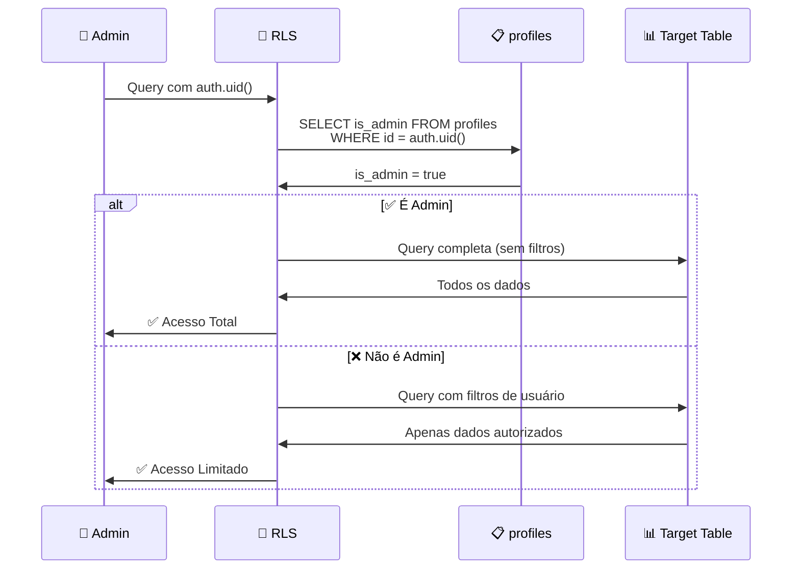

---

## Políticas RLS por Tabela

### Módulo Auth

#### Tabela: `profiles`

**Descrição**: Armazena informações de perfil dos usuários, incluindo nome, bio, nível de advocate e redes sociais.

**Políticas RLS:**

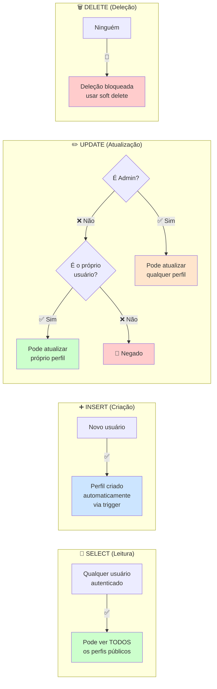

**Código SQL:**

```sql
-- =====================================================
-- PROFILES: Políticas de Segurança
-- =====================================================

-- ✅ SELECT: Todos podem ver perfis públicos
CREATE POLICY "Public profiles are viewable by everyone"
ON profiles FOR SELECT
TO authenticated
USING (true);

-- ✅ INSERT: Criação via trigger (não direto)
CREATE POLICY "Profiles created via trigger"
ON profiles FOR INSERT
TO authenticated
WITH CHECK (auth.uid() = id);

-- ✅ UPDATE: Usuário atualiza próprio perfil
CREATE POLICY "Users can update own profile"
ON profiles FOR UPDATE
TO authenticated
USING (auth.uid() = id)
WITH CHECK (auth.uid() = id);

-- ✅ UPDATE: Admin pode atualizar qualquer perfil
CREATE POLICY "Admins can update any profile"
ON profiles FOR UPDATE
TO authenticated
USING (
  EXISTS (
    SELECT 1 FROM profiles
    WHERE id = auth.uid()
    AND is_admin = true
  )
);

-- ❌ DELETE: Bloqueado (usar soft delete se necessário)
-- Sem política DELETE = ninguém pode deletar
```

**Casos de Uso:**

1. **Advocate visualiza perfil público**: ✅ Permitido (todos os perfis são visíveis)
2. **Advocate atualiza próprio nome/bio**: ✅ Permitido (política "own profile")
3. **Advocate tenta atualizar perfil de outro**: 🚫 Negado (não é owner)
4. **Admin atualiza nível de advocate**: ✅ Permitido (política admin)
5. **Qualquer um tenta deletar perfil**: 🚫 Negado (sem política DELETE)

**Fluxo de Atualização de Perfil:**

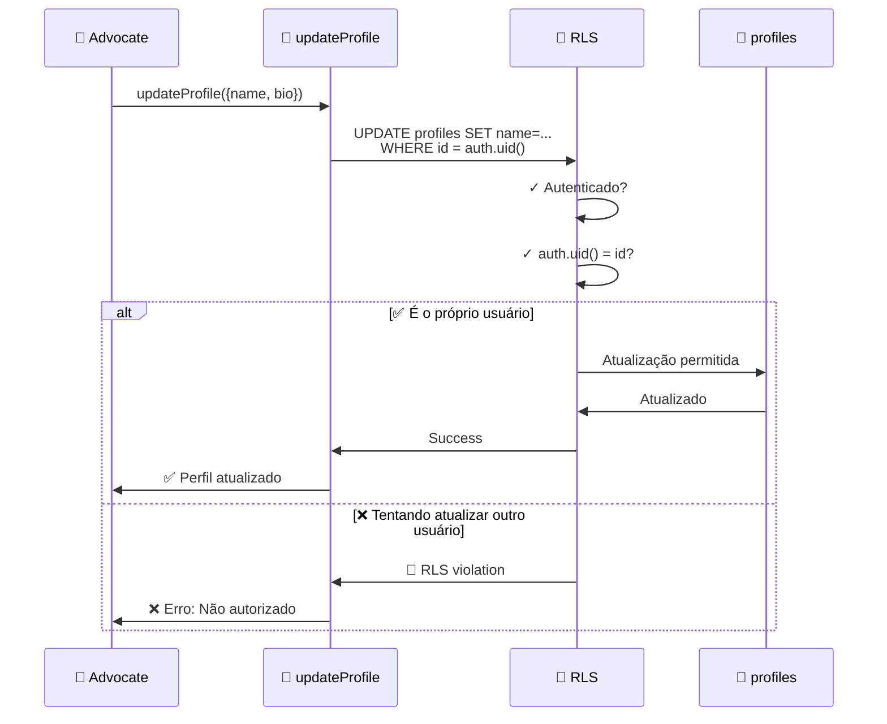

---

### Módulo Posts

#### Tabela: `posts`

**Descrição**: Armazena posts criados por advocates, com sistema de moderação (pending → approved/rejected).

**Políticas RLS:**

```mermaid
graph TB
    subgraph "👀 SELECT (Leitura)"
        S1{Quem está lendo?}
        S1 -->|👑 Admin| S2[Ver TODOS os posts<br/>qualquer status]
        S1 -->|👤 Advocate| S3{Qual post?}

        S3 -->|status = approved| S4[✅ Ver posts aprovados]
        S3 -->|Próprio post| S5[✅ Ver próprios posts<br/>qualquer status]
        S3 -->|Outro + pending/rejected| S6[🚫 Não pode ver]
    end

    subgraph "➕ INSERT (Criar Post)"
        I1[Advocate autenticado] -->|✅| I2[Criar post com<br/>user_id = auth.uid<br/>status = pending]
    end

    subgraph "✏️ UPDATE (Atualizar)"
        U1{Quem está atualizando?}
        U1 -->|👑 Admin| U2[Atualizar status<br/>approved/rejected]
        U1 -->|👤 Advocate| U3{Próprio post?}

        U3 -->|✅ Sim + pending| U4[Editar conteúdo]
        U3 -->|❌ Não ou approved| U5[🚫 Negado]
    end

    subgraph "🗑️ DELETE (Deletar)"
        D1{Quem está deletando?}
        D1 -->|👑 Admin| D2[Deletar qualquer post]
        D1 -->|👤 Advocate| D3{Próprio post?}

        D3 -->|✅ Sim| D4[Deletar próprio post]
        D3 -->|❌ Não| D5[🚫 Negado]
    end

    style S2 fill:#ffe5cc
    style S4 fill:#ccffcc
    style S5 fill:#ccffcc
    style S6 fill:#ffcccc
    style I2 fill:#ccffcc
    style U2 fill:#ffe5cc
    style U4 fill:#ccffcc
    style U5 fill:#ffcccc
    style D2 fill:#ffe5cc
    style D4 fill:#ccffcc
    style D5 fill:#ffcccc
```

**Código SQL:**

```sql
-- =====================================================
-- POSTS: Políticas de Segurança
-- =====================================================

-- ✅ SELECT: Ver posts aprovados
CREATE POLICY "Anyone can view approved posts"
ON posts FOR SELECT
TO authenticated
USING (status = 'approved');

-- ✅ SELECT: Ver próprios posts (qualquer status)
CREATE POLICY "Users can view their own posts"
ON posts FOR SELECT
TO authenticated
USING (auth.uid() = user_id);

-- ✅ SELECT: Admin vê todos
CREATE POLICY "Admins can view all posts"
ON posts FOR SELECT
TO authenticated
USING (
  EXISTS (
    SELECT 1 FROM profiles
    WHERE id = auth.uid()
    AND is_admin = true
  )
);

-- ✅ INSERT: Criar post próprio (status pending)
CREATE POLICY "Users can create their own posts"
ON posts FOR INSERT
TO authenticated
WITH CHECK (
  auth.uid() = user_id
  AND status = 'pending'
);

-- ✅ UPDATE: Admin modera posts
CREATE POLICY "Admins can update post status"
ON posts FOR UPDATE
TO authenticated
USING (
  EXISTS (
    SELECT 1 FROM profiles
    WHERE id = auth.uid()
    AND is_admin = true
  )
)
WITH CHECK (
  EXISTS (
    SELECT 1 FROM profiles
    WHERE id = auth.uid()
    AND is_admin = true
  )
);

-- ✅ UPDATE: Usuário edita próprio post (apenas se pending)
CREATE POLICY "Users can edit own pending posts"
ON posts FOR UPDATE
TO authenticated
USING (
  auth.uid() = user_id
  AND status = 'pending'
)
WITH CHECK (
  auth.uid() = user_id
  AND status = 'pending'
);

-- ✅ DELETE: Usuário deleta próprios posts
CREATE POLICY "Users can delete own posts"
ON posts FOR DELETE
TO authenticated
USING (auth.uid() = user_id);

-- ✅ DELETE: Admin deleta qualquer post
CREATE POLICY "Admins can delete any post"
ON posts FOR DELETE
TO authenticated
USING (
  EXISTS (
    SELECT 1 FROM profiles
    WHERE id = auth.uid()
    AND is_admin = true
  )
);
```

**Diagrama de Estados e Permissões:**

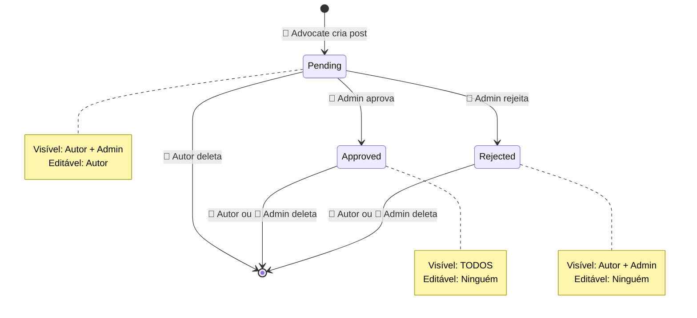

**Fluxo de Moderação:**

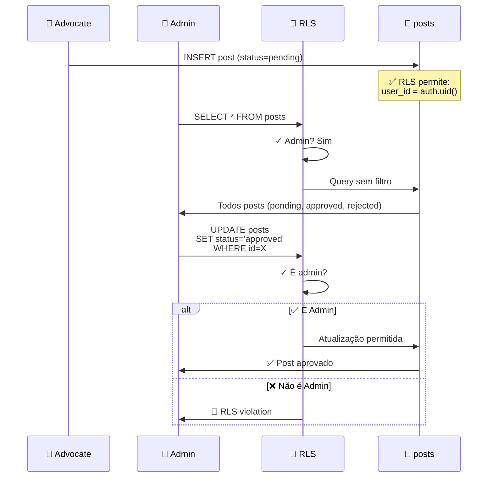

---

#### Tabela: `post_likes`

**Descrição**: Registra likes em posts (relação many-to-many entre users e posts).

**Políticas RLS:**

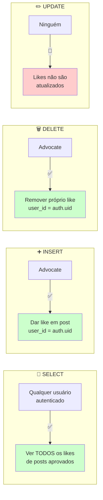

**Código SQL:**

```sql
-- =====================================================
-- POST_LIKES: Políticas de Segurança
-- =====================================================

-- ✅ SELECT: Todos podem ver likes
CREATE POLICY "Anyone can view likes"
ON post_likes FOR SELECT
TO authenticated
USING (true);

-- ✅ INSERT: Dar like (user_id = auth.uid)
CREATE POLICY "Users can like posts"
ON post_likes FOR INSERT
TO authenticated
WITH CHECK (auth.uid() = user_id);

-- ✅ DELETE: Remover próprio like
CREATE POLICY "Users can unlike posts"
ON post_likes FOR DELETE
TO authenticated
USING (auth.uid() = user_id);

-- ❌ UPDATE: Likes não são atualizados
-- Sem política UPDATE
```

---

#### Tabela: `post_comments`

**Descrição**: Armazena comentários em posts.

**Políticas RLS:**

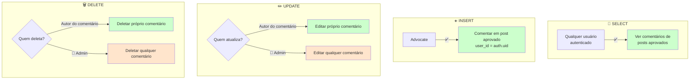

**Código SQL:**

```sql
-- =====================================================
-- POST_COMMENTS: Políticas de Segurança
-- =====================================================

-- ✅ SELECT: Ver comentários de posts aprovados
CREATE POLICY "Anyone can view comments on approved posts"
ON post_comments FOR SELECT
TO authenticated
USING (
  EXISTS (
    SELECT 1 FROM posts
    WHERE posts.id = post_comments.post_id
    AND posts.status = 'approved'
  )
);

-- ✅ INSERT: Criar comentário
CREATE POLICY "Users can comment on approved posts"
ON post_comments FOR INSERT
TO authenticated
WITH CHECK (
  auth.uid() = user_id
  AND EXISTS (
    SELECT 1 FROM posts
    WHERE posts.id = post_id
    AND posts.status = 'approved'
  )
);

-- ✅ UPDATE: Editar próprio comentário
CREATE POLICY "Users can edit own comments"
ON post_comments FOR UPDATE
TO authenticated
USING (auth.uid() = user_id)
WITH CHECK (auth.uid() = user_id);

-- ✅ DELETE: Deletar próprio comentário
CREATE POLICY "Users can delete own comments"
ON post_comments FOR DELETE
TO authenticated
USING (auth.uid() = user_id);

-- ✅ DELETE: Admin deleta qualquer comentário
CREATE POLICY "Admins can delete any comment"
ON post_comments FOR DELETE
TO authenticated
USING (
  EXISTS (
    SELECT 1 FROM profiles
    WHERE id = auth.uid()
    AND is_admin = true
  )
);
```

---

### Módulo Events

#### Tabela: `events`

**Descrição**: Armazena eventos criados por admins, com validação de nível de advocate.

**Políticas RLS:**

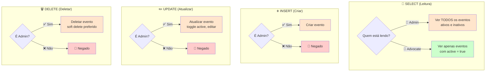

**Código SQL:**

```sql
-- =====================================================
-- EVENTS: Políticas de Segurança
-- =====================================================

-- ✅ SELECT: Ver eventos ativos
CREATE POLICY "Anyone can view active events"
ON events FOR SELECT
TO authenticated
USING (active = true);

-- ✅ SELECT: Admin vê todos
CREATE POLICY "Admins can view all events"
ON events FOR SELECT
TO authenticated
USING (
  EXISTS (
    SELECT 1 FROM profiles
    WHERE id = auth.uid()
    AND is_admin = true
  )
);

-- ✅ INSERT: Apenas admin cria eventos
CREATE POLICY "Only admins can create events"
ON events FOR INSERT
TO authenticated
WITH CHECK (
  EXISTS (
    SELECT 1 FROM profiles
    WHERE id = auth.uid()
    AND is_admin = true
  )
);

-- ✅ UPDATE: Apenas admin atualiza eventos
CREATE POLICY "Only admins can update events"
ON events FOR UPDATE
TO authenticated
USING (
  EXISTS (
    SELECT 1 FROM profiles
    WHERE id = auth.uid()
    AND is_admin = true
  )
)
WITH CHECK (
  EXISTS (
    SELECT 1 FROM profiles
    WHERE id = auth.uid()
    AND is_admin = true
  )
);

-- ✅ DELETE: Apenas admin deleta eventos
CREATE POLICY "Only admins can delete events"
ON events FOR DELETE
TO authenticated
USING (
  EXISTS (
    SELECT 1 FROM profiles
    WHERE id = auth.uid()
    AND is_admin = true
  )
);
```

**Validação de Nível em Server Action:**

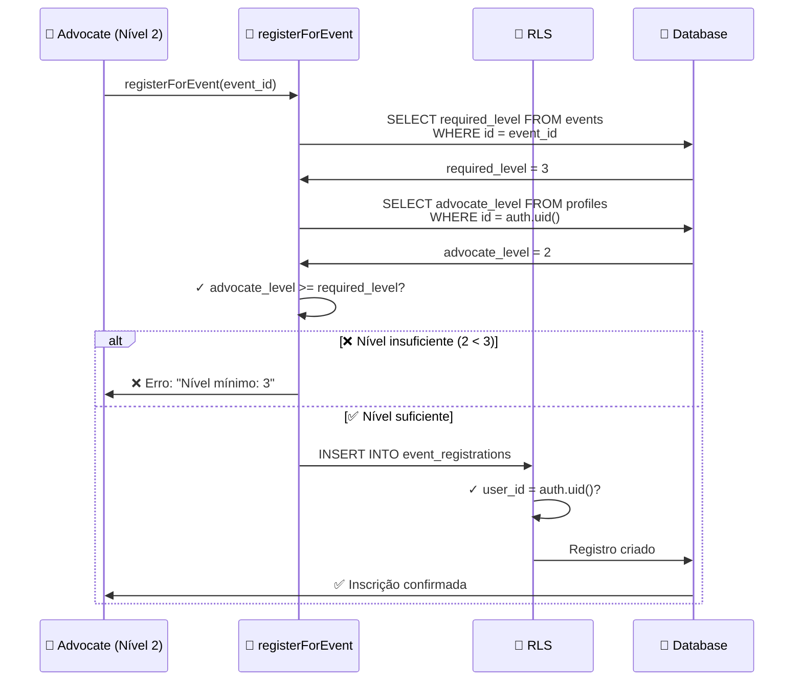

---

#### Tabela: `event_registrations`

**Descrição**: Registros de inscrições de advocates em eventos.

**Políticas RLS:**

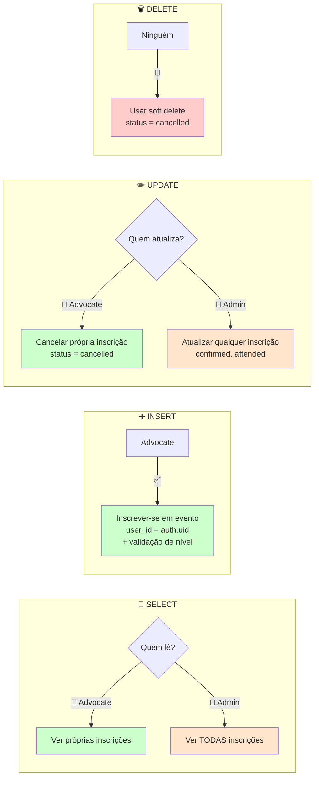

**Código SQL:**

```sql
-- =====================================================
-- EVENT_REGISTRATIONS: Políticas de Segurança
-- =====================================================

-- ✅ SELECT: Ver próprias inscrições
CREATE POLICY "Users can view own registrations"
ON event_registrations FOR SELECT
TO authenticated
USING (auth.uid() = user_id);

-- ✅ SELECT: Admin vê todas
CREATE POLICY "Admins can view all registrations"
ON event_registrations FOR SELECT
TO authenticated
USING (
  EXISTS (
    SELECT 1 FROM profiles
    WHERE id = auth.uid()
    AND is_admin = true
  )
);

-- ✅ INSERT: Inscrever-se em evento
CREATE POLICY "Users can register for events"
ON event_registrations FOR INSERT
TO authenticated
WITH CHECK (auth.uid() = user_id);

-- ✅ UPDATE: Cancelar própria inscrição
CREATE POLICY "Users can cancel own registrations"
ON event_registrations FOR UPDATE
TO authenticated
USING (
  auth.uid() = user_id
  AND status IN ('registered', 'confirmed')
)
WITH CHECK (
  auth.uid() = user_id
  AND status = 'cancelled'
);

-- ✅ UPDATE: Admin atualiza status
CREATE POLICY "Admins can update registrations"
ON event_registrations FOR UPDATE
TO authenticated
USING (
  EXISTS (
    SELECT 1 FROM profiles
    WHERE id = auth.uid()
    AND is_admin = true
  )
)
WITH CHECK (
  EXISTS (
    SELECT 1 FROM profiles
    WHERE id = auth.uid()
    AND is_admin = true
  )
);

-- ❌ DELETE: Usar soft delete (status = cancelled)
-- Sem política DELETE
```

---

### Módulo Challenges

#### Tabela: `challenges`

**Descrição**: Desafios criados por admins (físicos ou engajamento/participe).

**Políticas RLS:**

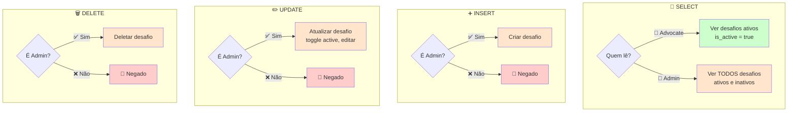

**Código SQL:**

```sql
-- =====================================================
-- CHALLENGES: Políticas de Segurança
-- =====================================================

-- ✅ SELECT: Ver desafios ativos
CREATE POLICY "Anyone can view active challenges"
ON challenges FOR SELECT
TO authenticated
USING (is_active = true);

-- ✅ SELECT: Admin vê todos
CREATE POLICY "Admins can view all challenges"
ON challenges FOR SELECT
TO authenticated
USING (
  EXISTS (
    SELECT 1 FROM profiles
    WHERE id = auth.uid()
    AND is_admin = true
  )
);

-- ✅ INSERT: Apenas admin cria desafios
CREATE POLICY "Only admins can create challenges"
ON challenges FOR INSERT
TO authenticated
WITH CHECK (
  EXISTS (
    SELECT 1 FROM profiles
    WHERE id = auth.uid()
    AND is_admin = true
  )
);

-- ✅ UPDATE: Apenas admin atualiza desafios
CREATE POLICY "Only admins can update challenges"
ON challenges FOR UPDATE
TO authenticated
USING (
  EXISTS (
    SELECT 1 FROM profiles
    WHERE id = auth.uid()
    AND is_admin = true
  )
)
WITH CHECK (
  EXISTS (
    SELECT 1 FROM profiles
    WHERE id = auth.uid()
    AND is_admin = true
  )
);

-- ✅ DELETE: Apenas admin deleta desafios
CREATE POLICY "Only admins can delete challenges"
ON challenges FOR DELETE
TO authenticated
USING (
  EXISTS (
    SELECT 1 FROM profiles
    WHERE id = auth.uid()
    AND is_admin = true
  )
);
```

---

#### Tabela: `challenge_participants`

**Descrição**: Participações de advocates em desafios físicos.

**Políticas RLS:**

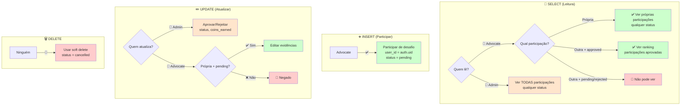

**Código SQL:**

```sql
-- =====================================================
-- CHALLENGE_PARTICIPANTS: Políticas de Segurança
-- =====================================================

-- ✅ SELECT: Ver próprias participações
CREATE POLICY "Users can view own participations"
ON challenge_participants FOR SELECT
TO authenticated
USING (auth.uid() = user_id);

-- ✅ SELECT: Ver participações aprovadas (ranking)
CREATE POLICY "Anyone can view approved participations"
ON challenge_participants FOR SELECT
TO authenticated
USING (status = 'approved');

-- ✅ SELECT: Admin vê todas
CREATE POLICY "Admins can view all participations"
ON challenge_participants FOR SELECT
TO authenticated
USING (
  EXISTS (
    SELECT 1 FROM profiles
    WHERE id = auth.uid()
    AND is_admin = true
  )
);

-- ✅ INSERT: Participar de desafio
CREATE POLICY "Users can participate in challenges"
ON challenge_participants FOR INSERT
TO authenticated
WITH CHECK (auth.uid() = user_id);

-- ✅ UPDATE: Editar própria participação (apenas pending)
CREATE POLICY "Users can update own pending participations"
ON challenge_participants FOR UPDATE
TO authenticated
USING (
  auth.uid() = user_id
  AND status = 'pending'
)
WITH CHECK (
  auth.uid() = user_id
  AND status = 'pending'
);

-- ✅ UPDATE: Admin modera participações
CREATE POLICY "Admins can update participations"
ON challenge_participants FOR UPDATE
TO authenticated
USING (
  EXISTS (
    SELECT 1 FROM profiles
    WHERE id = auth.uid()
    AND is_admin = true
  )
)
WITH CHECK (
  EXISTS (
    SELECT 1 FROM profiles
    WHERE id = auth.uid()
    AND is_admin = true
  )
);

-- ❌ DELETE: Usar soft delete (status = cancelled)
-- Sem política DELETE
```

**Fluxo de Moderação de Participação:**

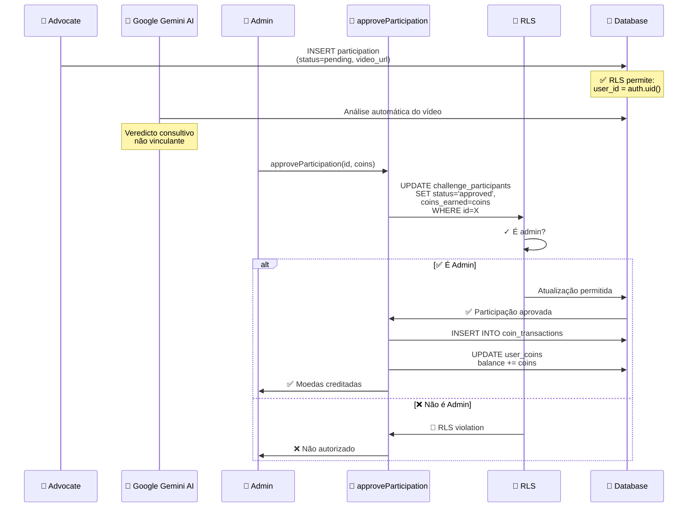

---

#### Tabela: `challenge_winners`

**Descrição**: Vencedores de desafios de engajamento/participe (sorteios).

**Políticas RLS:**

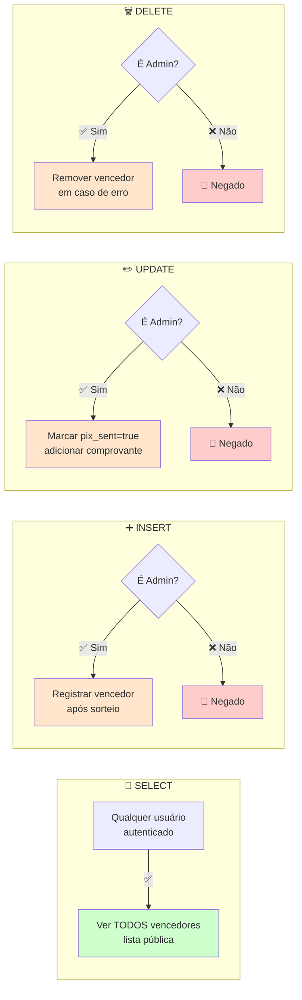

**Código SQL:**

```sql
-- =====================================================
-- CHALLENGE_WINNERS: Políticas de Segurança
-- =====================================================

-- ✅ SELECT: Todos podem ver vencedores
CREATE POLICY "Anyone can view winners"
ON challenge_winners FOR SELECT
TO authenticated
USING (true);

-- ✅ INSERT: Apenas admin registra vencedores
CREATE POLICY "Only admins can register winners"
ON challenge_winners FOR INSERT
TO authenticated
WITH CHECK (
  EXISTS (
    SELECT 1 FROM profiles
    WHERE id = auth.uid()
    AND is_admin = true
  )
);

-- ✅ UPDATE: Apenas admin marca prêmio enviado
CREATE POLICY "Only admins can mark prize sent"
ON challenge_winners FOR UPDATE
TO authenticated
USING (
  EXISTS (
    SELECT 1 FROM profiles
    WHERE id = auth.uid()
    AND is_admin = true
  )
)
WITH CHECK (
  EXISTS (
    SELECT 1 FROM profiles
    WHERE id = auth.uid()
    AND is_admin = true
  )
);

-- ✅ DELETE: Apenas admin remove vencedor
CREATE POLICY "Only admins can delete winners"
ON challenge_winners FOR DELETE
TO authenticated
USING (
  EXISTS (
    SELECT 1 FROM profiles
    WHERE id = auth.uid()
    AND is_admin = true
  )
);
```

---

### Módulo Rewards

#### Tabela: `rewards`

**Descrição**: Recompensas disponíveis no marketplace (físicas ou digitais).

**Políticas RLS:**

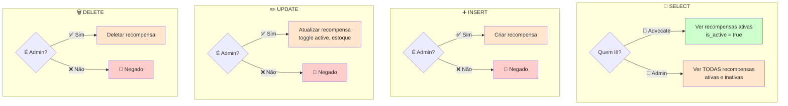

**Código SQL:**

```sql
-- =====================================================
-- REWARDS: Políticas de Segurança
-- =====================================================

-- ✅ SELECT: Ver recompensas ativas
CREATE POLICY "Anyone can view active rewards"
ON rewards FOR SELECT
TO authenticated
USING (is_active = true);

-- ✅ SELECT: Admin vê todas
CREATE POLICY "Admins can view all rewards"
ON rewards FOR SELECT
TO authenticated
USING (
  EXISTS (
    SELECT 1 FROM profiles
    WHERE id = auth.uid()
    AND is_admin = true
  )
);

-- ✅ INSERT: Apenas admin cria recompensas
CREATE POLICY "Only admins can create rewards"
ON rewards FOR INSERT
TO authenticated
WITH CHECK (
  EXISTS (
    SELECT 1 FROM profiles
    WHERE id = auth.uid()
    AND is_admin = true
  )
);

-- ✅ UPDATE: Apenas admin atualiza recompensas
CREATE POLICY "Only admins can update rewards"
ON rewards FOR UPDATE
TO authenticated
USING (
  EXISTS (
    SELECT 1 FROM profiles
    WHERE id = auth.uid()
    AND is_admin = true
  )
)
WITH CHECK (
  EXISTS (
    SELECT 1 FROM profiles
    WHERE id = auth.uid()
    AND is_admin = true
  )
);

-- ✅ DELETE: Apenas admin deleta recompensas
CREATE POLICY "Only admins can delete rewards"
ON rewards FOR DELETE
TO authenticated
USING (
  EXISTS (
    SELECT 1 FROM profiles
    WHERE id = auth.uid()
    AND is_admin = true
  )
);
```

---

#### Tabela: `reward_claims`

**Descrição**: Resgates de recompensas por advocates.

**Políticas RLS:**

```mermaid
graph TB
    subgraph "👀 SELECT"
        S1{Quem lê?}
        S1 -->|👤 Advocate| S2[Ver próprios resgates<br/>user_id = auth.uid]
        S1 -->|👑 Admin| S3[Ver TODOS resgates<br/>gerenciar entregas]
    end

    subgraph "➕ INSERT"
        I1[Advocate] -->|✅| I2[Resgatar recompensa<br/>user_id = auth.uid<br/>status = pending]
    end

    subgraph "✏️ UPDATE"
        U1{Quem atualiza?}
        U1 -->|👤 Advocate| U2{Status?}
        U1 -->|👑 Admin| U3[Atualizar status<br/>approved → shipped → delivered]

        U2 -->|pending| U4[Cancelar resgate<br/>devolve moedas]
        U2 -->|Outro| U5[🚫 Negado]
    end

    subgraph "🗑️ DELETE"
        D1[Ninguém] -->|🚫| D2[Usar soft delete<br/>status = cancelled]
    end

    style S2 fill:#ccffcc
    style S3 fill:#ffe5cc
    style I2 fill:#ccffcc
    style U3 fill:#ffe5cc
    style U4 fill:#ccffcc
    style U5 fill:#ffcccc
    style D2 fill:#ffcccc
```

**Código SQL:**

```sql
-- =====================================================
-- REWARD_CLAIMS: Políticas de Segurança
-- =====================================================

-- ✅ SELECT: Ver próprios resgates
CREATE POLICY "Users can view own claims"
ON reward_claims FOR SELECT
TO authenticated
USING (auth.uid() = user_id);

-- ✅ SELECT: Admin vê todos
CREATE POLICY "Admins can view all claims"
ON reward_claims FOR SELECT
TO authenticated
USING (
  EXISTS (
    SELECT 1 FROM profiles
    WHERE id = auth.uid()
    AND is_admin = true
  )
);

-- ✅ INSERT: Resgatar recompensa
CREATE POLICY "Users can create claims"
ON reward_claims FOR INSERT
TO authenticated
WITH CHECK (auth.uid() = user_id);

-- ✅ UPDATE: Cancelar próprio resgate (apenas pending)
CREATE POLICY "Users can cancel pending claims"
ON reward_claims FOR UPDATE
TO authenticated
USING (
  auth.uid() = user_id
  AND status = 'pending'
)
WITH CHECK (
  auth.uid() = user_id
  AND status = 'cancelled'
);

-- ✅ UPDATE: Admin gerencia resgates
CREATE POLICY "Admins can update claims"
ON reward_claims FOR UPDATE
TO authenticated
USING (
  EXISTS (
    SELECT 1 FROM profiles
    WHERE id = auth.uid()
    AND is_admin = true
  )
)
WITH CHECK (
  EXISTS (
    SELECT 1 FROM profiles
    WHERE id = auth.uid()
    AND is_admin = true
  )
);

-- ❌ DELETE: Usar soft delete (status = cancelled)
-- Sem política DELETE
```

**Fluxo de Resgate com Transação:**

```mermaid
sequenceDiagram
    participant ADV as 👤 Advocate
    participant SA as 🔧 claimReward
    participant RLS as 🔐 RLS
    participant DB as 💾 Database

    ADV->>SA: claimReward(reward_id)

    Note over SA: BEGIN TRANSACTION

    SA->>DB: SELECT coins_required, quantity_available<br/>FROM rewards WHERE id=X
    DB->>SA: coins=500, quantity=10

    SA->>DB: SELECT balance FROM user_coins<br/>WHERE user_id=auth.uid()
    DB->>SA: balance=750

    SA->>SA: ✓ balance >= coins? (750 >= 500)
    SA->>SA: ✓ quantity > 0? (10 > 0)

    alt ✅ Validações passaram
        SA->>RLS: INSERT INTO reward_claims<br/>(user_id, reward_id, coins_spent, status)
        RLS->>RLS: ✓ user_id = auth.uid()?
        RLS->>DB: Resgate criado (status=pending)

        SA->>DB: UPDATE user_coins<br/>SET balance = balance - 500<br/>WHERE user_id = auth.uid()

        SA->>DB: INSERT INTO coin_transactions<br/>(user_id, amount=-500, type='spent')

        SA->>DB: UPDATE rewards<br/>SET quantity_available -= 1<br/>WHERE id=X

        Note over SA: COMMIT TRANSACTION

        SA->>ADV: ✅ Resgate confirmado
    else ❌ Validação falhou
        Note over SA: ROLLBACK TRANSACTION

        SA->>ADV: ❌ Erro: Saldo ou estoque insuficiente
    end
```

---

#### Tabela: `user_coins`

**Descrição**: Saldo de moedas virtuais (corações ❤️) de cada usuário.

**Políticas RLS:**

```mermaid
graph LR
    subgraph "👀 SELECT"
        S1{Quem lê?}
        S1 -->|👤 Advocate| S2[Ver próprio saldo<br/>user_id = auth.uid]
        S1 -->|👑 Admin| S3[Ver TODOS saldos<br/>relatórios]
    end

    subgraph "➕ INSERT"
        I1[Sistema] -->|✅| I2[Trigger automático<br/>ao criar usuário<br/>balance = 0]
    end

    subgraph "✏️ UPDATE"
        U1[Service Role] -->|✅| U2[Apenas via RPC<br/>add_user_coins]
        U3[Usuário direto] -->|🚫| U4[Negado para<br/>prevenir fraude]
    end

    subgraph "🗑️ DELETE"
        D1[Ninguém] -->|🚫| D2[Nunca deletar<br/>saldo de usuário]
    end

    style S2 fill:#ccffcc
    style S3 fill:#ffe5cc
    style I2 fill:#cce5ff
    style U2 fill:#ffe5cc
    style U4 fill:#ffcccc
    style D2 fill:#ffcccc
```

**Código SQL:**

```sql
-- =====================================================
-- USER_COINS: Políticas de Segurança
-- =====================================================

-- ✅ SELECT: Ver próprio saldo
CREATE POLICY "Users can view own balance"
ON user_coins FOR SELECT
TO authenticated
USING (auth.uid() = user_id);

-- ✅ SELECT: Admin vê todos saldos
CREATE POLICY "Admins can view all balances"
ON user_coins FOR SELECT
TO authenticated
USING (
  EXISTS (
    SELECT 1 FROM profiles
    WHERE id = auth.uid()
    AND is_admin = true
  )
);

-- ✅ INSERT: Apenas via trigger (criação de usuário)
CREATE POLICY "System can insert coins"
ON user_coins FOR INSERT
TO authenticated
WITH CHECK (auth.uid() = user_id);

-- ✅ UPDATE: Apenas via RPC (service_role)
-- NÃO criar política UPDATE para usuários
-- Atualizações via Server Actions usando service_role client

-- ❌ DELETE: Nunca permitir
-- Sem política DELETE
```

**Função RPC para Adicionar Moedas:**

```sql
-- =====================================================
-- RPC: Adicionar Moedas com Segurança
-- =====================================================

CREATE OR REPLACE FUNCTION add_user_coins(
  p_user_id UUID,
  p_amount INTEGER,
  p_reference_type TEXT,
  p_reference_id UUID
)
RETURNS VOID
LANGUAGE plpgsql
SECURITY DEFINER  -- Executa com permissões de OWNER
AS $$
BEGIN
  -- Validação: apenas admin pode chamar
  IF NOT (
    SELECT is_admin FROM profiles
    WHERE id = auth.uid()
  ) THEN
    RAISE EXCEPTION 'Apenas admins podem adicionar moedas';
  END IF;

  -- Atualizar saldo
  UPDATE user_coins
  SET balance = balance + p_amount,
      updated_at = now()
  WHERE user_id = p_user_id;

  -- Registrar transação
  INSERT INTO coin_transactions (
    user_id, amount, type, reference_type, reference_id
  ) VALUES (
    p_user_id, p_amount, 'earned', p_reference_type, p_reference_id
  );
END;
$$;
```

---

#### Tabela: `coin_transactions`

**Descrição**: Histórico de transações de moedas (earned/spent).

**Políticas RLS:**

```mermaid
graph LR
    subgraph "👀 SELECT"
        S1{Quem lê?}
        S1 -->|👤 Advocate| S2[Ver próprias transações<br/>user_id = auth.uid]
        S1 -->|👑 Admin| S3[Ver TODAS transações<br/>auditoria]
    end

    subgraph "➕ INSERT"
        I1[Server Actions] -->|✅| I2[Via service_role<br/>após operações]
    end

    subgraph "✏️ UPDATE"
        U1[Ninguém] -->|🚫| U2[Transações são<br/>imutáveis]
    end

    subgraph "🗑️ DELETE"
        D1[Ninguém] -->|🚫| D2[Transações são<br/>imutáveis]
    end

    style S2 fill:#ccffcc
    style S3 fill:#ffe5cc
    style I2 fill:#cce5ff
    style U2 fill:#ffcccc
    style D2 fill:#ffcccc
```

**Código SQL:**

```sql
-- =====================================================
-- COIN_TRANSACTIONS: Políticas de Segurança
-- =====================================================

-- ✅ SELECT: Ver próprias transações
CREATE POLICY "Users can view own transactions"
ON coin_transactions FOR SELECT
TO authenticated
USING (auth.uid() = user_id);

-- ✅ SELECT: Admin vê todas transações
CREATE POLICY "Admins can view all transactions"
ON coin_transactions FOR SELECT
TO authenticated
USING (
  EXISTS (
    SELECT 1 FROM profiles
    WHERE id = auth.uid()
    AND is_admin = true
  )
);

-- ✅ INSERT: Apenas via Server Actions (service_role)
-- NÃO criar política INSERT para usuários autenticados
-- Apenas service_role client pode inserir

-- ❌ UPDATE/DELETE: Transações imutáveis
-- Sem políticas UPDATE/DELETE
```

---

### Módulo Profile

As políticas de Profile (`profiles`, `user_coins`, `coin_transactions`) já foram documentadas acima nas respectivas seções.

---

## Padrões de Segurança

### Padrão 1: Verificação de Admin

**Descrição**: Muitas operações requerem privilégios de admin. Este padrão verifica se o usuário autenticado é admin.

**Código:**

```sql
-- Padrão de verificação de admin (usado em todas as policies admin)
EXISTS (
  SELECT 1 FROM profiles
  WHERE id = auth.uid()
  AND is_admin = true
)
```

**Diagrama:**

```mermaid
flowchart LR
    A[Policy Check] --> B{EXISTS query}
    B -->|SELECT 1| C[(profiles)]
    C -->|WHERE id = auth.uid<br/>AND is_admin = true| D{Row found?}
    D -->|✅ Sim| E[Admin verified<br/>✅ Allow]
    D -->|❌ Não| F[Not admin<br/>🚫 Deny]

    style E fill:#ccffcc
    style F fill:#ffcccc
```

**Quando Usar:**
- CREATE operations (eventos, desafios, recompensas)
- UPDATE operations para moderação (aprovar posts, desafios)
- DELETE operations administrativas
- Ver dados sensíveis (todas participações, todos saldos)

---

### Padrão 2: Ownership Verification

**Descrição**: Verifica se o recurso pertence ao usuário autenticado.

**Código:**

```sql
-- Verificar ownership por user_id
auth.uid() = user_id

-- Verificar ownership por coluna id (para profiles)
auth.uid() = id
```

**Diagrama:**

```mermaid
flowchart LR
    A[Policy Check] --> B{auth.uid = user_id?}
    B -->|✅ Match| C[Owner verified<br/>✅ Allow]
    B -->|❌ No match| D[Not owner<br/>🚫 Deny]

    style C fill:#ccffcc
    style D fill:#ffcccc
```

**Quando Usar:**
- Ver dados próprios (posts, inscrições, resgates)
- Editar recursos próprios (perfil, posts pending)
- Deletar recursos próprios (posts, likes, comentários)
- Criar recursos em nome próprio (posts, inscrições)

---

### Padrão 3: Status-Based Access

**Descrição**: Controla acesso baseado no status do recurso.

**Código:**

```sql
-- Ver apenas recursos ativos
is_active = true

-- Ver apenas recursos aprovados
status = 'approved'

-- Editar apenas recursos pending
status = 'pending'
```

**Diagrama:**

```mermaid
flowchart TB
    A[Resource] --> B{Check Status}

    B -->|active/approved| C[Public Access<br/>👁️ Visible to all]
    B -->|pending| D{Check Owner}
    B -->|inactive/rejected| E{Check Role}

    D -->|Is Owner| F[✅ Owner can view]
    D -->|Not Owner| G[🚫 Hidden]

    E -->|Is Admin| H[✅ Admin can view]
    E -->|Not Admin| I[🚫 Hidden]

    style C fill:#ccffcc
    style F fill:#ccffcc
    style H fill:#ffe5cc
    style G fill:#ffcccc
    style I fill:#ffcccc
```

**Quando Usar:**
- Posts (approved são públicos, pending/rejected apenas para autor/admin)
- Eventos (active visíveis, inactive apenas admin)
- Desafios (active visíveis, inactive apenas admin)
- Recompensas (active visíveis, inactive apenas admin)

---

### Padrão 4: Transactional Integrity

**Descrição**: Operações que afetam múltiplas tabelas devem ser transacionais.

**Código:**

```typescript
// Server Action com transação
export async function claimReward(rewardId: string) {
  const supabase = await createClient();

  // 1. Validações antes da transação
  const { data: reward } = await supabase
    .from('rewards')
    .select('coins_required, quantity_available')
    .eq('id', rewardId)
    .single();

  const { data: userCoins } = await supabase
    .from('user_coins')
    .select('balance')
    .eq('user_id', userId)
    .single();

  if (userCoins.balance < reward.coins_required) {
    return { error: 'Saldo insuficiente' };
  }

  try {
    // 2. BEGIN transaction (implícito em Supabase)

    // 3. Criar resgate
    await supabase
      .from('reward_claims')
      .insert({
        user_id: userId,
        reward_id: rewardId,
        coins_spent: reward.coins_required,
        status: 'pending'
      });

    // 4. Deduzir moedas
    await supabase
      .from('user_coins')
      .update({ balance: userCoins.balance - reward.coins_required })
      .eq('user_id', userId);

    // 5. Registrar transação
    await supabase
      .from('coin_transactions')
      .insert({
        user_id: userId,
        amount: -reward.coins_required,
        type: 'spent',
        reference_id: rewardId
      });

    // 6. Decrementar estoque
    await supabase
      .from('rewards')
      .update({ quantity_available: reward.quantity_available - 1 })
      .eq('id', rewardId);

    // 7. COMMIT (implícito se todas operações bem-sucedidas)

    return { success: true };
  } catch (error) {
    // 8. ROLLBACK automático em caso de erro
    return { error: 'Erro ao processar resgate' };
  }
}
```

**Diagrama:**

```mermaid
sequenceDiagram
    participant SA as Server Action
    participant DB as Database

    SA->>DB: BEGIN TRANSACTION

    SA->>DB: 1. INSERT reward_claims
    Note over DB: RLS check:<br/>user_id = auth.uid()

    SA->>DB: 2. UPDATE user_coins (- coins)
    Note over DB: RLS check:<br/>via service_role

    SA->>DB: 3. INSERT coin_transactions
    Note over DB: Log transação

    SA->>DB: 4. UPDATE rewards (- quantity)
    Note over DB: Decrementar estoque

    alt ✅ Todas operações bem-sucedidas
        SA->>DB: COMMIT
        DB->>SA: ✅ Success
    else ❌ Alguma operação falhou
        SA->>DB: ROLLBACK
        DB->>SA: ❌ Error (estado anterior restaurado)
    end
```

**Quando Usar:**
- Resgates de recompensas (reward_claims + user_coins + coin_transactions + rewards)
- Aprovação de participações (challenge_participants + user_coins + coin_transactions)
- Cancelamento de resgates (reward_claims + user_coins + coin_transactions + rewards)

---

### Padrão 5: Soft Delete

**Descrição**: Não deletar permanentemente, apenas marcar como inativo/cancelado.

**Código:**

```sql
-- ❌ NÃO fazer hard delete
DELETE FROM event_registrations WHERE id = X;

-- ✅ Fazer soft delete
UPDATE event_registrations
SET status = 'cancelled', cancelled_at = now()
WHERE id = X;
```

**Benefícios:**
- 📊 **Auditoria**: Histórico completo preservado
- 🔄 **Recuperação**: Possível reverter ações
- 📈 **Analytics**: Estatísticas incluem cancelamentos
- 🔗 **Integridade**: Foreign keys não quebram

**Tabelas que usam Soft Delete:**
- `posts` (status = 'deleted' ou manter rejected)
- `event_registrations` (status = 'cancelled')
- `challenge_participants` (status = 'cancelled')
- `reward_claims` (status = 'cancelled')

**Diagrama:**

```mermaid
flowchart LR
    A[User Delete Action] --> B{Delete Type?}

    B -->|Hard Delete| C[DELETE FROM table<br/>❌ Dados perdidos]
    B -->|Soft Delete| D[UPDATE table<br/>SET status='deleted']

    D --> E[✅ Dados preservados]
    D --> F[✅ Auditável]
    D --> G[✅ Recuperável]

    C --> H[❌ Sem histórico]
    C --> I[❌ Sem auditoria]
    C --> J[❌ Sem recuperação]

    style D fill:#ccffcc
    style E fill:#ccffcc
    style F fill:#ccffcc
    style G fill:#ccffcc
    style C fill:#ffcccc
    style H fill:#ffcccc
    style I fill:#ffcccc
    style J fill:#ffcccc
```

---

### Padrão 6: Service Role para Operações Privilegiadas

**Descrição**: Operações que precisam bypassar RLS devem usar `service_role` client.

**Código:**

```typescript
// ❌ NÃO: Cliente autenticado não pode atualizar user_coins diretamente
const supabase = await createClient(); // client autenticado
await supabase
  .from('user_coins')
  .update({ balance: newBalance })
  .eq('user_id', userId);
// Erro: RLS violation (usuário não pode UPDATE próprio saldo)

// ✅ SIM: Service role bypassa RLS
const { createClient } = require('@supabase/supabase-js');
const supabaseAdmin = createClient(
  process.env.NEXT_PUBLIC_SUPABASE_URL!,
  process.env.SUPABASE_SERVICE_ROLE_KEY!, // Service role key
  {
    auth: {
      autoRefreshToken: false,
      persistSession: false
    }
  }
);

await supabaseAdmin
  .from('user_coins')
  .update({ balance: newBalance })
  .eq('user_id', userId);
// ✅ Sucesso: Service role bypassa RLS
```

**Quando Usar:**
- Atualizar saldos de moedas (`user_coins`)
- Inserir transações de moedas (`coin_transactions`)
- Operações de migração de dados
- Triggers e funções do banco

**⚠️ Segurança:**
- NUNCA expor `SUPABASE_SERVICE_ROLE_KEY` no cliente
- Usar apenas em Server Actions (backend)
- Validar todas operações antes de usar service_role
- Registrar auditoria de todas operações privilegiadas

---

## Validação em Múltiplas Camadas

A plataforma implementa validação em **3 camadas** para máxima segurança:

### Camada 1: Client-Side (UI)

**Propósito**: Melhorar UX, feedback imediato.

**Exemplos:**
```typescript
// Validação de formulário
if (!postContent.trim()) {
  setError('Conteúdo não pode estar vazio');
  return;
}

// Verificação de nível antes de mostrar botão
{event.required_level <= userLevel && (
  <button onClick={register}>Inscrever-se</button>
)}

// Verificação de saldo antes de permitir resgate
{userCoins >= reward.coins_required ? (
  <button onClick={claim}>Resgatar</button>
) : (
  <span>Saldo insuficiente</span>
)}
```

**Limitação**: ⚠️ Pode ser bypassada (DevTools, API direta)

---

### Camada 2: Server Actions (Backend)

**Propósito**: Validação de negócios, autorização.

**Exemplos:**
```typescript
export async function registerForEvent(eventId: string) {
  const supabase = await createClient();

  // 1. Autenticação
  const { data: { user } } = await supabase.auth.getUser();
  if (!user) {
    return { error: 'Não autenticado' };
  }

  // 2. Buscar dados do evento
  const { data: event } = await supabase
    .from('events')
    .select('required_level, max_participants')
    .eq('id', eventId)
    .single();

  // 3. Verificar nível do usuário
  const { data: profile } = await supabase
    .from('profiles')
    .select('advocate_level')
    .eq('id', user.id)
    .single();

  if (profile.advocate_level < event.required_level) {
    return { error: `Nível mínimo: ${event.required_level}` };
  }

  // 4. Verificar vagas disponíveis
  const { count } = await supabase
    .from('event_registrations')
    .select('*', { count: 'exact', head: true })
    .eq('event_id', eventId)
    .eq('status', 'registered');

  if (count >= event.max_participants) {
    return { error: 'Vagas esgotadas' };
  }

  // 5. Criar inscrição (RLS valida ownership)
  const { error } = await supabase
    .from('event_registrations')
    .insert({
      event_id: eventId,
      user_id: user.id,
      status: 'registered'
    });

  if (error) {
    return { error: 'Erro ao criar inscrição' };
  }

  return { success: true };
}
```

**Benefícios**: ✅ Executa no servidor, não pode ser bypassada pelo cliente

---

### Camada 3: RLS (Database)

**Propósito**: Camada final de segurança, garantia absoluta.

**Exemplo:**
```sql
-- Mesmo se Server Action tiver bug, RLS protege
CREATE POLICY "Users can only insert own registrations"
ON event_registrations FOR INSERT
TO authenticated
WITH CHECK (auth.uid() = user_id);
```

**Cenário de Proteção:**

```mermaid
sequenceDiagram
    participant H as 🦹 Hacker
    participant SA as 🔧 Buggy Server Action
    participant RLS as 🔐 RLS
    participant DB as 💾 Database

    H->>SA: registerForEvent(eventId)<br/>Manipula user_id via DevTools

    Note over SA: Bug: Não valida ownership<br/>Aceita user_id manipulado

    SA->>RLS: INSERT event_registrations<br/>user_id=VICTIM_ID (manipulado)

    RLS->>RLS: ✓ CHECK: auth.uid() = user_id?
    Note over RLS: auth.uid() = HACKER_ID<br/>user_id = VICTIM_ID<br/>❌ NO MATCH

    RLS->>SA: 🚫 RLS violation
    SA->>H: ❌ Erro: Não autorizado

    Note over RLS,DB: RLS protege mesmo com<br/>bugs no Server Action!
```

---

### Diagrama de Validação em Camadas

```mermaid
flowchart TB
    subgraph "🖥️ Camada 1: Client-Side"
        A[User Action] --> B{Validação UI}
        B -->|❌ Falha| C[Mostrar Erro<br/>UX Feedback]
        B -->|✅ Passa| D[Enviar para servidor]
    end

    subgraph "🔧 Camada 2: Server Actions"
        D --> E{Autenticado?}
        E -->|❌ Não| F[401 Unauthorized]
        E -->|✅ Sim| G{Validações<br/>de Negócio}

        G -->|❌ Nível insuficiente| H[Erro: Nível baixo]
        G -->|❌ Saldo insuficiente| I[Erro: Sem moedas]
        G -->|❌ Vagas esgotadas| J[Erro: Sem vagas]
        G -->|✅ Todas passam| K[Executar operação]
    end

    subgraph "🔐 Camada 3: RLS"
        K --> L{RLS Policies}
        L -->|❌ Ownership| M[RLS Violation]
        L -->|❌ Role| N[RLS Violation]
        L -->|❌ Status| O[RLS Violation]
        L -->|✅ Todas passam| P[(Database<br/>Operação permitida)]
    end

    style C fill:#fff4e1
    style F fill:#ffcccc
    style H fill:#ffcccc
    style I fill:#ffcccc
    style J fill:#ffcccc
    style M fill:#ffcccc
    style N fill:#ffcccc
    style O fill:#ffcccc
    style P fill:#ccffcc
```

---

## Testes de RLS

### Como Testar Políticas RLS

```sql
-- =====================================================
-- TESTES DE RLS
-- Execute no Supabase SQL Editor
-- =====================================================

-- 1. Criar usuário de teste
INSERT INTO auth.users (id, email)
VALUES ('test-user-uuid', 'test@example.com');

INSERT INTO profiles (id, name, is_admin)
VALUES ('test-user-uuid', 'Test User', false);

-- 2. Criar usuário admin de teste
INSERT INTO auth.users (id, email)
VALUES ('test-admin-uuid', 'admin@example.com');

INSERT INTO profiles (id, name, is_admin)
VALUES ('test-admin-uuid', 'Test Admin', true);

-- 3. Testar política de leitura de posts
-- Como usuário normal (deve ver apenas approved)
SET LOCAL role authenticated;
SET LOCAL request.jwt.claim.sub = 'test-user-uuid';

SELECT * FROM posts;
-- Esperado: Apenas posts com status='approved' ou user_id='test-user-uuid'

-- 4. Testar política de criação de post
INSERT INTO posts (user_id, content, status)
VALUES ('test-user-uuid', 'Test post', 'pending');
-- Esperado: ✅ Sucesso

INSERT INTO posts (user_id, content, status)
VALUES ('other-user-uuid', 'Fake post', 'pending');
-- Esperado: 🚫 RLS violation (user_id != auth.uid())

-- 5. Testar política admin
SET LOCAL request.jwt.claim.sub = 'test-admin-uuid';

SELECT * FROM posts;
-- Esperado: ✅ Todos os posts (qualquer status)

UPDATE posts SET status='approved' WHERE id='some-post-id';
-- Esperado: ✅ Sucesso (admin pode moderar)

-- 6. Resetar
RESET role;
```

### Checklist de Testes

- [ ] **Autenticação**: Usuários não autenticados são bloqueados?
- [ ] **Ownership**: Usuários só veem/editam dados próprios?
- [ ] **Admin**: Admins têm acesso total?
- [ ] **Status**: Recursos inativos/pending são ocultados?
- [ ] **Transação**: Operações multi-tabela são atômicas?
- [ ] **Soft Delete**: Deleções preservam dados?
- [ ] **Injection**: Políticas resistem a SQL injection?

---

## Troubleshooting

### Problema 1: "RLS Violation" ao Inserir Dados

**Sintoma:**
```
Error: new row violates row-level security policy for table "posts"
```

**Causas Comuns:**
1. `user_id` no INSERT não corresponde a `auth.uid()`
2. Política `WITH CHECK` falha (ex: `status != 'pending'`)
3. Usuário não autenticado

**Solução:**
```typescript
// ❌ ERRADO
await supabase
  .from('posts')
  .insert({
    user_id: someOtherUserId, // Não corresponde a auth.uid()
    content: 'Test',
    status: 'pending'
  });

// ✅ CORRETO
const { data: { user } } = await supabase.auth.getUser();
await supabase
  .from('posts')
  .insert({
    user_id: user.id, // Corresponde a auth.uid()
    content: 'Test',
    status: 'pending'
  });
```

---

### Problema 2: Admin Não Consegue Ver Todos os Dados

**Sintoma:**
Admin vê apenas dados próprios, não todos os dados.

**Causas Comuns:**
1. Política admin não foi criada
2. Coluna `is_admin` está `false` no perfil do admin
3. Ordem das políticas (política mais restritiva executando primeiro)

**Solução:**
```sql
-- 1. Verificar se admin está marcado corretamente
SELECT id, email, is_admin FROM profiles WHERE id = 'admin-uuid';
-- Deve retornar is_admin = true

-- 2. Criar/verificar política admin
CREATE POLICY "Admins can view all posts"
ON posts FOR SELECT
TO authenticated
USING (
  EXISTS (
    SELECT 1 FROM profiles
    WHERE id = auth.uid()
    AND is_admin = true
  )
);

-- 3. Se necessário, deletar políticas conflitantes
DROP POLICY IF EXISTS "Users can only view own posts" ON posts;
```

---

### Problema 3: Não Consigo Atualizar `user_coins`

**Sintoma:**
```
Error: permission denied for table user_coins
```

**Causa:**
Tentando atualizar `user_coins` com cliente autenticado (não permitido por segurança).

**Solução:**
```typescript
// ❌ ERRADO: Cliente autenticado
const supabase = await createClient();
await supabase
  .from('user_coins')
  .update({ balance: newBalance })
  .eq('user_id', userId);

// ✅ CORRETO: Service role em Server Action
import { createClient } from '@supabase/supabase-js';

const supabaseAdmin = createClient(
  process.env.NEXT_PUBLIC_SUPABASE_URL!,
  process.env.SUPABASE_SERVICE_ROLE_KEY!
);

await supabaseAdmin
  .from('user_coins')
  .update({ balance: newBalance })
  .eq('user_id', userId);
```

---

### Problema 4: Query Retorna Array Vazio Inesperadamente

**Sintoma:**
Query não retorna erro, mas array está vazio quando deveria ter dados.

**Causa:**
RLS está filtrando silenciosamente os dados (comportamento esperado).

**Diagnóstico:**
```sql
-- Verificar quais políticas estão ativas
SELECT schemaname, tablename, policyname, permissive, roles, cmd, qual
FROM pg_policies
WHERE tablename = 'posts';

-- Desabilitar RLS temporariamente para debug (APENAS EM DEV)
ALTER TABLE posts DISABLE ROW LEVEL SECURITY;

-- Re-executar query
SELECT * FROM posts;

-- Re-abilitar RLS
ALTER TABLE posts ENABLE ROW LEVEL SECURITY;
```

**Solução:**
Verificar se:
1. Usuário está autenticado
2. Status do recurso (active, approved, etc.)
3. Ownership (user_id = auth.uid())
4. Role (is_admin para ver todos)

---

### Problema 5: Política não Está Sendo Aplicada

**Sintoma:**
Usuário consegue acessar dados que não deveria.

**Causas Comuns:**
1. RLS não está habilitado na tabela
2. Política com lógica invertida
3. Service role key sendo usada (bypassa RLS)

**Solução:**
```sql
-- 1. Verificar se RLS está habilitado
SELECT tablename, rowsecurity
FROM pg_tables
WHERE tablename = 'posts' AND schemaname = 'public';
-- rowsecurity deve ser true

-- 2. Habilitar RLS se necessário
ALTER TABLE posts ENABLE ROW LEVEL SECURITY;

-- 3. Verificar políticas existentes
SELECT * FROM pg_policies WHERE tablename = 'posts';

-- 4. Re-criar política com lógica correta
DROP POLICY IF EXISTS "incorrect_policy" ON posts;
CREATE POLICY "correct_policy" ON posts
FOR SELECT
USING (status = 'approved' OR auth.uid() = user_id);
```

---

## Próximos Passos

### Documentos Relacionados

- [**ARCHITECTURE.md**](./ARCHITECTURE.md): Visão geral da arquitetura
- [**AUTHORIZATION.md**](./AUTHORIZATION.md): Diferenças entre Admin vs Advocate
- [**SERVER_ACTIONS.md**](./SERVER_ACTIONS.md): Todas as Server Actions
- [**DATABASE.md**](./DATABASE.md): Modelo de dados completo
- **Flows**: Fluxos de dados por módulo
  - [DATA_FLOW_AUTH.md](./flows/DATA_FLOW_AUTH.md)
  - [DATA_FLOW_POSTS.md](./flows/DATA_FLOW_POSTS.md)
  - [DATA_FLOW_EVENTS.md](./flows/DATA_FLOW_EVENTS.md)
  - [DATA_FLOW_CHALLENGES.md](./flows/DATA_FLOW_CHALLENGES.md)
  - [DATA_FLOW_PROFILE_REWARDS.md](./flows/DATA_FLOW_PROFILE_REWARDS.md)

### Recursos Externos

- [Supabase Row Level Security](https://supabase.com/docs/guides/auth/row-level-security)
- [PostgreSQL Row Security Policies](https://www.postgresql.org/docs/current/ddl-rowsecurity.html)
- [Next.js Security Best Practices](https://nextjs.org/docs/app/building-your-application/security)

---

**Documentação gerada para Plataforma de Advocate Marketing**
Última atualização: 2026-01-07
