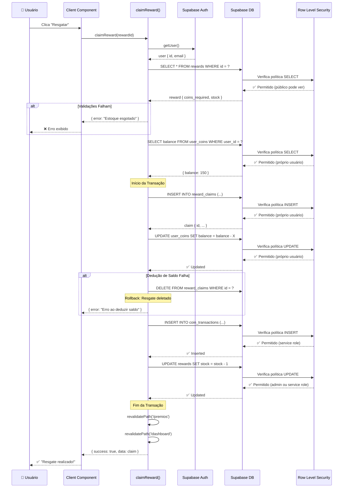
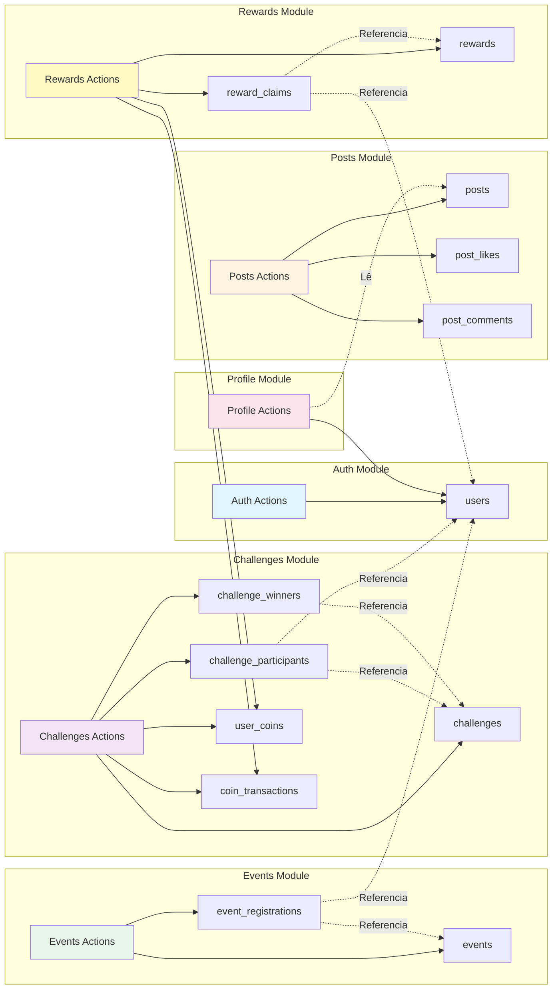
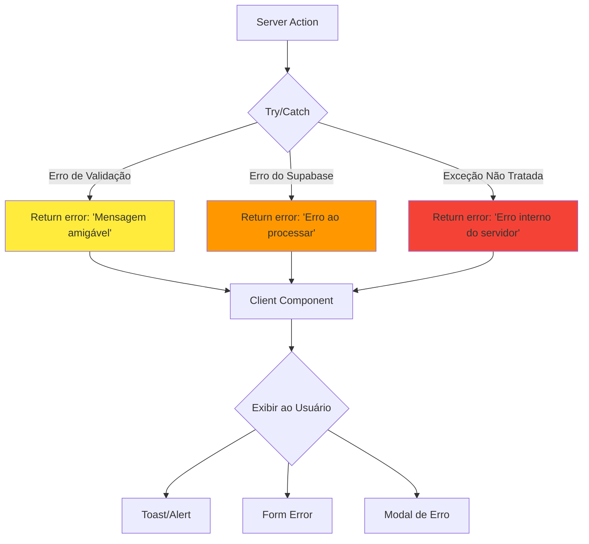

# Server Actions - Referência Completa

## 📋 Índice

1. [Visão Geral](#visão-geral)
2. [O Que São Server Actions](#o-que-são-server-actions)
3. [Actions de Autenticação](#actions-de-autenticação)
4. [Actions de Posts](#actions-de-posts)
5. [Actions de Eventos](#actions-de-eventos)
6. [Actions de Desafios](#actions-de-desafios)
7. [Actions de Perfil](#actions-de-perfil)
8. [Actions de Recompensas](#actions-de-recompensas)
9. [Actions Administrativas](#actions-administrativas)
10. [Diagrama de Relacionamentos](#diagrama-de-relacionamentos)
11. [Padrões de Uso](#padrões-de-uso)
12. [Tratamento de Erros](#tratamento-de-erros)

---

## Visão Geral

Este documento cataloga todas as **Server Actions** da plataforma de Advocate Marketing, incluindo seus parâmetros, retornos e relação com as tabelas do Supabase.

### 🎯 Conceitos Fundamentais

- **Server Actions** são funções que executam no servidor (marcadas com `'use server'`)
- Permitem mutações de dados de forma segura sem expor credenciais
- São chamadas diretamente de Client Components ou Server Components
- Retornam tipos serializáveis (JSON)
- Incluem validação, autenticação e autorização

### 📊 Estatísticas

- **Total de Server Actions**: 45+
- **Módulos**: 7 (auth, posts, events, challenges, profile, rewards, admin)
- **Tabelas do Supabase**: 12+
- **Actions Públicas**: ~20
- **Actions Admin**: ~25

---

## O Que São Server Actions

### Definição

Server Actions são funções assíncronas marcadas com `'use server'` que executam no servidor Next.js e podem ser chamadas de componentes cliente ou servidor.

```typescript
'use server';

export async function minhaAction(data: FormData): Promise<ActionResponse> {
  // Executa no servidor
  const supabase = await createClient();
  // ... lógica de negócio
  return { success: true };
}
```

### Características

- ✅ **Segurança**: Acesso direto ao banco sem expor credenciais
- ✅ **Validação**: Validação server-side antes de persistir dados
- ✅ **Autorização**: Verificação de permissões no servidor
- ✅ **Revalidação**: Controle de cache com `revalidatePath()`
- ✅ **Redirecionamento**: Navegação server-side com `redirect()`

### Tipos de Retorno Comuns

```typescript
type ActionResponse = {
  error?: string;      // Mensagem de erro em caso de falha
  success?: boolean;   // Indica sucesso da operação
  data?: any;         // Dados retornados (opcional)
};

type AuthResponse = {
  error?: string;
  success?: boolean;
};
```

---

## Actions de Autenticação

**Arquivo**: `src/actions/auth.ts`

### 🔐 login

Autentica usuário com email e senha.

**Assinatura:**
```typescript
async function login(formData: FormData): Promise<AuthResponse>
```

**Parâmetros:**
| Nome | Tipo | Obrigatório | Descrição |
|------|------|-------------|-----------|
| formData | FormData | ✅ | Contém `email` e `password` |

**Retorno:**
```typescript
{
  error?: string;    // "Email ou senha incorretos"
  success?: boolean; // true se login bem-sucedido
}
```

**Queries Supabase:**
```typescript
// 1. Autenticação
supabase.auth.signInWithPassword({ email, password })
```

**Efeitos Colaterais:**
- ✅ Revalida: `/` (layout)
- ✅ Redireciona: `/dashboard`

**Exemplo de Uso:**
```tsx
// Em um Client Component
async function handleSubmit(formData: FormData) {
  const result = await login(formData);
  if (result.error) {
    setError(result.error);
  }
  // Redirecionamento automático em caso de sucesso
}
```

---

### 🆕 register

Registra novo usuário na plataforma.

**Assinatura:**
```typescript
async function register(formData: FormData): Promise<AuthResponse>
```

**Parâmetros:**
| Nome | Tipo | Obrigatório | Descrição |
|------|------|-------------|-----------|
| formData | FormData | ✅ | Contém `name`, `email`, `password`, `confirmPassword` |

**Validações:**
- ✅ Todos os campos obrigatórios
- ✅ Senhas devem coincidir
- ✅ Senha mínima de 6 caracteres

**Queries Supabase:**
```typescript
// 1. Criar usuário
supabase.auth.signUp({
  email,
  password,
  options: {
    data: { full_name: name },
    emailRedirectTo: `${SITE_URL}/auth/callback`
  }
})
```

**Retorno:**
```typescript
{
  error?: string;    // "Este email já está cadastrado"
  success?: boolean; // true se registro bem-sucedido
}
```

---

### 🚪 logout

Encerra sessão do usuário.

**Assinatura:**
```typescript
async function logout(): Promise<void>
```

**Parâmetros:** Nenhum

**Queries Supabase:**
```typescript
// 1. Logout
supabase.auth.signOut()
```

**Efeitos Colaterais:**
- ✅ Revalida: `/` (layout)
- ✅ Redireciona: `/login`

---

### 🔑 resetPassword

Envia email de recuperação de senha.

**Assinatura:**
```typescript
async function resetPassword(formData: FormData): Promise<AuthResponse>
```

**Parâmetros:**
| Nome | Tipo | Obrigatório | Descrição |
|------|------|-------------|-----------|
| formData | FormData | ✅ | Contém `email` |

**Queries Supabase:**
```typescript
// 1. Enviar email de reset
supabase.auth.resetPasswordForEmail(email, {
  redirectTo: `${SITE_URL}/auth/reset-password`
})
```

---

### 🔄 updatePassword

Atualiza senha do usuário autenticado.

**Assinatura:**
```typescript
async function updatePassword(formData: FormData): Promise<AuthResponse>
```

**Parâmetros:**
| Nome | Tipo | Obrigatório | Descrição |
|------|------|-------------|-----------|
| formData | FormData | ✅ | Contém `password` e `confirmPassword` |

**Queries Supabase:**
```typescript
// 1. Atualizar senha
supabase.auth.updateUser({ password })
```

**Efeitos Colaterais:**
- ✅ Redireciona: `/dashboard`

---

## Actions de Posts

**Arquivo**: `src/actions/posts.ts`

### 📝 createPost

Cria novo post (aguarda moderação).

**Assinatura:**
```typescript
async function createPost(data: CreatePostData): Promise<ActionResponse>
```

**Parâmetros:**
```typescript
type CreatePostData = {
  title: string;
  content: string;
  media_url?: string;
  type: 'text' | 'image' | 'video';
}
```

**Queries Supabase:**
```typescript
// 1. Verificar autenticação
supabase.auth.getUser()

// 2. Inserir post
supabase.from('posts').insert({
  user_id: user.id,
  title: data.title,
  content: data.content,
  media_url: data.media_url ? [data.media_url] : null,
  type: data.type,
  status: 'pending'  // Aguarda aprovação
})
```

**Efeitos Colaterais:**
- ✅ Revalida: `/feed`, `/dashboard`

**Retorno:**
```typescript
{
  success: true,
  data: {
    id: string,
    user_id: string,
    title: string,
    content: string,
    status: 'pending',
    created_at: string
  }
}
```

---

### ✅ approvePost

Aprova post pendente (apenas admin).

**Assinatura:**
```typescript
async function approvePost(postId: string): Promise<ActionResponse>
```

**Parâmetros:**
| Nome | Tipo | Obrigatório | Descrição |
|------|------|-------------|-----------|
| postId | string | ✅ | UUID do post |

**Autorização:** 🔒 Admin

**Queries Supabase:**
```typescript
// 1. Verificar autenticação
supabase.auth.getUser()

// 2. Atualizar status
supabase.from('posts').update({
  status: 'approved',
  approved_by: user.id,
  approved_at: new Date().toISOString()
}).eq('id', postId)
```

**Efeitos Colaterais:**
- ✅ Revalida: `/feed`

---

### ❌ rejectPost

Rejeita post pendente (apenas admin).

**Assinatura:**
```typescript
async function rejectPost(postId: string, reason: string): Promise<ActionResponse>
```

**Parâmetros:**
| Nome | Tipo | Obrigatório | Descrição |
|------|------|-------------|-----------|
| postId | string | ✅ | UUID do post |
| reason | string | ✅ | Motivo da rejeição |

**Autorização:** 🔒 Admin

**Queries Supabase:**
```typescript
// 1. Atualizar status
supabase.from('posts').update({
  status: 'rejected',
  rejection_reason: reason,
  approved_by: user.id,
  approved_at: new Date().toISOString()
}).eq('id', postId)
```

---

### ❤️ likePost

Adiciona ou remove like de um post (toggle).

**Assinatura:**
```typescript
async function likePost(postId: string): Promise<ActionResponse>
```

**Parâmetros:**
| Nome | Tipo | Obrigatório | Descrição |
|------|------|-------------|-----------|
| postId | string | ✅ | UUID do post |

**Queries Supabase:**
```typescript
// 1. Verificar se já curtiu
supabase.from('post_likes')
  .select('id')
  .eq('post_id', postId)
  .eq('user_id', user.id)
  .single()

// 2a. Se já curtiu: Remover like
supabase.from('post_likes').delete().eq('id', existing.id)
supabase.rpc('decrement_likes', { post_id: postId })

// 2b. Se não curtiu: Adicionar like
supabase.from('post_likes').insert({
  post_id: postId,
  user_id: user.id
})
supabase.rpc('increment_likes', { post_id: postId })
```

**Efeitos Colaterais:**
- ✅ Revalida: `/feed`

---

### 💬 commentPost

Adiciona comentário em um post.

**Assinatura:**
```typescript
async function commentPost(postId: string, content: string): Promise<ActionResponse>
```

**Parâmetros:**
| Nome | Tipo | Obrigatório | Descrição |
|------|------|-------------|-----------|
| postId | string | ✅ | UUID do post |
| content | string | ✅ | Texto do comentário |

**Validações:**
- ✅ Comentário não pode ser vazio

**Queries Supabase:**
```typescript
// 1. Inserir comentário
supabase.from('post_comments').insert({
  post_id: postId,
  user_id: user.id,
  content: content.trim()
})

// 2. Incrementar contador
supabase.from('posts')
  .update({ comments_count: supabase.rpc('increment') })
  .eq('id', postId)
```

**Retorno:**
```typescript
{
  success: true,
  data: {
    id: string,
    post_id: string,
    user_id: string,
    content: string,
    created_at: string
  }
}
```

---

### 🗑️ deletePost

Deleta post próprio.

**Assinatura:**
```typescript
async function deletePost(postId: string): Promise<ActionResponse>
```

**Autorização:** 🔒 Apenas dono do post

**Queries Supabase:**
```typescript
// Deletar post (RLS garante que só dono pode deletar)
supabase.from('posts')
  .delete()
  .eq('id', postId)
  .eq('user_id', user.id)
```

**Efeitos Colaterais:**
- ✅ Revalida: `/feed`, `/profile`

---

### 📖 getPostComments

Busca comentários de um post.

**Assinatura:**
```typescript
async function getPostComments(postId: string): Promise<Comment[]>
```

**Queries Supabase:**
```typescript
supabase.from('post_comments')
  .select(`
    *,
    author:users!post_comments_user_id_fkey(id, full_name, avatar_url)
  `)
  .eq('post_id', postId)
  .eq('is_deleted', false)
  .order('created_at', { ascending: true })
```

---

## Actions de Eventos

**Arquivo**: `src/actions/events.ts`

### 🎟️ registerForEvent

Inscreve usuário em um evento.

**Assinatura:**
```typescript
async function registerForEvent(eventId: string): Promise<ActionResponse>
```

**Validações:**
- ✅ Evento deve estar ativo
- ✅ Evento não pode ter passado
- ✅ Usuário deve ter nível mínimo requerido
- ✅ Não pode estar já inscrito
- ✅ Deve haver vagas disponíveis

**Queries Supabase:**
```typescript
// 1. Buscar evento
supabase.from('events')
  .select('*')
  .eq('id', eventId)
  .eq('is_active', true)
  .single()

// 2. Verificar nível do usuário
supabase.from('users')
  .select('advocate_level')
  .eq('id', user.id)
  .single()

// 3. Verificar inscrição existente
supabase.from('event_registrations')
  .select('id, status')
  .eq('event_id', eventId)
  .eq('user_id', user.id)
  .single()

// 4. Verificar vagas
supabase.from('event_registrations')
  .select('id', { count: 'exact' })
  .eq('event_id', eventId)
  .neq('status', 'cancelled')

// 5. Criar ou reativar inscrição
supabase.from('event_registrations').insert({
  event_id: eventId,
  user_id: user.id,
  status: 'registered'
})
```

**Efeitos Colaterais:**
- ✅ Revalida: `/eventos`, `/dashboard`

---

### 🚫 cancelEventRegistration

Cancela inscrição em evento.

**Assinatura:**
```typescript
async function cancelEventRegistration(eventId: string): Promise<ActionResponse>
```

**Queries Supabase:**
```typescript
supabase.from('event_registrations')
  .update({ status: 'cancelled' })
  .eq('event_id', eventId)
  .eq('user_id', user.id)
```

**Efeitos Colaterais:**
- ✅ Revalida: `/eventos`, `/dashboard`

---

### ✔️ checkInEvent

Registra presença em evento (check-in).

**Assinatura:**
```typescript
async function checkInEvent(eventId: string): Promise<ActionResponse>
```

**Queries Supabase:**
```typescript
supabase.from('event_registrations')
  .update({
    status: 'attended',
    check_in_time: new Date().toISOString()
  })
  .eq('event_id', eventId)
  .eq('user_id', user.id)
```

**Efeitos Colaterais:**
- ✅ Revalida: `/eventos`

---

### 📝 submitEventFeedback

Envia feedback sobre evento.

**Assinatura:**
```typescript
async function submitEventFeedback(eventId: string, feedback: string): Promise<ActionResponse>
```

**Queries Supabase:**
```typescript
supabase.from('event_registrations')
  .update({ feedback: feedback.trim() })
  .eq('event_id', eventId)
  .eq('user_id', user.id)
```

---

### 🆕 createEvent

Cria novo evento (admin).

**Assinatura:**
```typescript
async function createEvent(data: CreateEventData): Promise<ActionResponse>
```

**Parâmetros:**
```typescript
type CreateEventData = {
  title: string;
  description?: string | null;
  type: 'virtual' | 'presencial' | 'hibrido';
  location?: string | null;
  starts_at: string;
  ends_at?: string | null;
  max_participants?: number | null;
  meeting_url?: string | null;
  image_url?: string | null;
}
```

**Autorização:** 🔒 Admin ou Creator

**Queries Supabase:**
```typescript
// 1. Verificar role
supabase.from('profiles')
  .select('role, is_creator')
  .eq('id', user.id)
  .single()

// 2. Criar evento
supabase.from('events').insert({
  ...data,
  is_active: true
})
```

**Efeitos Colaterais:**
- ✅ Revalida: `/eventos`, `/admin/eventos`

---

### 🔄 toggleEventActive

Ativa/desativa evento (admin).

**Assinatura:**
```typescript
async function toggleEventActive(eventId: string, isActive: boolean): Promise<ActionResponse>
```

**Autorização:** 🔒 Admin ou Creator

**Queries Supabase:**
```typescript
supabase.from('events')
  .update({ is_active: isActive })
  .eq('id', eventId)
```

---

### ✏️ updateEvent

Atualiza dados de evento (admin).

**Assinatura:**
```typescript
async function updateEvent(eventId: string, data: Partial<EventData>): Promise<ActionResponse>
```

**Autorização:** 🔒 Admin

**Queries Supabase:**
```typescript
supabase.from('events')
  .update({ ...data, updated_at: new Date().toISOString() })
  .eq('id', eventId)
```

---

### ✅ confirmEventRegistration

Confirma inscrição de participante (admin).

**Assinatura:**
```typescript
async function confirmEventRegistration(eventId: string, userId: string): Promise<ActionResponse>
```

**Autorização:** 🔒 Admin

**Queries Supabase:**
```typescript
supabase.from('event_registrations')
  .update({ status: 'confirmed' })
  .eq('event_id', eventId)
  .eq('user_id', userId)
```

---

## Actions de Desafios

**Arquivo**: `src/actions/challenges.ts`

### 🏋️ participateInChallenge

Participa de desafio físico (com IA).

**Assinatura:**
```typescript
async function participateInChallenge(data: ParticipationData): Promise<ActionResponse>
```

**Parâmetros:**
```typescript
type ParticipationData = {
  challengeId: string;
  resultValue: number;         // Resultado numérico obrigatório
  videoProofUrl?: string;       // Vídeo prova (opcional)
  socialMediaUrl?: string;      // Link rede social (opcional)
}
```

**Validações:**
- ✅ Desafio deve estar ativo
- ✅ Tipo deve ser 'fisico'
- ✅ Usuário não pode ter participado antes

**Queries Supabase:**
```typescript
// 1. Buscar desafio
supabase.from('challenges')
  .select('*')
  .eq('id', challengeId)
  .eq('is_active', true)
  .eq('status', 'active')
  .single()

// 2. Verificar participação existente
supabase.from('challenge_participants')
  .select('id')
  .eq('challenge_id', challengeId)
  .eq('user_id', user.id)
  .single()

// 3. Criar participação
supabase.from('challenge_participants').insert({
  challenge_id: challengeId,
  user_id: user.id,
  result_value: resultValue,
  video_proof_url: videoProofUrl || null,
  social_media_url: socialMediaUrl || null,
  status: 'pending',
  coins_earned: 0,
  ai_verdict: aiVerdict  // De analyzeVideoChallenge()
})
```

**Serviços Externos:**
- 🤖 **Google Gemini AI**: Análise de vídeo prova (se fornecido)

**Efeitos Colaterais:**
- ✅ Revalida: `/desafios`, `/dashboard`

---

### ✏️ updateParticipation

Atualiza participação pendente.

**Assinatura:**
```typescript
async function updateParticipation(data: UpdateParticipationData): Promise<ActionResponse>
```

**Parâmetros:**
```typescript
type UpdateParticipationData = {
  participationId: string;
  resultValue?: number;
  videoProofUrl?: string;
  socialMediaUrl?: string;
}
```

**Autorização:** 🔒 Apenas dono da participação com status 'pending'

**Queries Supabase:**
```typescript
// 1. Verificar ownership e status
supabase.from('challenge_participants')
  .select('*')
  .eq('id', participationId)
  .eq('user_id', user.id)
  .eq('status', 'pending')
  .single()

// 2. Atualizar
supabase.from('challenge_participants')
  .update({ ...updateData })
  .eq('id', participationId)
```

---

### ✅ approveParticipation

Aprova participação e credita moedas (admin).

**Assinatura:**
```typescript
async function approveParticipation(participationId: string, customCoins?: number): Promise<ActionResponse>
```

**Autorização:** 🔒 Admin ou Creator

**Queries Supabase:**
```typescript
// 1. Verificar autorização
supabase.from('profiles')
  .select('role, is_creator')
  .eq('id', user.id)
  .single()

// 2. Buscar participação e desafio
supabase.from('challenge_participants')
  .select('*, challenges(coins_reward)')
  .eq('id', participationId)
  .single()

// 3. Aprovar participação
supabase.from('challenge_participants')
  .update({
    status: 'approved',
    approved_by: user.id,
    approved_at: new Date().toISOString(),
    coins_earned: coinsReward
  })
  .eq('id', participationId)

// 4. Adicionar moedas via RPC
supabase.rpc('add_user_coins', {
  p_user_id: participation.user_id,
  p_amount: coinsReward
})

// 5. Registrar transação
supabase.from('coin_transactions').insert({
  user_id: participation.user_id,
  amount: coinsReward,
  type: 'earned',
  description: 'Desafio concluido',
  reference_id: participationId
})
```

**Efeitos Colaterais:**
- ✅ Revalida: `/desafios`, `/admin/desafios`
- ✅ Atualiza: `user_coins`, `coin_transactions`

---

### ❌ rejectParticipation

Rejeita participação (admin).

**Assinatura:**
```typescript
async function rejectParticipation(participationId: string, reason?: string): Promise<ActionResponse>
```

**Autorização:** 🔒 Admin ou Creator

**Queries Supabase:**
```typescript
supabase.from('challenge_participants')
  .update({
    status: 'rejected',
    approved_by: user.id,
    approved_at: new Date().toISOString()
  })
  .eq('id', participationId)
```

---

### 🔄 toggleChallengeActive

Ativa/desativa desafio (admin).

**Assinatura:**
```typescript
async function toggleChallengeActive(challengeId: string, isActive: boolean): Promise<ActionResponse>
```

**Autorização:** 🔒 Admin ou Creator

---

### 💰 markWinnerPaid

Marca prêmio PIX como enviado (admin).

**Assinatura:**
```typescript
async function markWinnerPaid(winnerId: string): Promise<ActionResponse>
```

**Autorização:** 🔒 Admin ou Creator

**Queries Supabase:**
```typescript
supabase.from('challenge_winners')
  .update({ pix_sent: true })
  .eq('id', winnerId)
```

---

### 🆕 createChallenge

Cria novo desafio (admin).

**Assinatura:**
```typescript
async function createChallenge(data: CreateChallengeData): Promise<ActionResponse>
```

**Parâmetros:**
```typescript
type CreateChallengeData = {
  title: string;
  description?: string | null;
  type: 'engajamento' | 'fisico' | 'participe';
  icon?: string;
  coins_reward: number;

  // Para engajamento/participe
  instagram_embed_url?: string | null;
  prize_amount?: number | null;
  num_winners?: number | null;

  // Para fisico
  goal_type?: 'repetitions' | 'time' | null;
  goal_value?: number | null;
  record_video_url?: string | null;
  hashtag?: string | null;
  profile_to_tag?: string | null;

  // Controle
  starts_at?: string | null;
  ends_at?: string | null;
}
```

**Autorização:** 🔒 Admin ou Creator

**Efeitos Colaterais:**
- ✅ Revalida: `/desafios`, `/admin/desafios`

---

### 🔒 closeChallenge

Encerra desafio (admin).

**Assinatura:**
```typescript
async function closeChallenge(challengeId: string): Promise<ActionResponse>
```

**Autorização:** 🔒 Admin ou Creator

**Queries Supabase:**
```typescript
supabase.from('challenges')
  .update({ status: 'closed' })
  .eq('id', challengeId)
```

---

### 🎰 registerWinner

Registra ganhador de sorteio (admin).

**Assinatura:**
```typescript
async function registerWinner(data: RegisterWinnerData): Promise<ActionResponse>
```

**Parâmetros:**
```typescript
type RegisterWinnerData = {
  challengeId: string;
  userId?: string;                  // Para usuários cadastrados
  instagramUsername?: string;       // Para participantes externos
  prizeAmount?: number;
}
```

**Autorização:** 🔒 Admin ou Creator

**Queries Supabase:**
```typescript
supabase.from('challenge_winners').insert({
  challenge_id: challengeId,
  user_id: userId || null,
  instagram_username: instagramUsername || null,
  prize_amount: prizeAmount || null,
  pix_sent: false
})
```

---

### 📦 markPrizeSent

Marca prêmio como enviado com comprovante (admin).

**Assinatura:**
```typescript
async function markPrizeSent(winnerId: string, proofImageUrl?: string): Promise<ActionResponse>
```

**Autorização:** 🔒 Admin ou Creator

**Queries Supabase:**
```typescript
supabase.from('challenge_winners')
  .update({
    pix_sent: true,
    proof_image_url: proofImageUrl || null
  })
  .eq('id', winnerId)
```

---

## Actions de Perfil

**Arquivo**: `src/actions/profile.ts`

### ✏️ updateProfile

Atualiza perfil do usuário.

**Assinatura:**
```typescript
async function updateProfile(data: UpdateProfileData): Promise<ActionResponse>
```

**Parâmetros:**
```typescript
type UpdateProfileData = {
  full_name?: string;
  bio?: string;
  avatar_url?: string;
  instagram_handle?: string;
  tiktok_handle?: string;
  youtube_handle?: string;
  twitter_handle?: string;
  website_url?: string;
}
```

**Queries Supabase:**
```typescript
supabase.from('users')
  .update({
    ...data,
    updated_at: new Date().toISOString()
  })
  .eq('id', user.id)
```

**Efeitos Colaterais:**
- ✅ Revalida: `/profile`, `/dashboard`

---

### 👤 getCurrentProfile

Busca perfil do usuário autenticado.

**Assinatura:**
```typescript
async function getCurrentProfile(): Promise<User | null>
```

**Queries Supabase:**
```typescript
supabase.from('users')
  .select('*')
  .eq('id', user.id)
  .single()
```

---

### 📊 getProfileStats

Busca estatísticas do usuário.

**Assinatura:**
```typescript
async function getProfileStats(): Promise<ProfileStats | null>
```

**Retorno:**
```typescript
type ProfileStats = {
  total_posts: number;
  approved_posts: number;
  total_likes: number;
}
```

**Queries Supabase:**
```typescript
// Agrega dados de posts
supabase.from('posts')
  .select('id, status, likes_count')
  .eq('user_id', user.id)
```

---

### 🌐 getPublicProfile

Busca perfil público de qualquer usuário.

**Assinatura:**
```typescript
async function getPublicProfile(userId: string): Promise<PublicUser | null>
```

**Queries Supabase:**
```typescript
supabase.from('users')
  .select('id, full_name, avatar_url, bio, instagram_handle, tiktok_handle, youtube_handle, twitter_handle, website_url, role, is_creator, created_at')
  .eq('id', userId)
  .single()
```

---

## Actions de Recompensas

**Arquivo**: `src/actions/rewards.ts`

### 🎁 claimReward

Resgata recompensa com moedas.

**Assinatura:**
```typescript
async function claimReward(rewardId: string): Promise<ActionResponse>
```

**Validações:**
- ✅ Recompensa deve estar ativa
- ✅ Estoque disponível
- ✅ Saldo suficiente de moedas

**Queries Supabase (Transação):**
```typescript
// 1. Buscar recompensa
supabase.from('rewards')
  .select('*')
  .eq('id', rewardId)
  .eq('is_active', true)
  .single()

// 2. Buscar saldo
supabase.from('user_coins')
  .select('balance')
  .eq('user_id', user.id)
  .single()

// 3. Criar resgate
supabase.from('reward_claims').insert({
  user_id: user.id,
  reward_id: rewardId,
  status: 'pending',
  coins_spent: reward.coins_required
})

// 4. Deduzir moedas
supabase.from('user_coins')
  .update({
    balance: userCoins.balance - reward.coins_required,
    updated_at: new Date().toISOString()
  })
  .eq('user_id', user.id)

// 5. Registrar transação
supabase.from('coin_transactions').insert({
  user_id: user.id,
  amount: -reward.coins_required,
  type: 'spent',
  description: `Resgate: ${reward.name}`,
  reference_id: claim.id
})

// 6. Decrementar estoque
supabase.from('rewards')
  .update({
    quantity_available: reward.quantity_available - 1
  })
  .eq('id', rewardId)
```

**Rollback em Caso de Erro:**
- Se dedução de saldo falhar, deleta resgate criado

**Efeitos Colaterais:**
- ✅ Revalida: `/premios`, `/dashboard`

---

### 🚫 cancelClaim

Cancela resgate pendente (devolve moedas).

**Assinatura:**
```typescript
async function cancelClaim(claimId: string): Promise<ActionResponse>
```

**Autorização:** 🔒 Apenas dono do resgate com status 'pending'

**Queries Supabase (Transação):**
```typescript
// 1. Buscar resgate
supabase.from('reward_claims')
  .select('*, rewards(*)')
  .eq('id', claimId)
  .eq('user_id', user.id)
  .eq('status', 'pending')
  .single()

// 2. Atualizar status
supabase.from('reward_claims')
  .update({ status: 'cancelled' })
  .eq('id', claimId)

// 3. Devolver moedas
supabase.from('user_coins')
  .update({
    balance: userCoins.balance + claim.coins_spent,
    updated_at: new Date().toISOString()
  })
  .eq('user_id', user.id)

// 4. Registrar estorno
supabase.from('coin_transactions').insert({
  user_id: user.id,
  amount: claim.coins_spent,
  type: 'earned',
  description: `Estorno: ${reward.name}`,
  reference_id: claimId
})

// 5. Devolver ao estoque
supabase.rpc('increment_reward_stock', { reward_id: claim.reward_id })
```

---

### 🔄 toggleRewardActive

Ativa/desativa recompensa (admin).

**Assinatura:**
```typescript
async function toggleRewardActive(rewardId: string, isActive: boolean): Promise<ActionResponse>
```

**Autorização:** 🔒 Admin ou Creator

---

### ✅ approveClaim

Aprova resgate (admin).

**Assinatura:**
```typescript
async function approveClaim(claimId: string): Promise<ActionResponse>
```

**Autorização:** 🔒 Admin ou Creator

**Queries Supabase:**
```typescript
supabase.from('reward_claims')
  .update({ status: 'approved' })
  .eq('id', claimId)
```

---

### 📦 markClaimShipped

Marca resgate como enviado (admin).

**Assinatura:**
```typescript
async function markClaimShipped(claimId: string): Promise<ActionResponse>
```

**Autorização:** 🔒 Admin ou Creator

**Queries Supabase:**
```typescript
supabase.from('reward_claims')
  .update({ status: 'shipped' })
  .eq('id', claimId)
```

---

### ✔️ markClaimDelivered

Marca resgate como entregue (admin).

**Assinatura:**
```typescript
async function markClaimDelivered(claimId: string): Promise<ActionResponse>
```

**Autorização:** 🔒 Admin ou Creator

**Queries Supabase:**
```typescript
supabase.from('reward_claims')
  .update({ status: 'delivered' })
  .eq('id', claimId)
```

---

### 🆕 createReward

Cria nova recompensa (admin).

**Assinatura:**
```typescript
async function createReward(data: CreateRewardData): Promise<ActionResponse>
```

**Parâmetros:**
```typescript
type CreateRewardData = {
  name: string;
  description?: string | null;
  image_url?: string | null;
  coins_cost: number;
  stock?: number | null;
  type: 'digital' | 'physical';
}
```

**Autorização:** 🔒 Admin ou Creator

---

### ✏️ updateReward

Atualiza recompensa (admin).

**Assinatura:**
```typescript
async function updateReward(rewardId: string, data: Partial<RewardData>): Promise<ActionResponse>
```

**Autorização:** 🔒 Admin

---

### 💰 addCoinsToUser

Adiciona moedas a usuário (admin).

**Assinatura:**
```typescript
async function addCoinsToUser(userId: string, amount: number, description: string): Promise<ActionResponse>
```

**Autorização:** 🔒 Admin ou Creator

**Queries Supabase:**
```typescript
// 1. Buscar saldo atual
supabase.from('user_coins')
  .select('balance')
  .eq('user_id', userId)
  .single()

// 2. Criar ou atualizar saldo
supabase.from('user_coins').upsert({
  user_id: userId,
  balance: (userCoins?.balance || 0) + amount
})

// 3. Registrar transação
supabase.from('coin_transactions').insert({
  user_id: userId,
  amount: amount,
  type: 'earned',
  description: description
})
```

---

## Actions Administrativas

**Arquivo**: `src/actions/admin.ts`

### 🔍 checkDatabaseSchema

Verifica estado do schema do banco.

**Assinatura:**
```typescript
async function checkDatabaseSchema(): Promise<SchemaCheck>
```

**Retorno:**
```typescript
type SchemaCheck = {
  challenges_raffle_fields: boolean;
  participants_ai_verdict: boolean;
  challenge_raffles_table: boolean;
}
```

**Uso:** Diagnóstico e migrations

---

### 📋 getPendingParticipations

Busca participações pendentes de aprovação.

**Assinatura:**
```typescript
async function getPendingParticipations(): Promise<{ data: Participation[] } | { error: string }>
```

**Queries Supabase:**
```typescript
supabase.from('challenge_participants')
  .select(`
    *,
    challenges(title, goal_type, goal_value, coins_reward),
    users(email, full_name, instagram_username)
  `)
  .eq('status', 'pending')
  .order('created_at', { ascending: false })
```

---

### 🎰 runRaffle

Executa sorteio de ganhadores (admin).

**Assinatura:**
```typescript
async function runRaffle(challengeId: string): Promise<ActionResponse>
```

**Autorização:** 🔒 Admin

**Queries Supabase:**
```typescript
// 1. Buscar desafio
supabase.from('challenges')
  .select('*')
  .eq('id', challengeId)
  .single()

// 2. Buscar participantes elegíveis
supabase.from('challenge_participants')
  .select('user_id')
  .eq('challenge_id', challengeId)
  .eq('status', 'approved')
  .eq('is_raffle_eligible', true)

// 3. Sortear e registrar ganhadores
supabase.from('challenge_raffles').insert({
  challenge_id: challengeId,
  winner_user_id: winner.user_id,
  prize_amount: prizeAmount / numWinners
})

// 4. Marcar como não elegível
supabase.from('challenge_participants')
  .update({ is_raffle_eligible: false })
  .eq('challenge_id', challengeId)
  .eq('user_id', winner.user_id)
```

---

## Diagrama de Relacionamentos

### Arquitetura Geral: Server Actions ↔ Supabase

```mermaid
graph TB
    subgraph "Client Layer"
        CC[Client Components]
        SC[Server Components]
    end

    subgraph "Server Actions Layer"
        AUTH[Auth Actions]
        POSTS[Posts Actions]
        EVENTS[Events Actions]
        CHALLENGES[Challenges Actions]
        PROFILE[Profile Actions]
        REWARDS[Rewards Actions]
        ADMIN[Admin Actions]
    end

    subgraph "External Services"
        GEMINI[Google Gemini AI]
    end

    subgraph "Supabase"
        SUPABASE_AUTH[Supabase Auth]
        SUPABASE_DB[(Database)]
        RLS[Row Level Security]
    end

    subgraph "Database Tables"
        T_USERS[users]
        T_POSTS[posts]
        T_POST_LIKES[post_likes]
        T_POST_COMMENTS[post_comments]
        T_EVENTS[events]
        T_EVENT_REGS[event_registrations]
        T_CHALLENGES[challenges]
        T_CHALLENGE_PARTS[challenge_participants]
        T_CHALLENGE_WINNERS[challenge_winners]
        T_REWARDS[rewards]
        T_REWARD_CLAIMS[reward_claims]
        T_USER_COINS[user_coins]
        T_COIN_TRANS[coin_transactions]
    end

    CC -->|Chamam| AUTH
    CC -->|Chamam| POSTS
    CC -->|Chamam| EVENTS
    CC -->|Chamam| CHALLENGES
    CC -->|Chamam| PROFILE
    CC -->|Chamam| REWARDS

    SC -->|Chamam| PROFILE
    SC -->|Chamam| ADMIN

    AUTH -->|signIn/signUp| SUPABASE_AUTH
    AUTH -->|CRUD| T_USERS

    POSTS -->|CRUD| T_POSTS
    POSTS -->|CRUD| T_POST_LIKES
    POSTS -->|CRUD| T_POST_COMMENTS

    EVENTS -->|CRUD| T_EVENTS
    EVENTS -->|CRUD| T_EVENT_REGS

    CHALLENGES -->|CRUD| T_CHALLENGES
    CHALLENGES -->|CRUD| T_CHALLENGE_PARTS
    CHALLENGES -->|CRUD| T_CHALLENGE_WINNERS
    CHALLENGES -->|Análise de Vídeo| GEMINI

    PROFILE -->|Read/Update| T_USERS

    REWARDS -->|CRUD| T_REWARDS
    REWARDS -->|CRUD| T_REWARD_CLAIMS
    REWARDS -->|Update| T_USER_COINS
    REWARDS -->|Insert| T_COIN_TRANS

    ADMIN -->|Read| T_CHALLENGE_PARTS
    ADMIN -->|Update| T_USER_COINS

    SUPABASE_DB --> RLS
    RLS -->|Protege| T_USERS
    RLS -->|Protege| T_POSTS
    RLS -->|Protege| T_EVENTS
    RLS -->|Protege| T_CHALLENGES
    RLS -->|Protege| T_REWARDS

    style AUTH fill:#e1f5ff
    style POSTS fill:#fff4e1
    style EVENTS fill:#e8f5e9
    style CHALLENGES fill:#f3e5f5
    style PROFILE fill:#fce4ec
    style REWARDS fill:#fff9c4
    style ADMIN fill:#ffebee
    style GEMINI fill:#ff6b6b
    style RLS fill:#4caf50
```



### Fluxo de Dados: Exemplo Completo (Resgate de Recompensa)



### Mapa de Tabelas e Actions



### Matriz de Dependências: Actions x Tabelas

| Server Action | users | posts | post_likes | post_comments | events | event_registrations | challenges | challenge_participants | challenge_winners | rewards | reward_claims | user_coins | coin_transactions |
|--------------|-------|-------|------------|---------------|--------|---------------------|------------|----------------------|-------------------|---------|--------------|-----------|------------------|
| **login** | ✅ R | | | | | | | | | | | | |
| **register** | ✅ C | | | | | | | | | | | ✅ C | |
| **createPost** | ✅ R | ✅ C | | | | | | | | | | | |
| **approvePost** | ✅ R | ✅ U | | | | | | | | | | | |
| **likePost** | ✅ R | ✅ U | ✅ C/D | | | | | | | | | | |
| **commentPost** | ✅ R | ✅ U | | ✅ C | | | | | | | | | |
| **deletePost** | ✅ R | ✅ D | ✅ D | ✅ D | | | | | | | | | |
| **registerForEvent** | ✅ R | | | | ✅ R | ✅ C | | | | | | | |
| **createEvent** | ✅ R | | | | ✅ C | | | | | | | | |
| **participateInChallenge** | ✅ R | | | | | | ✅ R | ✅ C | | | | | |
| **approveParticipation** | ✅ R | | | | | | ✅ R | ✅ U | | | | ✅ U | ✅ C |
| **registerWinner** | ✅ R | | | | | | ✅ R | | ✅ C | | | | |
| **claimReward** | ✅ R | | | | | | | | | ✅ R/U | ✅ C | ✅ U | ✅ C |
| **cancelClaim** | ✅ R | | | | | | | | | ✅ U | ✅ U | ✅ U | ✅ C |
| **updateProfile** | ✅ U | | | | | | | | | | | | |
| **getProfileStats** | ✅ R | ✅ R | | | | | | | | | | | |

**Legenda:**
- ✅ **C**: Create (INSERT)
- ✅ **R**: Read (SELECT)
- ✅ **U**: Update (UPDATE)
- ✅ **D**: Delete (DELETE)

---

## Padrões de Uso

### 1. Padrão de Validação Multi-Camada

Todas as Server Actions seguem validação em 3 camadas:

```typescript
export async function minhaAction(data: InputData): Promise<ActionResponse> {
  try {
    const supabase = await createClient();

    // 1️⃣ VALIDAÇÃO DE AUTENTICAÇÃO
    const { data: { user } } = await supabase.auth.getUser();
    if (!user) {
      return { error: 'Usuario nao autenticado' };
    }

    // 2️⃣ VALIDAÇÃO DE DADOS
    if (!data.field || data.field.trim() === '') {
      return { error: 'Campo obrigatorio' };
    }

    // 3️⃣ VALIDAÇÃO DE AUTORIZAÇÃO
    const { data: profile } = await supabase
      .from('profiles')
      .select('role')
      .eq('id', user.id)
      .single();

    if (profile?.role !== 'admin') {
      return { error: 'Acesso nao autorizado' };
    }

    // 4️⃣ LÓGICA DE NEGÓCIO
    const { data: result, error } = await supabase
      .from('tabela')
      .insert({ ...data });

    if (error) {
      return { error: 'Erro ao processar' };
    }

    // 5️⃣ REVALIDAÇÃO DE CACHE
    revalidatePath('/rota');

    return { success: true, data: result };
  } catch {
    return { error: 'Erro interno do servidor' };
  }
}
```

### 2. Padrão de Transação com Rollback

Para operações críticas que afetam múltiplas tabelas:

```typescript
export async function operacaoTransacional(): Promise<ActionResponse> {
  try {
    const supabase = await createClient();

    // Passo 1: Criar registro principal
    const { data: record, error: recordError } = await supabase
      .from('tabela_principal')
      .insert({ ... })
      .select()
      .single();

    if (recordError) {
      return { error: 'Erro ao criar registro' };
    }

    // Passo 2: Operação dependente
    const { error: dependentError } = await supabase
      .from('tabela_dependente')
      .update({ ... })
      .eq('id', someId);

    if (dependentError) {
      // ❌ ROLLBACK: Deletar registro principal
      await supabase
        .from('tabela_principal')
        .delete()
        .eq('id', record.id);

      return { error: 'Erro na operação dependente' };
    }

    // ✅ Sucesso: Ambas as operações concluídas
    revalidatePath('/rota');
    return { success: true };
  } catch {
    return { error: 'Erro interno do servidor' };
  }
}
```

**Exemplo Real:** `claimReward()` (rewards.ts, linhas 15-108)

### 3. Padrão de Revalidação de Cache

```typescript
// Revalidar uma rota específica
revalidatePath('/feed');

// Revalidar layout (afeta todas as rotas filhas)
revalidatePath('/', 'layout');

// Revalidar múltiplas rotas
revalidatePath('/premios');
revalidatePath('/dashboard');
revalidatePath('/admin/premios');
```

### 4. Padrão de Redirecionamento

```typescript
import { redirect } from 'next/navigation';

export async function loginAction() {
  // ... lógica de autenticação

  revalidatePath('/', 'layout');
  redirect('/dashboard');  // Redireciona após revalidação
}
```

⚠️ **Importante**: `redirect()` lança uma exceção, então não retorna valores após ele.

### 5. Padrão de Autorização Admin

```typescript
// Verificar se é admin ou creator
const { data: profile } = await supabase
  .from('profiles')
  .select('role, is_creator')
  .eq('id', user.id)
  .single();

if (!profile || (profile.role !== 'admin' && !profile.is_creator)) {
  return { error: 'Acesso nao autorizado' };
}
```

### 6. Padrão de Chamada de RPC (Remote Procedure Call)

```typescript
// Incrementar likes usando função do banco
await supabase.rpc('increment_likes', { post_id: postId });

// Adicionar moedas ao usuário
await supabase.rpc('add_user_coins', {
  p_user_id: userId,
  p_amount: coins
});

// Com fallback se RPC não existir
const { error: rpcError } = await supabase.rpc('add_user_coins', { ... });

if (rpcError) {
  // Fallback: Update manual
  await supabase
    .from('user_coins')
    .update({ balance: newBalance })
    .eq('user_id', userId);
}
```

---

## Tratamento de Erros

### Hierarquia de Erros



### Mensagens de Erro em Português

Todas as mensagens de erro são retornadas em português para melhor UX:

```typescript
// ✅ BOM: Mensagens claras em português
if (!email || !password) {
  return { error: 'Email e senha são obrigatórios' };
}

if (userCoins.balance < reward.coins_required) {
  return { error: 'Saldo insuficiente' };
}

// ❌ MAU: Expor erros técnicos ao usuário
if (error) {
  return { error: error.message };  // Pode vazar info técnica
}
```

### Tratamento no Cliente

```tsx
// Client Component
'use client';

async function handleAction() {
  const result = await myServerAction(data);

  if (result.error) {
    toast.error(result.error);
    return;
  }

  toast.success('Operação realizada com sucesso!');
  // ... lógica de sucesso
}
```

---

## Referências

### Documentos Relacionados

- [Arquitetura Geral](./ARCHITECTURE.md)
- [Server vs Client Components](./COMPONENTS.md)
- [Fluxo de Autenticação](./flows/DATA_FLOW_AUTH.md)
- [Fluxo de Posts](./flows/DATA_FLOW_POSTS.md)
- [Fluxo de Eventos](./flows/DATA_FLOW_EVENTS.md)
- [Fluxo de Desafios](./flows/DATA_FLOW_CHALLENGES.md)
- [Fluxo de Perfil e Recompensas](./flows/DATA_FLOW_PROFILE_REWARDS.md)

### Documentação Oficial

- [Next.js Server Actions](https://nextjs.org/docs/app/building-your-application/data-fetching/server-actions-and-mutations)
- [Supabase JavaScript Client](https://supabase.com/docs/reference/javascript/introduction)
- [Supabase Auth](https://supabase.com/docs/guides/auth)

---

**Última Atualização**: 2026-01-07
**Total de Actions Documentadas**: 45+
**Cobertura de Módulos**: 7/7 (100%)
