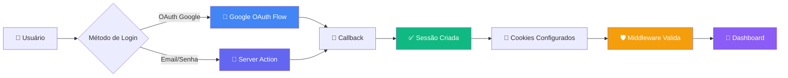
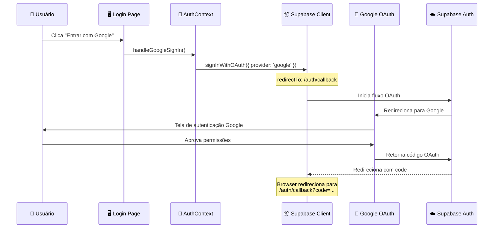
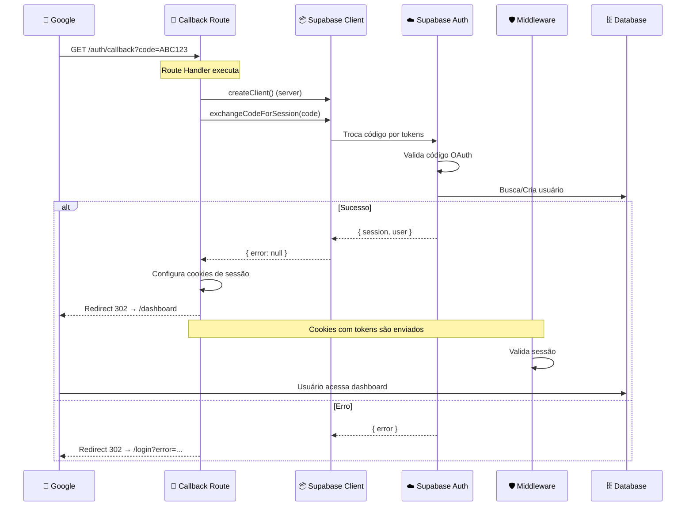
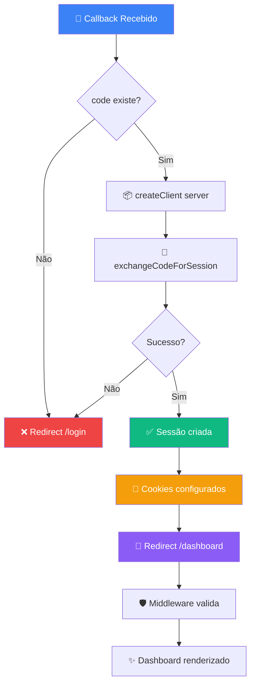
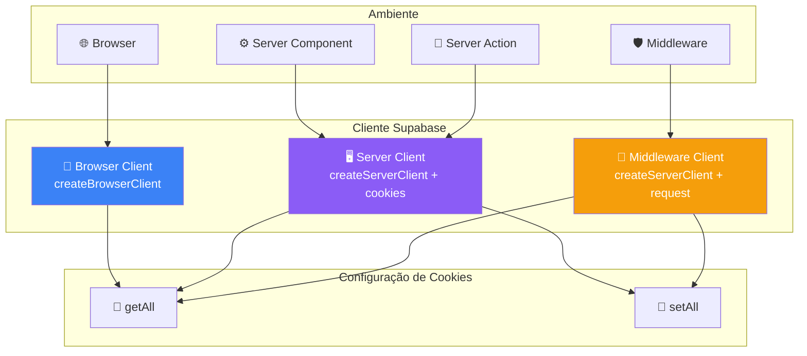
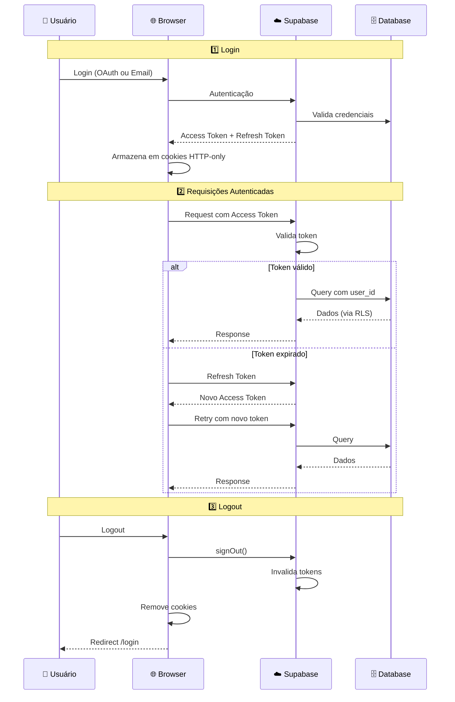
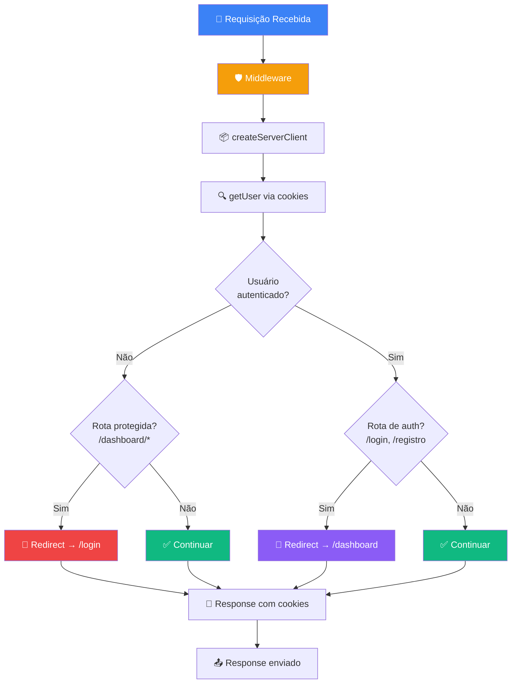
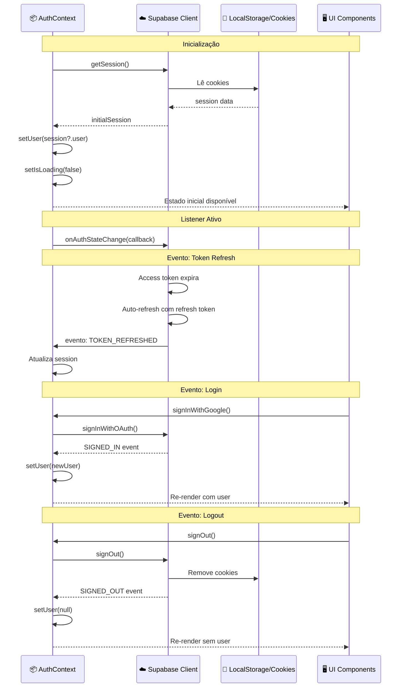
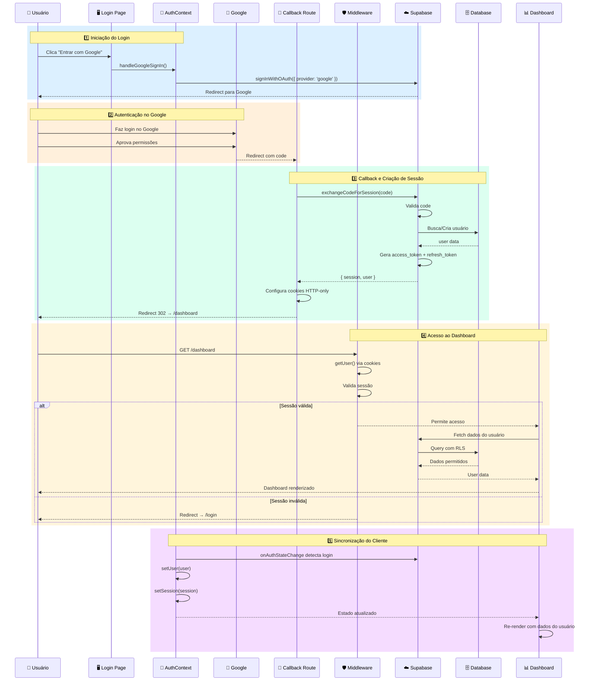
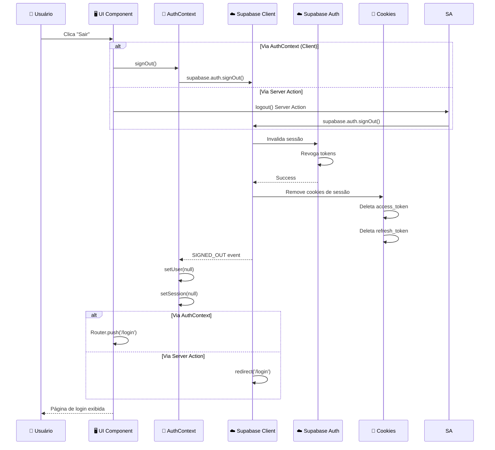

# 🔐 Fluxo de Autenticação

Este documento detalha todos os fluxos de autenticação da plataforma Arena Te Amo, incluindo login com Google OAuth, gerenciamento de sessão, proteção de rotas e contexto de autenticação no cliente.

## Índice

1. [Visão Geral](#visão-geral)
2. [Login com Google OAuth](#login-com-google-oauth)
3. [Callback do OAuth](#callback-do-oauth)
4. [Criação e Gerenciamento de Sessão](#criação-e-gerenciamento-de-sessão)
5. [Middleware de Proteção de Rotas](#middleware-de-proteção-de-rotas)
6. [Contexto de Autenticação no Cliente](#contexto-de-autenticação-no-cliente)
7. [Fluxo Completo de Login](#fluxo-completo-de-login)
8. [Logout](#logout)
9. [Arquivos Relacionados](#arquivos-relacionados)

---

## Visão Geral

A autenticação na plataforma utiliza **Supabase Auth** com suporte a:
- 🔑 **OAuth Google** (método principal)
- 📧 **Email/Senha** (método alternativo via Server Actions)
- 🔒 **Session Management** via cookies HTTP-only
- 🛡️ **RLS (Row Level Security)** para acesso ao banco de dados



---

## Login com Google OAuth

O fluxo de login com Google OAuth é iniciado no cliente através do `AuthContext` e gerenciado pelo Supabase.

### Diagrama de Sequência - Login Google



### Código: Iniciando Login com Google

**Localização**: `src/contexts/AuthContext.tsx`

```typescript
// Login com Google
const signInWithGoogle = useCallback(async () => {
  const { error } = await supabase.auth.signInWithOAuth({
    provider: 'google',
    options: {
      redirectTo: `${window.location.origin}/auth/callback`,
    },
  });

  if (error) {
    console.error('Erro ao fazer login com Google:', error);
    throw error;
  }
}, [supabase.auth]);
```

**Localização**: `src/app/login/page.tsx`

```typescript
// Função para lidar com o login
async function handleGoogleSignIn() {
  setIsSigningIn(true);
  try {
    await signInWithGoogle();
  } catch (error) {
    console.error('Erro ao fazer login:', error);
    setIsSigningIn(false);
  }
}
```

---

## Callback do OAuth

Após a autenticação no Google, o usuário é redirecionado para `/auth/callback` onde o código OAuth é trocado por uma sessão.

### Diagrama de Sequência - Callback



### Código: Route Handler de Callback

**Localização**: `src/app/auth/callback/route.ts`

```typescript
export async function GET(request: Request) {
  const { searchParams, origin } = new URL(request.url);
  const code = searchParams.get('code');
  const next = searchParams.get('next') ?? '/dashboard';

  if (code) {
    const supabase = await createClient();
    const { error } = await supabase.auth.exchangeCodeForSession(code);

    if (!error) {
      return NextResponse.redirect(`${origin}${next}`);
    }
  }

  // Redireciona para login em caso de erro
  return NextResponse.redirect(`${origin}/login?error=auth_callback_error`);
}
```

### Fluxo de Decisão - Callback



---

## Criação e Gerenciamento de Sessão

O Supabase gerencia sessões através de cookies HTTP-only seguros. Existem três tipos de clientes Supabase dependendo do contexto.

### Tipos de Clientes Supabase



### Cliente Browser (Client Components)

**Localização**: `src/lib/supabase/client.ts`

```typescript
import { createBrowserClient } from '@supabase/ssr'

export function createClient() {
  return createBrowserClient(
    process.env.NEXT_PUBLIC_SUPABASE_URL!,
    process.env.NEXT_PUBLIC_SUPABASE_ANON_KEY!
  )
}
```

- ✅ **Uso**: Client Components, Context API
- 🍪 **Cookies**: Gerenciados automaticamente pelo browser
- 🔄 **Auto-refresh**: Tokens renovados automaticamente

### Cliente Server (Server Components e Actions)

**Localização**: `src/lib/supabase/server.ts`

```typescript
import { createServerClient } from '@supabase/ssr';
import { cookies } from 'next/headers';

export async function createClient() {
  const cookieStore = await cookies();

  return createServerClient(
    process.env.NEXT_PUBLIC_SUPABASE_URL!,
    process.env.NEXT_PUBLIC_SUPABASE_ANON_KEY!,
    {
      cookies: {
        getAll() {
          return cookieStore.getAll();
        },
        setAll(cookiesToSet) {
          try {
            cookiesToSet.forEach(({ name, value, options }) =>
              cookieStore.set(name, value, options)
            );
          } catch {
            // Ignora erro quando chamado de Server Component (somente leitura)
          }
        },
      },
    }
  );
}
```

- ✅ **Uso**: Server Components, Server Actions, Route Handlers
- 🍪 **Cookies**: Leitura/escrita via `next/headers`
- 🔒 **Segurança**: Cookies HTTP-only não acessíveis pelo JavaScript

### Ciclo de Vida da Sessão



---

## Middleware de Proteção de Rotas

O middleware Next.js intercepta **todas** as requisições para validar sessões e proteger rotas.

### Fluxo do Middleware



### Código do Middleware

**Localização**: `src/middleware.ts`

```typescript
import { NextResponse } from 'next/server'
import type { NextRequest } from 'next/server'
import { updateSession } from '@/lib/supabase/middleware'

export async function middleware(request: NextRequest) {
  // Atualiza a sessão do Supabase
  return await updateSession(request)
}

export const config = {
  matcher: [
    /*
     * Regex para caminhos que requerem atualização de sessão:
     * - todas as rotas exceto arquivos estáticos, favicon, api, etc.
     */
    '/((?!_next/static|_next/image|favicon.ico|.*\\.(?:svg|png|jpg|jpeg|gif|webp)$).*)',
  ],
}
```

**Localização**: `src/lib/supabase/middleware.ts`

```typescript
export async function updateSession(request: NextRequest) {
  let supabaseResponse = NextResponse.next({
    request,
  });

  const supabase = createServerClient(
    process.env.NEXT_PUBLIC_SUPABASE_URL!,
    process.env.NEXT_PUBLIC_SUPABASE_ANON_KEY!,
    {
      cookies: {
        getAll() {
          return request.cookies.getAll();
        },
        setAll(cookiesToSet) {
          cookiesToSet.forEach(({ name, value }) =>
            request.cookies.set(name, value)
          );
          supabaseResponse = NextResponse.next({
            request,
          });
          cookiesToSet.forEach(({ name, value, options }) =>
            supabaseResponse.cookies.set(name, value, options)
          );
        },
      },
    }
  );

  // Atualiza a sessão - importante para manter tokens válidos
  const {
    data: { user },
  } = await supabase.auth.getUser();

  // Proteção de rotas: redireciona usuários não autenticados
  const isAuthRoute = request.nextUrl.pathname.startsWith('/login') ||
    request.nextUrl.pathname.startsWith('/registro');
  const isDashboardRoute = request.nextUrl.pathname.startsWith('/dashboard');

  // Se não está autenticado e tenta acessar área protegida
  if (!user && isDashboardRoute) {
    const url = request.nextUrl.clone();
    url.pathname = '/login';
    return NextResponse.redirect(url);
  }

  // Se está autenticado e tenta acessar páginas de auth
  if (user && isAuthRoute) {
    const url = request.nextUrl.clone();
    url.pathname = '/dashboard';
    return NextResponse.redirect(url);
  }

  return supabaseResponse;
}
```

### Tabela: Comportamento de Proteção de Rotas

| Rota | Usuário Autenticado | Usuário Não Autenticado |
|------|---------------------|-------------------------|
| `/` | ✅ Acesso permitido | ✅ Acesso permitido |
| `/login` | 🔀 Redirect `/dashboard` | ✅ Acesso permitido |
| `/registro` | 🔀 Redirect `/dashboard` | ✅ Acesso permitido |
| `/dashboard` | ✅ Acesso permitido | 🔀 Redirect `/login` |
| `/dashboard/*` | ✅ Acesso permitido | 🔀 Redirect `/login` |
| `/api/*` | ⚠️ Depende da implementação | ⚠️ Depende da implementação |

---

## Contexto de Autenticação no Cliente

O `AuthContext` fornece acesso global ao estado de autenticação em Client Components.

### Arquitetura do AuthContext

```mermaid
graph TD
    subgraph "App Root"
        A[🎯 RootLayout]
    end

    A --> B[📦 AuthProvider]

    subgraph "AuthContext State"
        C[👤 user: User | null]
        D[🎫 session: Session | null]
        E[⏳ isLoading: boolean]
    end

    B --> C
    B --> D
    B --> E

    subgraph "Actions"
        F[🔐 signInWithGoogle]
        G[🚪 signOut]
    end

    B --> F
    B --> G

    subgraph "Listeners"
        H[👂 onAuthStateChange]
        I[🔄 Auto-refresh tokens]
    end

    B --> H
    B --> I

    subgraph "Children Components"
        J[📱 Header]
        K[🖥️ Login Page]
        L[📊 Dashboard]
        M[... qualquer componente]
    end

    B --> J
    B --> K
    B --> L
    B --> M

    J -.useAuth.-> C
    K -.useAuth.-> F
    L -.useAuth.-> C

    style B fill:#8b5cf6,color:#fff
    style C fill:#3b82f6,color:#fff
    style D fill:#3b82f6,color:#fff
    style E fill:#3b82f6,color:#fff
    style F fill:#10b981,color:#fff
    style G fill:#ef4444,color:#fff
    style H fill:#f59e0b,color:#fff
```

### Código: AuthContext

**Localização**: `src/contexts/AuthContext.tsx`

```typescript
'use client';

import { createContext, useContext, useEffect, useState, useCallback } from 'react';
import { createClient } from '@/lib/supabase/client';
import type { User, Session } from '@supabase/supabase-js';

interface AuthContextType {
  user: User | null;
  session: Session | null;
  isLoading: boolean;
  signInWithGoogle: () => Promise<void>;
  signOut: () => Promise<void>;
}

const AuthContext = createContext<AuthContextType | undefined>(undefined);

export function AuthProvider({ children }: { children: ReactNode }) {
  const [user, setUser] = useState<User | null>(null);
  const [session, setSession] = useState<Session | null>(null);
  const [isLoading, setIsLoading] = useState(true);

  const supabase = createClient();

  useEffect(() => {
    // Obtém a sessão inicial
    const getInitialSession = async () => {
      const { data: { session: initialSession } } = await supabase.auth.getSession();
      setSession(initialSession);
      setUser(initialSession?.user ?? null);
      setIsLoading(false);
    };

    getInitialSession();

    // Listener para mudanças de autenticação
    const { data: { subscription } } = supabase.auth.onAuthStateChange(
      async (event, currentSession) => {
        setSession(currentSession);
        setUser(currentSession?.user ?? null);
        setIsLoading(false);
      }
    );

    return () => subscription.unsubscribe();
  }, []);

  const signInWithGoogle = useCallback(async () => {
    const { error } = await supabase.auth.signInWithOAuth({
      provider: 'google',
      options: { redirectTo: `${window.location.origin}/auth/callback` },
    });
    if (error) throw error;
  }, [supabase.auth]);

  const signOut = useCallback(async () => {
    const { error } = await supabase.auth.signOut();
    if (error) throw error;
  }, [supabase.auth]);

  return (
    <AuthContext.Provider value={{ user, session, isLoading, signInWithGoogle, signOut }}>
      {children}
    </AuthContext.Provider>
  );
}

export function useAuth() {
  const context = useContext(AuthContext);
  if (context === undefined) {
    throw new Error('useAuth deve ser usado dentro de um AuthProvider');
  }
  return context;
}
```

### Fluxo de Sincronização - onAuthStateChange



### Uso do Hook useAuth

```typescript
// Em qualquer Client Component
'use client';

import { useAuth } from '@/contexts/AuthContext';

function MyComponent() {
  const { user, isLoading, signOut } = useAuth();

  if (isLoading) {
    return <div>Carregando...</div>;
  }

  if (!user) {
    return <div>Não autenticado</div>;
  }

  return (
    <div>
      <p>Olá, {user.email}</p>
      <button onClick={signOut}>Sair</button>
    </div>
  );
}
```

---

## Fluxo Completo de Login

Visualização integrada de todo o processo, do clique no botão até o dashboard.



### Timeline do Fluxo Completo

```mermaid
gantt
    title Tempo de Execução do Fluxo de Login
    dateFormat X
    axisFormat %S s

    section Cliente
    Clique no botão           :0, 0.1s
    Redirect para Google      :0.1s, 0.2s
    Autenticação Google       :0.2s, 3s

    section Server
    Callback processa code    :3s, 0.5s
    Troca code por sessão     :3.5s, 1s
    Configura cookies         :4.5s, 0.2s

    section Middleware
    Valida sessão             :4.7s, 0.3s
    Permite acesso            :5s, 0.1s

    section Renderização
    Carrega dashboard         :5.1s, 0.5s
    Fetch dados               :5.6s, 0.4s
    Renderiza UI              :6s, 0.3s
```

---

## Logout

O processo de logout limpa a sessão tanto no cliente quanto no servidor.

### Fluxo de Logout



### Código: Logout via Server Action

**Localização**: `src/actions/auth.ts`

```typescript
export async function logout(): Promise<void> {
  const supabase = await createClient();
  await supabase.auth.signOut();
  revalidatePath('/', 'layout');
  redirect('/login');
}
```

### Código: Logout via AuthContext

**Localização**: `src/contexts/AuthContext.tsx`

```typescript
const signOut = useCallback(async () => {
  const { error } = await supabase.auth.signOut();
  if (error) {
    console.error('Erro ao fazer logout:', error);
    throw error;
  }
}, [supabase.auth]);
```

---

## Arquivos Relacionados

### Estrutura de Arquivos de Autenticação

```
src/
├── app/
│   ├── layout.tsx                    # AuthProvider wrapping
│   ├── login/
│   │   └── page.tsx                  # Login page com Google OAuth
│   └── auth/
│       └── callback/
│           └── route.ts              # OAuth callback handler
│
├── contexts/
│   └── AuthContext.tsx               # Context + Provider + Hook
│
├── lib/
│   └── supabase/
│       ├── client.ts                 # Browser client
│       ├── server.ts                 # Server client
│       └── middleware.ts             # Middleware session handler
│
├── actions/
│   └── auth.ts                       # Server Actions (login, logout, etc)
│
└── middleware.ts                     # Next.js middleware (route protection)
```

### Mapa de Responsabilidades

| Arquivo | Responsabilidade | Ambiente |
|---------|------------------|----------|
| `src/middleware.ts` | Intercepta requisições, valida sessão | Edge Runtime |
| `src/lib/supabase/middleware.ts` | Lógica de proteção de rotas | Edge Runtime |
| `src/lib/supabase/server.ts` | Cliente Supabase para server-side | Node.js Runtime |
| `src/lib/supabase/client.ts` | Cliente Supabase para client-side | Browser |
| `src/contexts/AuthContext.tsx` | Estado global de auth + listeners | Browser |
| `src/app/login/page.tsx` | UI de login | Browser |
| `src/app/auth/callback/route.ts` | Troca code por session | Node.js Runtime |
| `src/actions/auth.ts` | Server Actions de auth | Node.js Runtime |

---

## Resumo dos Fluxos

### ✅ Pontos Fortes da Arquitetura

1. **Segurança em Camadas**
   - 🍪 Cookies HTTP-only (não acessíveis por JS)
   - 🛡️ Middleware valida toda requisição
   - 🔒 RLS protege dados no banco

2. **Separação de Responsabilidades**
   - 📱 Cliente: UI e estado local
   - ⚙️ Server: Lógica de negócio e validação
   - 🛡️ Middleware: Proteção de rotas
   - ☁️ Supabase: Autenticação e dados

3. **Developer Experience**
   - 🎯 Context API para fácil acesso ao user
   - 🔄 Auto-refresh de tokens transparente
   - 📦 Três clientes Supabase otimizados por contexto

4. **Performance**
   - ⚡ Server Components por padrão
   - 🔄 Validação no Edge (baixa latência)
   - 🍪 Sessão via cookies (sem localStorage)

### 🔐 Fluxos Principais

| Fluxo | Trigger | Componentes Envolvidos | Resultado |
|-------|---------|------------------------|-----------|
| **Login Google** | Clique no botão | AuthContext → Supabase → Google → Callback | Sessão criada, redirect /dashboard |
| **Proteção de Rota** | Acesso a /dashboard | Middleware → Supabase → RLS | Usuário validado ou redirect /login |
| **Auto-refresh** | Token expira | Supabase Client (automático) | Novo access_token obtido |
| **Logout** | Clique "Sair" | AuthContext/ServerAction → Supabase | Sessão destruída, redirect /login |
| **State Sync** | Qualquer mudança de auth | onAuthStateChange → AuthContext | UI re-renderiza com novo estado |

---

## Próximos Documentos

- 📝 [Fluxo de Posts](./DATA_FLOW_POSTS.md) - Criação, moderação e feed
- 🎯 [Fluxo de Desafios](./DATA_FLOW_CHALLENGES.md) - Participação e recompensas
- 🎉 [Fluxo de Eventos](./DATA_FLOW_EVENTS.md) - Registro e check-in
- 👤 [Fluxo de Perfil](./DATA_FLOW_PROFILE_REWARDS.md) - Níveis e recompensas

---

**Documentação gerada para**: Arena Te Amo Platform
**Última atualização**: 2026-01-07
**Versão**: 1.0.0
