# 🎯 Fluxo de Desafios

Este documento detalha todos os fluxos relacionados ao sistema de desafios da plataforma NextLOVERS, incluindo listagem de desafios, participação, submissão de evidências, verificação por IA, aprovação admin, seleção de vencedores e sistema de recompensas.

## Índice

1. [Visão Geral](#visão-geral)
2. [Listagem de Desafios](#listagem-de-desafios)
3. [Participação em Desafios](#participação-em-desafios)
4. [Submissão de Evidências](#submissão-de-evidências)
5. [Verificação por IA (Gemini)](#verificação-por-ia-gemini)
6. [Fluxo Admin - Moderação de Participações](#fluxo-admin---moderação-de-participações)
7. [Seleção de Vencedores](#seleção-de-vencedores)
8. [Sistema de Recompensas](#sistema-de-recompensas)
9. [Fluxo Admin - Gestão de Desafios](#fluxo-admin---gestão-de-desafios)
10. [Fluxo Completo de Dados](#fluxo-completo-de-dados)
11. [Arquivos Relacionados](#arquivos-relacionados)

---

## Visão Geral

O sistema de desafios incentiva o engajamento dos advocates através de três tipos de desafios: físicos (com metas quantificáveis), engajamento (interação em redes sociais) e participe (sorteios). O sistema utiliza IA para verificação automática de evidências em vídeo e oferece recompensas em moedas virtuais (corações) e prêmios em dinheiro.

### Características Principais

- 🎯 **Três Tipos de Desafios**: Físico, Engajamento e Participe
- 📹 **Verificação por IA**: Análise automática de vídeos com Google Gemini
- 💰 **Dupla Recompensa**: Moedas virtuais + prêmios em dinheiro
- 👨‍💼 **Moderação Admin**: Aprovação/rejeição de participações
- 🏆 **Sistema de Vencedores**: Registro e controle de pagamento de prêmios
- 🔒 **Segurança**: RLS protege operações sensíveis

### Tipos de Desafios

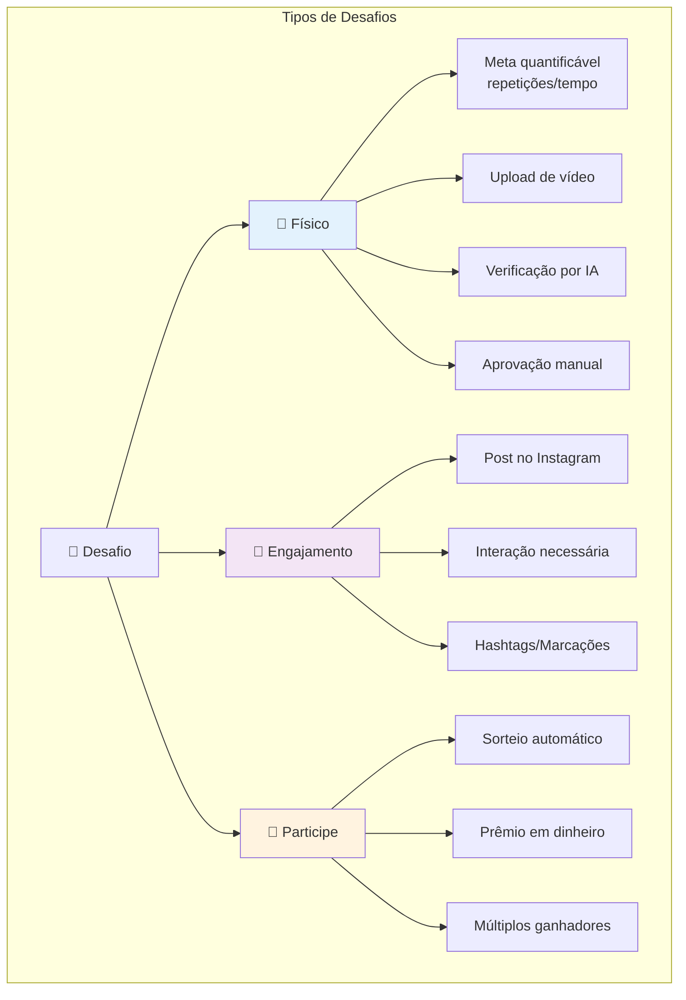
```mermaid
graph TB
    subgraph "Tipos de Desafios"
        A[🎯 Desafio]

        B[💪 Físico]
        C[📱 Engajamento]
        D[🎁 Participe]

        A --> B
        A --> C
        A --> D

        B --> B1[Meta quantificável<br/>repetições/tempo]
        B --> B2[Upload de vídeo]
        B --> B3[Verificação por IA]
        B --> B4[Aprovação manual]

        C --> C1[Post no Instagram]
        C --> C2[Interação necessária]
        C --> C3[Hashtags/Marcações]

        D --> D1[Sorteio automático]
        D --> D2[Prêmio em dinheiro]
        D --> D3[Múltiplos ganhadores]
    end

    style B fill:#e3f2fd
    style C fill:#f3e5f5
    style D fill:#fff3e0
```

### Estados de uma Participação

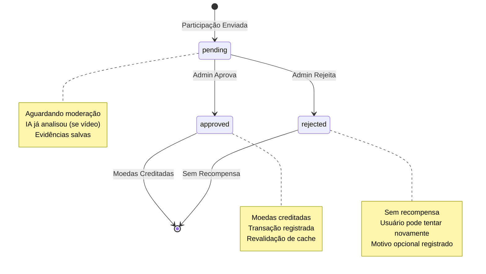
```mermaid
stateDiagram-v2
    [*] --> pending: Participação Enviada
    pending --> approved: Admin Aprova
    pending --> rejected: Admin Rejeita
    approved --> [*]: Moedas Creditadas
    rejected --> [*]: Sem Recompensa

    note right of pending
        Aguardando moderação
        IA já analisou (se vídeo)
        Evidências salvas
    end note

    note right of approved
        Moedas creditadas
        Transação registrada
        Revalidação de cache
    end note

    note right of rejected
        Sem recompensa
        Usuário pode tentar novamente
        Motivo opcional registrado
    end note
```

### Arquitetura Geral

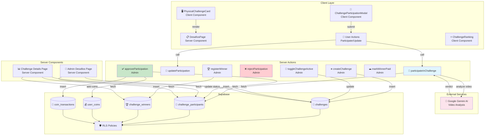
```mermaid
graph TB
    subgraph "Client Layer"
        A[🖥️ PhysicalChallengeCard<br/>Client Component]
        B[📝 ChallengeParticipationModal<br/>Client Component]
        C[📋 DesafiosPage<br/>Server Component]
        D[👤 User Actions<br/>Participate/Update]
        E[⭐ ChallengeRanking<br/>Client Component]
    end

    subgraph "Server Actions"
        F[🎯 participateInChallenge]
        G[📝 updateParticipation]
        H[✅ approveParticipation<br/>Admin]
        I[❌ rejectParticipation<br/>Admin]
        J[➕ createChallenge<br/>Admin]
        K[🏆 registerWinner<br/>Admin]
        L[💵 markWinnerPaid<br/>Admin]
        M[🔄 toggleChallengeActive<br/>Admin]
    end

    subgraph "External Services"
        N[🤖 Google Gemini AI<br/>Video Analysis]
    end

    subgraph "Server Components"
        O[📄 Admin Desafios Page<br/>Server Component]
        P[📊 Challenge Details Page<br/>Server Component]
    end

    subgraph "Supabase"
        Q[(🎯 challenges)]
        R[(👥 challenge_participants)]
        S[(🏆 challenge_winners)]
        T[(💰 user_coins)]
        U[(📝 coin_transactions)]
        V[🛡️ RLS Policies]
    end

    A -->|render| C
    B -->|submit| D
    D -->|call| F
    D -->|call| G

    F -->|analyze video| N
    N -->|verdict| F

    F -->|insert| R
    H -->|update status| R
    H -->|add coins| T
    H -->|insert| U

    J -->|insert| Q
    K -->|insert| S
    M -->|update| Q

    O -->|fetch| Q
    O -->|fetch| R
    P -->|fetch| Q
    P -->|fetch| R
    P -->|fetch| S

    Q --> V
    R --> V
    S --> V
    T --> V
    U --> V

    style N fill:#fce4ec
    style F fill:#e1f5fe
    style H fill:#c8e6c9
    style I fill:#ffcdd2
```

---

## Listagem de Desafios

A página de desafios exibe todos os desafios ativos, agrupados por tipo, com informações de recompensas e status de participação do usuário.

### Fluxo de Carregamento

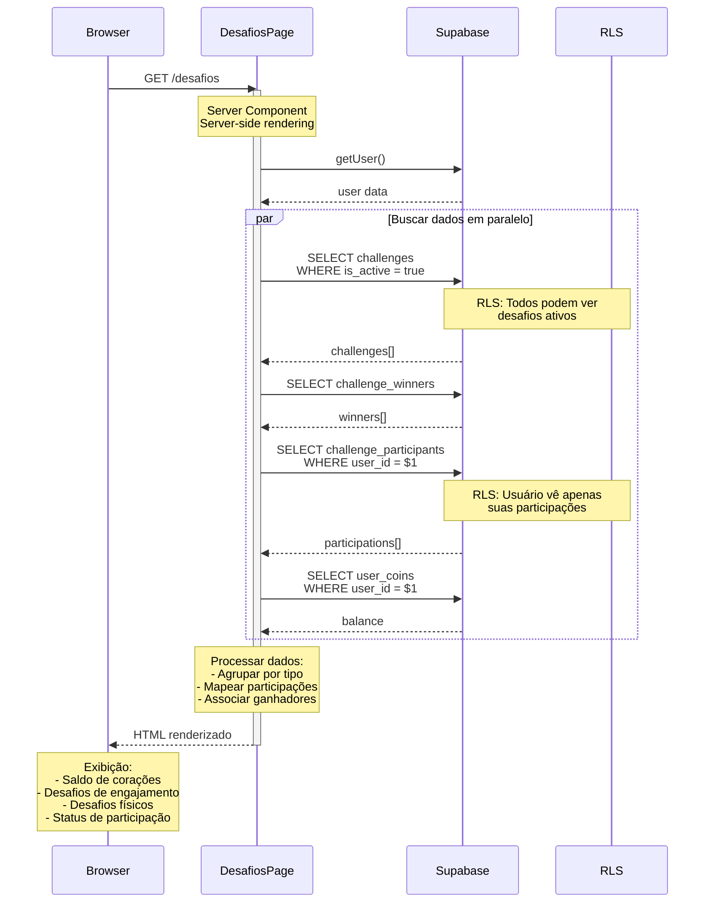
```mermaid
sequenceDiagram
    participant Browser
    participant DesafiosPage
    participant Supabase
    participant RLS

    Browser->>DesafiosPage: GET /desafios

    activate DesafiosPage
    Note over DesafiosPage: Server Component<br/>Server-side rendering

    DesafiosPage->>Supabase: getUser()
    Supabase-->>DesafiosPage: user data

    par Buscar dados em paralelo
        DesafiosPage->>Supabase: SELECT challenges<br/>WHERE is_active = true
        Note over Supabase,RLS: RLS: Todos podem ver<br/>desafios ativos
        Supabase-->>DesafiosPage: challenges[]

        DesafiosPage->>Supabase: SELECT challenge_winners
        Supabase-->>DesafiosPage: winners[]

        DesafiosPage->>Supabase: SELECT challenge_participants<br/>WHERE user_id = $1
        Note over Supabase,RLS: RLS: Usuário vê apenas<br/>suas participações
        Supabase-->>DesafiosPage: participations[]

        DesafiosPage->>Supabase: SELECT user_coins<br/>WHERE user_id = $1
        Supabase-->>DesafiosPage: balance
    end

    Note over DesafiosPage: Processar dados:<br/>- Agrupar por tipo<br/>- Mapear participações<br/>- Associar ganhadores

    DesafiosPage-->>Browser: HTML renderizado
    deactivate DesafiosPage

    Note over Browser: Exibição:<br/>- Saldo de corações<br/>- Desafios de engajamento<br/>- Desafios físicos<br/>- Status de participação
```

### Agrupamento de Desafios

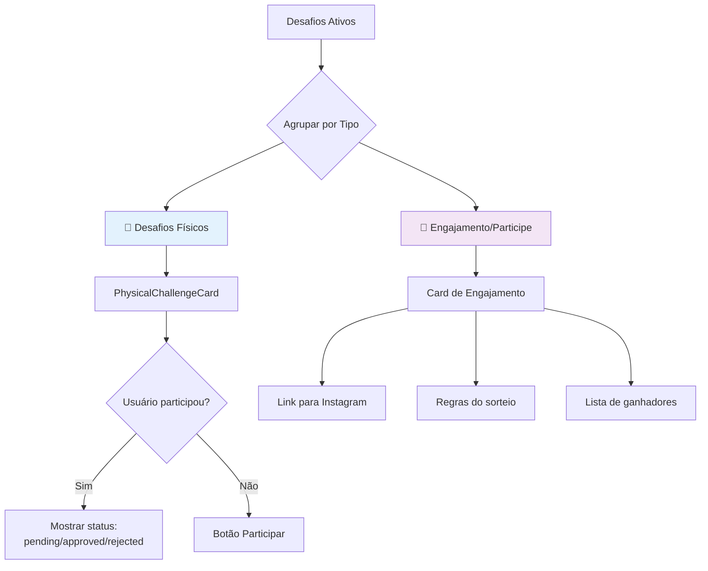
```mermaid
flowchart TB
    A[Desafios Ativos] --> B{Agrupar por Tipo}

    B --> C[💪 Desafios Físicos]
    B --> D[🎁 Engajamento/Participe]

    C --> C1[PhysicalChallengeCard]
    C1 --> C2{Usuário participou?}
    C2 -->|Sim| C3[Mostrar status:<br/>pending/approved/rejected]
    C2 -->|Não| C4[Botão Participar]

    D --> D1[Card de Engajamento]
    D1 --> D2[Link para Instagram]
    D1 --> D3[Regras do sorteio]
    D1 --> D4[Lista de ganhadores]

    style C fill:#e3f2fd
    style D fill:#f3e5f5
```

### Código: Listagem de Desafios

```typescript
// src/app/(dashboard)/desafios/page.tsx
export default async function DesafiosPage() {
  const supabase = await createClient();
  const { data: { user } } = await supabase.auth.getUser();

  if (!user) {
    redirect('/login');
  }

  // Buscar desafios ativos
  const { data: challenges } = await supabase
    .from('challenges')
    .select('*')
    .eq('is_active', true)
    .order('created_at', { ascending: false });

  // Buscar ganhadores
  const { data: winners } = await supabase
    .from('challenge_winners')
    .select('*')
    .order('created_at', { ascending: false });

  // Buscar participações do usuário
  const { data: participations } = await supabase
    .from('challenge_participants')
    .select('challenge_id, status, result_value, coins_earned')
    .eq('user_id', user.id);

  // Buscar saldo de corações
  const { data: userCoins } = await supabase
    .from('user_coins')
    .select('balance')
    .eq('user_id', user.id)
    .single();

  const balance = userCoins?.balance || 0;

  // Mapa de participações
  const participationMap = new Map(
    (participations || []).map(p => [p.challenge_id, p])
  );

  // Agrupar por tipo
  const engagementChallenges = (challenges || []).filter(
    c => c.type === 'participe' || c.type === 'engajamento'
  );
  const physicalChallenges = (challenges || []).filter(c => c.type === 'fisico');

  return (
    <div className="space-y-8">
      <PageHeader
        title="Desafios"
        description="Participe dos desafios e ganhe corações"
      />

      {/* Saldo de corações */}
      <Card className="p-4 bg-gradient-to-r from-pink-500 to-red-500 text-white">
        <div className="flex items-center justify-between">
          <div>
            <p className="text-pink-100 text-sm">Seus corações</p>
            <p className="text-3xl font-bold">{balance} corações</p>
          </div>
          <div className="text-5xl">❤️</div>
        </div>
      </Card>

      {/* Renderizar desafios por tipo... */}
    </div>
  );
}
```

### Filtros e Estados

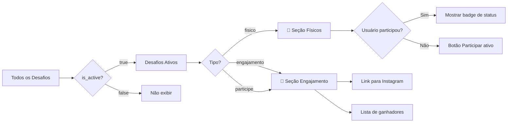
```mermaid
flowchart LR
    A[Todos os Desafios] --> B{is_active?}

    B -->|true| C[Desafios Ativos]
    B -->|false| D[Não exibir]

    C --> E{Tipo?}

    E -->|fisico| F[💪 Seção Físicos]
    E -->|engajamento| G[🎁 Seção Engajamento]
    E -->|participe| G

    F --> H{Usuário participou?}
    H -->|Sim| I[Mostrar badge de status]
    H -->|Não| J[Botão Participar ativo]

    G --> K[Link para Instagram]
    G --> L[Lista de ganhadores]
```

---

## Participação em Desafios

Usuários participam de desafios físicos submetendo evidências (resultado, vídeo, post em rede social).

### Fluxo de Participação

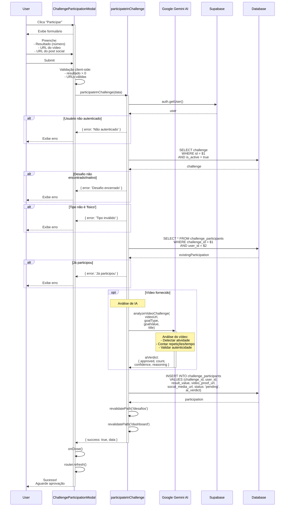
```mermaid
sequenceDiagram
    participant User
    participant Modal as ChallengeParticipationModal
    participant Action as participateInChallenge
    participant Gemini as Google Gemini AI
    participant Supabase
    participant DB as Database

    User->>Modal: Clica "Participar"
    activate Modal
    Modal-->>User: Exibe formulário

    User->>Modal: Preenche:<br/>- Resultado (número)<br/>- URL do vídeo<br/>- URL do post social
    User->>Modal: Submit

    Modal->>Modal: Validação client-side:<br/>- resultado > 0<br/>- URLs válidas

    Modal->>Action: participateInChallenge(data)
    activate Action

    Action->>Supabase: auth.getUser()
    Supabase-->>Action: user

    alt Usuário não autenticado
        Action-->>Modal: { error: 'Não autenticado' }
        Modal-->>User: Exibe erro
    end

    Action->>DB: SELECT challenge<br/>WHERE id = $1<br/>AND is_active = true
    DB-->>Action: challenge

    alt Desafio não encontrado/inativo
        Action-->>Modal: { error: 'Desafio encerrado' }
        Modal-->>User: Exibe erro
    end

    alt Tipo não é 'fisico'
        Action-->>Modal: { error: 'Tipo inválido' }
        Modal-->>User: Exibe erro
    end

    Action->>DB: SELECT * FROM challenge_participants<br/>WHERE challenge_id = $1<br/>AND user_id = $2
    DB-->>Action: existingParticipation

    alt Já participou
        Action-->>Modal: { error: 'Já participou' }
        Modal-->>User: Exibe erro
    end

    opt Vídeo fornecido
        Note over Action: Análise de IA
        Action->>Gemini: analyzeVideoChallenge(<br/>videoUrl,<br/>goalType,<br/>goalValue,<br/>title)
        activate Gemini
        Note over Gemini: Análise do vídeo:<br/>- Detectar atividade<br/>- Contar repetições/tempo<br/>- Validar autenticidade
        Gemini-->>Action: aiVerdict:<br/>{ approved, count,<br/>confidence, reasoning }
        deactivate Gemini
    end

    Action->>DB: INSERT INTO challenge_participants<br/>VALUES (challenge_id, user_id,<br/>result_value, video_proof_url,<br/>social_media_url, status: 'pending',<br/>ai_verdict)
    DB-->>Action: participation

    Action->>Action: revalidatePath('/desafios')
    Action->>Action: revalidatePath('/dashboard')

    Action-->>Modal: { success: true, data }
    deactivate Action

    Modal->>Modal: onClose()
    Modal->>Modal: router.refresh()
    Modal-->>User: Sucesso!<br/>Aguarde aprovação
    deactivate Modal
```

### Validações em Múltiplas Camadas

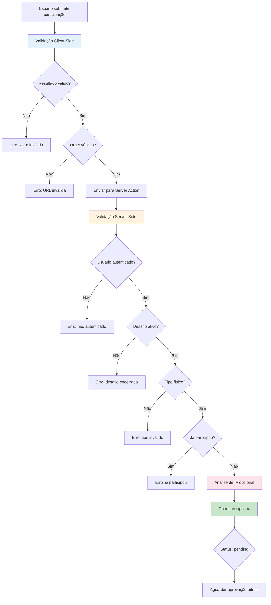
```mermaid
flowchart TB
    A[Usuário submete participação] --> B[Validação Client-Side]

    B --> B1{Resultado válido?}
    B1 -->|Não| B2[Erro: valor inválido]
    B1 -->|Sim| B3{URLs válidas?}
    B3 -->|Não| B4[Erro: URL inválida]
    B3 -->|Sim| C[Enviar para Server Action]

    C --> D[Validação Server-Side]

    D --> D1{Usuário autenticado?}
    D1 -->|Não| D2[Erro: não autenticado]
    D1 -->|Sim| D3{Desafio ativo?}

    D3 -->|Não| D4[Erro: desafio encerrado]
    D3 -->|Sim| D5{Tipo físico?}

    D5 -->|Não| D6[Erro: tipo inválido]
    D5 -->|Sim| D7{Já participou?}

    D7 -->|Sim| D8[Erro: já participou]
    D7 -->|Não| E[Análise de IA opcional]

    E --> F[Criar participação]
    F --> G{Status: pending}

    G --> H[Aguardar aprovação admin]

    style B fill:#e3f2fd
    style D fill:#fff3e0
    style E fill:#fce4ec
    style F fill:#c8e6c9
```

### Código: Participação

```typescript
// src/actions/challenges.ts
export async function participateInChallenge(data: {
  challengeId: string;
  resultValue: number;
  videoProofUrl?: string;
  socialMediaUrl?: string;
}): Promise<ActionResponse> {
  try {
    const supabase = await createClient();

    const { data: { user } } = await supabase.auth.getUser();
    if (!user) {
      return { error: 'Usuario nao autenticado' };
    }

    // Verificar se o desafio existe e está ativo
    const { data: challenge, error: challengeError } = await supabase
      .from('challenges')
      .select('*')
      .eq('id', data.challengeId)
      .eq('is_active', true)
      .eq('status', 'active')
      .single();

    if (challengeError || !challenge) {
      return { error: 'Desafio nao encontrado ou encerrado' };
    }

    if (challenge.type !== 'fisico') {
      return { error: 'Este desafio nao aceita participacoes diretas' };
    }

    // Verificar se já participou
    const { data: existingParticipation } = await supabase
      .from('challenge_participants')
      .select('id')
      .eq('challenge_id', data.challengeId)
      .eq('user_id', user.id)
      .single();

    if (existingParticipation) {
      return { error: 'Voce ja participou deste desafio' };
    }

    // Analisar vídeo com IA (se tiver URL)
    let aiVerdict: AIVerdict | null = null;
    if (data.videoProofUrl) {
      aiVerdict = await analyzeVideoChallenge(
        data.videoProofUrl,
        challenge.goal_type,
        challenge.goal_value,
        challenge.title
      );
    }

    // Criar participação
    const { data: participation, error } = await supabase
      .from('challenge_participants')
      .insert({
        challenge_id: data.challengeId,
        user_id: user.id,
        result_value: data.resultValue,
        video_proof_url: data.videoProofUrl || null,
        social_media_url: data.socialMediaUrl || null,
        status: 'pending',
        coins_earned: 0,
        ai_verdict: aiVerdict,
      })
      .select()
      .single();

    if (error) {
      console.error('Error creating participation:', error);
      return { error: 'Erro ao registrar participacao' };
    }

    revalidatePath('/desafios');
    revalidatePath('/dashboard');
    return { success: true, data: participation };
  } catch {
    return { error: 'Erro interno do servidor' };
  }
}
```

---

## Submissão de Evidências

Usuários podem submeter múltiplas formas de evidência para comprovar a conclusão do desafio.

### Tipos de Evidências

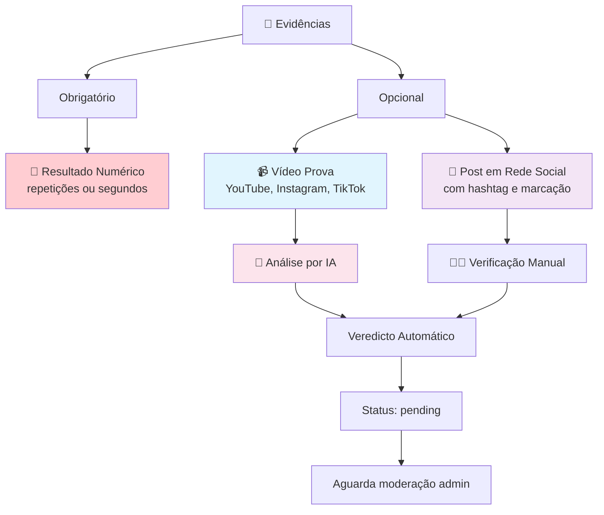
```mermaid
graph TB
    A[📝 Evidências] --> B[Obrigatório]
    A --> C[Opcional]

    B --> B1[🔢 Resultado Numérico<br/>repetições ou segundos]

    C --> C1[📹 Vídeo Prova<br/>YouTube, Instagram, TikTok]
    C --> C2[📱 Post em Rede Social<br/>com hashtag e marcação]

    C1 --> D[🤖 Análise por IA]
    C2 --> E[👨‍💼 Verificação Manual]

    D --> F[Veredicto Automático]
    E --> F

    F --> G[Status: pending]
    G --> H[Aguarda moderação admin]

    style B1 fill:#ffcdd2
    style C1 fill:#e1f5fe
    style C2 fill:#f3e5f5
    style D fill:#fce4ec
```

### Estrutura de Dados de Evidências

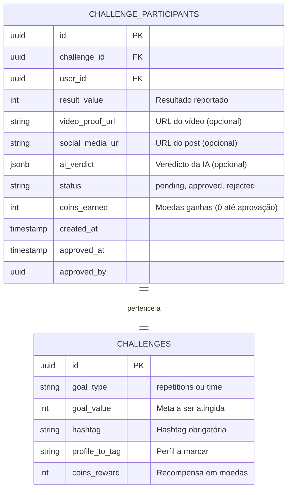
```mermaid
erDiagram
    CHALLENGE_PARTICIPANTS {
        uuid id PK
        uuid challenge_id FK
        uuid user_id FK
        int result_value "Resultado reportado"
        string video_proof_url "URL do vídeo (opcional)"
        string social_media_url "URL do post (opcional)"
        jsonb ai_verdict "Veredicto da IA (opcional)"
        string status "pending, approved, rejected"
        int coins_earned "Moedas ganhas (0 até aprovação)"
        timestamp created_at
        timestamp approved_at
        uuid approved_by
    }

    CHALLENGES {
        uuid id PK
        string goal_type "repetitions ou time"
        int goal_value "Meta a ser atingida"
        string hashtag "Hashtag obrigatória"
        string profile_to_tag "Perfil a marcar"
        int coins_reward "Recompensa em moedas"
    }

    CHALLENGE_PARTICIPANTS ||--|| CHALLENGES : "pertence a"
```

### Código: Modal de Participação

```typescript
// src/components/challenges/ChallengeParticipationModal.tsx
export function ChallengeParticipationModal({
  challenge,
  isOpen,
  onClose,
}: ChallengeParticipationModalProps) {
  const router = useRouter();
  const [isLoading, setIsLoading] = useState(false);
  const [error, setError] = useState<string | null>(null);
  const [formData, setFormData] = useState({
    resultValue: '',
    videoProofUrl: '',
    socialMediaUrl: '',
  });

  const handleSubmit = async (e: React.FormEvent) => {
    e.preventDefault();
    setError(null);

    const resultValue = parseInt(formData.resultValue);
    if (isNaN(resultValue) || resultValue <= 0) {
      setError('Informe um valor valido');
      return;
    }

    setIsLoading(true);

    const result = await participateInChallenge({
      challengeId: challenge.id,
      resultValue,
      videoProofUrl: formData.videoProofUrl || undefined,
      socialMediaUrl: formData.socialMediaUrl || undefined,
    });

    if (result.error) {
      setError(result.error);
      setIsLoading(false);
      return;
    }

    setIsLoading(false);
    onClose();
    router.refresh();
  };

  const goalLabel = challenge.goal_type === 'time' ? 'segundos' : 'repeticoes';

  return (
    <Modal isOpen={isOpen} onClose={onClose} title="Participar do Desafio">
      <form onSubmit={handleSubmit} className="space-y-4">
        {/* Info do desafio */}
        <div className="p-4 bg-blue-50 rounded-lg">
          <h3 className="font-bold text-blue-900">{challenge.title}</h3>
          {challenge.goal_value && (
            <p className="text-sm text-blue-700 mt-1">
              Meta: {challenge.goal_value} {goalLabel}
            </p>
          )}
          <p className="text-sm text-blue-600 mt-1">
            Recompensa: {challenge.coins_reward} corações
          </p>
        </div>

        {/* Resultado */}
        <div>
          <label className="block text-sm font-medium text-gray-700 mb-1">
            Seu resultado ({goalLabel}) *
          </label>
          <Input
            type="number"
            value={formData.resultValue}
            onChange={(e) => setFormData({ ...formData, resultValue: e.target.value })}
            placeholder={`Ex: ${challenge.goal_value || 50}`}
            min="1"
            required
          />
        </div>

        {/* Link do vídeo */}
        <div>
          <label className="block text-sm font-medium text-gray-700 mb-1">
            Link do vídeo (YouTube, Instagram, TikTok)
          </label>
          <Input
            type="url"
            value={formData.videoProofUrl}
            onChange={(e) => setFormData({ ...formData, videoProofUrl: e.target.value })}
            placeholder="https://..."
          />
        </div>

        {/* Link da publicação */}
        <div>
          <label className="block text-sm font-medium text-gray-700 mb-1">
            Link da publicação nas redes sociais
          </label>
          <Input
            type="url"
            value={formData.socialMediaUrl}
            onChange={(e) => setFormData({ ...formData, socialMediaUrl: e.target.value })}
            placeholder="https://instagram.com/p/..."
          />
          {challenge.hashtag && (
            <p className="text-xs text-gray-500 mt-1">
              Não esqueça de usar a hashtag <strong>{challenge.hashtag}</strong>
              {challenge.profile_to_tag && (
                <> e marcar <strong>{challenge.profile_to_tag}</strong></>
              )}
            </p>
          )}
        </div>

        {/* Erro */}
        {error && (
          <div className="p-3 bg-red-50 text-red-700 rounded-lg text-sm">
            {error}
          </div>
        )}

        {/* Ações */}
        <div className="flex gap-3 pt-2">
          <Button
            type="button"
            variant="outline"
            onClick={onClose}
            disabled={isLoading}
            className="flex-1"
          >
            Cancelar
          </Button>
          <Button
            type="submit"
            disabled={isLoading}
            className="flex-1"
          >
            {isLoading ? 'Enviando...' : 'Enviar Participação'}
          </Button>
        </div>
      </form>
    </Modal>
  );
}
```

---

## Verificação por IA (Gemini)

Quando o usuário fornece um URL de vídeo, o sistema utiliza Google Gemini para análise automática do conteúdo.

### Fluxo de Análise por IA

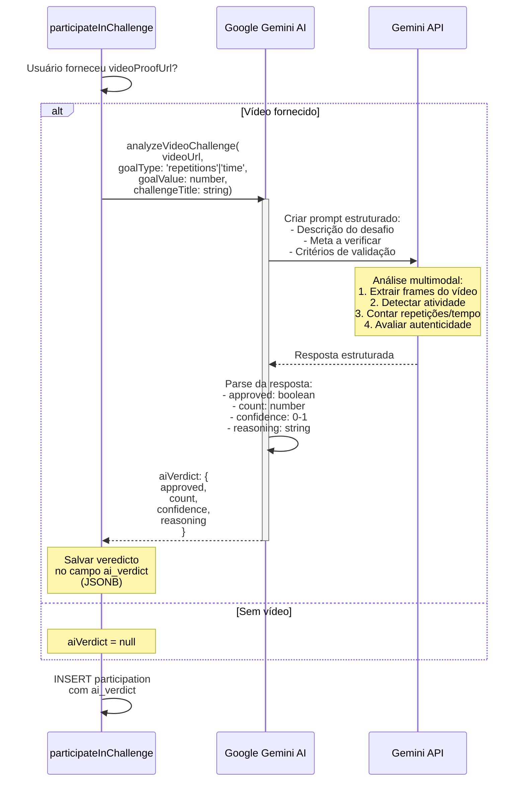
```mermaid
sequenceDiagram
    participant Action as participateInChallenge
    participant Gemini as Google Gemini AI
    participant API as Gemini API

    Action->>Action: Usuário forneceu videoProofUrl?

    alt Vídeo fornecido
        Action->>Gemini: analyzeVideoChallenge(<br/>videoUrl,<br/>goalType: 'repetitions'|'time',<br/>goalValue: number,<br/>challengeTitle: string)

        activate Gemini

        Gemini->>API: Criar prompt estruturado:<br/>- Descrição do desafio<br/>- Meta a verificar<br/>- Critérios de validação

        Note over API: Análise multimodal:<br/>1. Extrair frames do vídeo<br/>2. Detectar atividade<br/>3. Contar repetições/tempo<br/>4. Avaliar autenticidade

        API-->>Gemini: Resposta estruturada

        Gemini->>Gemini: Parse da resposta:<br/>- approved: boolean<br/>- count: number<br/>- confidence: 0-1<br/>- reasoning: string

        Gemini-->>Action: aiVerdict: {<br/>  approved,<br/>  count,<br/>  confidence,<br/>  reasoning<br/>}

        deactivate Gemini

        Note over Action: Salvar veredicto<br/>no campo ai_verdict<br/>(JSONB)
    else Sem vídeo
        Note over Action: aiVerdict = null
    end

    Action->>Action: INSERT participation<br/>com ai_verdict
```

### Estrutura do Veredicto da IA

```typescript
type AIVerdict = {
  approved: boolean;        // IA recomenda aprovação?
  count: number | null;     // Repetições/segundos detectados
  confidence: number;       // Confiança da análise (0-1)
  reasoning: string;        // Explicação da decisão
};
```

### Exemplo de Prompt para IA

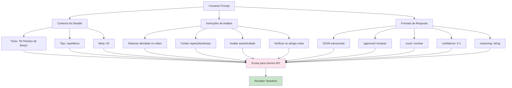
```mermaid
flowchart TB
    A[Construir Prompt] --> B[Contexto do Desafio]

    B --> B1["Título: '50 Flexões de Braço'"]
    B --> B2["Tipo: repetitions"]
    B --> B3["Meta: 50"]

    A --> C[Instruções de Análise]

    C --> C1[Detectar atividade no vídeo]
    C --> C2[Contar repetições/tempo]
    C --> C3[Avaliar autenticidade]
    C --> C4[Verificar se atingiu meta]

    A --> D[Formato de Resposta]

    D --> D1[JSON estruturado]
    D --> D2[approved: boolean]
    D --> D3[count: number]
    D --> D4[confidence: 0-1]
    D --> D5[reasoning: string]

    B1 --> E[Enviar para Gemini API]
    B2 --> E
    B3 --> E
    C1 --> E
    C2 --> E
    C3 --> E
    C4 --> E
    D1 --> E
    D2 --> E
    D3 --> E
    D4 --> E
    D5 --> E

    E --> F[Receber Veredicto]

    style E fill:#fce4ec
    style F fill:#c8e6c9
```

### Uso do Veredicto na Moderação

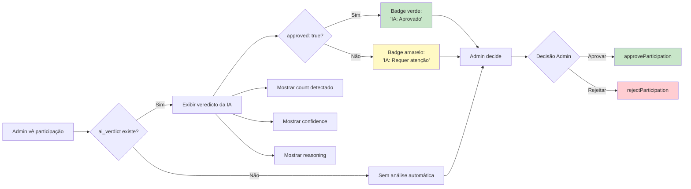
```mermaid
flowchart LR
    A[Admin vê participação] --> B{ai_verdict existe?}

    B -->|Sim| C[Exibir veredicto da IA]
    B -->|Não| D[Sem análise automática]

    C --> C1{approved: true?}
    C1 -->|Sim| C2[Badge verde:<br/>'IA: Aprovado']
    C1 -->|Não| C3[Badge amarelo:<br/>'IA: Requer atenção']

    C --> C4[Mostrar count detectado]
    C --> C5[Mostrar confidence]
    C --> C6[Mostrar reasoning]

    C2 --> E[Admin decide]
    C3 --> E
    D --> E

    E --> F{Decisão Admin}
    F -->|Aprovar| G[approveParticipation]
    F -->|Rejeitar| H[rejectParticipation]

    style C2 fill:#c8e6c9
    style C3 fill:#fff9c4
    style G fill:#c8e6c9
    style H fill:#ffcdd2
```

**Nota Importante:** O veredicto da IA é **consultivo**. A decisão final sempre cabe ao admin, que pode aprovar ou rejeitar independentemente da recomendação da IA.

---

## Fluxo Admin - Moderação de Participações

Admins revisam participações pendentes e aprovam/rejeitam com base nas evidências e no veredicto da IA.

### Fluxo de Aprovação

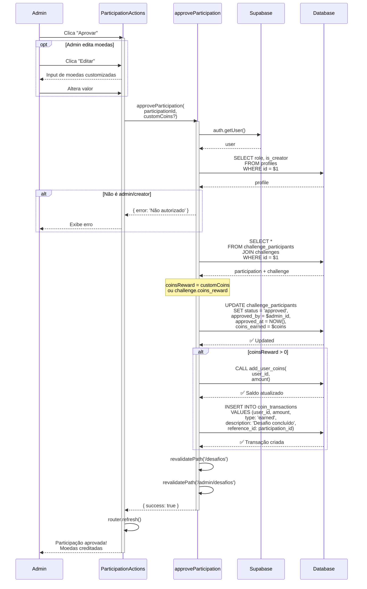
```mermaid
sequenceDiagram
    participant Admin
    participant UI as ParticipationActions
    participant Action as approveParticipation
    participant Supabase
    participant DB as Database

    Admin->>UI: Clica "Aprovar"
    activate UI

    opt Admin edita moedas
        Admin->>UI: Clica "Editar"
        UI-->>Admin: Input de moedas customizadas
        Admin->>UI: Altera valor
    end

    UI->>Action: approveParticipation(<br/>participationId,<br/>customCoins?)
    activate Action

    Action->>Supabase: auth.getUser()
    Supabase-->>Action: user

    Action->>DB: SELECT role, is_creator<br/>FROM profiles<br/>WHERE id = $1
    DB-->>Action: profile

    alt Não é admin/creator
        Action-->>UI: { error: 'Não autorizado' }
        UI-->>Admin: Exibe erro
    end

    Action->>DB: SELECT *<br/>FROM challenge_participants<br/>JOIN challenges<br/>WHERE id = $1
    DB-->>Action: participation + challenge

    Note over Action: coinsReward = customCoins<br/>ou challenge.coins_reward

    Action->>DB: UPDATE challenge_participants<br/>SET status = 'approved',<br/>    approved_by = $admin_id,<br/>    approved_at = NOW(),<br/>    coins_earned = $coins
    DB-->>Action: ✅ Updated

    alt coinsReward > 0
        Action->>DB: CALL add_user_coins(<br/>  user_id,<br/>  amount)
        DB-->>Action: ✅ Saldo atualizado

        Action->>DB: INSERT INTO coin_transactions<br/>VALUES (user_id, amount,<br/>type: 'earned',<br/>description: 'Desafio concluído',<br/>reference_id: participation_id)
        DB-->>Action: ✅ Transação criada
    end

    Action->>Action: revalidatePath('/desafios')
    Action->>Action: revalidatePath('/admin/desafios')

    Action-->>UI: { success: true }
    deactivate Action

    UI->>UI: router.refresh()
    UI-->>Admin: Participação aprovada!<br/>Moedas creditadas
    deactivate UI
```

### Fluxo de Rejeição

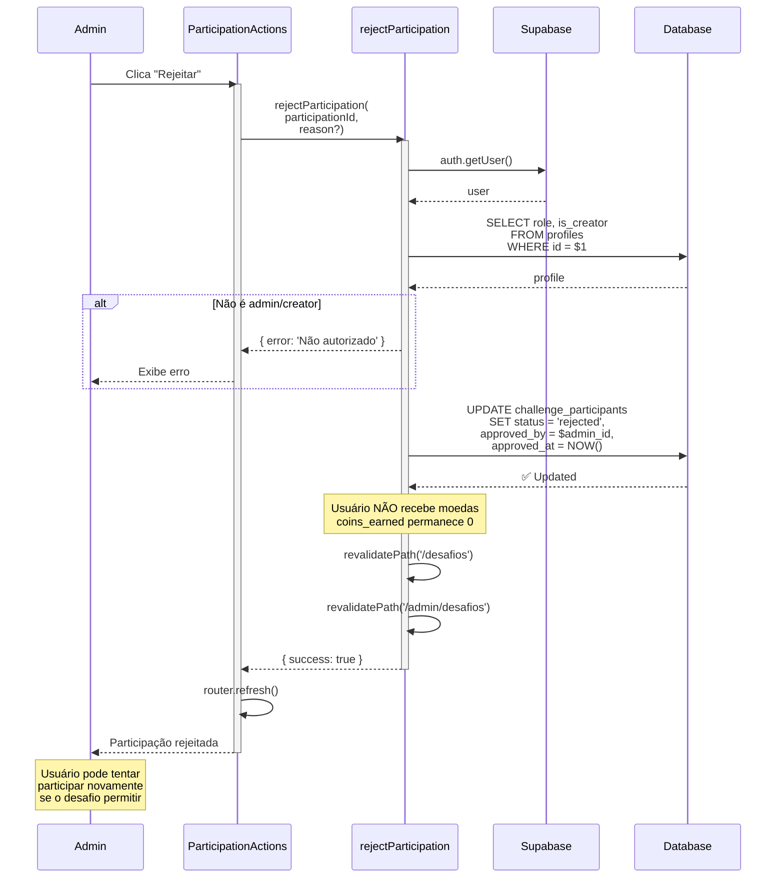
```mermaid
sequenceDiagram
    participant Admin
    participant UI as ParticipationActions
    participant Action as rejectParticipation
    participant Supabase
    participant DB as Database

    Admin->>UI: Clica "Rejeitar"
    activate UI

    UI->>Action: rejectParticipation(<br/>participationId,<br/>reason?)
    activate Action

    Action->>Supabase: auth.getUser()
    Supabase-->>Action: user

    Action->>DB: SELECT role, is_creator<br/>FROM profiles<br/>WHERE id = $1
    DB-->>Action: profile

    alt Não é admin/creator
        Action-->>UI: { error: 'Não autorizado' }
        UI-->>Admin: Exibe erro
    end

    Action->>DB: UPDATE challenge_participants<br/>SET status = 'rejected',<br/>    approved_by = $admin_id,<br/>    approved_at = NOW()
    DB-->>Action: ✅ Updated

    Note over Action: Usuário NÃO recebe moedas<br/>coins_earned permanece 0

    Action->>Action: revalidatePath('/desafios')
    Action->>Action: revalidatePath('/admin/desafios')

    Action-->>UI: { success: true }
    deactivate Action

    UI->>UI: router.refresh()
    UI-->>Admin: Participação rejeitada
    deactivate UI

    Note over Admin: Usuário pode tentar<br/>participar novamente<br/>se o desafio permitir
```

### Painel de Moderação

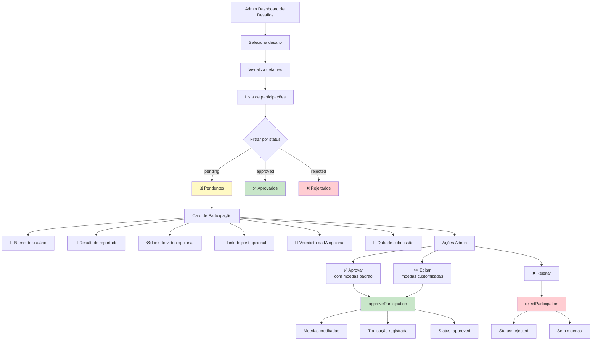
```mermaid
graph TB
    A[Admin Dashboard de Desafios] --> B[Seleciona desafio]

    B --> C[Visualiza detalhes]

    C --> D[Lista de participações]

    D --> E{Filtrar por status}
    E -->|pending| F[⏳ Pendentes]
    E -->|approved| G[✅ Aprovados]
    E -->|rejected| H[❌ Rejeitados]

    F --> I[Card de Participação]

    I --> I1[👤 Nome do usuário]
    I --> I2[🔢 Resultado reportado]
    I --> I3[📹 Link do vídeo opcional]
    I --> I4[📱 Link do post opcional]
    I --> I5[🤖 Veredicto da IA opcional]
    I --> I6[📅 Data de submissão]

    I --> J[Ações Admin]

    J --> J1[✅ Aprovar<br/>com moedas padrão]
    J --> J2[✏️ Editar<br/>moedas customizadas]
    J --> J3[❌ Rejeitar]

    J1 --> K[approveParticipation]
    J2 --> K
    J3 --> L[rejectParticipation]

    K --> M[Moedas creditadas]
    K --> N[Transação registrada]
    K --> O[Status: approved]

    L --> P[Status: rejected]
    L --> Q[Sem moedas]

    style F fill:#fff9c4
    style G fill:#c8e6c9
    style H fill:#ffcdd2
    style K fill:#c8e6c9
    style L fill:#ffcdd2
```

### Código: Aprovação de Participação

```typescript
// src/actions/challenges.ts
export async function approveParticipation(
  participationId: string,
  customCoins?: number
): Promise<ActionResponse> {
  try {
    const supabase = await createClient();

    const { data: { user } } = await supabase.auth.getUser();
    if (!user) {
      return { error: 'Usuario nao autenticado' };
    }

    // Verificar se é admin/creator
    const { data: profile } = await supabase
      .from('profiles')
      .select('role, is_creator')
      .eq('id', user.id)
      .single();

    if (!profile || (profile.role !== 'admin' && !profile.is_creator)) {
      return { error: 'Acesso nao autorizado' };
    }

    // Buscar participação e desafio
    const { data: participation } = await supabase
      .from('challenge_participants')
      .select('*, challenges(coins_reward)')
      .eq('id', participationId)
      .single();

    if (!participation) {
      return { error: 'Participacao nao encontrada' };
    }

    const coinsReward = customCoins !== undefined
      ? customCoins
      : ((participation as any).challenges?.coins_reward || 0);

    // Aprovar participação
    const { error: updateError } = await supabase
      .from('challenge_participants')
      .update({
        status: 'approved',
        approved_by: user.id,
        approved_at: new Date().toISOString(),
        coins_earned: coinsReward,
      })
      .eq('id', participationId);

    if (updateError) {
      return { error: 'Erro ao aprovar participacao' };
    }

    // Adicionar moedas ao usuário
    if (coinsReward > 0) {
      // Atualizar saldo
      const { error: coinsError } = await supabase.rpc('add_user_coins', {
        p_user_id: participation.user_id,
        p_amount: coinsReward,
      });

      // Fallback se a função RPC não existir
      if (coinsError) {
        await supabase
          .from('user_coins')
          .update({
            balance: supabase.rpc('increment', { amount: coinsReward }),
            updated_at: new Date().toISOString(),
          })
          .eq('user_id', participation.user_id);
      }

      // Registrar transação
      await supabase
        .from('coin_transactions')
        .insert({
          user_id: participation.user_id,
          amount: coinsReward,
          type: 'earned',
          description: `Desafio concluido`,
          reference_id: participationId,
        });
    }

    revalidatePath('/desafios');
    revalidatePath('/admin/desafios');
    return { success: true };
  } catch {
    return { error: 'Erro interno do servidor' };
  }
}
```

### Código: Rejeição de Participação

```typescript
// src/actions/challenges.ts
export async function rejectParticipation(
  participationId: string,
  reason?: string
): Promise<ActionResponse> {
  try {
    const supabase = await createClient();

    const { data: { user } } = await supabase.auth.getUser();
    if (!user) {
      return { error: 'Usuario nao autenticado' };
    }

    // Verificar se é admin/creator
    const { data: profile } = await supabase
      .from('profiles')
      .select('role, is_creator')
      .eq('id', user.id)
      .single();

    if (!profile || (profile.role !== 'admin' && !profile.is_creator)) {
      return { error: 'Acesso nao autorizado' };
    }

    const { error } = await supabase
      .from('challenge_participants')
      .update({
        status: 'rejected',
        approved_by: user.id,
        approved_at: new Date().toISOString(),
      })
      .eq('id', participationId);

    if (error) {
      return { error: 'Erro ao rejeitar participacao' };
    }

    revalidatePath('/desafios');
    revalidatePath('/admin/desafios');
    return { success: true };
  } catch {
    return { error: 'Erro interno do servidor' };
  }
}
```

---

## Seleção de Vencedores

Para desafios do tipo "engajamento" ou "participe", admins registram manualmente os vencedores do sorteio.

### Fluxo de Registro de Vencedor

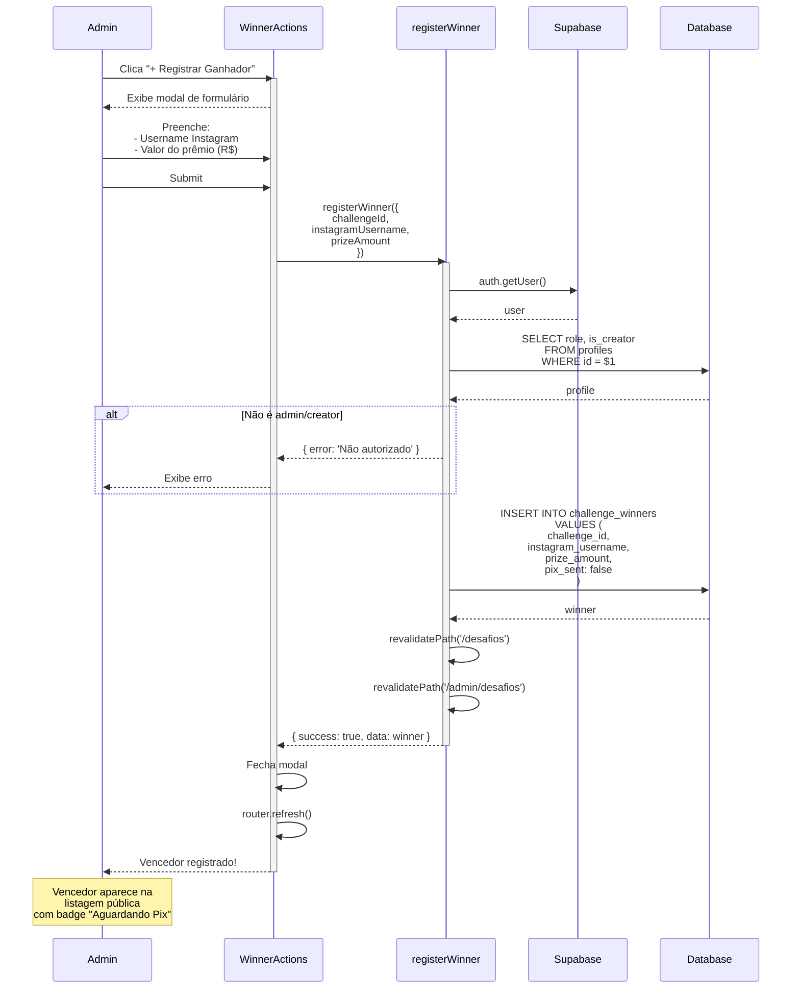
```mermaid
sequenceDiagram
    participant Admin
    participant UI as WinnerActions
    participant Action as registerWinner
    participant Supabase
    participant DB as Database

    Admin->>UI: Clica "+ Registrar Ganhador"
    activate UI
    UI-->>Admin: Exibe modal de formulário

    Admin->>UI: Preenche:<br/>- Username Instagram<br/>- Valor do prêmio (R$)
    Admin->>UI: Submit

    UI->>Action: registerWinner({<br/>  challengeId,<br/>  instagramUsername,<br/>  prizeAmount<br/>})
    activate Action

    Action->>Supabase: auth.getUser()
    Supabase-->>Action: user

    Action->>DB: SELECT role, is_creator<br/>FROM profiles<br/>WHERE id = $1
    DB-->>Action: profile

    alt Não é admin/creator
        Action-->>UI: { error: 'Não autorizado' }
        UI-->>Admin: Exibe erro
    end

    Action->>DB: INSERT INTO challenge_winners<br/>VALUES (<br/>  challenge_id,<br/>  instagram_username,<br/>  prize_amount,<br/>  pix_sent: false<br/>)
    DB-->>Action: winner

    Action->>Action: revalidatePath('/desafios')
    Action->>Action: revalidatePath('/admin/desafios')

    Action-->>UI: { success: true, data: winner }
    deactivate Action

    UI->>UI: Fecha modal
    UI->>UI: router.refresh()
    UI-->>Admin: Vencedor registrado!
    deactivate UI

    Note over Admin: Vencedor aparece na<br/>listagem pública<br/>com badge "Aguardando Pix"
```

### Fluxo de Pagamento de Prêmio

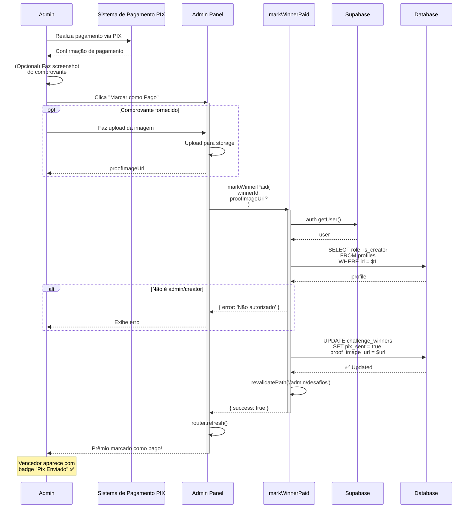
```mermaid
sequenceDiagram
    participant Admin
    participant PIX as Sistema de Pagamento PIX
    participant UI as Admin Panel
    participant Action as markWinnerPaid
    participant Supabase
    participant DB as Database

    Admin->>PIX: Realiza pagamento via PIX
    PIX-->>Admin: Confirmação de pagamento

    Admin->>Admin: (Opcional) Faz screenshot<br/>do comprovante

    Admin->>UI: Clica "Marcar como Pago"
    activate UI

    opt Comprovante fornecido
        Admin->>UI: Faz upload da imagem
        UI->>UI: Upload para storage
        UI-->>Admin: proofImageUrl
    end

    UI->>Action: markWinnerPaid(<br/>  winnerId,<br/>  proofImageUrl?<br/>)
    activate Action

    Action->>Supabase: auth.getUser()
    Supabase-->>Action: user

    Action->>DB: SELECT role, is_creator<br/>FROM profiles<br/>WHERE id = $1
    DB-->>Action: profile

    alt Não é admin/creator
        Action-->>UI: { error: 'Não autorizado' }
        UI-->>Admin: Exibe erro
    end

    Action->>DB: UPDATE challenge_winners<br/>SET pix_sent = true,<br/>    proof_image_url = $url
    DB-->>Action: ✅ Updated

    Action->>Action: revalidatePath('/admin/desafios')

    Action-->>UI: { success: true }
    deactivate Action

    UI->>UI: router.refresh()
    UI-->>Admin: Prêmio marcado como pago!
    deactivate UI

    Note over Admin: Vencedor aparece com<br/>badge "Pix Enviado" ✅
```

### Estados de um Vencedor

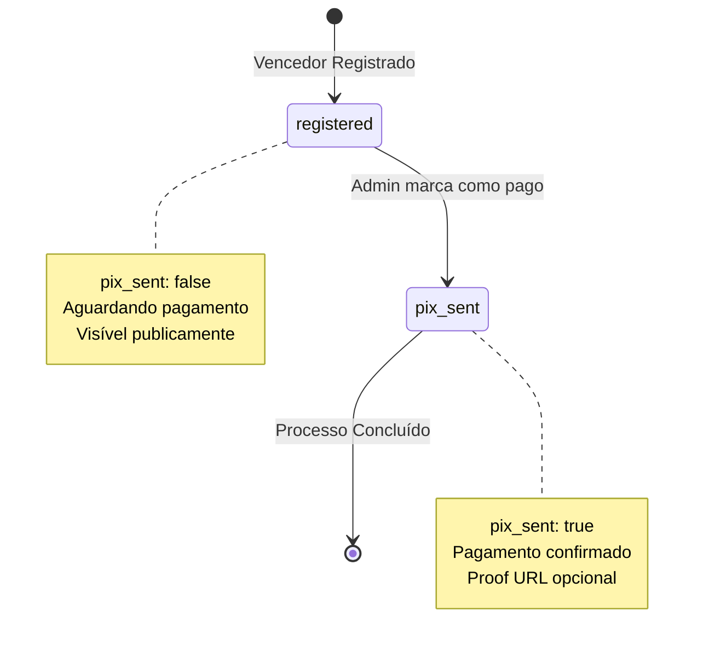
```mermaid
stateDiagram-v2
    [*] --> registered: Vencedor Registrado
    registered --> pix_sent: Admin marca como pago
    pix_sent --> [*]: Processo Concluído

    note right of registered
        pix_sent: false
        Aguardando pagamento
        Visível publicamente
    end note

    note right of pix_sent
        pix_sent: true
        Pagamento confirmado
        Proof URL opcional
    end note
```

### Exibição de Vencedores

```mermaid
flowchart TB
    A[Página de Desafios] --> B{Desafio tem vencedores?}

    B -->|Sim| C[Seção 🏆 Ganhadores]
    B -->|Não| D[Aguardando seleção...]

    C --> E[Card de Vencedor]

    E --> E1[🎉 Emoji]
    E --> E2[@instagram_username]
    E --> E3[R$ prize_amount]
    E --> E4{pix_sent?}

    E4 -->|true| F[✅ Badge: Pix enviado]
    E4 -->|false| G[⏳ Badge: Aguardando]

    style F fill:#c8e6c9
    style G fill:#fff9c4
```

### Código: Registro de Vencedor

```typescript
// src/actions/challenges.ts
export async function registerWinner(data: {
  challengeId: string;
  userId?: string;
  instagramUsername?: string;
  prizeAmount?: number;
}): Promise<ActionResponse> {
  try {
    const supabase = await createClient();

    const { data: { user } } = await supabase.auth.getUser();
    if (!user) {
      return { error: 'Usuario nao autenticado' };
    }

    // Verificar se é admin/creator
    const { data: profile } = await supabase
      .from('profiles')
      .select('role, is_creator')
      .eq('id', user.id)
      .single();

    if (!profile || (profile.role !== 'admin' && !profile.is_creator)) {
      return { error: 'Acesso nao autorizado' };
    }

    const { data: winner, error } = await supabase
      .from('challenge_winners')
      .insert({
        challenge_id: data.challengeId,
        user_id: data.userId || null,
        instagram_username: data.instagramUsername || null,
        prize_amount: data.prizeAmount || null,
        pix_sent: false,
      })
      .select()
      .single();

    if (error) {
      return { error: 'Erro ao registrar ganhador' };
    }

    revalidatePath('/desafios');
    revalidatePath('/admin/desafios');
    return { success: true, data: winner };
  } catch {
    return { error: 'Erro interno do servidor' };
  }
}
```

### Código: Marcar Prêmio como Pago

```typescript
// src/actions/challenges.ts
export async function markPrizeSent(
  winnerId: string,
  proofImageUrl?: string
): Promise<ActionResponse> {
  try {
    const supabase = await createClient();

    const { data: { user } } = await supabase.auth.getUser();
    if (!user) {
      return { error: 'Usuario nao autenticado' };
    }

    // Verificar se é admin/creator
    const { data: profile } = await supabase
      .from('profiles')
      .select('role, is_creator')
      .eq('id', user.id)
      .single();

    if (!profile || (profile.role !== 'admin' && !profile.is_creator)) {
      return { error: 'Acesso nao autorizado' };
    }

    const { error } = await supabase
      .from('challenge_winners')
      .update({
        pix_sent: true,
        proof_image_url: proofImageUrl || null,
      })
      .eq('id', winnerId);

    if (error) {
      return { error: 'Erro ao marcar premio como enviado' };
    }

    revalidatePath('/admin/desafios');
    return { success: true };
  } catch {
    return { error: 'Erro interno do servidor' };
  }
}
```

---

## Sistema de Recompensas

O sistema oferece dois tipos de recompensas: moedas virtuais (corações) e prêmios em dinheiro (PIX).

### Arquitetura do Sistema de Moedas

```mermaid
graph TB
    subgraph "Recompensas por Desafios"
        A[Participação Aprovada]

        A --> B{Tipo de Recompensa}

        B -->|Sempre| C[💰 Moedas Corações]
        B -->|Opcional| D[💵 Prêmio em Dinheiro]

        C --> C1[Crédito em user_coins]
        C --> C2[Registro em coin_transactions]
        C --> C3[Revalidação de cache]

        D --> D1[Registro em challenge_winners]
        D --> D2[Pagamento via PIX]
        D --> D3[Comprovante opcional]
    end

    subgraph "Tabelas Envolvidas"
        E[(user_coins<br/>balance)]
        F[(coin_transactions<br/>histórico)]
        G[(challenge_winners<br/>prêmios)]
    end

    C1 --> E
    C2 --> F
    D1 --> G

    style C fill:#c8e6c9
    style D fill:#fff9c4
```

### Fluxo de Crédito de Moedas

```mermaid
sequenceDiagram
    participant Action as approveParticipation
    participant RPC as add_user_coins RPC
    participant UserCoins as user_coins table
    participant Transactions as coin_transactions table

    Note over Action: Participação aprovada<br/>coinsReward = 50

    alt coinsReward > 0
        Action->>RPC: add_user_coins(<br/>  user_id,<br/>  amount: 50<br/>)

        activate RPC
        RPC->>UserCoins: UPDATE user_coins<br/>SET balance = balance + 50,<br/>    updated_at = NOW()<br/>WHERE user_id = $1
        UserCoins-->>RPC: ✅ Balance updated
        deactivate RPC

        RPC-->>Action: Success

        alt RPC não existe (fallback)
            Action->>UserCoins: UPDATE user_coins<br/>SET balance = balance + 50<br/>WHERE user_id = $1
            UserCoins-->>Action: ✅ Updated
        end

        Action->>Transactions: INSERT INTO coin_transactions<br/>VALUES (<br/>  user_id,<br/>  amount: 50,<br/>  type: 'earned',<br/>  description: 'Desafio concluído',<br/>  reference_id: participation_id<br/>)
        Transactions-->>Action: ✅ Transaction logged

        Note over Action: Usuário recebeu 50 corações!
    end
```

### Estrutura de Dados - Moedas

```mermaid
erDiagram
    USER_COINS {
        uuid user_id PK
        int balance "Saldo atual"
        timestamp created_at
        timestamp updated_at
    }

    COIN_TRANSACTIONS {
        uuid id PK
        uuid user_id FK
        int amount "Quantidade (+ ou -)"
        string type "earned, spent, bonus"
        string description "Descrição da transação"
        uuid reference_id "ID da participação/compra"
        timestamp created_at
    }

    CHALLENGE_PARTICIPANTS {
        uuid id PK
        int coins_earned "Moedas ganhas (0 até aprovação)"
        string status "pending, approved, rejected"
    }

    USER_COINS ||--o{ COIN_TRANSACTIONS : "histórico"
    CHALLENGE_PARTICIPANTS ||--o| COIN_TRANSACTIONS : "referencia"
```

### Tipos de Transações

```mermaid
flowchart LR
    A[Transações de Moedas] --> B{Tipo}

    B -->|earned| C[💰 Ganho]
    B -->|spent| D[🛍️ Gasto]
    B -->|bonus| E[🎁 Bônus]

    C --> C1[Participação em desafio aprovada]
    C --> C2[Evento completado]
    C --> C3[Post aprovado]

    D --> D1[Resgate de recompensa]
    D --> D2[Compra na loja]

    E --> E1[Bônus de cadastro]
    E --> E2[Promoção especial]
    E --> E3[Programa de referência]

    style C fill:#c8e6c9
    style D fill:#ffcdd2
    style E fill:#fff9c4
```

### Visualização de Saldo

```typescript
// Exemplo de query para buscar saldo e histórico
const { data: userCoins } = await supabase
  .from('user_coins')
  .select('balance')
  .eq('user_id', user.id)
  .single();

const balance = userCoins?.balance || 0;

// Histórico de transações
const { data: transactions } = await supabase
  .from('coin_transactions')
  .select('*')
  .eq('user_id', user.id)
  .order('created_at', { ascending: false })
  .limit(50);
```

### Moedas Customizadas por Admin

Admins podem alterar a quantidade de moedas ao aprovar uma participação:

```mermaid
flowchart TB
    A[Admin revisa participação] --> B{Desempenho excepcional?}

    B -->|Sim| C[Clica 'Editar']
    B -->|Não| D[Usa recompensa padrão]

    C --> E[Input de moedas customizadas]
    E --> F[Define valor maior/menor]
    F --> G[Aprova com valor custom]

    D --> H[Aprova com coins_reward padrão]

    G --> I[approveParticipation<br/>customCoins]
    H --> I

    I --> J[Moedas creditadas]

    style C fill:#fff9c4
    style F fill:#fff9c4
    style J fill:#c8e6c9
```

---

## Fluxo Admin - Gestão de Desafios

Admins criam, editam, ativam/desativam e encerram desafios.

### Fluxo de Criação de Desafio

```mermaid
sequenceDiagram
    participant Admin
    participant UI as Create Challenge Form
    participant Action as createChallenge
    participant Supabase
    participant DB as Database

    Admin->>UI: Acessa /admin/desafios/novo
    activate UI
    UI-->>Admin: Exibe formulário

    Admin->>UI: Seleciona tipo de desafio:<br/>fisico, engajamento ou participe

    alt Tipo: Físico
        UI-->>Admin: Campos:<br/>- goal_type (repetições/tempo)<br/>- goal_value<br/>- record_video_url<br/>- hashtag<br/>- profile_to_tag
    else Tipo: Engajamento/Participe
        UI-->>Admin: Campos:<br/>- instagram_embed_url<br/>- prize_amount<br/>- num_winners
    end

    Admin->>UI: Preenche campos comuns:<br/>- title<br/>- description<br/>- icon<br/>- coins_reward<br/>- starts_at/ends_at

    Admin->>UI: Submit

    UI->>Action: createChallenge(data)
    activate Action

    Action->>Supabase: auth.getUser()
    Supabase-->>Action: user

    Action->>DB: SELECT role, is_creator<br/>FROM profiles<br/>WHERE id = $1
    DB-->>Action: profile

    alt Não é admin/creator
        Action-->>UI: { error: 'Não autorizado' }
        UI-->>Admin: Exibe erro
    end

    Action->>DB: INSERT INTO challenges<br/>VALUES (<br/>  title, description, type,<br/>  icon, is_active: true,<br/>  status: 'active',<br/>  coins_reward,<br/>  ... campos específicos do tipo<br/>)
    DB-->>Action: challenge

    Action->>Action: revalidatePath('/desafios')
    Action->>Action: revalidatePath('/admin/desafios')

    Action-->>UI: { success: true, data: challenge }
    deactivate Action

    UI->>UI: Redireciona para /admin/desafios
    UI-->>Admin: Desafio criado com sucesso!
    deactivate UI
```

### Campos por Tipo de Desafio

```mermaid
graph TB
    A[Campos Comuns] --> A1[title *]
    A --> A2[description]
    A --> A3[type * <br/>fisico/engajamento/participe]
    A --> A4[icon]
    A --> A5[coins_reward *]
    A --> A6[starts_at]
    A --> A7[ends_at]

    B[Tipo: Físico] --> B1[goal_type *<br/>repetitions/time]
    B --> B2[goal_value *]
    B --> B3[record_video_url]
    B --> B4[hashtag]
    B --> B5[profile_to_tag]

    C[Tipo: Engajamento/Participe] --> C1[instagram_embed_url *]
    C --> C2[prize_amount]
    C --> C3[num_winners]

    style A fill:#e3f2fd
    style B fill:#fff3e0
    style C fill:#f3e5f5
```

### Gestão de Status

```mermaid
stateDiagram-v2
    [*] --> active: Criado
    active --> inactive: toggleChallengeActive(false)
    inactive --> active: toggleChallengeActive(true)
    active --> closed: closeChallenge()
    inactive --> closed: closeChallenge()
    closed --> [*]: Finalizado

    note right of active
        is_active: true
        status: 'active'
        Visível para usuários
        Aceita participações
    end note

    note right of inactive
        is_active: false
        status: 'active'
        Oculto para usuários
        Não aceita participações
    end note

    note right of closed
        status: 'closed'
        Desafio encerrado
        Não aceita novas participações
        Participações antigas preservadas
    end note
```

### Painel de Gestão Admin

```mermaid
flowchart TB
    A[Admin Desafios] --> B{Visualização}

    B --> C[🟢 Desafios Ativos]
    B --> D[⚪ Desafios Inativos]

    C --> E[ChallengeAdminCard]
    D --> E

    E --> E1[📊 Estatísticas:<br/>- Total participantes<br/>- Pendentes<br/>- Aprovados<br/>- Ganhadores]

    E --> F[Clica no card]

    F --> G[Página de Detalhes]

    G --> G1[Informações do Desafio]
    G --> G2[Lista de Participações]
    G --> G3[Lista de Vencedores]
    G --> G4[Ações de Gestão]

    G4 --> H1[🔄 Ativar/Desativar]
    G4 --> H2[🔒 Encerrar]
    G4 --> H3[🏆 Registrar Vencedor]
    G4 --> H4[✅ Aprovar Participações]
    G4 --> H5[❌ Rejeitar Participações]

    style C fill:#c8e6c9
    style D fill:#e0e0e0
```

### Código: Criação de Desafio

```typescript
// src/actions/challenges.ts
export async function createChallenge(data: {
  title: string;
  description?: string | null;
  type: 'engajamento' | 'fisico' | 'participe';
  icon?: string;
  coins_reward: number;
  // Para engajamento/participe
  instagram_embed_url?: string | null;
  prize_amount?: number | null;
  num_winners?: number | null;
  // Para físico
  goal_type?: 'repetitions' | 'time' | null;
  goal_value?: number | null;
  record_video_url?: string | null;
  hashtag?: string | null;
  profile_to_tag?: string | null;
  // Controle
  starts_at?: string | null;
  ends_at?: string | null;
}): Promise<ActionResponse> {
  try {
    const supabase = await createClient();

    const { data: { user } } = await supabase.auth.getUser();
    if (!user) {
      return { error: 'Usuario nao autenticado' };
    }

    // Verificar se é admin/creator
    const { data: profile } = await supabase
      .from('profiles')
      .select('role, is_creator')
      .eq('id', user.id)
      .single();

    if (!profile || (profile.role !== 'admin' && !profile.is_creator)) {
      return { error: 'Acesso nao autorizado' };
    }

    const { data: challenge, error } = await supabase
      .from('challenges')
      .insert({
        title: data.title,
        description: data.description || null,
        type: data.type,
        icon: data.icon || '🎯',
        is_active: true,
        status: 'active',
        coins_reward: data.coins_reward || 0,
        // Engajamento/Participe
        instagram_embed_url: data.instagram_embed_url || null,
        prize_amount: data.prize_amount || null,
        num_winners: data.num_winners || 1,
        // Físico
        goal_type: data.goal_type || null,
        goal_value: data.goal_value || null,
        record_video_url: data.record_video_url || null,
        hashtag: data.hashtag || null,
        profile_to_tag: data.profile_to_tag || null,
        // Controle
        starts_at: data.starts_at || null,
        ends_at: data.ends_at || null,
      })
      .select()
      .single();

    if (error) {
      console.error('Error creating challenge:', error);
      return { error: 'Erro ao criar desafio' };
    }

    revalidatePath('/desafios');
    revalidatePath('/admin/desafios');
    return { success: true, data: challenge };
  } catch {
    return { error: 'Erro interno do servidor' };
  }
}
```

### Código: Toggle Active

```typescript
// src/actions/challenges.ts
export async function toggleChallengeActive(
  challengeId: string,
  isActive: boolean
): Promise<ActionResponse> {
  try {
    const supabase = await createClient();

    const { data: { user } } = await supabase.auth.getUser();
    if (!user) {
      return { error: 'Usuario nao autenticado' };
    }

    // Verificar se é admin/creator
    const { data: profile } = await supabase
      .from('profiles')
      .select('role, is_creator')
      .eq('id', user.id)
      .single();

    if (!profile || (profile.role !== 'admin' && !profile.is_creator)) {
      return { error: 'Acesso nao autorizado' };
    }

    const { error } = await supabase
      .from('challenges')
      .update({ is_active: isActive })
      .eq('id', challengeId);

    if (error) {
      return { error: 'Erro ao atualizar desafio' };
    }

    revalidatePath('/desafios');
    revalidatePath('/admin/desafios');
    return { success: true };
  } catch {
    return { error: 'Erro interno do servidor' };
  }
}
```

---

## Fluxo Completo de Dados

Visão consolidada mostrando todas as camadas e interações do sistema de desafios.

### Arquitetura Completa

```mermaid
graph TB
    subgraph "Client Layer - Usuários"
        A1[PhysicalChallengeCard]
        A2[ChallengeParticipationModal]
        A3[DesafiosPage]
        A4[ChallengeRanking]
    end

    subgraph "Client Layer - Admin"
        B1[AdminDesafiosPage]
        B2[ChallengeDetailsPage]
        B3[ParticipationActions]
        B4[WinnerActions]
        B5[CreateChallengeForm]
    end

    subgraph "Server Actions - Usuário"
        C1[participateInChallenge]
        C2[updateParticipation]
    end

    subgraph "Server Actions - Admin"
        D1[approveParticipation]
        D2[rejectParticipation]
        D3[registerWinner]
        D4[markWinnerPaid]
        D5[createChallenge]
        D6[toggleChallengeActive]
        D7[closeChallenge]
    end

    subgraph "External Services"
        E1[Google Gemini AI]
    end

    subgraph "Server Components"
        F1[DesafiosPage SSR]
        F2[AdminDesafiosPage SSR]
        F3[ChallengeDetailsPage SSR]
    end

    subgraph "Supabase Database"
        G1[(challenges)]
        G2[(challenge_participants)]
        G3[(challenge_winners)]
        G4[(user_coins)]
        G5[(coin_transactions)]
        G6[(profiles)]
    end

    subgraph "Row Level Security"
        H1[RLS Policies]
    end

    A1 --> A2
    A2 --> C1
    A3 --> F1

    B3 --> D1
    B3 --> D2
    B4 --> D3
    B4 --> D4
    B5 --> D5
    B2 --> D6
    B2 --> D7

    C1 --> E1
    E1 --> C1

    C1 --> G2
    C2 --> G2
    D1 --> G2
    D1 --> G4
    D1 --> G5
    D2 --> G2
    D3 --> G3
    D4 --> G3
    D5 --> G1
    D6 --> G1
    D7 --> G1

    F1 --> G1
    F1 --> G2
    F1 --> G3
    F1 --> G4
    F2 --> G1
    F2 --> G2
    F2 --> G3
    F3 --> G1
    F3 --> G2
    F3 --> G3

    G1 --> H1
    G2 --> H1
    G3 --> H1
    G4 --> H1
    G5 --> H1
    G6 --> H1

    style E1 fill:#fce4ec
    style D1 fill:#c8e6c9
    style D2 fill:#ffcdd2
    style H1 fill:#e1f5fe
```

### Timeline do Ciclo de Vida Completo

```mermaid
gantt
    title Ciclo de Vida Completo de um Desafio
    dateFormat X
    axisFormat %s

    section Admin
    Criar desafio                    :done, create, 0, 1s
    Publicar (is_active: true)       :done, publish, 1s, 2s

    section Usuário
    Visualizar desafios              :done, view, 2s, 3s
    Participar (enviar evidências)   :done, participate, 3s, 5s

    section IA
    Analisar vídeo (Gemini)          :done, ai, 4s, 6s
    Gerar veredicto                  :done, verdict, 6s, 7s

    section Database
    Criar participação (pending)     :done, insert, 5s, 6s

    section Admin
    Revisar participação             :active, review, 7s, 9s
    Aprovar participação             :done, approve, 9s, 10s

    section Recompensas
    Creditar moedas                  :done, coins, 10s, 11s
    Registrar transação              :done, transaction, 11s, 12s
    Registrar vencedor (se sorteio)  :done, winner, 12s, 13s
    Pagamento PIX                    :crit, pix, 13s, 15s
    Marcar como pago                 :done, paid, 15s, 16s

    section Usuário
    Ver saldo atualizado             :done, balance, 12s, 17s

    section Admin
    Encerrar desafio                 :milestone, close, 17s, 17s
```

### Fluxo de Dados Integrado

```mermaid
sequenceDiagram
    participant U as Usuário
    participant UI as Interface
    participant SA as Server Action
    participant AI as Gemini AI
    participant DB as Supabase
    participant A as Admin

    Note over A: 1. Admin cria desafio
    A->>DB: createChallenge()
    DB-->>A: Desafio criado (ativo)

    Note over U: 2. Usuário vê desafio
    U->>UI: Acessa /desafios
    UI->>DB: SELECT challenges<br/>WHERE is_active = true
    DB-->>UI: Lista de desafios

    Note over U: 3. Usuário participa
    U->>UI: Preenche formulário
    UI->>SA: participateInChallenge()

    par Validações paralelas
        SA->>DB: Verificar desafio ativo
        SA->>DB: Verificar participação prévia
    end

    opt Vídeo fornecido
        SA->>AI: Analisar vídeo
        AI-->>SA: Veredicto da IA
    end

    SA->>DB: INSERT participation<br/>(status: pending)
    DB-->>U: Participação registrada

    Note over A: 4. Admin modera
    A->>DB: SELECT participações pendentes
    DB-->>A: Lista de participações
    A->>A: Revisa evidências + IA

    alt Aprovado
        A->>SA: approveParticipation()
        SA->>DB: UPDATE status = approved
        SA->>DB: ADD user_coins
        SA->>DB: INSERT coin_transaction
        DB-->>U: ✅ Moedas creditadas!
    else Rejeitado
        A->>SA: rejectParticipation()
        SA->>DB: UPDATE status = rejected
        DB-->>U: ❌ Tente novamente
    end

    opt Desafio com sorteio
        Note over A: 5. Admin registra vencedor
        A->>SA: registerWinner()
        SA->>DB: INSERT challenge_winner
        DB-->>U: 🏆 Visível no desafio

        Note over A: 6. Admin paga prêmio
        A->>A: Realiza PIX
        A->>SA: markWinnerPaid()
        SA->>DB: UPDATE pix_sent = true
        DB-->>U: ✅ Pix enviado
    end

    Note over U: 7. Usuário vê saldo
    U->>DB: SELECT user_coins
    DB-->>U: Balance atualizado
```

### Diagrama de Estados Consolidado

```mermaid
stateDiagram-v2
    [*] --> ChallengeCreated: Admin cria

    ChallengeCreated --> Active: is_active: true
    ChallengeCreated --> Inactive: is_active: false

    Active --> UserParticipates: Usuário participa
    Inactive --> Active: Admin ativa
    Active --> Inactive: Admin desativa

    UserParticipates --> AIAnalysis: Vídeo fornecido
    UserParticipates --> ParticipationPending: Sem vídeo
    AIAnalysis --> ParticipationPending: Veredicto gerado

    ParticipationPending --> AdminReview: Admin vê participação

    AdminReview --> Approved: Admin aprova
    AdminReview --> Rejected: Admin rejeita

    Approved --> CoinsCredited: Moedas adicionadas
    CoinsCredited --> TransactionLogged: Transação registrada

    TransactionLogged --> UserBalance: Saldo atualizado

    Rejected --> UserRetry: Usuário pode tentar novamente
    UserRetry --> UserParticipates: Nova tentativa

    Active --> WinnerSelection: Desafio de sorteio
    WinnerSelection --> WinnerRegistered: Admin registra
    WinnerRegistered --> PixPending: pix_sent: false
    PixPending --> PixSent: Admin marca pago

    Active --> ChallengeClosed: Admin encerra
    Inactive --> ChallengeClosed: Admin encerra
    ChallengeClosed --> [*]: Finalizado

    note right of AIAnalysis
        Google Gemini
        Análise de vídeo
        Veredicto consultivo
    end note

    note right of Approved
        - Moedas creditadas
        - Transação registrada
        - Cache revalidado
    end note

    note right of WinnerRegistered
        - Visível publicamente
        - Aguardando pagamento
    end note
```

### Diagrama ERD Completo

```mermaid
erDiagram
    CHALLENGES {
        uuid id PK
        string title
        text description
        string type "fisico, engajamento, participe"
        string icon
        boolean is_active
        string status "active, closed"
        int coins_reward
        string instagram_embed_url "para engajamento"
        decimal prize_amount "para sorteio"
        int num_winners "para sorteio"
        string goal_type "repetitions, time (físico)"
        int goal_value "meta (físico)"
        string record_video_url "físico"
        string hashtag "físico"
        string profile_to_tag "físico"
        timestamp starts_at
        timestamp ends_at
        timestamp created_at
        timestamp updated_at
    }

    CHALLENGE_PARTICIPANTS {
        uuid id PK
        uuid challenge_id FK
        uuid user_id FK
        int result_value "Resultado reportado"
        string video_proof_url
        string social_media_url
        jsonb ai_verdict "Veredicto da IA"
        string status "pending, approved, rejected"
        int coins_earned
        uuid approved_by FK
        timestamp approved_at
        timestamp created_at
    }

    CHALLENGE_WINNERS {
        uuid id PK
        uuid challenge_id FK
        uuid user_id FK "Opcional"
        string instagram_username
        decimal prize_amount
        boolean pix_sent
        string proof_image_url
        timestamp created_at
    }

    USER_COINS {
        uuid user_id PK
        int balance
        timestamp created_at
        timestamp updated_at
    }

    COIN_TRANSACTIONS {
        uuid id PK
        uuid user_id FK
        int amount
        string type "earned, spent, bonus"
        text description
        uuid reference_id "participation_id"
        timestamp created_at
    }

    PROFILES {
        uuid id PK
        string role "admin, advocate"
        boolean is_creator
        string email
        string full_name
        string instagram_username
    }

    CHALLENGES ||--o{ CHALLENGE_PARTICIPANTS : "tem"
    CHALLENGES ||--o{ CHALLENGE_WINNERS : "tem"
    PROFILES ||--o{ CHALLENGE_PARTICIPANTS : "participa"
    PROFILES ||--o{ CHALLENGE_WINNERS : "ganhou"
    PROFILES ||--|| USER_COINS : "possui"
    PROFILES ||--o{ COIN_TRANSACTIONS : "transaciona"
    CHALLENGE_PARTICIPANTS ||--o| COIN_TRANSACTIONS : "referencia"
```

---

## Políticas RLS

Todas as tabelas relacionadas a desafios possuem Row Level Security para garantir que apenas usuários autorizados possam realizar operações específicas.

### RLS: challenges

```sql
-- Leitura: Todos podem ver desafios ativos
CREATE POLICY "Public can view active challenges"
ON challenges FOR SELECT
USING (is_active = true);

-- Admin pode ver todos
CREATE POLICY "Admin can view all challenges"
ON challenges FOR SELECT
USING (
  auth.uid() IN (
    SELECT id FROM profiles
    WHERE role = 'admin' OR is_creator = true
  )
);

-- Inserção: Apenas admin
CREATE POLICY "Only admin can insert challenges"
ON challenges FOR INSERT
WITH CHECK (
  auth.uid() IN (
    SELECT id FROM profiles
    WHERE role = 'admin' OR is_creator = true
  )
);

-- Atualização: Apenas admin
CREATE POLICY "Only admin can update challenges"
ON challenges FOR UPDATE
USING (
  auth.uid() IN (
    SELECT id FROM profiles
    WHERE role = 'admin' OR is_creator = true
  )
);
```

### RLS: challenge_participants

```sql
-- Leitura: Usuário vê suas próprias participações
CREATE POLICY "Users can view own participations"
ON challenge_participants FOR SELECT
USING (auth.uid() = user_id);

-- Admin vê todas
CREATE POLICY "Admin can view all participations"
ON challenge_participants FOR SELECT
USING (
  auth.uid() IN (
    SELECT id FROM profiles
    WHERE role = 'admin' OR is_creator = true
  )
);

-- Inserção: Usuários autenticados podem participar
CREATE POLICY "Authenticated users can participate"
ON challenge_participants FOR INSERT
WITH CHECK (
  auth.uid() = user_id
  AND
  auth.uid() IS NOT NULL
);

-- Atualização: Usuário pode atualizar própria participação pendente
CREATE POLICY "Users can update own pending participation"
ON challenge_participants FOR UPDATE
USING (
  auth.uid() = user_id
  AND status = 'pending'
);

-- Admin pode atualizar qualquer participação
CREATE POLICY "Admin can update any participation"
ON challenge_participants FOR UPDATE
USING (
  auth.uid() IN (
    SELECT id FROM profiles
    WHERE role = 'admin' OR is_creator = true
  )
);
```

### RLS: challenge_winners

```sql
-- Leitura: Todos podem ver ganhadores
CREATE POLICY "Public can view winners"
ON challenge_winners FOR SELECT
USING (true);

-- Inserção: Apenas admin
CREATE POLICY "Only admin can insert winners"
ON challenge_winners FOR INSERT
WITH CHECK (
  auth.uid() IN (
    SELECT id FROM profiles
    WHERE role = 'admin' OR is_creator = true
  )
);

-- Atualização: Apenas admin
CREATE POLICY "Only admin can update winners"
ON challenge_winners FOR UPDATE
USING (
  auth.uid() IN (
    SELECT id FROM profiles
    WHERE role = 'admin' OR is_creator = true
  )
);
```

### RLS: user_coins

```sql
-- Leitura: Usuário vê apenas próprio saldo
CREATE POLICY "Users can view own balance"
ON user_coins FOR SELECT
USING (auth.uid() = user_id);

-- Admin vê todos
CREATE POLICY "Admin can view all balances"
ON user_coins FOR SELECT
USING (
  auth.uid() IN (
    SELECT id FROM profiles
    WHERE role = 'admin' OR is_creator = true
  )
);

-- Atualização: Apenas via RPC functions (add_user_coins)
-- Não permite UPDATE direto pelos usuários
```

### RLS: coin_transactions

```sql
-- Leitura: Usuário vê apenas próprias transações
CREATE POLICY "Users can view own transactions"
ON coin_transactions FOR SELECT
USING (auth.uid() = user_id);

-- Admin vê todas
CREATE POLICY "Admin can view all transactions"
ON coin_transactions FOR SELECT
USING (
  auth.uid() IN (
    SELECT id FROM profiles
    WHERE role = 'admin' OR is_creator = true
  )
);

-- Inserção: Apenas via Server Actions
-- Não permite INSERT direto pelos usuários
```

### Diagrama de Permissões

```mermaid
graph TB
    subgraph "Público (Não Autenticado)"
        A1[challenges: SELECT<br/>is_active = true]
        A2[challenge_winners: SELECT]
    end

    subgraph "Usuário Advocate (Autenticado)"
        B1[challenges: SELECT<br/>is_active = true]
        B2[challenge_participants: SELECT<br/>user_id = auth.uid]
        B3[challenge_participants: INSERT<br/>user_id = auth.uid]
        B4[challenge_participants: UPDATE<br/>user_id = auth.uid<br/>status = pending]
        B5[user_coins: SELECT<br/>user_id = auth.uid]
        B6[coin_transactions: SELECT<br/>user_id = auth.uid]
        B7[challenge_winners: SELECT]
    end

    subgraph "Admin / Creator"
        C1[challenges: SELECT ALL]
        C2[challenges: INSERT]
        C3[challenges: UPDATE]
        C4[challenge_participants: SELECT ALL]
        C5[challenge_participants: UPDATE ALL]
        C6[challenge_winners: SELECT ALL]
        C7[challenge_winners: INSERT]
        C8[challenge_winners: UPDATE]
        C9[user_coins: SELECT ALL]
        C10[user_coins: UPDATE via RPC]
        C11[coin_transactions: SELECT ALL]
        C12[coin_transactions: INSERT]
    end

    style A1 fill:#e3f2fd
    style A2 fill:#e3f2fd
    style B1 fill:#fff9c4
    style B2 fill:#fff9c4
    style B3 fill:#fff9c4
    style B4 fill:#fff9c4
    style B5 fill:#fff9c4
    style B6 fill:#fff9c4
    style B7 fill:#fff9c4
    style C1 fill:#c8e6c9
    style C2 fill:#c8e6c9
    style C3 fill:#c8e6c9
    style C4 fill:#c8e6c9
    style C5 fill:#c8e6c9
    style C6 fill:#c8e6c9
    style C7 fill:#c8e6c9
    style C8 fill:#c8e6c9
    style C9 fill:#c8e6c9
    style C10 fill:#c8e6c9
    style C11 fill:#c8e6c9
    style C12 fill:#c8e6c9
```

---

## Arquivos Relacionados

### Estrutura de Arquivos

```
src/
├── actions/
│   └── challenges.ts                    # Server Actions para desafios
│       ├── participateInChallenge()     # Usuário participa
│       ├── updateParticipation()        # Usuário atualiza participação
│       ├── approveParticipation()       # Admin aprova
│       ├── rejectParticipation()        # Admin rejeita
│       ├── toggleChallengeActive()      # Admin ativa/desativa
│       ├── markWinnerPaid()             # Admin marca prêmio pago
│       ├── createChallenge()            # Admin cria desafio
│       ├── closeChallenge()             # Admin encerra desafio
│       ├── registerWinner()             # Admin registra vencedor
│       └── markPrizeSent()              # Admin marca PIX enviado
│
├── components/
│   └── challenges/
│       ├── PhysicalChallengeCard.tsx    # Card de desafio físico
│       ├── ChallengeParticipationModal.tsx  # Modal de participação
│       ├── ChallengeRanking.tsx         # Ranking de participantes
│       └── index.ts                     # Exports
│
├── app/
│   └── (dashboard)/
│       ├── desafios/
│       │   └── page.tsx                 # Página pública de desafios
│       │       # Server Component que busca:
│       │       # - challenges (ativos)
│       │       # - challenge_winners
│       │       # - challenge_participants (do usuário)
│       │       # - user_coins (saldo)
│       │
│       └── admin/
│           └── desafios/
│               ├── page.tsx             # Lista de desafios (admin)
│               ├── novo/
│               │   └── page.tsx         # Criar novo desafio
│               └── [id]/
│                   ├── page.tsx         # Detalhes do desafio
│                   ├── ParticipationActions.tsx  # Aprovar/Rejeitar
│                   ├── WinnerActions.tsx         # Registrar vencedor
│                   └── ChallengeActions.tsx      # Ativar/Encerrar
│
├── lib/
│   └── gemini.ts                        # Integração com Google Gemini
│       └── analyzeVideoChallenge()      # Análise de vídeo por IA
│
└── types/
    └── (tipos relacionados a challenges)
```

### Mapa de Responsabilidades

| Arquivo | Responsabilidade | Tipo |
|---------|------------------|------|
| `challenges.ts` | Lógica de negócio de desafios | Server Actions |
| `PhysicalChallengeCard.tsx` | UI de desafio físico | Client Component |
| `ChallengeParticipationModal.tsx` | Formulário de participação | Client Component |
| `desafios/page.tsx` | Listagem pública de desafios | Server Component |
| `admin/desafios/page.tsx` | Painel admin de desafios | Server Component |
| `admin/desafios/[id]/page.tsx` | Detalhes e moderação | Server Component |
| `ParticipationActions.tsx` | Botões aprovar/rejeitar | Client Component |
| `WinnerActions.tsx` | Registrar vencedor | Client Component |
| `gemini.ts` | Análise de vídeo por IA | Server Utility |

### Database Tables

| Tabela | Descrição |
|--------|-----------|
| `challenges` | Desafios criados (físico, engajamento, participe) |
| `challenge_participants` | Participações de usuários em desafios físicos |
| `challenge_winners` | Vencedores de sorteios (engajamento/participe) |
| `user_coins` | Saldo de moedas (corações) por usuário |
| `coin_transactions` | Histórico de transações de moedas |
| `profiles` | Dados de usuários (role, is_creator) |

### RPC Functions

| Função | Descrição |
|--------|-----------|
| `add_user_coins(p_user_id, p_amount)` | Adiciona moedas ao saldo do usuário |
| `increment(amount)` | Helper para incrementar valores (fallback) |

### External Services

| Serviço | Uso |
|---------|-----|
| **Google Gemini AI** | Análise automática de vídeos de desafios físicos |
| - API: `gemini-1.5-pro` | Análise multimodal (vídeo + texto) |
| - Input: URL do vídeo, meta do desafio | |
| - Output: Veredicto estruturado (approved, count, confidence, reasoning) | |

---

## Resumo

O sistema de desafios da plataforma NextLOVERS oferece uma experiência gamificada completa:

### ✅ Pontos Fortes

1. **Múltiplos Tipos de Desafios**: Físico, Engajamento e Participe
2. **Verificação por IA**: Google Gemini analisa vídeos automaticamente
3. **Dupla Recompensa**: Moedas virtuais + prêmios em dinheiro
4. **Moderação Flexível**: Admin pode ajustar recompensas e tomar decisões finais
5. **Segurança Robusta**: RLS em todas as camadas
6. **Rastreabilidade**: Histórico completo de transações
7. **UX Otimizada**: Server Components para performance, Client Components para interatividade

### 🔄 Fluxo Principal

```
Admin cria desafio → Usuário participa → IA analisa (opcional) →
Admin aprova → Moedas creditadas → Transação registrada →
Admin registra vencedor (se sorteio) → Admin paga prêmio → Concluído
```

### 🎯 Casos de Uso

- **Desafio Físico**: "50 Flexões" → Usuário envia vídeo → IA conta → Admin aprova → Moedas creditadas
- **Desafio de Engajamento**: "Comente no Instagram" → Usuários comentam → Admin seleciona vencedor → PIX enviado
- **Desafio Participe**: "Sorteio de R$100" → Usuários participam → Admin sorteia → PIX enviado

### 🔐 Segurança

- RLS garante que usuários só vejam/editem suas próprias participações
- Admins têm acesso total controlado por policies
- Moedas só podem ser creditadas via Server Actions aprovadas
- Veredicto da IA é consultivo, decisão final do admin

---

**Última atualização:** 2026-01-07
**Autor:** Claude (Auto-Claude Documentation System)
**Versão:** 1.0
