# 📅 Fluxo de Eventos

Este documento detalha todos os fluxos relacionados ao sistema de eventos da plataforma Arena Te Amo, incluindo listagem de eventos, registro de participação, verificação de nível de advocate, gerenciamento admin, check-in e feedback.

## Índice

1. [Visão Geral](#visão-geral)
2. [Listagem de Eventos](#listagem-de-eventos)
3. [Registro de Participação](#registro-de-participação)
4. [Verificação de Nível de Advocate](#verificação-de-nível-de-advocate)
5. [Fluxo Admin - Criação de Eventos](#fluxo-admin---criação-de-eventos)
6. [Fluxo Admin - Gestão de Eventos](#fluxo-admin---gestão-de-eventos)
7. [Check-in de Participantes](#check-in-de-participantes)
8. [Sistema de Feedback](#sistema-de-feedback)
9. [Fluxo Completo de Dados](#fluxo-completo-de-dados)
10. [Arquivos Relacionados](#arquivos-relacionados)

---

## Visão Geral

O sistema de eventos permite que admins criem eventos (virtuais, presenciais ou híbridos) e advocates possam se inscrever de acordo com seu nível. O sistema gerencia inscrições, vagas limitadas, check-in de presença e coleta de feedback.

### Características Principais

- 📋 **Listagem de Eventos**: Exibição de eventos ativos, ao vivo e passados
- 🎫 **Inscrições**: Sistema de registro com validação de nível e vagas
- ⭐ **Níveis de Advocate**: Restrição de acesso por nível do usuário
- 👨‍💼 **Painel Admin**: Criação e gestão completa de eventos
- ✅ **Check-in**: Confirmação de presença em eventos
- 💬 **Feedback**: Coleta de avaliações pós-evento
- 🔒 **Segurança**: RLS protege operações sensíveis

### Estados de uma Inscrição

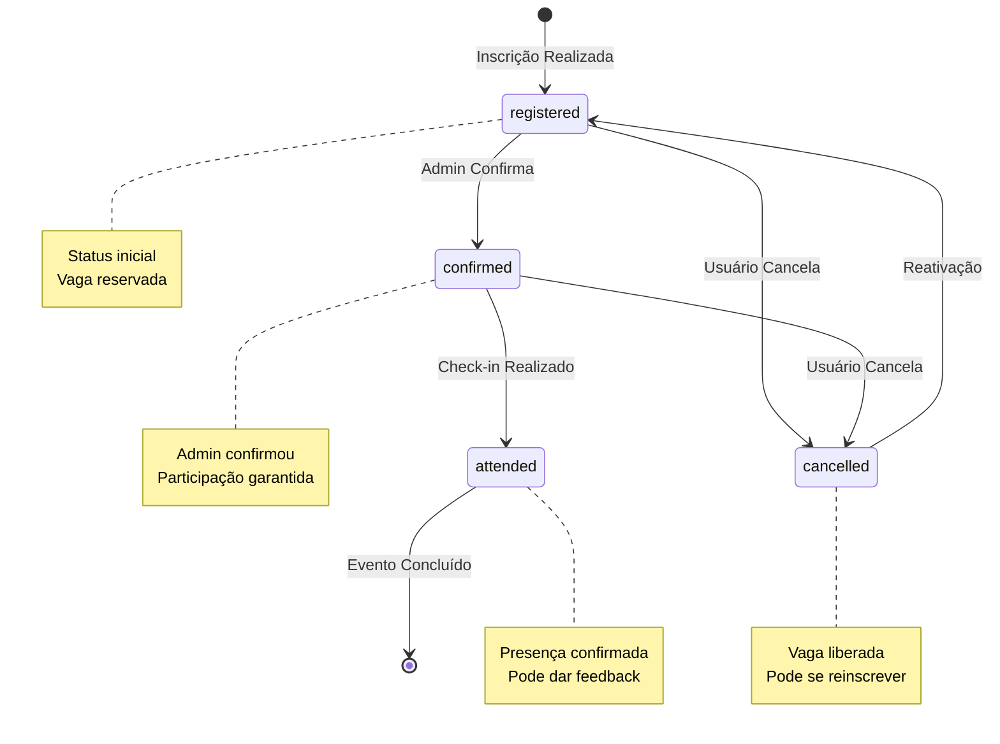
```mermaid
stateDiagram-v2
    [*] --> registered: Inscrição Realizada
    registered --> confirmed: Admin Confirma
    registered --> cancelled: Usuário Cancela
    confirmed --> attended: Check-in Realizado
    confirmed --> cancelled: Usuário Cancela
    attended --> [*]: Evento Concluído
    cancelled --> registered: Reativação

    note right of registered
        Status inicial
        Vaga reservada
    end note

    note right of confirmed
        Admin confirmou
        Participação garantida
    end note

    note right of attended
        Presença confirmada
        Pode dar feedback
    end note

    note right of cancelled
        Vaga liberada
        Pode se reinscrever
    end note
```

### Arquitetura Geral

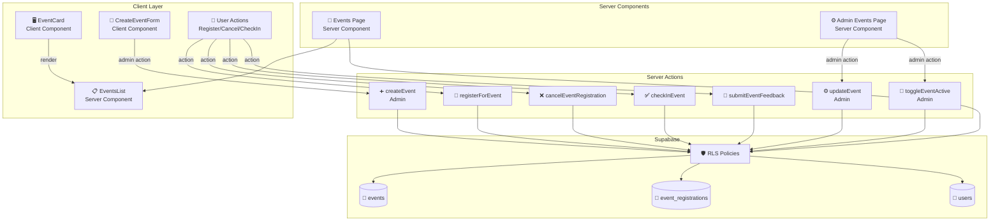
```mermaid
graph TB
    subgraph "Client Layer"
        A[🖥️ EventCard<br/>Client Component]
        B[📋 EventsList<br/>Server Component]
        C[📝 CreateEventForm<br/>Client Component]
        D[👤 User Actions<br/>Register/Cancel/CheckIn]
    end

    subgraph "Server Actions"
        E[🎫 registerForEvent]
        F[❌ cancelEventRegistration]
        G[✅ checkInEvent]
        H[💬 submitEventFeedback]
        I[➕ createEvent<br/>Admin]
        J[⚙️ updateEvent<br/>Admin]
        K[🔄 toggleEventActive<br/>Admin]
    end

    subgraph "Server Components"
        L[📄 Events Page<br/>Server Component]
        M[⚙️ Admin Events Page<br/>Server Component]
    end

    subgraph "Supabase"
        N[(📅 events)]
        O[(🎫 event_registrations)]
        P[(👥 users)]
        Q[🛡️ RLS Policies]
    end

    A -->|render| B
    D -->|action| E
    D -->|action| F
    D -->|action| G
    D -->|action| H

    C -->|admin action| I

    M -->|admin action| J
    M -->|admin action| K

    L --> B
    L --> Q

    E --> Q
    F --> Q
    G --> Q
    H --> Q
    I --> Q
    J --> Q
    K --> Q

    Q --> N
    Q --> O
    Q --> P
```

---

## Listagem de Eventos

O sistema exibe eventos organizados por status: acontecendo agora, próximos eventos e eventos passados que o usuário participou.

### Fluxo de Listagem

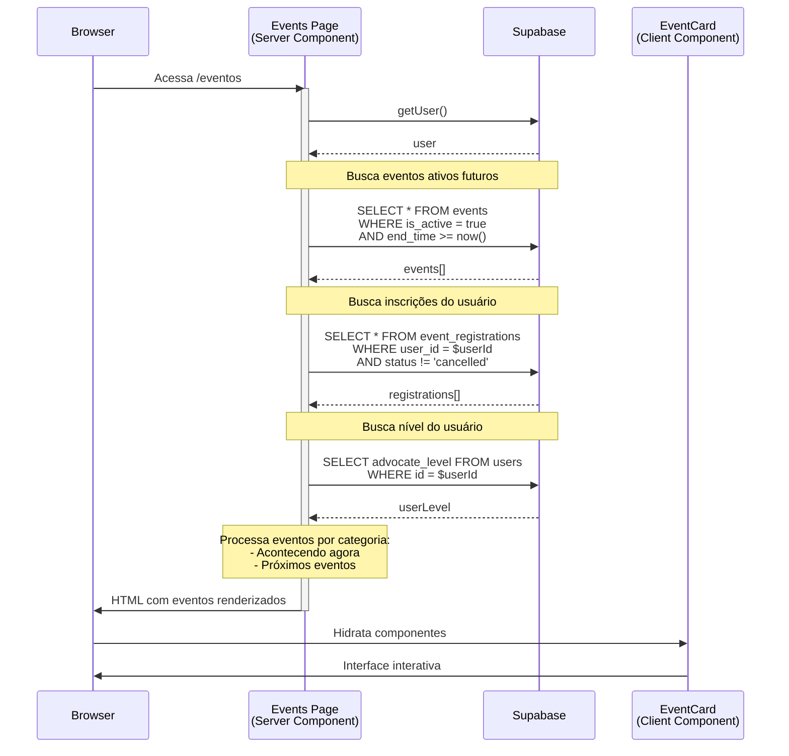
```mermaid
sequenceDiagram
    participant Browser
    participant EventsPage as Events Page<br/>(Server Component)
    participant Supabase
    participant EventCard as EventCard<br/>(Client Component)

    Browser->>EventsPage: Acessa /eventos

    activate EventsPage
    EventsPage->>Supabase: getUser()
    Supabase-->>EventsPage: user

    Note over EventsPage,Supabase: Busca eventos ativos futuros
    EventsPage->>Supabase: SELECT * FROM events<br/>WHERE is_active = true<br/>AND end_time >= now()
    Supabase-->>EventsPage: events[]

    Note over EventsPage,Supabase: Busca inscrições do usuário
    EventsPage->>Supabase: SELECT * FROM event_registrations<br/>WHERE user_id = $userId<br/>AND status != 'cancelled'
    Supabase-->>EventsPage: registrations[]

    Note over EventsPage,Supabase: Busca nível do usuário
    EventsPage->>Supabase: SELECT advocate_level FROM users<br/>WHERE id = $userId
    Supabase-->>EventsPage: userLevel

    Note over EventsPage: Processa eventos por categoria:<br/>- Acontecendo agora<br/>- Próximos eventos

    EventsPage->>Browser: HTML com eventos renderizados
    deactivate EventsPage

    Browser->>EventCard: Hidrata componentes
    EventCard->>Browser: Interface interativa
```

### Código: Events Page (Server Component)

```typescript
// src/app/(dashboard)/eventos/page.tsx
export default async function EventosPage() {
  const supabase = await createClient();
  const { data: { user } } = await supabase.auth.getUser();

  if (!user) {
    redirect('/login');
  }

  // Buscar eventos ativos
  const { data: events } = await supabase
    .from('events')
    .select('*')
    .eq('is_active', true)
    .gte('end_time', new Date().toISOString())
    .order('start_time', { ascending: true });

  // Buscar inscrições do usuário
  const { data: registrations } = await supabase
    .from('event_registrations')
    .select('event_id, status')
    .eq('user_id', user.id)
    .neq('status', 'cancelled');

  // Buscar perfil do usuário para verificar nível
  const { data: profile } = await supabase
    .from('users')
    .select('advocate_level')
    .eq('id', user.id)
    .single();

  const userLevel = profile?.advocate_level || 1;

  // Mapa de inscrições
  const registrationMap = new Map(
    (registrations || []).map(r => [r.event_id, r.status])
  );

  // Separar eventos por categoria
  const upcomingEvents = (events || []).filter(
    e => new Date(e.start_time) > new Date()
  );

  const happeningNow = (events || []).filter(e => {
    const now = new Date();
    return new Date(e.start_time) <= now && new Date(e.end_time) >= now;
  });

  return (
    <div className="space-y-8">
      {/* Acontecendo agora */}
      {happeningNow.length > 0 && (
        <div>
          <h2>Acontecendo Agora</h2>
          <div className="grid">
            {happeningNow.map((event) => (
              <EventCard
                key={event.id}
                event={event}
                userLevel={userLevel}
                registrationStatus={registrationMap.get(event.id)}
                isLive
              />
            ))}
          </div>
        </div>
      )}

      {/* Próximos eventos */}
      {upcomingEvents.length > 0 && (
        <div>
          <h2>Próximos Eventos</h2>
          <div className="grid">
            {upcomingEvents.map((event) => (
              <EventCard
                key={event.id}
                event={event}
                userLevel={userLevel}
                registrationStatus={registrationMap.get(event.id)}
              />
            ))}
          </div>
        </div>
      )}
    </div>
  );
}
```

### Categorização de Eventos

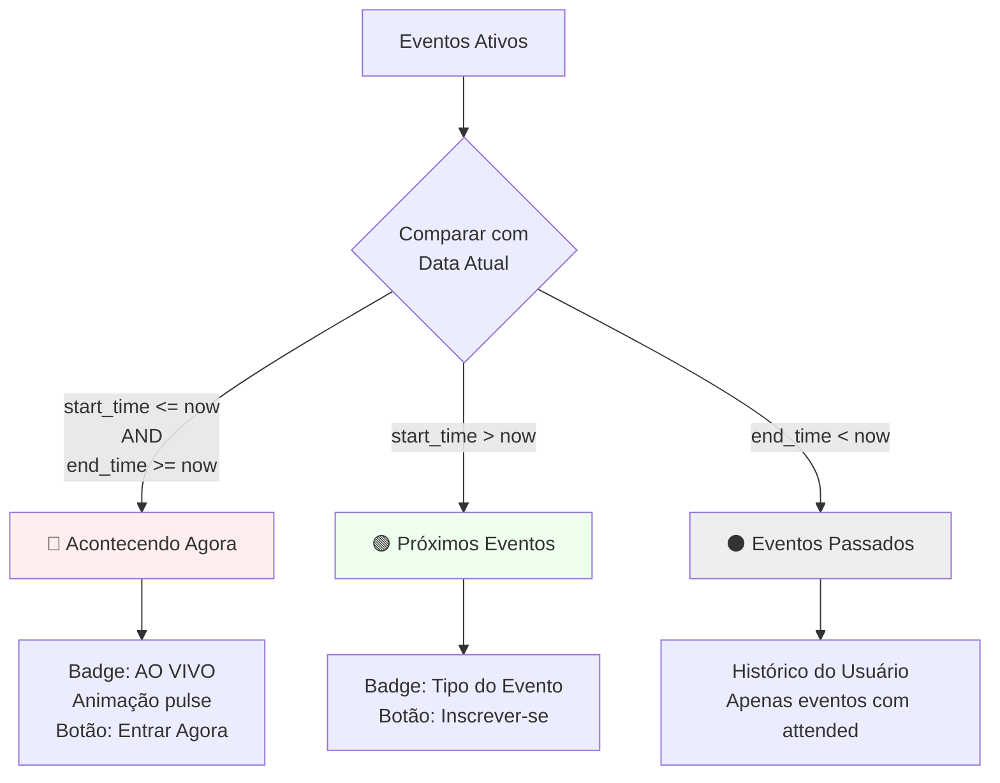
```mermaid
flowchart TD
    A[Eventos Ativos] --> B{Comparar com<br/>Data Atual}

    B -->|start_time <= now<br/>AND<br/>end_time >= now| C[🔴 Acontecendo Agora]
    B -->|start_time > now| D[🟢 Próximos Eventos]
    B -->|end_time < now| E[⚫ Eventos Passados]

    C --> F[Badge: AO VIVO<br/>Animação pulse<br/>Botão: Entrar Agora]
    D --> G[Badge: Tipo do Evento<br/>Botão: Inscrever-se]
    E --> H[Histórico do Usuário<br/>Apenas eventos com attended]

    style C fill:#fee
    style D fill:#efe
    style E fill:#eee
```

---

## Registro de Participação

O sistema permite que advocates se inscrevam em eventos, com validações de nível, vagas e status do evento.

### Fluxo de Inscrição

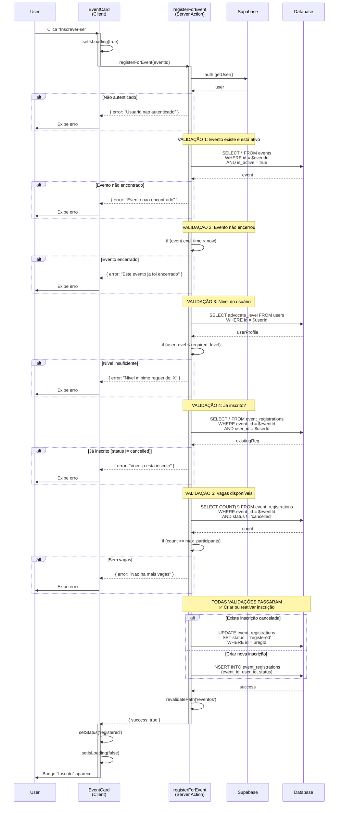
```mermaid
sequenceDiagram
    participant User
    participant EventCard as EventCard<br/>(Client)
    participant Action as registerForEvent<br/>(Server Action)
    participant Supabase
    participant DB as Database

    User->>EventCard: Clica "Inscrever-se"
    activate EventCard
    EventCard->>EventCard: setIsLoading(true)
    EventCard->>Action: registerForEvent(eventId)
    deactivate EventCard

    activate Action
    Action->>Supabase: auth.getUser()
    Supabase-->>Action: user

    alt Não autenticado
        Action-->>EventCard: { error: "Usuario nao autenticado" }
        EventCard->>User: Exibe erro
    end

    Note over Action,Supabase: VALIDAÇÃO 1: Evento existe e está ativo
    Action->>DB: SELECT * FROM events<br/>WHERE id = $eventId<br/>AND is_active = true
    DB-->>Action: event

    alt Evento não encontrado
        Action-->>EventCard: { error: "Evento nao encontrado" }
        EventCard->>User: Exibe erro
    end

    Note over Action,Supabase: VALIDAÇÃO 2: Evento não encerrou
    Action->>Action: if (event.end_time < now)

    alt Evento encerrado
        Action-->>EventCard: { error: "Este evento ja foi encerrado" }
        EventCard->>User: Exibe erro
    end

    Note over Action,Supabase: VALIDAÇÃO 3: Nível do usuário
    Action->>DB: SELECT advocate_level FROM users<br/>WHERE id = $userId
    DB-->>Action: userProfile
    Action->>Action: if (userLevel < required_level)

    alt Nível insuficiente
        Action-->>EventCard: { error: "Nivel minimo requerido: X" }
        EventCard->>User: Exibe erro
    end

    Note over Action,Supabase: VALIDAÇÃO 4: Já inscrito?
    Action->>DB: SELECT * FROM event_registrations<br/>WHERE event_id = $eventId<br/>AND user_id = $userId
    DB-->>Action: existingReg

    alt Já inscrito (status != cancelled)
        Action-->>EventCard: { error: "Voce ja esta inscrito" }
        EventCard->>User: Exibe erro
    end

    Note over Action,Supabase: VALIDAÇÃO 5: Vagas disponíveis
    Action->>DB: SELECT COUNT(*) FROM event_registrations<br/>WHERE event_id = $eventId<br/>AND status != 'cancelled'
    DB-->>Action: count
    Action->>Action: if (count >= max_participants)

    alt Sem vagas
        Action-->>EventCard: { error: "Nao ha mais vagas" }
        EventCard->>User: Exibe erro
    end

    Note over Action,DB: TODAS VALIDAÇÕES PASSARAM<br/>✅ Criar ou reativar inscrição

    alt Existe inscrição cancelada
        Action->>DB: UPDATE event_registrations<br/>SET status = 'registered'<br/>WHERE id = $regId
    else Criar nova inscrição
        Action->>DB: INSERT INTO event_registrations<br/>(event_id, user_id, status)
    end

    DB-->>Action: success
    Action->>Action: revalidatePath('/eventos')
    Action-->>EventCard: { success: true }
    deactivate Action

    activate EventCard
    EventCard->>EventCard: setStatus('registered')
    EventCard->>EventCard: setIsLoading(false)
    EventCard->>User: Badge "Inscrito" aparece
    deactivate EventCard
```

### Código: Server Action - registerForEvent

```typescript
// src/actions/events.ts
export async function registerForEvent(eventId: string): Promise<ActionResponse> {
  try {
    const supabase = await createClient();
    const { data: { user } } = await supabase.auth.getUser();

    if (!user) {
      return { error: 'Usuario nao autenticado' };
    }

    // VALIDAÇÃO 1: Verificar se o evento existe e está ativo
    const { data: event, error: eventError } = await supabase
      .from('events')
      .select('*')
      .eq('id', eventId)
      .eq('is_active', true)
      .single();

    if (eventError || !event) {
      return { error: 'Evento nao encontrado' };
    }

    // VALIDAÇÃO 2: Verificar se o evento já passou
    if (new Date(event.end_time) < new Date()) {
      return { error: 'Este evento ja foi encerrado' };
    }

    // VALIDAÇÃO 3: Verificar nível do usuário
    const { data: userProfile } = await supabase
      .from('users')
      .select('advocate_level')
      .eq('id', user.id)
      .single();

    if (userProfile && event.required_level > (userProfile.advocate_level || 1)) {
      return { error: `Nivel minimo requerido: ${event.required_level}` };
    }

    // VALIDAÇÃO 4: Verificar se já está inscrito
    const { data: existingReg } = await supabase
      .from('event_registrations')
      .select('id, status')
      .eq('event_id', eventId)
      .eq('user_id', user.id)
      .single();

    if (existingReg && existingReg.status !== 'cancelled') {
      return { error: 'Voce ja esta inscrito neste evento' };
    }

    // VALIDAÇÃO 5: Verificar vagas disponíveis
    if (event.max_participants) {
      const { count } = await supabase
        .from('event_registrations')
        .select('id', { count: 'exact' })
        .eq('event_id', eventId)
        .neq('status', 'cancelled');

      if ((count || 0) >= event.max_participants) {
        return { error: 'Nao ha mais vagas disponiveis' };
      }
    }

    // Criar inscrição ou reativar inscrição cancelada
    if (existingReg) {
      // Reativar inscrição cancelada
      const { error } = await supabase
        .from('event_registrations')
        .update({
          status: 'registered',
          registration_time: new Date().toISOString()
        })
        .eq('id', existingReg.id);

      if (error) {
        return { error: 'Erro ao reativar inscricao' };
      }
    } else {
      // Criar nova inscrição
      const { error } = await supabase
        .from('event_registrations')
        .insert({
          event_id: eventId,
          user_id: user.id,
          status: 'registered',
        });

      if (error) {
        return { error: 'Erro ao realizar inscricao' };
      }
    }

    revalidatePath('/eventos');
    revalidatePath('/dashboard');
    return { success: true };
  } catch {
    return { error: 'Erro interno do servidor' };
  }
}
```

### Fluxo de Cancelamento

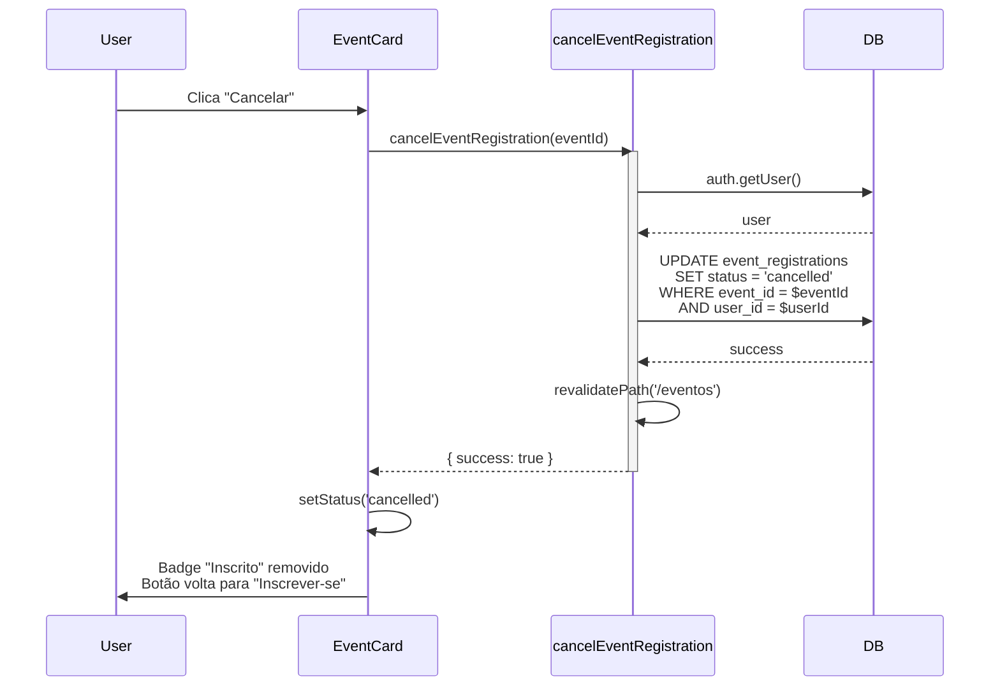
```mermaid
sequenceDiagram
    participant User
    participant EventCard
    participant Action as cancelEventRegistration
    participant DB

    User->>EventCard: Clica "Cancelar"
    EventCard->>Action: cancelEventRegistration(eventId)

    activate Action
    Action->>DB: auth.getUser()
    DB-->>Action: user

    Action->>DB: UPDATE event_registrations<br/>SET status = 'cancelled'<br/>WHERE event_id = $eventId<br/>AND user_id = $userId
    DB-->>Action: success

    Action->>Action: revalidatePath('/eventos')
    Action-->>EventCard: { success: true }
    deactivate Action

    EventCard->>EventCard: setStatus('cancelled')
    EventCard->>User: Badge "Inscrito" removido<br/>Botão volta para "Inscrever-se"
```

---

## Verificação de Nível de Advocate

O sistema restringe acesso a eventos com base no nível do advocate. Esta validação ocorre tanto na UI quanto no servidor.

### Fluxo de Verificação de Nível

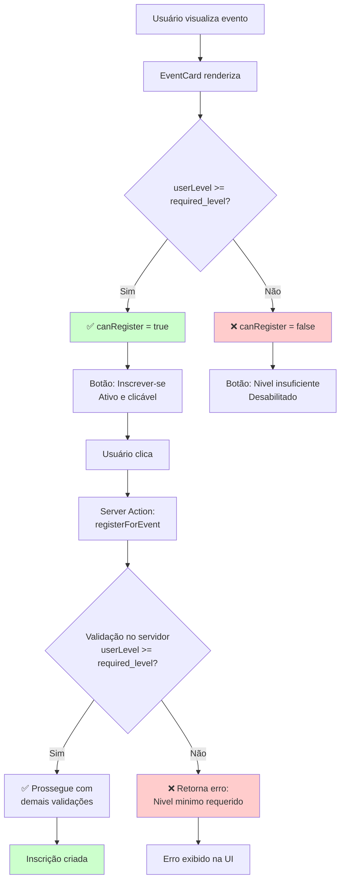
```mermaid
flowchart TD
    A[Usuário visualiza evento] --> B[EventCard renderiza]
    B --> C{userLevel >= required_level?}

    C -->|Sim| D[✅ canRegister = true]
    C -->|Não| E[❌ canRegister = false]

    D --> F[Botão: Inscrever-se<br/>Ativo e clicável]
    E --> G[Botão: Nivel insuficiente<br/>Desabilitado]

    F --> H[Usuário clica]
    H --> I[Server Action:<br/>registerForEvent]

    I --> J{Validação no servidor<br/>userLevel >= required_level?}

    J -->|Sim| K[✅ Prossegue com<br/>demais validações]
    J -->|Não| L[❌ Retorna erro:<br/>Nivel minimo requerido]

    K --> M[Inscrição criada]
    L --> N[Erro exibido na UI]

    style D fill:#cfc
    style E fill:#fcc
    style M fill:#cfc
    style L fill:#fcc
```

### Código: Validação de Nível no Client

```typescript
// src/components/events/EventCard.tsx
interface EventCardProps {
  event: Event;
  userLevel: number;  // Vem do Server Component
  registrationStatus?: string;
  isLive?: boolean;
}

export function EventCard({ event, userLevel, ... }: EventCardProps) {
  // Validação no cliente (UI)
  const canRegister = userLevel >= event.required_level;
  const isRegistered = status && status !== 'cancelled';

  return (
    <Card>
      {/* Indicador visual de nível requerido */}
      {event.required_level > 1 && (
        <div className="flex items-center gap-2 text-sm">
          <StarIcon />
          <span className={canRegister ? 'text-gray-600' : 'text-red-600'}>
            Nível {event.required_level} necessário
          </span>
        </div>
      )}

      {/* Botões de ação */}
      <div className="pt-2 flex gap-2">
        {isRegistered ? (
          <Button onClick={handleCancel}>Cancelar</Button>
        ) : canRegister ? (
          <Button onClick={handleRegister}>Inscrever-se</Button>
        ) : (
          <div className="w-full py-2 bg-gray-100 text-gray-500 text-center">
            Nível insuficiente
          </div>
        )}
      </div>
    </Card>
  );
}
```

### Matriz de Acesso por Nível

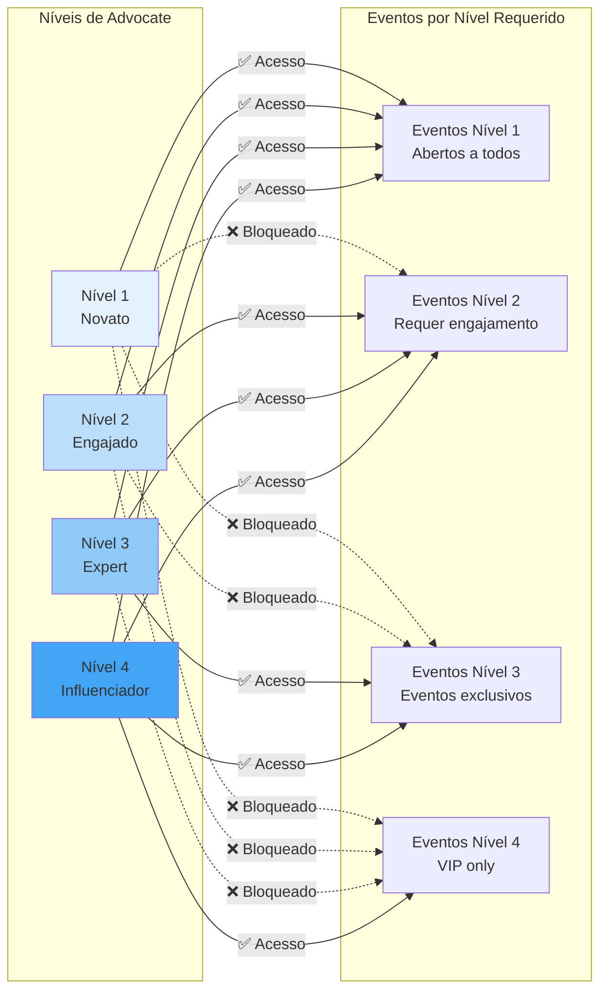
```mermaid
graph LR
    subgraph Níveis de Advocate
        N1[Nível 1<br/>Novato]
        N2[Nível 2<br/>Engajado]
        N3[Nível 3<br/>Expert]
        N4[Nível 4<br/>Influenciador]
    end

    subgraph Eventos por Nível Requerido
        E1[Eventos Nível 1<br/>Abertos a todos]
        E2[Eventos Nível 2<br/>Requer engajamento]
        E3[Eventos Nível 3<br/>Eventos exclusivos]
        E4[Eventos Nível 4<br/>VIP only]
    end

    N1 -->|✅ Acesso| E1
    N1 -.->|❌ Bloqueado| E2
    N1 -.->|❌ Bloqueado| E3
    N1 -.->|❌ Bloqueado| E4

    N2 -->|✅ Acesso| E1
    N2 -->|✅ Acesso| E2
    N2 -.->|❌ Bloqueado| E3
    N2 -.->|❌ Bloqueado| E4

    N3 -->|✅ Acesso| E1
    N3 -->|✅ Acesso| E2
    N3 -->|✅ Acesso| E3
    N3 -.->|❌ Bloqueado| E4

    N4 -->|✅ Acesso| E1
    N4 -->|✅ Acesso| E2
    N4 -->|✅ Acesso| E3
    N4 -->|✅ Acesso| E4

    style N1 fill:#e3f2fd
    style N2 fill:#bbdefb
    style N3 fill:#90caf9
    style N4 fill:#42a5f5
```

### Validação em Camadas (Defense in Depth)

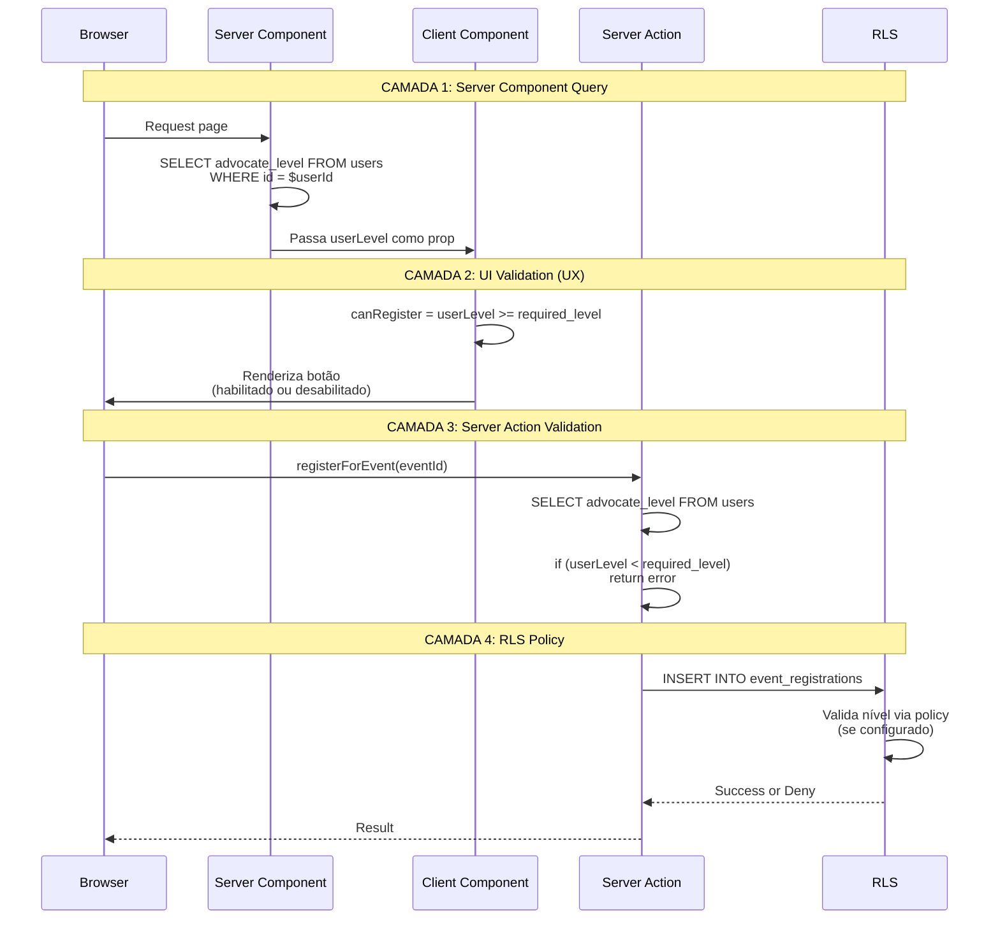
```mermaid
sequenceDiagram
    participant Browser
    participant Server as Server Component
    participant Client as Client Component
    participant Action as Server Action
    participant RLS

    Note over Browser,RLS: CAMADA 1: Server Component Query
    Browser->>Server: Request page
    Server->>Server: SELECT advocate_level FROM users<br/>WHERE id = $userId
    Server->>Client: Passa userLevel como prop

    Note over Browser,RLS: CAMADA 2: UI Validation (UX)
    Client->>Client: canRegister = userLevel >= required_level
    Client->>Browser: Renderiza botão<br/>(habilitado ou desabilitado)

    Note over Browser,RLS: CAMADA 3: Server Action Validation
    Browser->>Action: registerForEvent(eventId)
    Action->>Action: SELECT advocate_level FROM users
    Action->>Action: if (userLevel < required_level)<br/>return error

    Note over Browser,RLS: CAMADA 4: RLS Policy
    Action->>RLS: INSERT INTO event_registrations
    RLS->>RLS: Valida nível via policy<br/>(se configurado)
    RLS-->>Action: Success or Deny
    Action-->>Browser: Result
```

---

## Fluxo Admin - Criação de Eventos

Admins e creators podem criar novos eventos através do painel administrativo.

### Fluxo de Criação

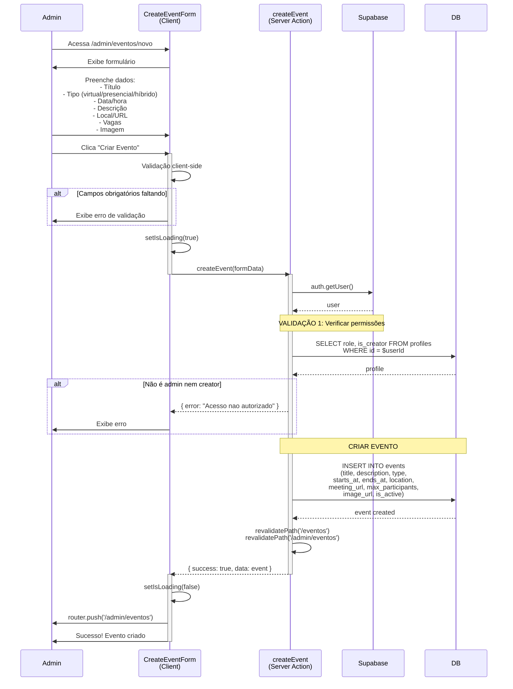
```mermaid
sequenceDiagram
    participant Admin
    participant Form as CreateEventForm<br/>(Client)
    participant Action as createEvent<br/>(Server Action)
    participant Supabase
    participant DB

    Admin->>Form: Acessa /admin/eventos/novo
    Form->>Admin: Exibe formulário

    Admin->>Form: Preenche dados:<br/>- Título<br/>- Tipo (virtual/presencial/híbrido)<br/>- Data/hora<br/>- Descrição<br/>- Local/URL<br/>- Vagas<br/>- Imagem

    Admin->>Form: Clica "Criar Evento"

    activate Form
    Form->>Form: Validação client-side

    alt Campos obrigatórios faltando
        Form->>Admin: Exibe erro de validação
    end

    Form->>Form: setIsLoading(true)
    Form->>Action: createEvent(formData)
    deactivate Form

    activate Action
    Action->>Supabase: auth.getUser()
    Supabase-->>Action: user

    Note over Action,Supabase: VALIDAÇÃO 1: Verificar permissões
    Action->>DB: SELECT role, is_creator FROM profiles<br/>WHERE id = $userId
    DB-->>Action: profile

    alt Não é admin nem creator
        Action-->>Form: { error: "Acesso nao autorizado" }
        Form->>Admin: Exibe erro
    end

    Note over Action,DB: CRIAR EVENTO
    Action->>DB: INSERT INTO events<br/>(title, description, type,<br/>starts_at, ends_at, location,<br/>meeting_url, max_participants,<br/>image_url, is_active)
    DB-->>Action: event created

    Action->>Action: revalidatePath('/eventos')<br/>revalidatePath('/admin/eventos')
    Action-->>Form: { success: true, data: event }
    deactivate Action

    activate Form
    Form->>Form: setIsLoading(false)
    Form->>Admin: router.push('/admin/eventos')
    Form->>Admin: Sucesso! Evento criado
    deactivate Form
```

### Código: Formulário de Criação

```typescript
// src/app/(dashboard)/admin/eventos/novo/page.tsx
export default function NovoEventoPage() {
  const router = useRouter();
  const [isLoading, setIsLoading] = useState(false);
  const [error, setError] = useState<string | null>(null);

  const [formData, setFormData] = useState({
    title: '',
    description: '',
    type: 'virtual' as EventType,
    starts_at: '',
    ends_at: '',
    location: '',
    meeting_url: '',
    max_participants: '',
    image_url: '',
  });

  const handleSubmit = async (e: React.FormEvent) => {
    e.preventDefault();
    setError(null);

    // Validação básica
    if (!formData.title || !formData.starts_at) {
      setError('Titulo e data de inicio sao obrigatorios');
      return;
    }

    setIsLoading(true);

    const result = await createEvent({
      title: formData.title,
      description: formData.description || null,
      type: formData.type,
      starts_at: formData.starts_at,
      ends_at: formData.ends_at || null,
      location: formData.location || null,
      meeting_url: formData.meeting_url || null,
      max_participants: formData.max_participants
        ? parseInt(formData.max_participants)
        : null,
      image_url: formData.image_url || null,
    });

    if (result.error) {
      setError(result.error);
      setIsLoading(false);
      return;
    }

    router.push('/admin/eventos');
    router.refresh();
  };

  return (
    <form onSubmit={handleSubmit}>
      {/* Tipo de Evento */}
      <div className="grid grid-cols-3 gap-3">
        {[
          { value: 'virtual', label: 'Virtual', icon: '💻' },
          { value: 'presencial', label: 'Presencial', icon: '📍' },
          { value: 'hibrido', label: 'Híbrido', icon: '🔄' },
        ].map((type) => (
          <button
            key={type.value}
            type="button"
            onClick={() => setFormData({ ...formData, type: type.value })}
            className={formData.type === type.value ? 'selected' : ''}
          >
            {type.icon} {type.label}
          </button>
        ))}
      </div>

      {/* Campos do formulário */}
      <Input
        label="Título *"
        value={formData.title}
        onChange={(e) => setFormData({ ...formData, title: e.target.value })}
        required
      />

      <Textarea
        label="Descrição"
        value={formData.description}
        onChange={(e) => setFormData({ ...formData, description: e.target.value })}
      />

      {/* Data e hora */}
      <Input
        type="datetime-local"
        label="Início *"
        value={formData.starts_at}
        onChange={(e) => setFormData({ ...formData, starts_at: e.target.value })}
        required
      />

      <Input
        type="datetime-local"
        label="Término"
        value={formData.ends_at}
        onChange={(e) => setFormData({ ...formData, ends_at: e.target.value })}
      />

      {/* Condicional: Local ou URL */}
      {(formData.type === 'presencial' || formData.type === 'hibrido') && (
        <Input
          label="Endereço"
          value={formData.location}
          onChange={(e) => setFormData({ ...formData, location: e.target.value })}
        />
      )}

      {(formData.type === 'virtual' || formData.type === 'hibrido') && (
        <Input
          type="url"
          label="Link da Reunião"
          value={formData.meeting_url}
          onChange={(e) => setFormData({ ...formData, meeting_url: e.target.value })}
        />
      )}

      <Button type="submit" disabled={isLoading}>
        {isLoading ? 'Criando...' : 'Criar Evento'}
      </Button>
    </form>
  );
}
```

### Tipos de Eventos

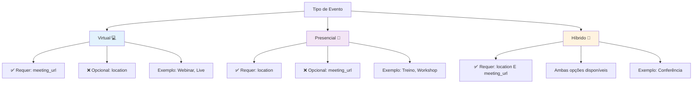
```mermaid
graph TB
    A[Tipo de Evento] --> B[Virtual 💻]
    A --> C[Presencial 📍]
    A --> D[Híbrido 🔄]

    B --> B1[✅ Requer: meeting_url]
    B --> B2[❌ Opcional: location]
    B --> B3[Exemplo: Webinar, Live]

    C --> C1[✅ Requer: location]
    C --> C2[❌ Opcional: meeting_url]
    C --> C3[Exemplo: Treino, Workshop]

    D --> D1[✅ Requer: location E meeting_url]
    D --> D2[Ambas opções disponíveis]
    D --> D3[Exemplo: Conferência]

    style B fill:#e3f2fd
    style C fill:#f3e5f5
    style D fill:#fff3e0
```

---

## Fluxo Admin - Gestão de Eventos

Admins podem visualizar, editar, ativar/desativar e gerenciar inscrições de eventos existentes.

### Painel de Gestão

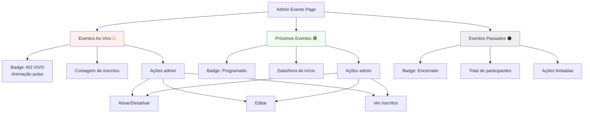
```mermaid
graph TB
    A[Admin Events Page] --> B[Eventos Ao Vivo 🔴]
    A --> C[Próximos Eventos 🟢]
    A --> D[Eventos Passados ⚫]

    B --> B1[Badge: AO VIVO<br/>Animação pulse]
    B --> B2[Contagem de inscritos]
    B --> B3[Ações admin]

    C --> C1[Badge: Programado]
    C --> C2[Data/hora de início]
    C --> C3[Ações admin]

    D --> D1[Badge: Encerrado]
    D --> D2[Total de participantes]
    D --> D3[Ações limitadas]

    B3 --> E[Ativar/Desativar]
    B3 --> F[Editar]
    B3 --> G[Ver inscritos]

    C3 --> E
    C3 --> F
    C3 --> G

    style B fill:#fee
    style C fill:#efe
    style D fill:#eee
```

### Fluxo de Ativação/Desativação

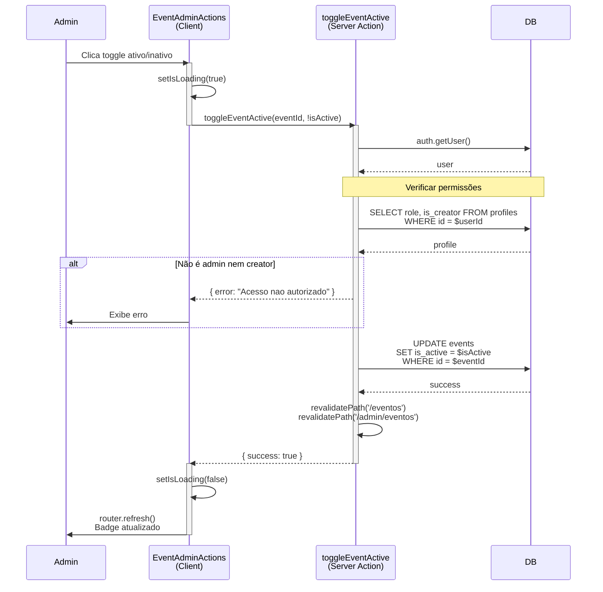
```mermaid
sequenceDiagram
    participant Admin
    participant Actions as EventAdminActions<br/>(Client)
    participant Action as toggleEventActive<br/>(Server Action)
    participant DB

    Admin->>Actions: Clica toggle ativo/inativo

    activate Actions
    Actions->>Actions: setIsLoading(true)
    Actions->>Action: toggleEventActive(eventId, !isActive)
    deactivate Actions

    activate Action
    Action->>DB: auth.getUser()
    DB-->>Action: user

    Note over Action,DB: Verificar permissões
    Action->>DB: SELECT role, is_creator FROM profiles<br/>WHERE id = $userId
    DB-->>Action: profile

    alt Não é admin nem creator
        Action-->>Actions: { error: "Acesso nao autorizado" }
        Actions->>Admin: Exibe erro
    end

    Action->>DB: UPDATE events<br/>SET is_active = $isActive<br/>WHERE id = $eventId
    DB-->>Action: success

    Action->>Action: revalidatePath('/eventos')<br/>revalidatePath('/admin/eventos')
    Action-->>Actions: { success: true }
    deactivate Action

    activate Actions
    Actions->>Actions: setIsLoading(false)
    Actions->>Admin: router.refresh()<br/>Badge atualizado
    deactivate Actions
```

### Código: Admin Events Page (Server Component)

```typescript
// src/app/(dashboard)/admin/eventos/page.tsx
export default async function AdminEventosPage() {
  const supabase = await createClient();

  // Buscar eventos com contagem de inscritos
  const { data: events } = await supabase
    .from('events')
    .select(`
      *,
      event_registrations (
        id,
        status
      )
    `)
    .order('starts_at', { ascending: false });

  // Processar dados
  const now = new Date();
  const processedEvents = (events || []).map((e) => {
    const registrations = e.event_registrations || [];
    const startsAt = new Date(e.starts_at);
    const endsAt = e.ends_at ? new Date(e.ends_at) : null;

    // Determinar status
    let status = 'upcoming';
    if (startsAt <= now && (!endsAt || endsAt >= now)) {
      status = 'live';
    } else if (endsAt && endsAt < now) {
      status = 'past';
    }

    return {
      ...e,
      totalRegistrations: registrations.length,
      confirmedCount: registrations.filter(r => r.status === 'confirmed').length,
      status,
    };
  });

  const upcomingEvents = processedEvents.filter(e => e.status === 'upcoming');
  const liveEvents = processedEvents.filter(e => e.status === 'live');
  const pastEvents = processedEvents.filter(e => e.status === 'past');

  return (
    <div>
      {/* Eventos Ao Vivo */}
      {liveEvents.length > 0 && (
        <div>
          <h2>🔴 Ao Vivo Agora ({liveEvents.length})</h2>
          <div className="grid">
            {liveEvents.map((event) => (
              <EventAdminCard key={event.id} event={event} />
            ))}
          </div>
        </div>
      )}

      {/* Próximos Eventos */}
      <div>
        <h2>🟢 Próximos Eventos ({upcomingEvents.length})</h2>
        {upcomingEvents.length > 0 ? (
          <div className="grid">
            {upcomingEvents.map((event) => (
              <EventAdminCard key={event.id} event={event} />
            ))}
          </div>
        ) : (
          <EmptyState>Nenhum evento programado</EmptyState>
        )}
      </div>
    </div>
  );
}
```

### Estatísticas de Inscrições

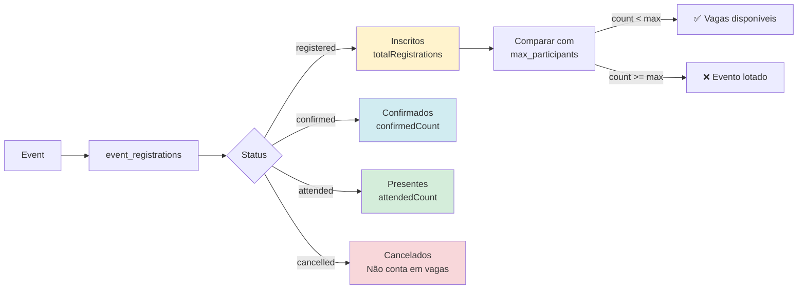
```mermaid
graph LR
    A[Event] --> B[event_registrations]

    B --> C{Status}
    C -->|registered| D[Inscritos<br/>totalRegistrations]
    C -->|confirmed| E[Confirmados<br/>confirmedCount]
    C -->|attended| F[Presentes<br/>attendedCount]
    C -->|cancelled| G[Cancelados<br/>Não conta em vagas]

    D --> H[Comparar com<br/>max_participants]
    H -->|count < max| I[✅ Vagas disponíveis]
    H -->|count >= max| J[❌ Evento lotado]

    style D fill:#fff3cd
    style E fill:#d1ecf1
    style F fill:#d4edda
    style G fill:#f8d7da
```

---

## Check-in de Participantes

Quando um evento está acontecendo, participantes inscritos podem fazer check-in para confirmar presença.

### Fluxo de Check-in

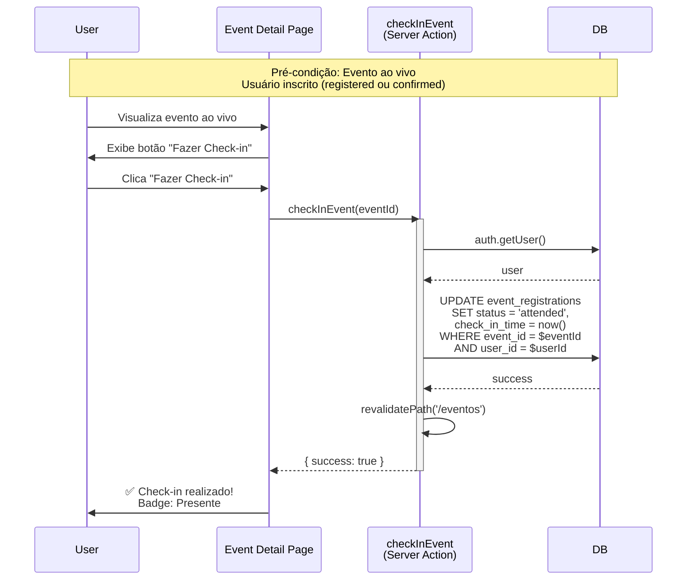
```mermaid
sequenceDiagram
    participant User
    participant EventPage as Event Detail Page
    participant Action as checkInEvent<br/>(Server Action)
    participant DB

    Note over User,DB: Pré-condição: Evento ao vivo<br/>Usuário inscrito (registered ou confirmed)

    User->>EventPage: Visualiza evento ao vivo
    EventPage->>User: Exibe botão "Fazer Check-in"

    User->>EventPage: Clica "Fazer Check-in"
    EventPage->>Action: checkInEvent(eventId)

    activate Action
    Action->>DB: auth.getUser()
    DB-->>Action: user

    Action->>DB: UPDATE event_registrations<br/>SET status = 'attended',<br/>check_in_time = now()<br/>WHERE event_id = $eventId<br/>AND user_id = $userId
    DB-->>Action: success

    Action->>Action: revalidatePath('/eventos')
    Action-->>EventPage: { success: true }
    deactivate Action

    EventPage->>User: ✅ Check-in realizado!<br/>Badge: Presente
```

### Código: Server Action - checkInEvent

```typescript
// src/actions/events.ts
export async function checkInEvent(eventId: string): Promise<ActionResponse> {
  try {
    const supabase = await createClient();

    const { data: { user } } = await supabase.auth.getUser();
    if (!user) {
      return { error: 'Usuario nao autenticado' };
    }

    const { error } = await supabase
      .from('event_registrations')
      .update({
        status: 'attended',
        check_in_time: new Date().toISOString(),
      })
      .eq('event_id', eventId)
      .eq('user_id', user.id);

    if (error) {
      return { error: 'Erro ao realizar check-in' };
    }

    revalidatePath('/eventos');
    return { success: true };
  } catch {
    return { error: 'Erro interno do servidor' };
  }
}
```

### Estados de Participação

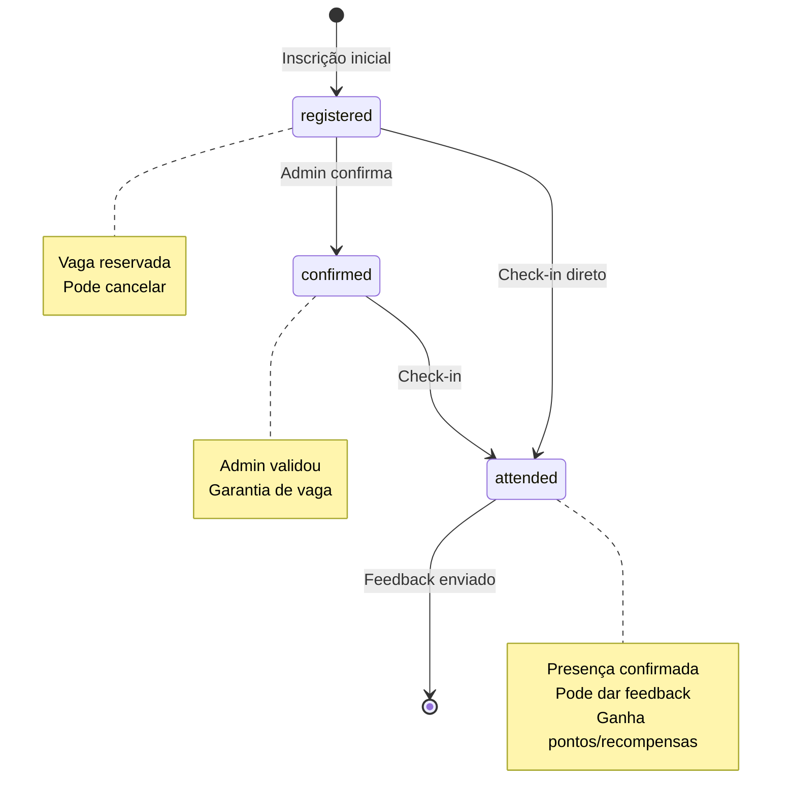
```mermaid
stateDiagram-v2
    [*] --> registered: Inscrição inicial
    registered --> confirmed: Admin confirma
    registered --> attended: Check-in direto
    confirmed --> attended: Check-in
    attended --> [*]: Feedback enviado

    note right of registered
        Vaga reservada
        Pode cancelar
    end note

    note right of confirmed
        Admin validou
        Garantia de vaga
    end note

    note right of attended
        Presença confirmada
        Pode dar feedback
        Ganha pontos/recompensas
    end note
```

---

## Sistema de Feedback

Após participar de um evento (status: attended), o usuário pode enviar feedback sobre sua experiência.

### Fluxo de Feedback

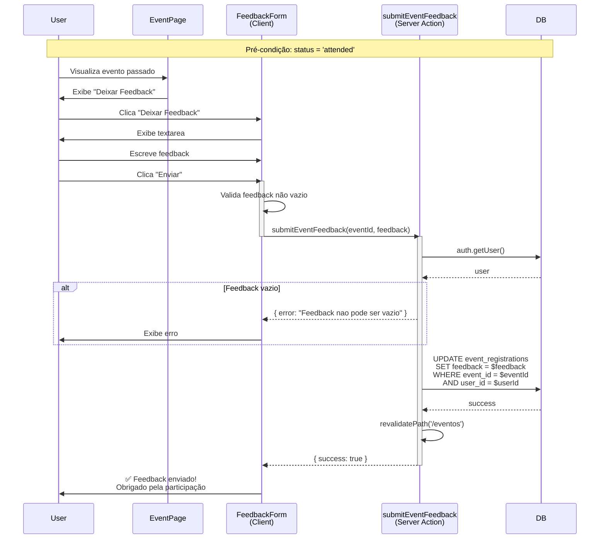
```mermaid
sequenceDiagram
    participant User
    participant EventPage
    participant Form as FeedbackForm<br/>(Client)
    participant Action as submitEventFeedback<br/>(Server Action)
    participant DB

    Note over User,DB: Pré-condição: status = 'attended'

    User->>EventPage: Visualiza evento passado
    EventPage->>User: Exibe "Deixar Feedback"

    User->>Form: Clica "Deixar Feedback"
    Form->>User: Exibe textarea

    User->>Form: Escreve feedback
    User->>Form: Clica "Enviar"

    activate Form
    Form->>Form: Valida feedback não vazio
    Form->>Action: submitEventFeedback(eventId, feedback)
    deactivate Form

    activate Action
    Action->>DB: auth.getUser()
    DB-->>Action: user

    alt Feedback vazio
        Action-->>Form: { error: "Feedback nao pode ser vazio" }
        Form->>User: Exibe erro
    end

    Action->>DB: UPDATE event_registrations<br/>SET feedback = $feedback<br/>WHERE event_id = $eventId<br/>AND user_id = $userId
    DB-->>Action: success

    Action->>Action: revalidatePath('/eventos')
    Action-->>Form: { success: true }
    deactivate Action

    Form->>User: ✅ Feedback enviado!<br/>Obrigado pela participação
```

### Código: Server Action - submitEventFeedback

```typescript
// src/actions/events.ts
export async function submitEventFeedback(
  eventId: string,
  feedback: string
): Promise<ActionResponse> {
  try {
    const supabase = await createClient();

    const { data: { user } } = await supabase.auth.getUser();
    if (!user) {
      return { error: 'Usuario nao autenticado' };
    }

    // Validação
    if (!feedback.trim()) {
      return { error: 'Feedback nao pode ser vazio' };
    }

    const { error } = await supabase
      .from('event_registrations')
      .update({ feedback: feedback.trim() })
      .eq('event_id', eventId)
      .eq('user_id', user.id);

    if (error) {
      return { error: 'Erro ao enviar feedback' };
    }

    revalidatePath('/eventos');
    return { success: true };
  } catch {
    return { error: 'Erro interno do servidor' };
  }
}
```

### Coleta de Feedback

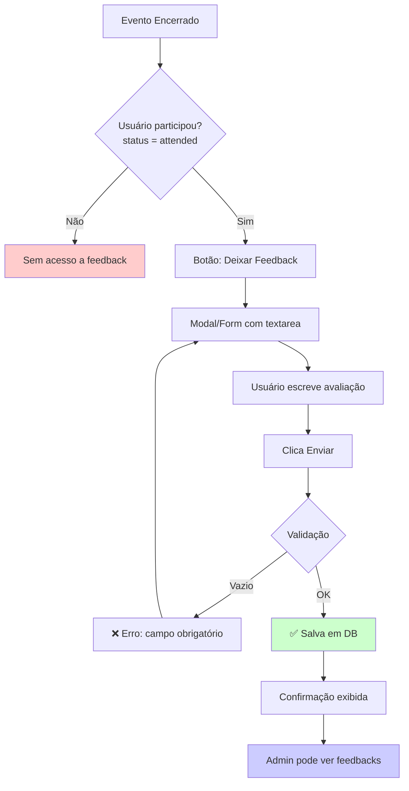
```mermaid
graph TB
    A[Evento Encerrado] --> B{Usuário participou?<br/>status = attended}

    B -->|Não| C[Sem acesso a feedback]
    B -->|Sim| D[Botão: Deixar Feedback]

    D --> E[Modal/Form com textarea]
    E --> F[Usuário escreve avaliação]
    F --> G[Clica Enviar]

    G --> H{Validação}
    H -->|Vazio| I[❌ Erro: campo obrigatório]
    H -->|OK| J[✅ Salva em DB]

    I --> E
    J --> K[Confirmação exibida]
    K --> L[Admin pode ver feedbacks]

    style C fill:#fcc
    style J fill:#cfc
    style L fill:#ccf
```

---

## Fluxo Completo de Dados

Visão integrada de todos os fluxos desde a criação até o feedback.

### Arquitetura Completa em Camadas

```mermaid
graph TB
    subgraph "Client Layer - Browser"
        A1[EventCard]
        A2[CreateEventForm]
        A3[AdminEventsPage Client]
        A4[EventsList]
    end

    subgraph "Server Components - Next.js Server"
        B1[Events Page<br/>GET /eventos]
        B2[Admin Events Page<br/>GET /admin/eventos]
        B3[Event Detail Page<br/>GET /eventos/[id]]
    end

    subgraph "Server Actions - Next.js Server"
        C1[registerForEvent]
        C2[cancelEventRegistration]
        C3[checkInEvent]
        C4[submitEventFeedback]
        C5[createEvent - Admin]
        C6[updateEvent - Admin]
        C7[toggleEventActive - Admin]
    end

    subgraph "Supabase Client - Auth & Queries"
        D1[createClient - Server]
        D2[auth.getUser]
        D3[RLS Enforcement]
    end

    subgraph "Database - PostgreSQL"
        E1[(events)]
        E2[(event_registrations)]
        E3[(users/profiles)]
    end

    A1 --> B1
    A2 --> C5
    A3 --> C6
    A3 --> C7
    A4 --> B1

    B1 --> D1
    B2 --> D1
    B3 --> D1

    C1 --> D1
    C2 --> D1
    C3 --> D1
    C4 --> D1
    C5 --> D1
    C6 --> D1
    C7 --> D1

    D1 --> D2
    D1 --> D3

    D3 --> E1
    D3 --> E2
    D3 --> E3
```

### Timeline do Ciclo de Vida de um Evento

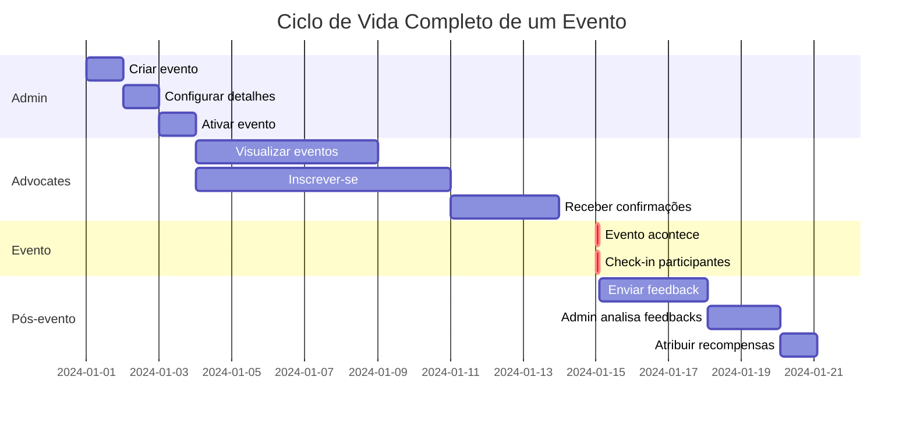
```mermaid
gantt
    title Ciclo de Vida Completo de um Evento
    dateFormat YYYY-MM-DD
    section Admin
    Criar evento                :a1, 2024-01-01, 1d
    Configurar detalhes         :a2, after a1, 1d
    Ativar evento               :a3, after a2, 1d

    section Advocates
    Visualizar eventos          :b1, after a3, 5d
    Inscrever-se                :b2, after a3, 7d
    Receber confirmações        :b3, after b2, 3d

    section Evento
    Evento acontece             :crit, c1, 2024-01-15, 2h
    Check-in participantes      :crit, c2, 2024-01-15, 2h

    section Pós-evento
    Enviar feedback             :d1, after c1, 3d
    Admin analisa feedbacks     :d2, after d1, 2d
    Atribuir recompensas        :d3, after d2, 1d
```

### Fluxo Integrado - Do Admin ao Feedback

```mermaid
sequenceDiagram
    participant Admin
    participant System
    participant Advocate
    participant DB

    Note over Admin,DB: FASE 1: Criação (Admin)
    Admin->>System: createEvent(data)
    System->>DB: INSERT INTO events
    DB-->>System: event created
    System-->>Admin: ✅ Evento criado

    Note over Admin,DB: FASE 2: Descoberta (Advocate)
    Advocate->>System: Acessa /eventos
    System->>DB: SELECT events WHERE is_active
    DB-->>System: events list
    System->>DB: SELECT advocate_level
    DB-->>System: userLevel
    System-->>Advocate: Lista de eventos<br/>(com validação de nível)

    Note over Admin,DB: FASE 3: Inscrição (Advocate)
    Advocate->>System: registerForEvent(eventId)
    System->>DB: Valida evento, nível, vagas
    DB-->>System: ✅ validations passed
    System->>DB: INSERT event_registration
    DB-->>System: registration created
    System-->>Advocate: ✅ Inscrito com sucesso!

    Note over Admin,DB: FASE 4: Confirmação (Admin)
    Admin->>System: confirmEventRegistration(eventId, userId)
    System->>DB: UPDATE registration<br/>SET status = 'confirmed'
    DB-->>System: confirmed
    System-->>Admin: ✅ Confirmado

    Note over Admin,DB: FASE 5: Evento Ao Vivo
    Note over Advocate: Evento começa
    Advocate->>System: Visualiza evento (isLive = true)
    System-->>Advocate: Botão "Entrar Agora" + "Check-in"

    Advocate->>System: checkInEvent(eventId)
    System->>DB: UPDATE registration<br/>SET status = 'attended'<br/>SET check_in_time = now()
    DB-->>System: attended
    System-->>Advocate: ✅ Presença confirmada!

    Note over Admin,DB: FASE 6: Feedback (Advocate)
    Note over Advocate: Evento termina
    Advocate->>System: submitEventFeedback(eventId, feedback)
    System->>DB: UPDATE registration<br/>SET feedback = $text
    DB-->>System: saved
    System-->>Advocate: ✅ Feedback enviado!

    Note over Admin,DB: FASE 7: Análise (Admin)
    Admin->>System: Visualiza feedbacks
    System->>DB: SELECT registrations<br/>WHERE feedback IS NOT NULL
    DB-->>System: feedbacks[]
    System-->>Admin: Dashboard com feedbacks
```

### Estado Completo do Banco de Dados

```mermaid
erDiagram
    EVENTS ||--o{ EVENT_REGISTRATIONS : "has many"
    USERS ||--o{ EVENT_REGISTRATIONS : "registers for"

    EVENTS {
        uuid id PK
        string title
        text description
        string type
        timestamp starts_at
        timestamp ends_at
        string location
        string meeting_url
        int max_participants
        int required_level
        string image_url
        boolean is_active
        timestamp created_at
        timestamp updated_at
    }

    EVENT_REGISTRATIONS {
        uuid id PK
        uuid event_id FK
        uuid user_id FK
        timestamp registration_time
        string status
        timestamp check_in_time
        text feedback
    }

    USERS {
        uuid id PK
        int advocate_level
        string role
        boolean is_creator
    }
```

### Mapa de Responsabilidades

| Camada | Responsabilidade | Exemplo |
|--------|------------------|---------|
| **Client Components** | Interatividade, estado local, otimização | EventCard (botões, loading) |
| **Server Components** | Fetch de dados, SSR, SEO | Events Page (lista de eventos) |
| **Server Actions** | Mutações, validações, lógica de negócio | registerForEvent, createEvent |
| **Supabase Client** | Autenticação, queries, realtime | auth.getUser(), select(), insert() |
| **RLS Policies** | Segurança em nível de linha | Quem pode ler/escrever eventos |
| **Database** | Persistência, integridade, relações | PostgreSQL com constraints |

---

## Políticas RLS (Row Level Security)

### Tabela: events

```sql
-- Políticas de Leitura
-- ✅ Todos podem ver eventos ativos
CREATE POLICY "Todos podem ver eventos ativos"
ON events FOR SELECT
TO authenticated
USING (is_active = true);

-- ✅ Admins podem ver todos os eventos
CREATE POLICY "Admins podem ver todos os eventos"
ON events FOR SELECT
TO authenticated
USING (
  EXISTS (
    SELECT 1 FROM profiles
    WHERE profiles.id = auth.uid()
    AND (profiles.role = 'admin' OR profiles.is_creator = true)
  )
);

-- Políticas de Inserção
-- ✅ Apenas admins e creators podem criar eventos
CREATE POLICY "Admins e creators podem criar eventos"
ON events FOR INSERT
TO authenticated
WITH CHECK (
  EXISTS (
    SELECT 1 FROM profiles
    WHERE profiles.id = auth.uid()
    AND (profiles.role = 'admin' OR profiles.is_creator = true)
  )
);

-- Políticas de Atualização
-- ✅ Apenas admins e creators podem atualizar eventos
CREATE POLICY "Admins e creators podem atualizar eventos"
ON events FOR UPDATE
TO authenticated
USING (
  EXISTS (
    SELECT 1 FROM profiles
    WHERE profiles.id = auth.uid()
    AND (profiles.role = 'admin' OR profiles.is_creator = true)
  )
);

-- Políticas de Deleção
-- ✅ Apenas admins podem deletar eventos
CREATE POLICY "Admins podem deletar eventos"
ON events FOR DELETE
TO authenticated
USING (
  EXISTS (
    SELECT 1 FROM profiles
    WHERE profiles.id = auth.uid()
    AND profiles.role = 'admin'
  )
);
```

### Tabela: event_registrations

```sql
-- Políticas de Leitura
-- ✅ Usuários podem ver suas próprias inscrições
CREATE POLICY "Usuarios podem ver suas inscricoes"
ON event_registrations FOR SELECT
TO authenticated
USING (user_id = auth.uid());

-- ✅ Admins podem ver todas as inscrições
CREATE POLICY "Admins podem ver todas as inscricoes"
ON event_registrations FOR SELECT
TO authenticated
USING (
  EXISTS (
    SELECT 1 FROM profiles
    WHERE profiles.id = auth.uid()
    AND profiles.role = 'admin'
  )
);

-- Políticas de Inserção
-- ✅ Usuários podem criar inscrições para si mesmos
CREATE POLICY "Usuarios podem se inscrever"
ON event_registrations FOR INSERT
TO authenticated
WITH CHECK (user_id = auth.uid());

-- Políticas de Atualização
-- ✅ Usuários podem atualizar suas próprias inscrições
CREATE POLICY "Usuarios podem atualizar suas inscricoes"
ON event_registrations FOR UPDATE
TO authenticated
USING (user_id = auth.uid());

-- ✅ Admins podem atualizar qualquer inscrição
CREATE POLICY "Admins podem atualizar inscricoes"
ON event_registrations FOR UPDATE
TO authenticated
USING (
  EXISTS (
    SELECT 1 FROM profiles
    WHERE profiles.id = auth.uid()
    AND profiles.role = 'admin'
  )
);

-- Políticas de Deleção
-- ✅ Usuários podem deletar suas próprias inscrições (cancelamento)
CREATE POLICY "Usuarios podem deletar suas inscricoes"
ON event_registrations FOR DELETE
TO authenticated
USING (user_id = auth.uid());
```

### Diagrama de Permissões

```mermaid
graph TB
    subgraph Eventos - events
        E1[SELECT]
        E2[INSERT]
        E3[UPDATE]
        E4[DELETE]
    end

    subgraph Inscrições - event_registrations
        R1[SELECT]
        R2[INSERT]
        R3[UPDATE]
        R4[DELETE]
    end

    subgraph Roles
        ADV[Advocate]
        ADM[Admin/Creator]
    end

    ADV -->|✅ Eventos ativos| E1
    ADV -.->|❌ Não autorizado| E2
    ADV -.->|❌ Não autorizado| E3
    ADV -.->|❌ Não autorizado| E4

    ADM -->|✅ Todos os eventos| E1
    ADM -->|✅ Criar| E2
    ADM -->|✅ Editar| E3
    ADM -->|✅ Deletar| E4

    ADV -->|✅ Próprias inscrições| R1
    ADV -->|✅ Criar para si| R2
    ADV -->|✅ Atualizar próprias| R3
    ADV -->|✅ Deletar próprias| R4

    ADM -->|✅ Todas as inscrições| R1
    ADM -->|✅ Confirmar qualquer| R3

    style ADV fill:#e3f2fd
    style ADM fill:#fff3e0
```

---

## Arquivos Relacionados

### Estrutura de Arquivos

```
src/
├── actions/
│   └── events.ts                    # Server Actions para eventos
│
├── components/
│   └── events/
│       ├── EventCard.tsx            # Card de evento (Client Component)
│       └── index.ts
│
├── app/
│   └── (dashboard)/
│       ├── eventos/
│       │   ├── page.tsx             # Lista de eventos (Server Component)
│       │   └── [id]/
│       │       ├── page.tsx         # Detalhes do evento
│       │       └── EventActions.tsx # Ações do usuário (Client)
│       │
│       └── admin/
│           └── eventos/
│               ├── page.tsx         # Gestão de eventos (Server Component)
│               ├── novo/
│               │   └── page.tsx     # Criação de evento (Client Component)
│               └── EventAdminActions.tsx  # Ações admin (Client)
│
└── lib/
    └── supabase/
        ├── types.ts                 # Tipos Event, EventRegistration
        ├── server.ts                # Cliente Supabase server
        └── client.ts                # Cliente Supabase client
```

### Mapa de Responsabilidades por Arquivo

```mermaid
graph TB
    subgraph "Server Actions"
        A1[events.ts]
    end

    subgraph "Server Components"
        B1[eventos/page.tsx]
        B2[admin/eventos/page.tsx]
        B3[eventos/[id]/page.tsx]
    end

    subgraph "Client Components"
        C1[EventCard.tsx]
        C2[novo/page.tsx]
        C3[EventActions.tsx]
        C4[EventAdminActions.tsx]
    end

    A1 -->|Exporta| A1A[registerForEvent]
    A1 -->|Exporta| A1B[cancelEventRegistration]
    A1 -->|Exporta| A1C[checkInEvent]
    A1 -->|Exporta| A1D[submitEventFeedback]
    A1 -->|Exporta| A1E[createEvent - Admin]
    A1 -->|Exporta| A1F[updateEvent - Admin]
    A1 -->|Exporta| A1G[toggleEventActive - Admin]

    B1 -->|Busca| B1A[Eventos ativos]
    B1 -->|Busca| B1B[Inscrições do usuário]
    B1 -->|Busca| B1C[Nível do advocate]
    B1 -->|Renderiza| C1

    B2 -->|Busca| B2A[Todos os eventos]
    B2 -->|Busca| B2B[Inscrições por evento]
    B2 -->|Renderiza| C4

    B3 -->|Busca| B3A[Detalhes do evento]
    B3 -->|Busca| B3B[Status de inscrição]
    B3 -->|Renderiza| C3

    C1 -->|Chama| A1A
    C1 -->|Chama| A1B

    C2 -->|Chama| A1E

    C3 -->|Chama| A1A
    C3 -->|Chama| A1B
    C3 -->|Chama| A1C
    C3 -->|Chama| A1D

    C4 -->|Chama| A1F
    C4 -->|Chama| A1G
```

### Tabelas do Banco de Dados

#### events

| Coluna | Tipo | Descrição |
|--------|------|-----------|
| id | uuid | Primary Key |
| title | varchar | Título do evento |
| description | text | Descrição detalhada |
| type | enum | 'virtual', 'presencial', 'hibrido' |
| starts_at | timestamp | Data/hora de início |
| ends_at | timestamp | Data/hora de término |
| location | varchar | Endereço físico (se presencial/híbrido) |
| meeting_url | varchar | Link da reunião (se virtual/híbrido) |
| max_participants | int | Limite de vagas (null = ilimitado) |
| required_level | int | Nível mínimo de advocate (default: 1) |
| image_url | varchar | URL da imagem de capa |
| is_active | boolean | Evento ativo/visível |
| created_at | timestamp | Data de criação |
| updated_at | timestamp | Data de atualização |

#### event_registrations

| Coluna | Tipo | Descrição |
|--------|------|-----------|
| id | uuid | Primary Key |
| event_id | uuid | Foreign Key → events.id |
| user_id | uuid | Foreign Key → users.id |
| registration_time | timestamp | Data/hora de inscrição |
| status | enum | 'registered', 'confirmed', 'attended', 'cancelled' |
| check_in_time | timestamp | Data/hora do check-in (nullable) |
| feedback | text | Feedback pós-evento (nullable) |

### Tipos TypeScript

```typescript
// src/lib/supabase/types.ts

export type EventStatus = 'registered' | 'confirmed' | 'attended' | 'cancelled';

export interface Event {
  id: string;
  title: string;
  description: string;
  location: string | null;
  start_time: string;
  end_time: string;
  max_participants: number | null;
  required_level: number;
  is_virtual: boolean;
  meeting_url: string | null;
  image_url: string | null;
  is_active: boolean;
  created_at: string;
  updated_at: string;
}

export interface EventRegistration {
  id: string;
  event_id: string;
  user_id: string;
  registration_time: string;
  status: EventStatus;
  check_in_time: string | null;
  feedback: string | null;
}

export interface EventWithRegistration extends Event {
  registrations_count: number;
  is_registered: boolean;
  user_registration?: EventRegistration | null;
}
```

---

## Resumo dos Fluxos

### Para Advocates

1. **Descobrir Eventos**: Acessar `/eventos` e ver eventos ativos filtrados por nível
2. **Inscrever-se**: Clicar em "Inscrever-se" após validação de nível e vagas
3. **Receber Confirmação**: Admin pode confirmar inscrição (status: confirmed)
4. **Participar**: Quando evento estiver ao vivo, entrar via link e fazer check-in
5. **Dar Feedback**: Após o evento, enviar avaliação sobre a experiência

### Para Admins

1. **Criar Evento**: Acessar `/admin/eventos/novo` e preencher formulário
2. **Configurar**: Definir tipo, datas, local/URL, vagas, nível requerido
3. **Ativar**: Tornar evento visível para advocates
4. **Gerenciar**: Ver inscrições, confirmar participantes
5. **Analisar**: Revisar feedbacks e métricas pós-evento

### Validações Implementadas

- ✅ **Autenticação**: Usuário deve estar logado
- ✅ **Nível de Advocate**: Validado tanto na UI quanto no servidor
- ✅ **Vagas Disponíveis**: Contador de inscrições vs. max_participants
- ✅ **Evento Ativo**: Apenas eventos ativos são exibidos
- ✅ **Evento Futuro**: Não permite inscrição em eventos encerrados
- ✅ **Inscrição Única**: Usuário não pode se inscrever duas vezes
- ✅ **Permissões Admin**: Apenas admins/creators podem criar/editar eventos

### Performance e Otimizações

- 🚀 **Server Components**: Renderização no servidor para SEO e performance
- 🚀 **Queries Otimizadas**: JOINs com event_registrations para contagens
- 🚀 **Revalidation**: revalidatePath após mutações para atualizar cache
- 🚀 **Status Calculado**: Determinação de "ao vivo" baseada em timestamps
- 🚀 **Validação em Camadas**: UI + Server Action + RLS para segurança

---

**Documento criado em**: 2026-01-07
**Última atualização**: 2026-01-07
**Versão**: 1.0
**Autor**: Auto-Claude Documentation System
