# 📝 Fluxo de Posts e Feed

Este documento detalha todos os fluxos relacionados ao sistema de posts da plataforma NextLOVERS, incluindo criação, moderação, exibição no feed, likes, comentários e o fluxo de dados entre Server Components, Client Components, Server Actions e Supabase.

## Índice

1. [Visão Geral](#visão-geral)
2. [Criação de Post](#criação-de-post)
3. [Moderação de Posts (Admin)](#moderação-de-posts-admin)
4. [Exibição no Feed](#exibição-no-feed)
5. [Sistema de Likes](#sistema-de-likes)
6. [Sistema de Comentários](#sistema-de-comentários)
7. [Deleção de Posts](#deleção-de-posts)
8. [Fluxo Completo de Dados](#fluxo-completo-de-dados)
9. [Arquivos Relacionados](#arquivos-relacionados)

---

## Visão Geral

O sistema de posts permite que advocates compartilhem conteúdo na plataforma. Todos os posts passam por moderação antes de serem exibidos publicamente no feed.

### Características Principais

- 📝 **Criação de Posts**: Formulário interativo com título, conteúdo, mídia e tipo
- 🔍 **Moderação Admin**: Sistema de aprovação/rejeição com motivos
- 📰 **Feed Dinâmico**: Exibição de posts aprovados com interações
- ❤️ **Likes**: Sistema otimista com contadores em tempo real
- 💬 **Comentários**: Thread de discussões por post
- 🔒 **Segurança**: RLS protege operações sensíveis

### Estados de um Post

```mermaid
stateDiagram-v2
    [*] --> pending: Criação do Post
    pending --> approved: Admin Aprova
    pending --> rejected: Admin Rejeita
    approved --> [*]: Exibido no Feed
    rejected --> [*]: Não Exibido

    note right of pending
        Status inicial
        Visível apenas para admin
    end note

    note right of approved
        Visível no feed
        Permite likes/comments
    end note

    note right of rejected
        Motivo registrado
        Visível para o autor
    end note
```

### Arquitetura Geral

```mermaid
graph TB
    subgraph "Client Layer"
        A[🖥️ CreatePostForm<br/>Client Component]
        B[📱 PostCard<br/>Client Component]
        C[👤 User Actions<br/>Like/Comment/Delete]
    end

    subgraph "Server Actions"
        D[📤 createPost]
        E[✅ approvePost]
        F[❌ rejectPost]
        G[❤️ likePost]
        H[💬 commentPost]
        I[🗑️ deletePost]
    end

    subgraph "Server Components"
        J[📄 Feed Page<br/>Server Component]
        K[⚙️ Admin Posts Page<br/>Server Component]
    end

    subgraph "Supabase"
        L[(🗄️ posts)]
        M[(❤️ post_likes)]
        N[(💬 post_comments)]
        O[🛡️ RLS Policies]
    end

    A -->|submit| D
    C -->|action| G
    C -->|action| H
    C -->|action| I

    B -->|render| J
    B -->|render| K

    K -->|admin action| E
    K -->|admin action| F

    D --> O
    E --> O
    F --> O
    G --> O
    H --> O
    I --> O

    O --> L
    O --> M
    O --> N

    J -->|fetch| L
    K -->|fetch| L

    style A fill:#3b82f6,color:#fff
    style B fill:#3b82f6,color:#fff
    style J fill:#8b5cf6,color:#fff
    style K fill:#8b5cf6,color:#fff
    style D fill:#10b981,color:#fff
    style E fill:#10b981,color:#fff
    style F fill:#ef4444,color:#fff
    style G fill:#ec4899,color:#fff
    style H fill:#f59e0b,color:#fff
    style O fill:#f59e0b,color:#fff
```

---

## Criação de Post

O processo de criação de post é iniciado em um Client Component e processado por uma Server Action.

### Fluxo de Criação de Post

```mermaid
sequenceDiagram
    participant U as 👤 Usuário
    participant F as 🖥️ CreatePostForm
    participant SA as 📤 createPost<br/>Server Action
    participant SC as ☁️ Supabase Client
    participant DB as 🗄️ Database
    participant RLS as 🛡️ RLS Policies

    rect rgb(220, 240, 255)
        Note over U,F: 1️⃣ Preenchimento do Formulário
        U->>F: Preenche título
        U->>F: Escreve conteúdo
        U->>F: Adiciona URL de mídia (opcional)
        U->>F: Seleciona tipo (creator/community)
        U->>F: Clica "Publicar"
    end

    rect rgb(255, 240, 220)
        Note over F,SA: 2️⃣ Validação no Cliente
        F->>F: Valida campos obrigatórios
        F->>F: Desabilita botão (isPending)
        F->>SA: create(formData)
    end

    rect rgb(220, 255, 240)
        Note over SA,DB: 3️⃣ Processamento no Servidor
        SA->>SC: createClient()
        SA->>SC: auth.getUser()
        SC-->>SA: { user }

        alt Usuário não autenticado
            SA-->>F: { error: 'Não autenticado' }
        else Usuário autenticado
            SA->>SC: insert posts
            SC->>RLS: Valida permissão INSERT
            RLS->>RLS: Verifica auth.uid()

            alt Permissão negada
                RLS-->>SC: Error
                SC-->>SA: { error }
                SA-->>F: { error: 'Erro ao criar' }
            else Permissão concedida
                RLS->>DB: INSERT INTO posts
                DB-->>SC: Post criado
                SC-->>SA: { data: post }
            end
        end
    end

    rect rgb(255, 245, 220)
        Note over SA,F: 4️⃣ Revalidação e Resposta
        SA->>SA: revalidatePath('/feed')
        SA->>SA: revalidatePath('/dashboard')
        SA-->>F: { success: true }
        F->>F: Limpa formulário
        F->>F: Fecha expansão
        F-->>U: Post enviado para moderação
    end
```

### Código: Server Action - createPost

**Localização**: `src/actions/posts.ts`

```typescript
export async function createPost(data: CreatePostData): Promise<ActionResponse> {
  try {
    const supabase = await createClient();

    // 1. Verificar autenticação
    const { data: { user } } = await supabase.auth.getUser();
    if (!user) {
      return { error: 'Usuário não autenticado' };
    }

    // 2. Inserir post com status 'pending'
    const { data: post, error } = await supabase
      .from('posts')
      .insert({
        user_id: user.id,
        title: data.title,
        content: data.content,
        media_url: data.media_url ? [data.media_url] : null,
        type: data.type,
        status: 'pending', // ⚠️ Sempre pending inicialmente
      })
      .select()
      .single();

    if (error) {
      return { error: 'Erro ao criar post' };
    }

    // 3. Revalidar páginas que exibem posts
    revalidatePath('/feed');
    revalidatePath('/dashboard');

    return { success: true, data: post };
  } catch {
    return { error: 'Erro interno do servidor' };
  }
}
```

### Código: Client Component - CreatePostForm

**Localização**: `src/app/(dashboard)/feed/CreatePostForm.tsx`

```typescript
'use client';

export function CreatePostForm() {
  const { create, isPending, error } = usePosts(); // Hook customizado
  const [formData, setFormData] = useState({
    title: '',
    content: '',
    media_url: '',
    type: 'community' as 'creator' | 'community',
  });

  const handleSubmit = async (e: React.FormEvent) => {
    e.preventDefault();

    const result = await create({
      title: formData.title,
      content: formData.content,
      media_url: formData.media_url || undefined,
      type: formData.type,
    });

    if (result.success) {
      // Limpar formulário após sucesso
      setFormData({ title: '', content: '', media_url: '', type: 'community' });
    }
  };

  return (
    <form onSubmit={handleSubmit}>
      {/* Campos do formulário */}
      <Button type="submit" disabled={isPending}>
        {isPending ? 'Publicando...' : 'Publicar'}
      </Button>
    </form>
  );
}
```

### Diagrama de Decisão - Criação de Post

```mermaid
flowchart TD
    A[👤 Usuário preenche formulário] --> B{Campos válidos?}

    B -->|Não| C[❌ Exibe erro de validação]
    C --> A

    B -->|Sim| D[📤 Chama createPost]
    D --> E{Usuário autenticado?}

    E -->|Não| F[❌ Retorna erro auth]
    F --> G[🔴 Exibe mensagem de erro]

    E -->|Sim| H[🛡️ RLS valida permissão]
    H --> I{Permissão OK?}

    I -->|Não| F

    I -->|Sim| J[✅ Insere no DB]
    J --> K[🔄 Revalidate paths]
    K --> L[🟢 Post criado com status 'pending']
    L --> M[✨ Formulário limpo]
    M --> N[📢 Notifica: Enviado para moderação]

    style A fill:#3b82f6,color:#fff
    style L fill:#10b981,color:#fff
    style F fill:#ef4444,color:#fff
    style G fill:#ef4444,color:#fff
    style N fill:#f59e0b,color:#fff
```

### Políticas RLS - Criação de Post

```sql
-- Qualquer usuário autenticado pode criar posts
CREATE POLICY "Users can create their own posts"
ON posts FOR INSERT
TO authenticated
WITH CHECK (auth.uid() = user_id);
```

---

## Moderação de Posts (Admin)

Admins podem aprovar ou rejeitar posts pendentes através de um painel dedicado.

### Fluxo de Moderação - Visão Geral

```mermaid
graph LR
    A[👤 Advocate cria post] --> B[📝 Status: pending]
    B --> C[👨‍💼 Admin acessa painel]
    C --> D{Decisão}

    D -->|Aprova| E[✅ Status: approved]
    D -->|Rejeita| F[❌ Status: rejected<br/>+ motivo]

    E --> G[📰 Exibido no feed]
    F --> H[🚫 Não exibido<br/>Autor vê motivo]

    style B fill:#f59e0b,color:#fff
    style E fill:#10b981,color:#fff
    style F fill:#ef4444,color:#fff
    style G fill:#3b82f6,color:#fff
    style H fill:#94a3b8,color:#fff
```

### Fluxo de Aprovação

```mermaid
sequenceDiagram
    participant A as 👨‍💼 Admin
    participant P as 📄 Admin Posts Page<br/>Server Component
    participant PMC as 📱 PostModerationCard<br/>Client Component
    participant SA as ✅ approvePost<br/>Server Action
    participant SC as ☁️ Supabase Client
    participant DB as 🗄️ Database
    participant RLS as 🛡️ RLS Policies

    rect rgb(220, 240, 255)
        Note over A,P: 1️⃣ Admin Acessa Painel
        A->>P: GET /admin/posts?status=pending
        P->>SC: fetch posts WHERE status='pending'
        SC->>RLS: Valida permissão SELECT
        RLS->>RLS: Verifica is_admin = true
        RLS->>DB: SELECT posts
        DB-->>P: Lista de posts pendentes
        P-->>A: Renderiza lista
    end

    rect rgb(220, 255, 240)
        Note over A,SA: 2️⃣ Admin Aprova Post
        A->>PMC: Clica "Aprovar"
        PMC->>SA: approvePost(postId)
        SA->>SC: auth.getUser()
        SC-->>SA: { user }

        SA->>SC: UPDATE posts SET status='approved'
        SC->>RLS: Valida permissão UPDATE
        RLS->>RLS: Verifica is_admin = true

        alt Admin autorizado
            RLS->>DB: UPDATE posts
            DB->>DB: status = 'approved'
            DB->>DB: approved_by = admin_id
            DB->>DB: approved_at = NOW()
            DB-->>SC: Post atualizado
            SC-->>SA: { success }
        else Não autorizado
            RLS-->>SC: Error
            SC-->>SA: { error }
        end
    end

    rect rgb(255, 245, 220)
        Note over SA,A: 3️⃣ Revalidação e Feedback
        SA->>SA: revalidatePath('/feed')
        SA-->>PMC: { success: true }
        PMC-->>A: Post aprovado! ✅

        Note over A: Post agora visível no feed
    end
```

### Fluxo de Rejeição

```mermaid
sequenceDiagram
    participant A as 👨‍💼 Admin
    participant PMC as 📱 PostModerationCard
    participant SA as ❌ rejectPost<br/>Server Action
    participant DB as 🗄️ Database

    A->>PMC: Clica "Rejeitar"
    PMC->>A: prompt("Motivo da rejeição:")
    A->>PMC: Digita motivo

    PMC->>SA: rejectPost(postId, reason)
    SA->>SA: Valida admin
    SA->>DB: UPDATE posts

    Note over DB: status = 'rejected'<br/>rejection_reason = reason<br/>approved_by = admin_id<br/>approved_at = NOW()

    DB-->>SA: Post rejeitado
    SA->>SA: revalidatePath('/feed')
    SA-->>PMC: { success: true }
    PMC-->>A: Post rejeitado ❌
```

### Código: Server Actions de Moderação

**Localização**: `src/actions/posts.ts`

```typescript
// Aprovar post
export async function approvePost(postId: string): Promise<ActionResponse> {
  try {
    const supabase = await createClient();
    const { data: { user } } = await supabase.auth.getUser();

    if (!user) {
      return { error: 'Usuário não autenticado' };
    }

    const { error } = await supabase
      .from('posts')
      .update({
        status: 'approved',
        approved_by: user.id,
        approved_at: new Date().toISOString(),
      })
      .eq('id', postId);

    if (error) {
      return { error: 'Erro ao aprovar post' };
    }

    revalidatePath('/feed');
    return { success: true };
  } catch {
    return { error: 'Erro interno do servidor' };
  }
}

// Rejeitar post
export async function rejectPost(postId: string, reason: string): Promise<ActionResponse> {
  try {
    const supabase = await createClient();
    const { data: { user } } = await supabase.auth.getUser();

    if (!user) {
      return { error: 'Usuário não autenticado' };
    }

    const { error } = await supabase
      .from('posts')
      .update({
        status: 'rejected',
        rejection_reason: reason, // ⚠️ Motivo visível para o autor
        approved_by: user.id,
        approved_at: new Date().toISOString(),
      })
      .eq('id', postId);

    if (error) {
      return { error: 'Erro ao rejeitar post' };
    }

    revalidatePath('/feed');
    return { success: true };
  } catch {
    return { error: 'Erro interno do servidor' };
  }
}
```

### Painel de Moderação - Estrutura

```mermaid
graph TD
    subgraph "Admin Posts Page - Server Component"
        A[📄 /admin/posts] --> B{searchParams.status}

        B -->|pending| C[🟡 Posts Pendentes]
        B -->|approved| D[🟢 Posts Aprovados]
        B -->|rejected| E[🔴 Posts Rejeitados]
    end

    subgraph "Queries Paralelas"
        F[COUNT pending]
        G[COUNT approved]
        H[COUNT rejected]
        I[SELECT posts WHERE status=X]
    end

    A --> F
    A --> G
    A --> H
    B --> I

    subgraph "Renderização"
        C --> J[📊 Tabs com contadores]
        D --> J
        E --> J

        J --> K[📱 PostModerationCard[]]
    end

    style A fill:#8b5cf6,color:#fff
    style C fill:#f59e0b,color:#fff
    style D fill:#10b981,color:#fff
    style E fill:#ef4444,color:#fff
```

### Políticas RLS - Moderação

```sql
-- Apenas admins podem atualizar status de posts
CREATE POLICY "Admins can update post status"
ON posts FOR UPDATE
TO authenticated
USING (
  EXISTS (
    SELECT 1 FROM profiles
    WHERE profiles.id = auth.uid()
    AND profiles.is_admin = true
  )
)
WITH CHECK (
  EXISTS (
    SELECT 1 FROM profiles
    WHERE profiles.id = auth.uid()
    AND profiles.is_admin = true
  )
);
```

---

## Exibição no Feed

O feed exibe apenas posts aprovados, buscados em Server Components e renderizados com Client Components interativos.

### Arquitetura do Feed

```mermaid
graph TB
    subgraph "Server Side - Data Fetching"
        A[📄 Feed Page<br/>Server Component]
        B[☁️ Supabase Query]
        C[🛡️ RLS Filter]
    end

    subgraph "Client Side - Interatividade"
        D[📱 PostCard<br/>Client Component]
        E[❤️ Like Button]
        F[💬 Comment Button]
        G[🗑️ Delete Button]
    end

    subgraph "Database"
        H[(📝 posts<br/>status='approved')]
        I[(👤 profiles<br/>JOIN autor)]
        J[(❤️ post_likes<br/>user_liked?)]
    end

    A -->|fetch| B
    B -->|apply| C
    C -->|query| H
    C -->|join| I
    C -->|check| J

    B -->|return| A
    A -->|render| D

    D --> E
    D --> F
    D --> G

    E -->|Server Action| K[likePost]
    F -->|Server Action| L[commentPost]
    G -->|Server Action| M[deletePost]

    K -->|update| J
    L -->|insert| N[(💬 post_comments)]
    M -->|delete| H

    style A fill:#8b5cf6,color:#fff
    style D fill:#3b82f6,color:#fff
    style H fill:#10b981,color:#fff
    style K fill:#ec4899,color:#fff
    style L fill:#f59e0b,color:#fff
    style M fill:#ef4444,color:#fff
```

### Fluxo de Carregamento do Feed

```mermaid
sequenceDiagram
    participant U as 👤 Usuário
    participant P as 📄 Feed Page<br/>Server Component
    participant SC as ☁️ Supabase Client
    participant DB as 🗄️ Database
    participant PC as 📱 PostCard<br/>Client Component

    rect rgb(220, 240, 255)
        Note over U,P: 1️⃣ Requisição Inicial
        U->>P: GET /feed
        P->>P: Cria Supabase Client (server)
        P->>SC: auth.getUser()
        SC-->>P: { user }
    end

    rect rgb(220, 255, 240)
        Note over P,DB: 2️⃣ Busca Posts Aprovados
        P->>SC: from('posts').select(...)

        Note over SC: Query com JOINs:<br/>- profiles (autor)<br/>- post_likes (is_liked)

        SC->>DB: SELECT posts<br/>WHERE status='approved'<br/>JOIN profiles<br/>LEFT JOIN post_likes

        DB->>DB: Aplica RLS
        DB->>DB: Ordena por created_at DESC
        DB-->>SC: posts[] com autor e is_liked
        SC-->>P: { data: posts }
    end

    rect rgb(255, 245, 220)
        Note over P,U: 3️⃣ Renderização
        P->>P: Mapeia posts[]

        loop Para cada post
            P->>PC: <PostCard post={post} isLiked={...} />
            PC-->>U: Renderiza card interativo
        end
    end

    rect rgb(245, 220, 255)
        Note over U,PC: 4️⃣ Interações (Client-Side)
        U->>PC: Clica ❤️ Like
        PC->>PC: Atualização otimista (UI)
        PC->>SC: likePost() Server Action
        SC->>DB: INSERT/DELETE post_likes
        DB-->>SC: Success
        SC-->>PC: Confirma
    end
```

### Query do Feed - Exemplo

**Localização**: `src/app/(dashboard)/feed/page.tsx` (exemplo)

```typescript
export default async function FeedPage() {
  const supabase = await createClient();

  // Buscar usuário atual
  const { data: { user } } = await supabase.auth.getUser();

  // Buscar posts aprovados com autor e likes
  const { data: posts } = await supabase
    .from('posts')
    .select(`
      *,
      author:profiles!posts_user_id_fkey(
        id,
        full_name,
        avatar_url,
        is_creator
      ),
      post_likes!left(
        user_id
      )
    `)
    .eq('status', 'approved') // ⚠️ Apenas aprovados
    .order('created_at', { ascending: false });

  // Processar is_liked para cada post
  const postsWithLikes = posts?.map(post => ({
    ...post,
    is_liked: post.post_likes?.some(like => like.user_id === user?.id),
  }));

  return (
    <div>
      {postsWithLikes?.map(post => (
        <PostCard
          key={post.id}
          post={post}
          isLiked={post.is_liked}
          isOwner={post.user_id === user?.id}
        />
      ))}
    </div>
  );
}
```

### Políticas RLS - Leitura de Posts

```sql
-- Todos podem ver posts aprovados
CREATE POLICY "Anyone can view approved posts"
ON posts FOR SELECT
TO authenticated
USING (status = 'approved');

-- Usuários podem ver seus próprios posts (qualquer status)
CREATE POLICY "Users can view their own posts"
ON posts FOR SELECT
TO authenticated
USING (auth.uid() = user_id);

-- Admins podem ver todos os posts
CREATE POLICY "Admins can view all posts"
ON posts FOR SELECT
TO authenticated
USING (
  EXISTS (
    SELECT 1 FROM profiles
    WHERE profiles.id = auth.uid()
    AND profiles.is_admin = true
  )
);
```

---

## Paginação do Feed

O feed utiliza **cursor-based pagination** com infinite scroll automático, proporcionando uma experiência fluida e eficiente ao usuário.

### Características da Paginação

- 🎯 **Cursor-Based**: Usa cursors opacos ao invés de offsets para paginação determinística
- ♾️ **Infinite Scroll**: Carregamento automático usando Intersection Observer
- 🚀 **Prefetch**: Antecipa próxima página para melhor performance
- 📊 **Múltiplas Ordenações**: Suporta 'new', 'top' e 'hot' com cursors específicos
- 💾 **Cache Inteligente**: React Query gerencia cache e deduplicação
- 🎨 **Feedback Visual**: Skeletons e animações fade-in

### Arquitetura de Paginação

```mermaid
graph TB
    subgraph "Client Components"
        A[📱 InfiniteFeed<br/>Component]
        B[👁️ Intersection Observer<br/>Prefetch 800px]
        C[👁️ Intersection Observer<br/>Fetch 100px]
    end

    subgraph "React Query Layer"
        D[🔄 useInfiniteFeed<br/>Hook]
        E[💾 Query Cache]
        F[📄 Pages Array]
    end

    subgraph "Server Actions"
        G[📤 getFeedPosts<br/>Server Action]
        H{Tipo de Ordenação}
        I[🆕 Sort: new<br/>cursor = created_at]
        J[⭐ Sort: top<br/>cursor = likes+id]
        K[🔥 Sort: hot<br/>cursor = created_at]
    end

    subgraph "Database"
        L[(📝 posts)]
        M[🔍 WHERE created_at < cursor]
        N[🔍 WHERE likes<cursor OR<br/>likes=cursor AND id<cursor]
        O[🔍 WHERE created_at < cursor<br/>+ ORDER BY hot_score]
    end

    A --> B
    A --> C
    B -->|70% scrolled| D
    C -->|100% scrolled| D

    D --> E
    D --> F
    D -->|async| G

    G --> H
    H -->|new| I
    H -->|top| J
    H -->|hot| K

    I --> M
    J --> N
    K --> O

    M --> L
    N --> L
    O --> L

    L -->|results + nextCursor| G
    G -->|PaginatedResponse| D
    D -->|flatten pages| A

    style A fill:#3b82f6,color:#fff
    style D fill:#8b5cf6,color:#fff
    style G fill:#10b981,color:#fff
    style I fill:#60a5fa,color:#fff
    style J fill:#fbbf24,color:#fff
    style K fill:#f87171,color:#fff
    style E fill:#ec4899,color:#fff
```

### Fluxo de Infinite Scroll

```mermaid
sequenceDiagram
    participant U as 👤 Usuário
    participant IF as 📱 InfiniteFeed
    participant IO as 👁️ Intersection Observer
    participant H as 🔄 useInfiniteFeed Hook
    participant RQ as 💾 React Query
    participant SA as 📤 getFeedPosts
    participant DB as 🗄️ Database

    rect rgb(220, 240, 255)
        Note over U,IF: 1️⃣ Carregamento Inicial (SSR)
        U->>IF: Acessa /feed
        Note over IF: initialPosts do servidor<br/>10 posts via SSR
        IF->>H: useInfiniteFeed({ initialData })
        H->>RQ: Inicializa cache com primeira página
        IF-->>U: Feed exibido (sem skeleton)
    end

    rect rgb(255, 240, 220)
        Note over U,IO: 2️⃣ Setup Intersection Observers
        IF->>IO: Cria Prefetch Observer (800px)
        IF->>IO: Cria Fetch Observer (100px)
        Note over IO: Monitora elementos sentinel
    end

    rect rgb(220, 255, 240)
        Note over U,SA: 3️⃣ Prefetch Antecipado (70% scroll)
        U->>U: Scroll ↓ (70% do conteúdo)
        IO->>IO: Prefetch sentinel visível
        IO->>H: Trigger prefetchNextPage()
        H->>RQ: Verifica cache

        alt Não está em cache
            RQ->>SA: getFeedPosts({ cursor, limit })
            SA->>DB: SELECT posts WHERE ... LIMIT 10
            DB-->>SA: 10 posts + nextCursor
            SA-->>RQ: { data, nextCursor, hasMore }
            RQ->>RQ: Armazena em cache
            Note over RQ: Próxima página pronta!
        else Já está em cache
            Note over RQ: Usa dados do cache
        end
    end

    rect rgb(245, 220, 255)
        Note over U,IF: 4️⃣ Carregamento de Próxima Página (100% scroll)
        U->>U: Scroll ↓ (fim do feed)
        IO->>IO: Fetch sentinel visível
        IO->>H: Trigger fetchNextPage()
        H->>RQ: Busca próxima página

        alt Já está em cache (prefetch)
            RQ-->>H: Posts instantaneamente
            Note over IF: ⚡ Zero loading time
        else Não está em cache
            IF-->>U: Exibe spinner
            RQ->>SA: getFeedPosts({ cursor, limit })
            SA->>DB: Query com cursor
            DB-->>RQ: Posts
        end

        H->>H: Flatten all pages
        H-->>IF: posts[] + hasMore
        IF->>IF: Adiciona posts ao final
        IF-->>U: Animação fade-in
    end

    rect rgb(255, 245, 220)
        Note over U,IF: 5️⃣ Fim do Feed
        U->>U: Scroll ↓
        IO->>H: Trigger fetchNextPage()
        H->>SA: getFeedPosts({ cursor })
        SA->>DB: Query retorna 0 posts
        DB-->>SA: []
        SA-->>H: { data: [], hasMore: false }
        H-->>IF: hasMore = false
        IF-->>U: "Você chegou ao fim do feed"
    end
```

### Tipos de Cursor por Ordenação

A implementação utiliza diferentes estratégias de cursor dependendo da ordenação:

#### 1️⃣ Ordenação 'new' (Mais Recentes)

```typescript
// Cursor simples: data de criação
cursor = post.created_at  // Ex: "2024-01-08T12:00:00Z"

// Query SQL
SELECT * FROM posts
WHERE created_at < $cursor
ORDER BY created_at DESC
LIMIT 10
```

#### 2️⃣ Ordenação 'top' (Mais Curtidos)

```typescript
// Cursor composto: likes_count + id
interface TopCursor {
  likes_count: number;
  id: string;
}

cursor = base64({ likes_count: 42, id: 'abc...' })

// Query SQL - Garante ordenação determinística
SELECT * FROM posts
WHERE (
  likes_count < $cursor.likes_count OR
  (likes_count = $cursor.likes_count AND id < $cursor.id)
)
ORDER BY likes_count DESC, id DESC
LIMIT 10
```

**Por que cursor composto?**
- Posts com mesmo número de likes precisam de ordenação estável
- ID é usado como tiebreaker para evitar duplicação/pulos
- Garante consistência mesmo quando likes mudam

#### 3️⃣ Ordenação 'hot' (Trending)

```typescript
// Cursor: created_at (hot_score calculado no client)
cursor = post.created_at

// Query SQL - Busca por data
SELECT * FROM posts
WHERE created_at < $cursor
ORDER BY created_at DESC
LIMIT 10

// Client-side - Reordena por hot_score
posts.sort((a, b) => {
  const scoreA = calculateHotScore(a.likes_count, a.created_at);
  const scoreB = calculateHotScore(b.likes_count, b.created_at);
  return scoreB - scoreA;
});

// Hot Score Algorithm (Reddit-like)
function calculateHotScore(voteScore, createdAt) {
  const ageInHours = (now - createdAt) / 3600000;
  const gravity = 1.8; // Decay factor
  return voteScore / Math.pow(ageInHours + 2, gravity);
}
```

**Por que created_at como cursor?**
- hot_score é calculado dinamicamente no client
- Usar score como cursor seria inconsistente (muda com o tempo)
- Buscamos por data e reordenamos no client para estabilidade

### Código: Server Action - getFeedPosts

**Localização**: `src/actions/feed.ts`

```typescript
export async function getFeedPosts({
  type,
  sort = 'new',
  cursor,
  limit = 10,
}: GetFeedParams): Promise<PaginatedFeedResponse<PostWithAuthor>> {
  const supabase = await createClient();

  let query = supabase
    .from('posts')
    .select(`
      *,
      author:profiles!posts_user_id_fkey(
        id, full_name, avatar_url, is_creator
      ),
      post_likes!left(user_id)
    `)
    .eq('status', 'approved');

  // Filtro por tipo de feed
  if (type === 'creator') {
    query = query.eq('type', 'creator');
  } else if (type === 'community') {
    query = query.eq('type', 'community');
  }

  // Aplicar cursor e ordenação
  if (sort === 'top') {
    // Cursor composto: (likes_count, id)
    if (cursor) {
      const decoded = decodeTopCursor(cursor);
      if (decoded) {
        query = query.or(
          `likes_count.lt.${decoded.likes_count},` +
          `and(likes_count.eq.${decoded.likes_count},id.lt.${decoded.id})`
        );
      }
    }
    query = query
      .order('likes_count', { ascending: false })
      .order('id', { ascending: false });
  } else {
    // 'new' e 'hot' usam created_at como cursor
    if (cursor) {
      query = query.lt('created_at', cursor);
    }
    query = query.order('created_at', { ascending: false });
  }

  query = query.limit(limit + 1); // +1 para detectar hasMore

  const { data: posts } = await query;

  // Detectar se há mais posts
  const hasMore = (posts?.length ?? 0) > limit;
  const finalPosts = hasMore ? posts!.slice(0, limit) : posts ?? [];

  // Calcular nextCursor
  let nextCursor: string | null = null;
  if (hasMore && finalPosts.length > 0) {
    const lastPost = finalPosts[finalPosts.length - 1];
    if (sort === 'top') {
      nextCursor = encodeTopCursor({
        likes_count: lastPost.likes_count,
        id: lastPost.id,
      });
    } else {
      nextCursor = lastPost.created_at;
    }
  }

  return {
    data: finalPosts,
    nextCursor,
    hasMore,
  };
}
```

### Código: Hook - useInfiniteFeed

**Localização**: `src/hooks/useInfiniteFeed.ts`

```typescript
export function useInfiniteFeed({
  type,
  sort = 'new',
  initialData,
  limit = 10,
}: UseInfiniteFeedOptions) {
  const queryClient = useQueryClient();

  const {
    data,
    fetchNextPage,
    hasNextPage,
    isFetchingNextPage,
    isLoading,
    isError,
    error,
    refetch,
  } = useInfiniteQuery({
    queryKey: ['feed', type, sort],
    queryFn: async ({ pageParam }) => {
      return await getFeedPosts({
        type,
        sort,
        cursor: pageParam,
        limit,
      });
    },
    initialPageParam: undefined as string | undefined,
    getNextPageParam: (lastPage) => {
      return lastPage.hasMore ? lastPage.nextCursor : undefined;
    },
    initialData: initialData
      ? {
          pages: [
            {
              data: initialData,
              nextCursor: initialData[initialData.length - 1]?.created_at,
              hasMore: initialData.length === limit,
            },
          ],
          pageParams: [undefined],
        }
      : undefined,
  });

  // Flatten all pages into single array
  const posts = data?.pages.flatMap((page) => page.data) ?? [];

  // Prefetch próxima página
  const prefetchNextPage = useCallback(async () => {
    if (!hasNextPage || isFetchingNextPage) return;

    const lastPage = data?.pages[data.pages.length - 1];
    if (!lastPage?.nextCursor) return;

    await queryClient.prefetchInfiniteQuery({
      queryKey: ['feed', type, sort],
      queryFn: async () => {
        return await getFeedPosts({
          type,
          sort,
          cursor: lastPage.nextCursor,
          limit,
        });
      },
    });
  }, [hasNextPage, isFetchingNextPage, data, type, sort, limit, queryClient]);

  return {
    posts,
    hasMore: hasNextPage ?? false,
    isLoading,
    isFetchingNextPage,
    isError,
    error,
    fetchNextPage,
    prefetchNextPage,
    refetch,
  };
}
```

### Código: Componente - InfiniteFeed

**Localização**: `src/components/home/InfiniteFeed.tsx`

```typescript
export function InfiniteFeed({ type, sort = 'new', initialPosts }: InfiniteFeedProps) {
  const {
    posts,
    hasMore,
    isLoading,
    isFetchingNextPage,
    isError,
    error,
    fetchNextPage,
    prefetchNextPage,
    refetch,
  } = useInfiniteFeed({
    type,
    sort,
    initialPosts,
  });

  // Refs para Intersection Observers
  const fetchSentinelRef = useRef<HTMLDivElement>(null);
  const prefetchSentinelRef = useRef<HTMLDivElement>(null);

  // Observer para prefetch (800px antes do fim)
  useEffect(() => {
    const sentinel = prefetchSentinelRef.current;
    if (!sentinel) return;

    const observer = new IntersectionObserver(
      (entries) => {
        if (entries[0].isIntersecting && hasMore && !isFetchingNextPage) {
          prefetchNextPage();
        }
      },
      { rootMargin: '800px' } // Trigger 800px antes
    );

    observer.observe(sentinel);
    return () => observer.disconnect();
  }, [hasMore, isFetchingNextPage, prefetchNextPage]);

  // Observer para fetch real (100px antes do fim)
  useEffect(() => {
    const sentinel = fetchSentinelRef.current;
    if (!sentinel) return;

    const observer = new IntersectionObserver(
      (entries) => {
        if (entries[0].isIntersecting && hasMore && !isFetchingNextPage) {
          fetchNextPage();
        }
      },
      { rootMargin: '100px' }
    );

    observer.observe(sentinel);
    return () => observer.disconnect();
  }, [hasMore, isFetchingNextPage, fetchNextPage]);

  // Loading inicial - 10 skeletons
  if (isLoading) {
    return (
      <div className="space-y-6">
        {Array.from({ length: 10 }).map((_, i) => (
          <PostSkeleton key={i} />
        ))}
      </div>
    );
  }

  // Erro no carregamento inicial
  if (isError && posts.length === 0) {
    return (
      <Card className="p-6 text-center">
        <p className="text-gray-600 mb-4">Ops! Algo deu errado</p>
        <Button onClick={() => refetch()}>Tentar novamente</Button>
      </Card>
    );
  }

  return (
    <div className="space-y-6">
      {/* Posts com animação fade-in */}
      {posts.map((post, index) => (
        <div
          key={post.id}
          className="animate-fade-in"
          style={{ animationDelay: `${Math.min(index * 50, 500)}ms` }}
        >
          <MemoizedCard post={post} />
        </div>
      ))}

      {/* Sentinel para prefetch (invisível) */}
      <div ref={prefetchSentinelRef} className="h-px" />

      {/* Loading state ao carregar mais */}
      {isFetchingNextPage && (
        <div className="flex justify-center py-8">
          <Spinner size="md" className="text-primary-600" />
        </div>
      )}

      {/* Erro ao carregar próxima página */}
      {isError && posts.length > 0 && (
        <div className="text-center py-4">
          <p className="text-gray-600 mb-2">Erro ao carregar mais posts</p>
          <Button variant="outline" onClick={() => fetchNextPage()}>
            Tentar novamente
          </Button>
        </div>
      )}

      {/* Sentinel para fetch real */}
      {hasMore && <div ref={fetchSentinelRef} className="h-px" />}

      {/* Fim do feed */}
      {!hasMore && posts.length > 0 && (
        <p className="text-center text-gray-500 py-8">
          Você chegou ao fim do feed 🎉
        </p>
      )}

      {/* Feed vazio */}
      {!isLoading && posts.length === 0 && (
        <Card className="p-8 text-center">
          <p className="text-gray-600">Nenhum post para exibir</p>
        </Card>
      )}
    </div>
  );
}
```

### Exemplo de Uso Completo

**Página do Feed com SSR**:

```typescript
// src/app/(dashboard)/feed/page.tsx
import { InfiniteFeed } from '@/components/home/InfiniteFeed';
import { getInitialFeedPosts } from '@/actions/feed';

export default async function FeedPage({
  searchParams,
}: {
  searchParams: { tab?: string; sort?: string };
}) {
  const type = searchParams.tab === 'creator' ? 'creator' : 'community';
  const sort = (searchParams.sort as FeedSortType) ?? 'new';

  // Carregar 10 posts iniciais no servidor (SSR)
  const initialPosts = await getInitialFeedPosts(type, 10);

  return (
    <div>
      {/* Tabs e filtros */}
      <FeedTabs currentTab={type} currentSort={sort} />

      {/* Feed com infinite scroll */}
      <InfiniteFeed
        type={type}
        sort={sort}
        initialPosts={initialPosts} // SSR data
      />
    </div>
  );
}
```

### Performance e Otimizações

#### 1. SSR (Server-Side Rendering)
- Primeira página (10 posts) renderizada no servidor
- Zero skeleton no carregamento inicial
- Melhor SEO e LCP (Largest Contentful Paint)

#### 2. Prefetch Inteligente
- Antecipa próxima página quando usuário atinge 70% do scroll
- Usa React Query cache para evitar requests duplicados
- Carregamento praticamente instantâneo ao chegar no fim

#### 3. Cache do React Query
- Cache de 5 minutos por padrão
- Revalidação automática em window focus
- Compartilhado entre múltiplos componentes

#### 4. Memoização
- `MemoizedCard` evita re-renders desnecessários
- Apenas posts novos são renderizados ao paginar

#### 5. Intersection Observer
- Usa API nativa do browser (mais eficiente que scroll events)
- Dois observers: um para prefetch, outro para fetch
- Desconecta observers ao desmontar

### Diagrama de Performance


### Métricas de Performance

| Métrica | Valor | Otimização |
|---------|-------|------------|
| **LCP (Largest Contentful Paint)** | < 1.5s | SSR + 10 posts iniciais |
| **FID (First Input Delay)** | < 100ms | Memoização de cards |
| **CLS (Cumulative Layout Shift)** | < 0.1 | Skeleton com dimensões fixas |
| **Time to Interactive** | < 2s | Hidratação progressiva |
| **Prefetch Hit Rate** | ~90% | Observer com 800px margin |
| **Cache Hit Rate** | ~80% | React Query de 5min |

### Comparação: Offset vs Cursor Pagination

| Aspecto | Offset Pagination | Cursor Pagination ✅ |
|---------|-------------------|---------------------|
| **Performance** | Degrada com páginas altas | Constante O(log n) |
| **Consistência** | ❌ Pode pular/duplicar posts | ✅ Determinística |
| **Inserções** | ❌ Afeta todas as páginas | ✅ Não afeta páginas carregadas |
| **Deletions** | ❌ Pode causar inconsistências | ✅ Mantém consistência |
| **Deep Linking** | ✅ `/feed?page=5` | ❌ Cursor opaco |
| **Infinite Scroll** | ⚠️ Funciona mas subótimo | ✅ Ideal |

### Tratamento de Edge Cases

#### 1. Posts Deletados Durante Navegação
```typescript
// Se um post é deletado entre páginas:
// ✅ Cursor garante que não há duplicação
// ✅ hasMore continua funcionando corretamente
// ❌ Pode haver "salto" visual (aceitável)
```

#### 2. Novos Posts Inseridos
```typescript
// Novos posts aparecem ANTES do cursor
// ✅ Não afetam paginação das páginas já carregadas
// Para ver novos posts: refetch() ou pull-to-refresh
```

#### 3. Mudança de Likes Durante 'top'
```typescript
// Post com cursor composto (likes=42, id=abc)
// Se likes mudam para 45:
// ✅ Cursor ainda funciona (usa ID como tiebreaker)
// ⚠️ Post pode aparecer "fora de ordem" em páginas já carregadas
// Solução: revalidação periódica ou manual
```

#### 4. Cursor Inválido
```typescript
// Se cursor está corrompido ou expirado:
try {
  const decoded = decodeCursor(cursor);
  if (!decoded) {
    // Ignora cursor e retorna primeira página
    cursor = undefined;
  }
} catch {
  // Fallback: primeira página
}
```

### Tipo TypeScript - PaginatedFeedResponse

**Localização**: `src/types/post.ts`

```typescript
/**
 * Resposta paginada genérica
 * Usado para qualquer tipo de lista paginada
 */
export interface PaginatedFeedResponse<T> {
  /** Array de items da página atual */
  data: T[];

  /** Cursor opaco para próxima página (null se não houver mais) */
  nextCursor: string | null;

  /** Indica se existem mais páginas disponíveis */
  hasMore: boolean;

  /** Estimativa total de items (opcional) */
  totalEstimate?: number;
}
```

---

## Sistema de Likes

O sistema de likes utiliza uma abordagem otimista para melhor UX, atualizando a UI imediatamente antes de confirmar no servidor.

### Arquitetura de Likes

```mermaid
graph TB
    subgraph "Client Component"
        A[📱 PostCard]
        B[❤️ Like Button]
        C[🔢 likesCount State]
        D[✅ isLiked State]
    end

    subgraph "Server Action"
        E[💕 likePost]
        F{Já curtiu?}
        G[➕ Inserir like]
        H[➖ Remover like]
    end

    subgraph "Database"
        I[(❤️ post_likes)]
        J[(📝 posts.likes_count)]
        K[🔧 increment_likes RPC]
        L[🔧 decrement_likes RPC]
    end

    A --> B
    B --> C
    B --> D

    B -->|onClick| M[Atualização Otimista]
    M --> C
    M --> D

    B -->|async| E
    E --> F

    F -->|Não| G
    F -->|Sim| H

    G --> I
    G --> K
    K --> J

    H --> I
    H --> L
    L --> J

    E -->|success| N[Confirma UI]
    E -->|error| O[Reverte UI]

    style A fill:#3b82f6,color:#fff
    style B fill:#ec4899,color:#fff
    style M fill:#f59e0b,color:#fff
    style G fill:#10b981,color:#fff
    style H fill:#ef4444,color:#fff
```

### Fluxo de Like - Atualização Otimista


### Código: Like Handler no PostCard

**Localização**: `src/components/posts/PostCard.tsx`

```typescript
'use client';

export function PostCard({ post, isLiked: initialIsLiked = false }: PostCardProps) {
  const { like, isPending } = usePosts();

  // Estados locais para atualização otimista
  const [isLiked, setIsLiked] = useState(initialIsLiked);
  const [likesCount, setLikesCount] = useState(post.likes_count || 0);

  const handleLike = async () => {
    // 1️⃣ Atualização OTIMISTA - UI atualiza imediatamente
    setIsLiked(!isLiked);
    setLikesCount((prev) => (isLiked ? prev - 1 : prev + 1));

    // 2️⃣ Sincronização com servidor (background)
    const result = await like(post.id);

    // 3️⃣ Se houver erro, reverte a UI
    if (result.error) {
      setIsLiked(!isLiked); // Reverte
      setLikesCount((prev) => (isLiked ? prev + 1 : prev - 1)); // Reverte
    }
  };

  return (
    <button
      onClick={handleLike}
      className={isLiked ? 'text-red-500' : 'text-gray-500'}
    >
      ❤️ {likesCount}
    </button>
  );
}
```

### Código: Server Action - likePost

**Localização**: `src/actions/posts.ts`

```typescript
export async function likePost(postId: string): Promise<ActionResponse> {
  try {
    const supabase = await createClient();
    const { data: { user } } = await supabase.auth.getUser();

    if (!user) {
      return { error: 'Usuário não autenticado' };
    }

    // Verificar se já curtiu
    const { data: existing } = await supabase
      .from('post_likes')
      .select('id')
      .eq('post_id', postId)
      .eq('user_id', user.id)
      .single();

    if (existing) {
      // ❤️ → 🤍 Remover like
      await supabase
        .from('post_likes')
        .delete()
        .eq('id', existing.id);

      // Decrementar contador
      await supabase.rpc('decrement_likes', { post_id: postId });
    } else {
      // 🤍 → ❤️ Adicionar like
      await supabase
        .from('post_likes')
        .insert({
          post_id: postId,
          user_id: user.id,
        });

      // Incrementar contador
      await supabase.rpc('increment_likes', { post_id: postId });
    }

    revalidatePath('/feed');
    return { success: true };
  } catch {
    return { error: 'Erro interno do servidor' };
  }
}
```

### Database Functions - Contadores

```sql
-- Incrementar contador de likes
CREATE OR REPLACE FUNCTION increment_likes(post_id UUID)
RETURNS void AS $$
BEGIN
  UPDATE posts
  SET likes_count = likes_count + 1
  WHERE id = post_id;
END;
$$ LANGUAGE plpgsql;

-- Decrementar contador de likes
CREATE OR REPLACE FUNCTION decrement_likes(post_id UUID)
RETURNS void AS $$
BEGIN
  UPDATE posts
  SET likes_count = GREATEST(0, likes_count - 1)
  WHERE id = post_id;
END;
$$ LANGUAGE plpgsql;
```

### Políticas RLS - Likes

```sql
-- Usuários podem curtir qualquer post aprovado
CREATE POLICY "Users can like approved posts"
ON post_likes FOR INSERT
TO authenticated
WITH CHECK (
  EXISTS (
    SELECT 1 FROM posts
    WHERE posts.id = post_likes.post_id
    AND posts.status = 'approved'
  )
);

-- Usuários podem remover seus próprios likes
CREATE POLICY "Users can unlike their likes"
ON post_likes FOR DELETE
TO authenticated
USING (auth.uid() = user_id);

-- Todos podem ver likes
CREATE POLICY "Anyone can view likes"
ON post_likes FOR SELECT
TO authenticated
USING (true);
```

---

## Sistema de Comentários

O sistema de comentários permite discussões em posts aprovados.

### Fluxo de Comentários

```mermaid
sequenceDiagram
    participant U as 👤 Usuário
    participant CF as 💬 Comment Form
    participant SA as 📤 commentPost<br/>Server Action
    participant DB as 🗄️ Database
    participant P as 📝 posts.comments_count

    U->>CF: Digita comentário
    U->>CF: Clica "Enviar"

    CF->>CF: Valida: não vazio
    CF->>SA: commentPost(postId, content)

    SA->>SA: Valida autenticação
    SA->>DB: INSERT post_comments

    Note over DB: post_id<br/>user_id<br/>content<br/>created_at

    DB-->>SA: comment criado

    SA->>P: Incrementa comments_count
    SA->>SA: revalidatePath('/feed')
    SA-->>CF: { success: true, data: comment }

    CF->>CF: Limpa input
    CF-->>U: Comentário adicionado ✅
```

### Código: Server Action - commentPost

**Localização**: `src/actions/posts.ts`

```typescript
export async function commentPost(postId: string, content: string): Promise<ActionResponse> {
  try {
    const supabase = await createClient();
    const { data: { user } } = await supabase.auth.getUser();

    if (!user) {
      return { error: 'Usuário não autenticado' };
    }

    if (!content.trim()) {
      return { error: 'Comentário não pode ser vazio' };
    }

    // Inserir comentário
    const { data: comment, error } = await supabase
      .from('post_comments')
      .insert({
        post_id: postId,
        user_id: user.id,
        content: content.trim(),
      })
      .select()
      .single();

    if (error) {
      return { error: 'Erro ao adicionar comentário' };
    }

    // Incrementar contador
    await supabase
      .from('posts')
      .update({
        comments_count: supabase.rpc('increment')
      })
      .eq('id', postId);

    revalidatePath('/feed');
    return { success: true, data: comment };
  } catch {
    return { error: 'Erro interno do servidor' };
  }
}
```

### Buscar Comentários

**Localização**: `src/actions/posts.ts`

```typescript
export async function getPostComments(postId: string) {
  try {
    const supabase = await createClient();

    const { data, error } = await supabase
      .from('post_comments')
      .select(`
        *,
        author:users!post_comments_user_id_fkey(
          id,
          full_name,
          avatar_url
        )
      `)
      .eq('post_id', postId)
      .eq('is_deleted', false)
      .order('created_at', { ascending: true });

    if (error) throw error;

    return data || [];
  } catch {
    return [];
  }
}
```

### Políticas RLS - Comentários

```sql
-- Usuários podem comentar em posts aprovados
CREATE POLICY "Users can comment on approved posts"
ON post_comments FOR INSERT
TO authenticated
WITH CHECK (
  EXISTS (
    SELECT 1 FROM posts
    WHERE posts.id = post_comments.post_id
    AND posts.status = 'approved'
  )
);

-- Todos podem ver comentários não deletados
CREATE POLICY "Anyone can view comments"
ON post_comments FOR SELECT
TO authenticated
USING (is_deleted = false);

-- Usuários podem marcar seus comentários como deletados
CREATE POLICY "Users can soft-delete their comments"
ON post_comments FOR UPDATE
TO authenticated
USING (auth.uid() = user_id)
WITH CHECK (auth.uid() = user_id AND is_deleted = true);
```

---

## Deleção de Posts

Usuários podem deletar seus próprios posts. A deleção é permanente (hard delete).

### Fluxo de Deleção

```mermaid
flowchart TD
    A[👤 Usuário clica "Excluir"] --> B{Confirmação}

    B -->|Cancela| C[❌ Nenhuma ação]

    B -->|Confirma| D[🗑️ deletePost Server Action]
    D --> E{Usuário autenticado?}

    E -->|Não| F[❌ Erro: Não autenticado]

    E -->|Sim| G[🛡️ RLS valida]
    G --> H{É o dono do post?}

    H -->|Não| I[❌ Erro: Permissão negada]

    H -->|Sim| J[🗄️ DELETE FROM posts]
    J --> K[🔄 CASCADE deletes]

    Note over K: Automaticamente deleta:<br/>- post_likes<br/>- post_comments

    K --> L[✅ Post deletado]
    L --> M[🔄 revalidatePath]
    M --> N[🔄 Atualiza UI]

    style A fill:#3b82f6,color:#fff
    style L fill:#10b981,color:#fff
    style F fill:#ef4444,color:#fff
    style I fill:#ef4444,color:#fff
```

### Código: Server Action - deletePost

**Localização**: `src/actions/posts.ts`

```typescript
export async function deletePost(postId: string): Promise<ActionResponse> {
  try {
    const supabase = await createClient();
    const { data: { user } } = await supabase.auth.getUser();

    if (!user) {
      return { error: 'Usuário não autenticado' };
    }

    // RLS garante que apenas o dono pode deletar
    const { error } = await supabase
      .from('posts')
      .delete()
      .eq('id', postId)
      .eq('user_id', user.id); // ⚠️ Importante: valida ownership

    if (error) {
      return { error: 'Erro ao deletar post' };
    }

    revalidatePath('/feed');
    revalidatePath('/profile');
    return { success: true };
  } catch {
    return { error: 'Erro interno do servidor' };
  }
}
```

### Políticas RLS - Deleção

```sql
-- Usuários podem deletar apenas seus próprios posts
CREATE POLICY "Users can delete their own posts"
ON posts FOR DELETE
TO authenticated
USING (auth.uid() = user_id);

-- Admins podem deletar qualquer post
CREATE POLICY "Admins can delete any post"
ON posts FOR DELETE
TO authenticated
USING (
  EXISTS (
    SELECT 1 FROM profiles
    WHERE profiles.id = auth.uid()
    AND profiles.is_admin = true
  )
);
```

---

## Fluxo Completo de Dados

Visualização integrada de como os dados fluem através de todas as camadas da aplicação.

### Camadas da Arquitetura


### Timeline - Ciclo de Vida de um Post

```mermaid
gantt
    title Ciclo de Vida Completo de um Post
    dateFormat X
    axisFormat %S s

    section Criação
    Usuário preenche formulário    :0, 2s
    Submit para Server Action      :2s, 0.2s
    Validação e Insert DB          :2.2s, 0.5s
    Status: pending                :2.7s, 0.1s

    section Moderação
    Admin acessa painel            :3s, 1s
    Admin revisa post              :4s, 10s
    Admin aprova                   :14s, 0.5s
    Status: approved               :14.5s, 0.1s

    section Publicação
    Post aparece no feed           :14.6s, 0.3s
    Renderização no cliente        :14.9s, 0.2s

    section Interações
    Usuário vê post                :15.1s, 2s
    Usuário curte (like)           :17.1s, 0.3s
    Usuário comenta                :20s, 1s
```

### Fluxo de Dados Completo - Sequência

```mermaid
sequenceDiagram
    participant U1 as 👤 Advocate
    participant CF as 🖥️ CreatePostForm
    participant SA1 as 📤 createPost
    participant DB as 🗄️ Database
    participant A as 👨‍💼 Admin
    participant AP as 📄 Admin Page
    participant SA2 as ✅ approvePost
    participant FP as 📰 Feed Page
    participant U2 as 👥 Community
    participant PC as 📱 PostCard
    participant SA3 as ❤️ likePost

    rect rgb(220, 240, 255)
        Note over U1,DB: 1️⃣ Criação
        U1->>CF: Cria post
        CF->>SA1: createPost(data)
        SA1->>DB: INSERT posts (status=pending)
        DB-->>SA1: Post criado
        SA1-->>U1: Enviado para moderação
    end

    rect rgb(255, 240, 220)
        Note over A,DB: 2️⃣ Moderação
        A->>AP: Acessa /admin/posts
        AP->>DB: SELECT WHERE status=pending
        DB-->>AP: Posts pendentes
        A->>SA2: approvePost(postId)
        SA2->>DB: UPDATE status=approved
        DB-->>SA2: Post aprovado
    end

    rect rgb(220, 255, 240)
        Note over FP,U2: 3️⃣ Publicação
        U2->>FP: Acessa /feed
        FP->>DB: SELECT WHERE status=approved
        DB-->>FP: Posts aprovados
        FP->>PC: Renderiza PostCards
        PC-->>U2: Feed exibido
    end

    rect rgb(245, 220, 255)
        Note over U2,DB: 4️⃣ Interação
        U2->>PC: Clica ❤️
        PC->>PC: Atualização otimista
        PC->>SA3: likePost(postId)
        SA3->>DB: INSERT post_likes
        DB-->>SA3: Like registrado
        SA3-->>PC: Confirmado
    end
```

### Diagrama de Estados - Post Completo

```mermaid
stateDiagram-v2
    [*] --> Formulário: Usuário inicia criação

    Formulário --> Validando: Submit
    Validando --> Formulário: Erro de validação
    Validando --> Enviando: Válido

    Enviando --> Pending: Insert DB sucesso
    Enviando --> Erro: Falha no servidor
    Erro --> Formulário: Retry

    Pending --> EmModeração: Admin acessa
    EmModeração --> Approved: Admin aprova
    EmModeração --> Rejected: Admin rejeita

    Approved --> NoFeed: Revalidate
    NoFeed --> Visível: Renderização

    Visível --> ComLikes: Usuários curtem
    ComLikes --> ComComentários: Usuários comentam
    ComComentários --> [*]: Post ativo

    Rejected --> [*]: Fim (não exibido)

    note right of Pending
        Aguardando moderação
        Visível apenas p/ admin
    end note

    note right of Approved
        Liberado para o feed
        Permite interações
    end note

    note right of Rejected
        Não exibido no feed
        Motivo visível p/ autor
    end note
```

---

## Arquivos Relacionados

### Estrutura de Arquivos do Sistema de Posts

```
src/
├── app/
│   ├── (dashboard)/
│   │   ├── feed/
│   │   │   ├── page.tsx                    # Feed principal (Server Component)
│   │   │   └── CreatePostForm.tsx          # Formulário de criação (Client)
│   │   │
│   │   └── admin/
│   │       └── posts/
│   │           ├── page.tsx                # Painel de moderação (Server)
│   │           └── PostModerationCard.tsx  # Card de moderação (Client)
│   │
├── components/
│   └── posts/
│       └── PostCard.tsx                    # Card de post (Client Component)
│
├── actions/
│   └── posts.ts                            # Server Actions
│       ├── createPost()
│       ├── approvePost()
│       ├── rejectPost()
│       ├── likePost()
│       ├── commentPost()
│       ├── deletePost()
│       └── getPostComments()
│
├── hooks/
│   └── usePosts.ts                         # Hook customizado (opcional)
│
├── types/
│   └── post.ts                             # Tipos TypeScript
│       ├── Post
│       ├── PostWithAuthor
│       ├── PostComment
│       ├── PostLike
│       └── CreatePostData
│
└── lib/
    ├── constants.ts                        # POST_STATUS config
    └── supabase/
        ├── client.ts                       # Cliente browser
        └── server.ts                       # Cliente server
```

### Mapa de Responsabilidades

| Arquivo | Responsabilidade | Tipo | Runtime |
|---------|------------------|------|---------|
| `src/app/(dashboard)/feed/page.tsx` | Buscar e exibir posts aprovados | Server Component | Node.js |
| `src/app/(dashboard)/feed/CreatePostForm.tsx` | Formulário de criação de post | Client Component | Browser |
| `src/app/(dashboard)/admin/posts/page.tsx` | Painel de moderação | Server Component | Node.js |
| `src/components/posts/PostCard.tsx` | Exibir post com interações | Client Component | Browser |
| `src/actions/posts.ts` | Lógica de negócio de posts | Server Actions | Node.js |
| `src/types/post.ts` | Definições de tipos | Types | - |

### Tabelas do Banco de Dados

| Tabela | Descrição | Colunas Principais |
|--------|-----------|-------------------|
| `posts` | Posts da plataforma | id, user_id, title, content, media_url, status, likes_count, comments_count |
| `post_likes` | Curtidas em posts | id, post_id, user_id, created_at |
| `post_comments` | Comentários em posts | id, post_id, user_id, content, is_deleted |
| `profiles` | Perfis de usuários | id, full_name, avatar_url, is_admin, is_creator |

### Funções RPC do Banco

| Função | Descrição | Parâmetros |
|--------|-----------|------------|
| `increment_likes(post_id)` | Incrementa contador de likes | UUID |
| `decrement_likes(post_id)` | Decrementa contador de likes | UUID |

---

## Resumo dos Fluxos

### ✅ Pontos Fortes da Arquitetura

1. **Separação Clara de Responsabilidades**
   - 🖥️ Client Components: UI e interatividade
   - ⚙️ Server Components: Data fetching
   - 📤 Server Actions: Lógica de negócio
   - 🛡️ RLS: Segurança no banco

2. **Moderação de Conteúdo**
   - ✅ Todo post passa por aprovação
   - 📝 Motivos de rejeição registrados
   - 👨‍💼 Painel dedicado para admins
   - 📊 Contadores por status

3. **UX Otimizada**
   - ⚡ Atualização otimista em likes
   - 🔄 Revalidação automática de cache
   - 📱 Feedback visual imediato
   - 💨 Server Components para performance

4. **Segurança em Camadas**
   - 🔒 RLS protege todas as operações
   - 🛡️ Validação de ownership
   - 👤 Autenticação obrigatória
   - 📋 Logs de moderação (approved_by)

### 🔄 Fluxos Principais

| Fluxo | Trigger | Componentes | Resultado |
|-------|---------|-------------|-----------|
| **Criação** | Submit formulário | CreatePostForm → createPost → DB | Post com status 'pending' |
| **Aprovação** | Admin aprova | Admin Page → approvePost → DB | Status 'approved', visível no feed |
| **Rejeição** | Admin rejeita | Admin Page → rejectPost → DB | Status 'rejected', motivo registrado |
| **Feed** | User acessa /feed | Feed Page → Query DB → PostCards | Lista de posts aprovados |
| **Like** | Click ❤️ | PostCard → likePost → DB | Like registrado, contador atualizado |
| **Comentário** | Submit comment | PostCard → commentPost → DB | Comentário adicionado |
| **Deleção** | Owner deleta | PostCard → deletePost → DB | Post e relacionamentos removidos |

### 📊 Métricas de Performance

| Operação | Tempo Estimado | Otimização |
|----------|----------------|------------|
| Criação de post | ~500ms | Server Action + RLS |
| Moderação (admin) | ~300ms | Update direto no DB |
| Carregamento do feed | ~200ms | Server Component + JOIN otimizado |
| Like (visual) | ~0ms | Atualização otimista |
| Like (sync) | ~300ms | Background, não bloqueia UI |
| Comentário | ~400ms | Insert + increment counter |

---

## Próximos Documentos

- 🎯 [Fluxo de Desafios](./DATA_FLOW_CHALLENGES.md) - Participação e recompensas
- 🎉 [Fluxo de Eventos](./DATA_FLOW_EVENTS.md) - Registro e check-in
- 👤 [Fluxo de Perfil](./DATA_FLOW_PROFILE_REWARDS.md) - Níveis e recompensas
- 🔐 [Fluxo de Autenticação](./DATA_FLOW_AUTH.md) - Login e sessão

---

**Documentação gerada para**: NextLOVERS Platform
**Última atualização**: 2026-01-07
**Versão**: 1.0.0
