# 👤 Fluxo de Perfil e Recompensas

Este documento detalha todos os fluxos relacionados à gestão de perfil, sistema de níveis de advocate, resgate de recompensas e histórico de participações da plataforma NextLOVERS.

## Índice

1. [Visão Geral](#visão-geral)
2. [Gestão de Perfil](#gestão-de-perfil)
3. [Sistema de Níveis de Advocate](#sistema-de-níveis-de-advocate)
4. [Resgate de Recompensas](#resgate-de-recompensas)
5. [Histórico de Participações](#histórico-de-participações)
6. [Fluxo Admin - Gestão de Recompensas](#fluxo-admin---gestão-de-recompensas)
7. [Fluxo Completo de Dados](#fluxo-completo-de-dados)
8. [Arquivos Relacionados](#arquivos-relacionados)

---

## Visão Geral

O sistema de perfil e recompensas gerencia as informações dos usuários, progresso no programa de advocates, saldo de moedas virtuais (corações ❤️) e resgate de prêmios. O sistema integra dados de diversas fontes (posts, eventos, desafios) para construir o histórico completo de participações do usuário.

### Características Principais

- 👤 **Perfil Customizável**: Nome, bio, avatar, links sociais
- 📊 **Estatísticas Integradas**: Posts, likes, eventos, desafios
- 🏆 **Níveis de Advocate**: Sistema de progressão baseado em engajamento
- 💰 **Moedas Virtuais**: Sistema de corações para recompensas
- 🎁 **Resgate de Prêmios**: Marketplace de recompensas
- 📜 **Histórico Completo**: Timeline de todas as participações
- 🔒 **Segurança**: RLS protege dados pessoais

### Arquitetura Geral

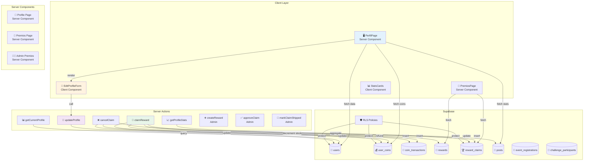

---

## Gestão de Perfil

O usuário pode visualizar e editar seu perfil, incluindo informações pessoais, links de redes sociais e bio.

### Arquitetura de Perfil

```mermaid
graph TB
    subgraph "Profile Views"
        A[🖥️ /perfil<br/>View Profile]
        B[✏️ /perfil/editar<br/>Edit Profile]
        C[👁️ /usuarios/[id]<br/>Public Profile]
    end

    subgraph "Profile Data"
        D[👤 Basic Info<br/>name, email, avatar]
        E[📱 Social Links<br/>instagram, tiktok, youtube]
        F[📝 Bio<br/>description]
        G[🏷️ Metadata<br/>role, is_creator, level]
    end

    subgraph "Stats Aggregation"
        H[📄 Posts Stats<br/>total, approved, likes]
        I[📅 Events Stats<br/>registered, attended]
        J[🎯 Challenges Stats<br/>participated, won]
        K[💰 Coins Balance<br/>earned, spent]
    end

    A -->|display| D
    A -->|display| E
    A -->|display| F
    A -->|display| G

    B -->|update| D
    B -->|update| E
    B -->|update| F

    A -->|aggregate| H
    A -->|aggregate| I
    A -->|aggregate| J
    A -->|aggregate| K

    C -->|public view| D
    C -->|public view| E
    C -->|public view| F

    style A fill:#e3f2fd
    style B fill:#fff3e0
    style H fill:#e8f5e9
    style K fill:#f3e5f5
```

### Fluxo de Visualização de Perfil

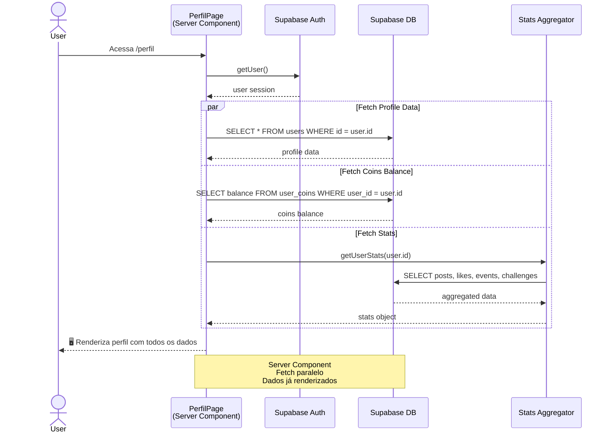

### Fluxo de Edição de Perfil

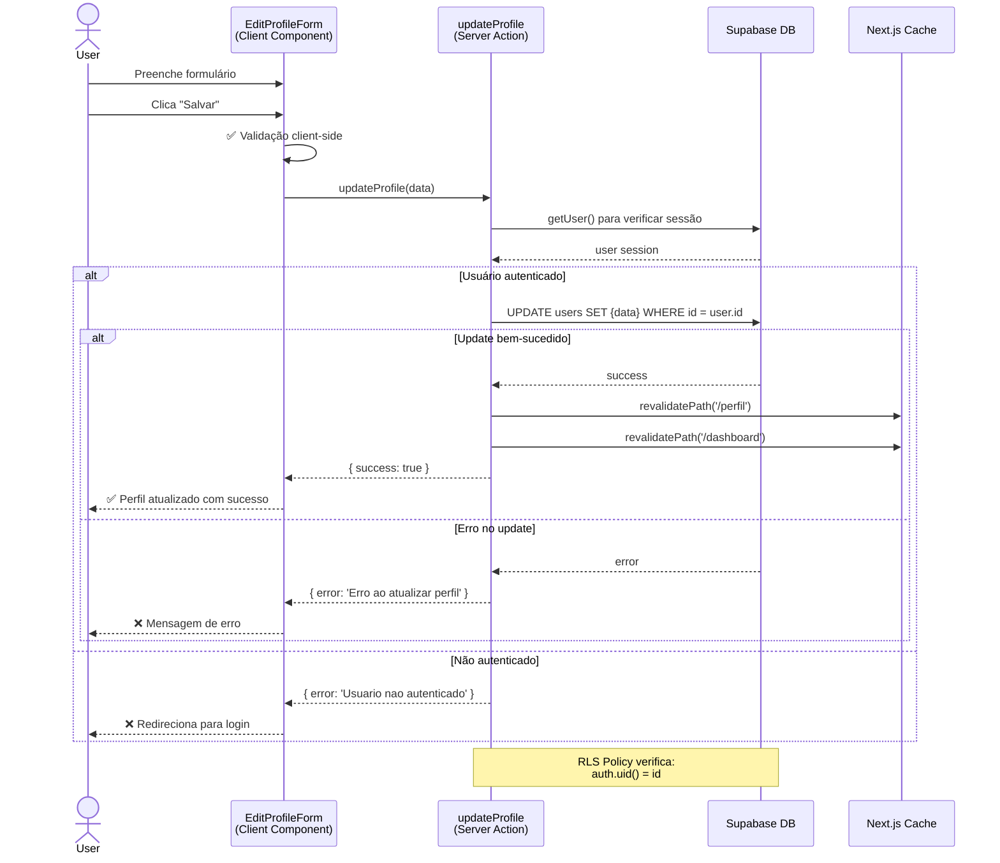

### Código: Server Action updateProfile

```typescript
// src/actions/profile.ts
'use server';

export async function updateProfile(data: UpdateProfileData): Promise<ActionResponse> {
  const supabase = await createClient();

  // 1. Verificar autenticação
  const { data: { user } } = await supabase.auth.getUser();
  if (!user) {
    return { error: 'Usuario nao autenticado' };
  }

  // 2. Atualizar perfil (RLS protege)
  const { error } = await supabase
    .from('users')
    .update({
      ...data,
      updated_at: new Date().toISOString(),
    })
    .eq('id', user.id);

  if (error) {
    return { error: 'Erro ao atualizar perfil' };
  }

  // 3. Revalidar cache
  revalidatePath('/perfil');
  revalidatePath('/dashboard');

  return { success: true };
}
```

### Campos do Perfil

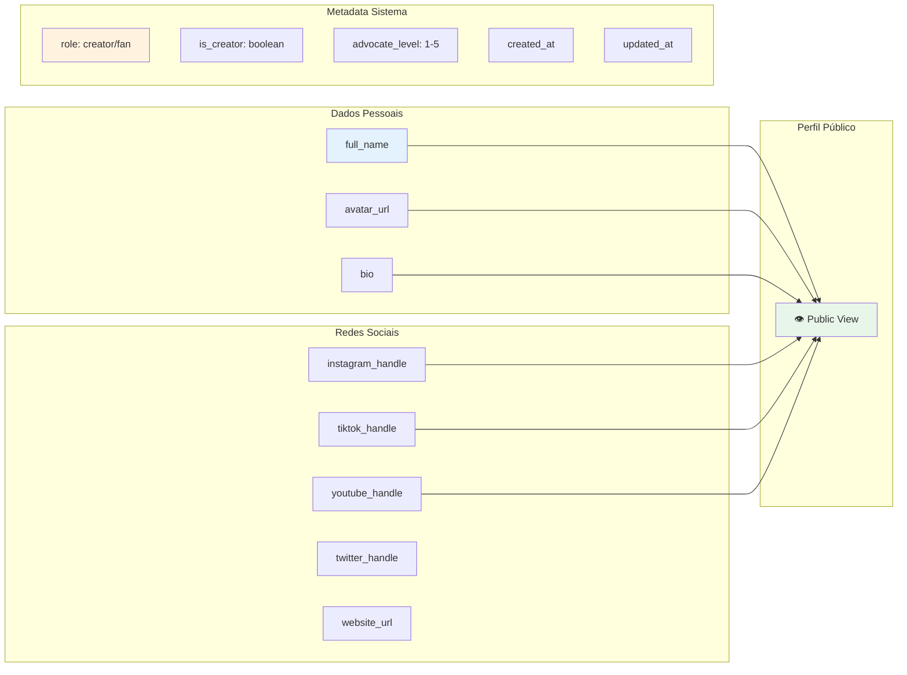

---

## Sistema de Níveis de Advocate

O sistema de níveis incentiva o engajamento progressivo dos usuários através de 5 níveis de advocate.

### Níveis de Advocate

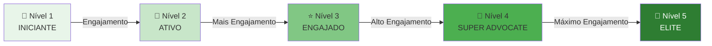

### Critérios de Progressão

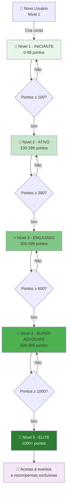

### Tabela de Pontuação

| Ação | Pontos | Moedas (❤️) |
|------|--------|-------------|
| Post aprovado | 10 pontos | 5 ❤️ |
| Like recebido | 1 ponto | - |
| Comentário | 2 pontos | - |
| Participação em evento | 20 pontos | 10 ❤️ |
| Desafio físico concluído | 50 pontos | 20-100 ❤️ |
| Desafio engajamento | 15 pontos | 10 ❤️ |
| Check-in em evento | 10 pontos | 5 ❤️ |

### Benefícios por Nível

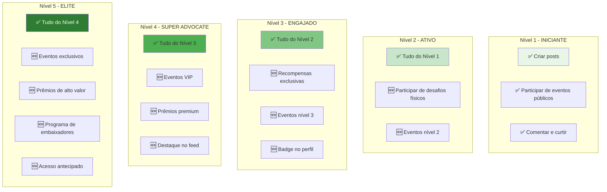

### Validação de Nível em Eventos

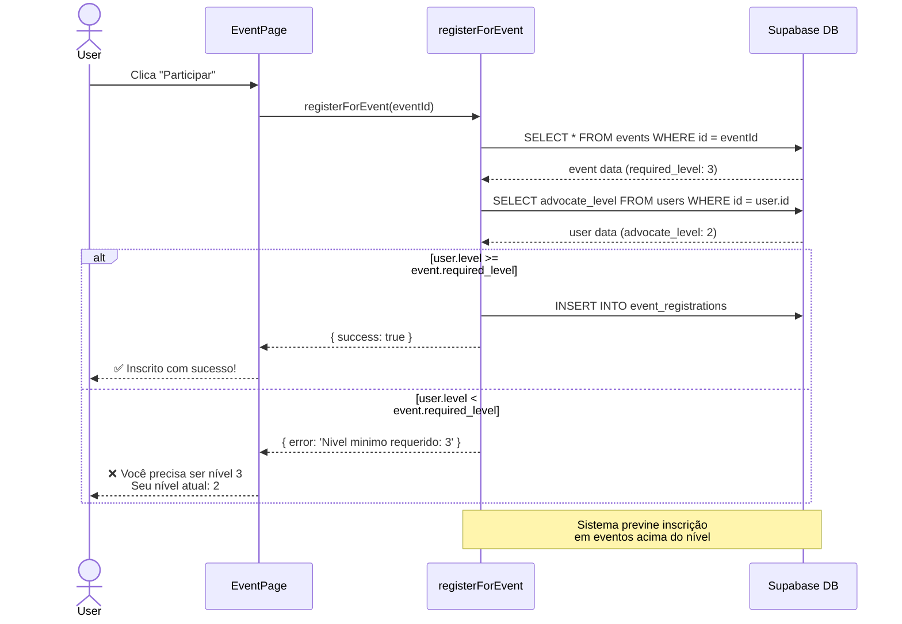

### Código: Verificação de Nível

```typescript
// src/actions/events.ts - registerForEvent()

// Verificar nivel do usuario
const { data: userProfile } = await supabase
  .from('users')
  .select('advocate_level')
  .eq('id', user.id)
  .single();

if (userProfile && event.required_level > (userProfile.advocate_level || 1)) {
  return { error: `Nivel minimo requerido: ${event.required_level}` };
}
```

---

## Resgate de Recompensas

Os usuários podem resgatar prêmios físicos e digitais usando seu saldo de moedas (corações ❤️).

### Arquitetura de Recompensas

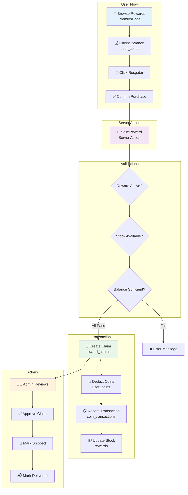

### Fluxo Completo de Resgate

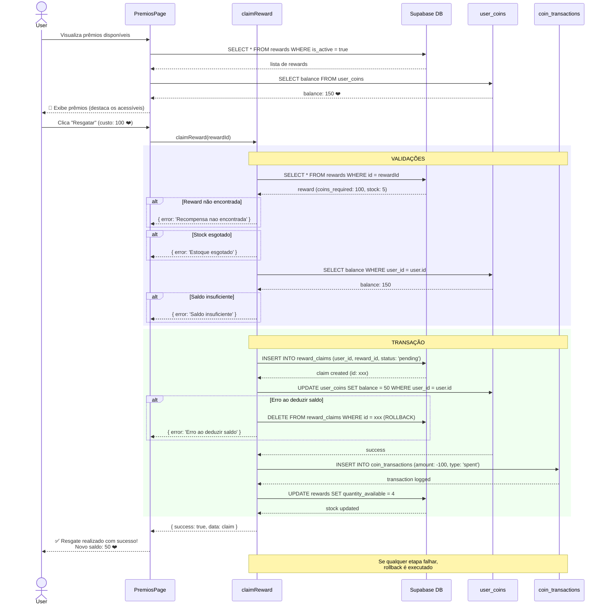

### Estados de um Resgate

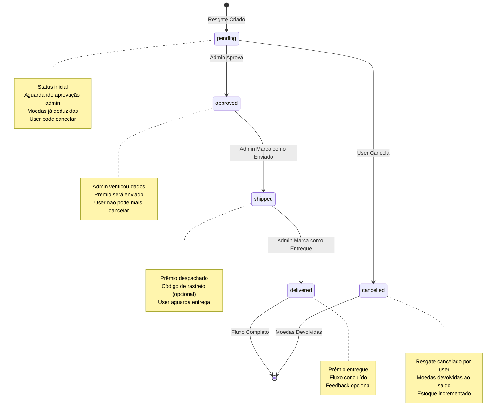

### Código: Server Action claimReward

```typescript
// src/actions/rewards.ts
'use server';

export async function claimReward(rewardId: string): Promise<ActionResponse> {
  const supabase = await createClient();

  // 1. Verificar autenticação
  const { data: { user } } = await supabase.auth.getUser();
  if (!user) return { error: 'Usuario nao autenticado' };

  // 2. Buscar recompensa
  const { data: reward } = await supabase
    .from('rewards')
    .select('*')
    .eq('id', rewardId)
    .eq('is_active', true)
    .single();

  if (!reward) return { error: 'Recompensa nao encontrada' };
  if (reward.quantity_available <= 0) return { error: 'Estoque esgotado' };

  // 3. Verificar saldo
  const { data: userCoins } = await supabase
    .from('user_coins')
    .select('balance')
    .eq('user_id', user.id)
    .single();

  if (!userCoins || userCoins.balance < reward.coins_required) {
    return { error: 'Saldo insuficiente' };
  }

  // 4. Criar resgate
  const { data: claim, error: claimError } = await supabase
    .from('reward_claims')
    .insert({
      user_id: user.id,
      reward_id: rewardId,
      status: 'pending',
      coins_spent: reward.coins_required,
    })
    .select()
    .single();

  if (claimError) return { error: 'Erro ao criar resgate' };

  // 5. Deduzir moedas
  const { error: balanceError } = await supabase
    .from('user_coins')
    .update({
      balance: userCoins.balance - reward.coins_required,
      updated_at: new Date().toISOString(),
    })
    .eq('user_id', user.id);

  if (balanceError) {
    // ROLLBACK: Deletar resgate
    await supabase.from('reward_claims').delete().eq('id', claim.id);
    return { error: 'Erro ao deduzir saldo' };
  }

  // 6. Registrar transação
  await supabase.from('coin_transactions').insert({
    user_id: user.id,
    amount: -reward.coins_required,
    type: 'spent',
    description: `Resgate: ${reward.name}`,
    reference_id: claim.id,
  });

  // 7. Decrementar estoque
  await supabase
    .from('rewards')
    .update({ quantity_available: reward.quantity_available - 1 })
    .eq('id', rewardId);

  // 8. Revalidar cache
  revalidatePath('/premios');
  revalidatePath('/dashboard');

  return { success: true, data: claim };
}
```

### Fluxo de Cancelamento de Resgate

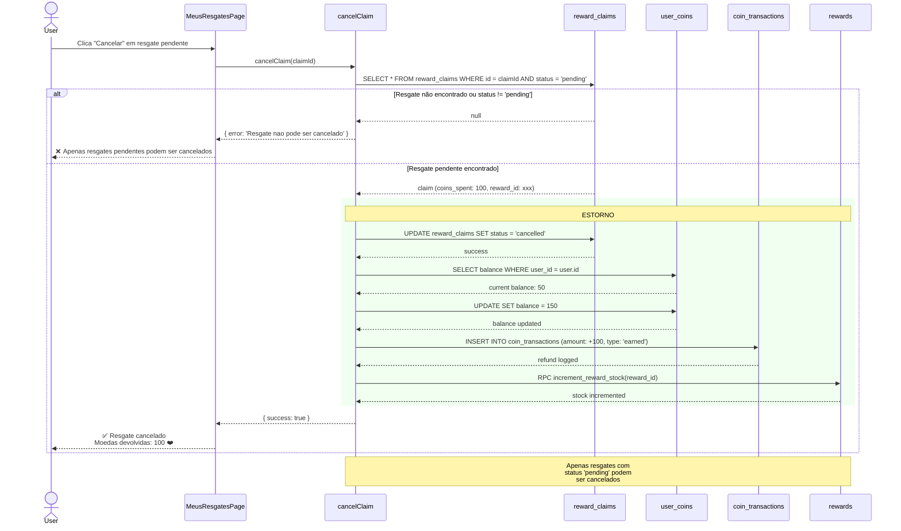

### Tipos de Recompensas

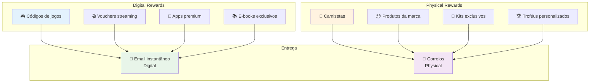

---

## Histórico de Participações

O histórico consolida todas as atividades do usuário na plataforma em uma timeline unificada.

### Fontes de Dados

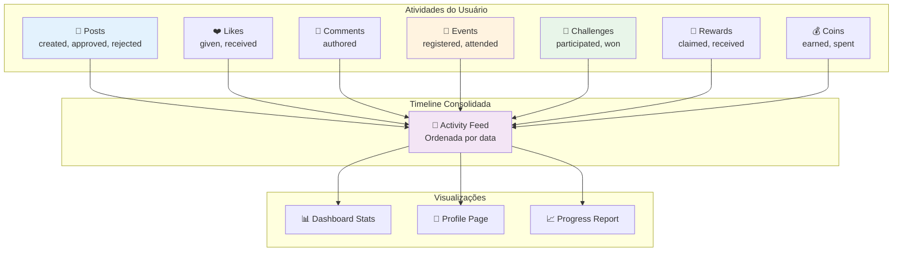

### Estrutura do Histórico

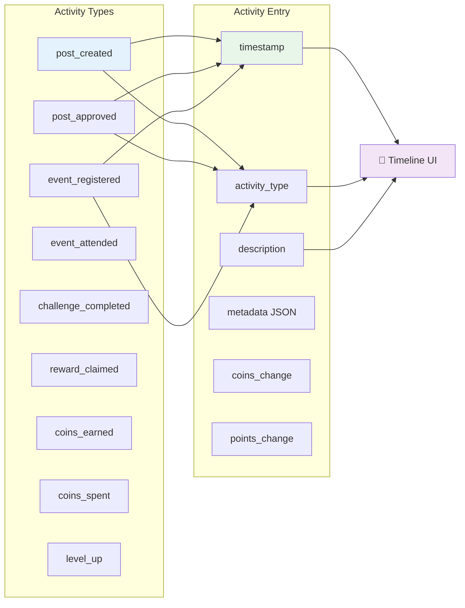

### Timeline Visual

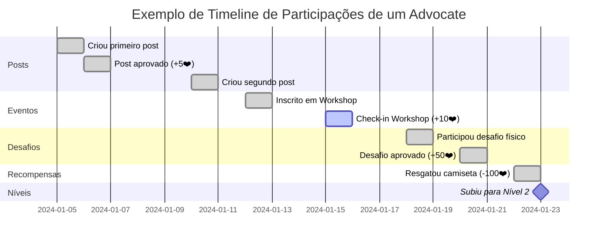

### Agregação de Estatísticas

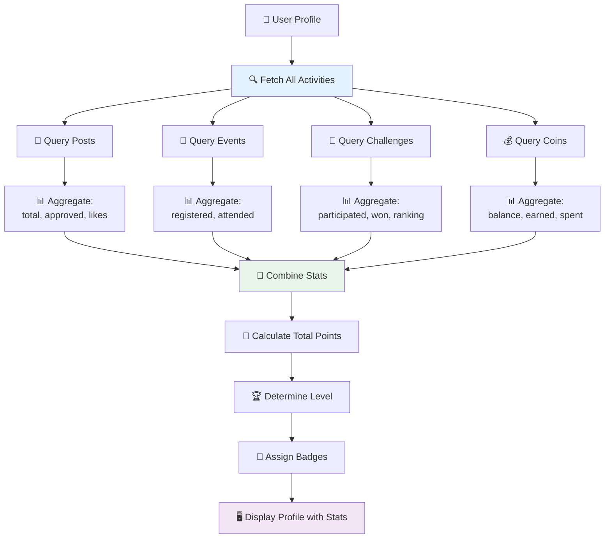

### Código: Agregação de Stats

```typescript
// src/lib/supabase/queries.ts

export async function getUserStats(userId: string) {
  const supabase = await createClient();

  // Buscar posts
  const { data: posts } = await supabase
    .from('posts')
    .select('id, status, likes_count')
    .eq('user_id', userId);

  const allPosts = posts || [];
  const approvedPosts = allPosts.filter((p) => p.status === 'approved');
  const totalLikes = approvedPosts.reduce((sum, p) => sum + (p.likes_count || 0), 0);

  // Buscar eventos
  const { data: events } = await supabase
    .from('event_registrations')
    .select('status')
    .eq('user_id', userId);

  const totalEvents = events?.length || 0;
  const attendedEvents = events?.filter(e => e.status === 'attended').length || 0;

  // Buscar desafios
  const { data: challenges } = await supabase
    .from('challenge_participants')
    .select('status')
    .eq('user_id', userId);

  const totalChallenges = challenges?.length || 0;
  const approvedChallenges = challenges?.filter(c => c.status === 'approved').length || 0;

  // Buscar moedas
  const { data: coins } = await supabase
    .from('user_coins')
    .select('balance')
    .eq('user_id', userId)
    .single();

  const { data: transactions } = await supabase
    .from('coin_transactions')
    .select('amount, type')
    .eq('user_id', userId);

  const totalEarned = transactions?.filter(t => t.type === 'earned')
    .reduce((sum, t) => sum + t.amount, 0) || 0;
  const totalSpent = transactions?.filter(t => t.type === 'spent')
    .reduce((sum, t) => sum + Math.abs(t.amount), 0) || 0;

  return {
    posts: {
      total: allPosts.length,
      approved: approvedPosts.length,
      total_likes: totalLikes,
    },
    events: {
      registered: totalEvents,
      attended: attendedEvents,
    },
    challenges: {
      participated: totalChallenges,
      approved: approvedChallenges,
    },
    coins: {
      balance: coins?.balance || 0,
      earned: totalEarned,
      spent: totalSpent,
    },
  };
}
```

### Exibição no Perfil

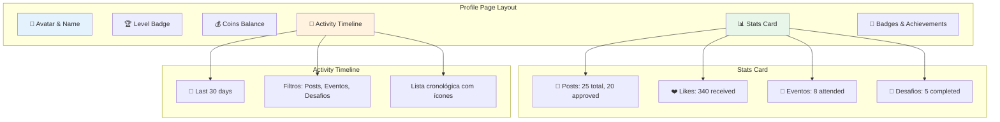

---

## Fluxo Admin - Gestão de Recompensas

Admins gerenciam o catálogo de recompensas e aprovam resgates.

### Painel Admin de Recompensas

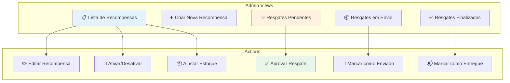

### Fluxo Admin: Criar Recompensa

```mermaid
sequenceDiagram
    actor Admin
    participant Form as CreateRewardForm
    participant Action as createReward
    participant DB as Supabase DB
    participant Cache as Next.js Cache

    Admin->>Form: Preenche formulário
    Note over Form: name, description, image_url<br/>coins_cost, stock, type (digital/physical)

    Admin->>Form: Clica "Criar"
    Form->>Action: createReward(data)

    Action->>DB: SELECT role FROM users WHERE id = admin.id

    alt Admin autorizado
        DB-->>Action: role: 'admin' ou is_creator: true

        Action->>DB: INSERT INTO rewards {data}
        DB-->>Action: reward created

        Action->>Cache: revalidatePath('/premios')
        Action->>Cache: revalidatePath('/admin/premios')

        Action-->>Form: { success: true, data: reward }
        Form-->>Admin: ✅ Recompensa criada com sucesso
    else Não autorizado
        DB-->>Action: role: 'fan'
        Action-->>Form: { error: 'Acesso nao autorizado' }
        Form-->>Admin: ❌ Sem permissão
    end

    Note over Action,DB: RLS Policy verifica:<br/>role = 'admin' OR is_creator = true
```

### Fluxo Admin: Aprovar Resgate

```mermaid
sequenceDiagram
    actor Admin
    participant Page as AdminPremiosPage
    participant Action as approveClaim
    participant DB as reward_claims
    participant User as Notification

    Admin->>Page: Visualiza resgates pendentes
    Page->>DB: SELECT * FROM reward_claims WHERE status = 'pending'
    DB-->>Page: lista de claims pendentes

    Page-->>Admin: 📋 Mostra lista (nome user, prêmio, data)

    Admin->>Page: Clica "Aprovar" em resgate
    Page->>Action: approveClaim(claimId)

    Action->>DB: SELECT role FROM users

    alt Admin autorizado
        DB-->>Action: role: 'admin'

        Action->>DB: UPDATE reward_claims SET status = 'approved'
        DB-->>Action: success

        Action-->>Page: { success: true }
        Page-->>Admin: ✅ Resgate aprovado

        opt Notificação (future feature)
            Page->>User: 🔔 "Seu resgate foi aprovado!"
        end
    else Não autorizado
        DB-->>Action: role: 'fan'
        Action-->>Page: { error: 'Acesso nao autorizado' }
        Page-->>Admin: ❌ Sem permissão
    end

    Note over Action,DB: Após aprovação, admin deve<br/>providenciar envio e marcar<br/>como 'shipped' depois
```

### Pipeline de Entrega

```mermaid
stateDiagram-v2
    direction LR

    [*] --> pending: User resgata prêmio<br/>Moedas deduzidas
    pending --> approved: Admin aprova<br/>Verifica dados de entrega
    approved --> shipped: Admin marca enviado<br/>Adiciona código rastreio (opcional)
    shipped --> delivered: Admin confirma entrega<br/>ou User confirma recebimento
    delivered --> [*]: Fluxo completo

    note right of pending
        🕐 Aguardando revisão admin
        ⏱️ SLA: 24-48h
    end note

    note right of approved
        📋 Admin verificou dados
        📦 Preparando envio
    end note

    note right of shipped
        🚚 Em trânsito
        📍 Rastreamento ativo
    end note

    note right of delivered
        ✅ Prêmio recebido
        ⭐ Feedback opcional
    end note
```

### Código: Server Action approveClaim

```typescript
// src/actions/rewards.ts
'use server';

export async function approveClaim(claimId: string): Promise<ActionResponse> {
  const supabase = await createClient();

  // 1. Verificar autenticação
  const { data: { user } } = await supabase.auth.getUser();
  if (!user) return { error: 'Usuario nao autenticado' };

  // 2. Verificar se é admin/creator
  const { data: profile } = await supabase
    .from('profiles')
    .select('role, is_creator')
    .eq('id', user.id)
    .single();

  if (!profile || (profile.role !== 'admin' && !profile.is_creator)) {
    return { error: 'Acesso nao autorizado' };
  }

  // 3. Atualizar status
  const { error } = await supabase
    .from('reward_claims')
    .update({ status: 'approved' })
    .eq('id', claimId);

  if (error) return { error: 'Erro ao aprovar resgate' };

  // 4. Revalidar cache
  revalidatePath('/admin/premios');

  return { success: true };
}
```

---

## Fluxo Completo de Dados

Visão integrada de como todos os sistemas se conectam.

### Arquitetura Completa: Profile & Rewards

```mermaid
graph TB
    subgraph "Client Layer"
        A[🖥️ PerfilPage<br/>Server Component]
        B[✏️ EditProfileForm<br/>Client Component]
        C[🎁 PremiosPage<br/>Server Component]
        D[📊 StatsCards<br/>Client Component]
        E[📜 ActivityTimeline<br/>Client Component]
    end

    subgraph "Server Actions"
        F[👤 updateProfile]
        G[📊 getProfileStats]
        H[💰 getUserCoins]
        I[🎁 claimReward]
        J[❌ cancelClaim]
        K[➕ createReward<br/>Admin]
        L[✅ approveClaim<br/>Admin]
    end

    subgraph "Server Components"
        M[📄 Profile Page<br/>SSR]
        N[🎁 Rewards Page<br/>SSR]
        O[👨‍💼 Admin Dashboard<br/>SSR]
    end

    subgraph "Database - Supabase"
        P[(👥 users<br/>profile data, advocate_level)]
        Q[(💰 user_coins<br/>balance)]
        R[(📝 coin_transactions<br/>history)]
        S[(🎁 rewards<br/>catalog)]
        T[(🏆 reward_claims<br/>redemptions)]
        U[(📄 posts<br/>user content)]
        V[(📅 event_registrations<br/>participation)]
        W[(🎯 challenge_participants<br/>challenges)]
    end

    subgraph "RLS Policies"
        X[🛡️ User Profile<br/>Owner or Public Read]
        Y[🛡️ User Coins<br/>Owner Only]
        Z[🛡️ Reward Claims<br/>Owner + Admin]
        AA[🛡️ Rewards<br/>Public Read, Admin Write]
    end

    A -->|fetch| M
    B -->|submit| F
    C -->|fetch| N
    D -->|aggregate| G
    E -->|display| G

    F -->|update| P
    G -->|query| U
    G -->|query| V
    G -->|query| W
    H -->|query| Q
    I -->|insert| T
    I -->|update| Q
    I -->|insert| R

    M -->|read| P
    M -->|read| Q
    M -->|read| U
    N -->|read| S
    N -->|read| T
    O -->|manage| S
    O -->|manage| T

    X -->|protect| P
    Y -->|protect| Q
    Z -->|protect| T
    AA -->|protect| S

    style A fill:#e3f2fd
    style F fill:#f3e5f5
    style P fill:#e8f5e9
    style X fill:#fff3e0
```

### Diagrama ERD: Relacionamentos de Dados

```mermaid
erDiagram
    USERS ||--o{ USER_COINS : has
    USERS ||--o{ COIN_TRANSACTIONS : has
    USERS ||--o{ REWARD_CLAIMS : makes
    USERS ||--o{ POSTS : creates
    USERS ||--o{ EVENT_REGISTRATIONS : participates
    USERS ||--o{ CHALLENGE_PARTICIPANTS : joins

    REWARDS ||--o{ REWARD_CLAIMS : redeemed_in

    USERS {
        uuid id PK
        string full_name
        string avatar_url
        text bio
        string instagram_handle
        string tiktok_handle
        int advocate_level
        string role
        boolean is_creator
        timestamp created_at
    }

    USER_COINS {
        uuid id PK
        uuid user_id FK
        int balance
        timestamp updated_at
    }

    COIN_TRANSACTIONS {
        uuid id PK
        uuid user_id FK
        int amount
        string type
        text description
        uuid reference_id
        timestamp created_at
    }

    REWARDS {
        uuid id PK
        string name
        text description
        string image_url
        int coins_required
        int quantity_available
        string type
        boolean is_active
        timestamp created_at
    }

    REWARD_CLAIMS {
        uuid id PK
        uuid user_id FK
        uuid reward_id FK
        string status
        int coins_spent
        timestamp created_at
    }

    POSTS {
        uuid id PK
        uuid user_id FK
        text content
        string status
        int likes_count
        timestamp created_at
    }

    EVENT_REGISTRATIONS {
        uuid id PK
        uuid user_id FK
        uuid event_id FK
        string status
        timestamp registration_time
    }

    CHALLENGE_PARTICIPANTS {
        uuid id PK
        uuid user_id FK
        uuid challenge_id FK
        string status
        int result_value
        timestamp created_at
    }
```

### Fluxo de Pontos e Moedas

```mermaid
flowchart TB
    Start[🎯 User Action] --> Type{Tipo de Ação}

    Type -->|Post Aprovado| PostCoins[+5 ❤️<br/>+10 pontos]
    Type -->|Like Recebido| LikePoints[+1 ponto]
    Type -->|Evento Participado| EventCoins[+10 ❤️<br/>+20 pontos]
    Type -->|Desafio Concluído| ChallengeCoins[+20-100 ❤️<br/>+50 pontos]

    PostCoins --> UpdateCoins[💰 UPDATE user_coins]
    EventCoins --> UpdateCoins
    ChallengeCoins --> UpdateCoins

    UpdateCoins --> LogTransaction[📝 INSERT coin_transactions]

    PostCoins --> UpdatePoints[🎯 Calcular Pontos Totais]
    LikePoints --> UpdatePoints
    EventCoins --> UpdatePoints
    ChallengeCoins --> UpdatePoints

    UpdatePoints --> CheckLevel{Pontos ≥<br/>Próximo Nível?}

    CheckLevel -->|Sim| LevelUp[🎉 LEVEL UP!<br/>UPDATE advocate_level]
    CheckLevel -->|Não| End[✅ Ação Completa]

    LevelUp --> Notify[🔔 Notificação de Level Up]
    Notify --> UnlockFeatures[🔓 Desbloquear Novos Recursos]
    UnlockFeatures --> End

    style PostCoins fill:#e8f5e9
    style EventCoins fill:#e8f5e9
    style ChallengeCoins fill:#e8f5e9
    style LevelUp fill:#f3e5f5
```

### Timeline Integrada: Exemplo Real

```mermaid
gantt
    title Jornada Completa de um Advocate - Janeiro 2024
    dateFormat YYYY-MM-DD

    section Perfil
    Cadastro na plataforma          :milestone, 2024-01-01, 0d
    Upload de avatar                :done, 2024-01-02, 1d

    section Posts
    Primeiro post criado            :done, 2024-01-03, 1d
    Post aprovado (+5❤️)            :done, 2024-01-04, 1d
    Segundo post (+5❤️)             :done, 2024-01-08, 1d
    Terceiro post (+5❤️)            :done, 2024-01-12, 1d

    section Eventos
    Inscrito em Workshop Online     :done, 2024-01-05, 1d
    Participou Workshop (+10❤️)     :done, 2024-01-10, 1d
    Inscrito em Meetup Presencial   :done, 2024-01-15, 1d
    Check-in Meetup (+10❤️)         :done, 2024-01-20, 1d

    section Desafios
    Inscrito desafio 100 flexões    :done, 2024-01-14, 1d
    Desafio aprovado (+50❤️)        :done, 2024-01-16, 1d
    Desafio engajamento IG (+10❤️)  :done, 2024-01-22, 1d

    section Recompensas
    Resgatou camiseta (-100❤️)      :done, 2024-01-25, 1d
    Admin aprovou resgate           :done, 2024-01-26, 1d
    Prêmio enviado                  :active, 2024-01-28, 3d

    section Níveis
    Nível 1 - INICIANTE             :done, 2024-01-01, 17d
    Subiu para Nível 2 - ATIVO      :milestone, 2024-01-18, 0d
```

---

## Políticas RLS

Documentação completa das políticas de segurança Row Level Security.

### RLS: users

```sql
-- Leitura: Todos podem ver perfis públicos
CREATE POLICY "Public profiles are viewable by everyone"
ON users FOR SELECT
USING (true);

-- Atualização: Apenas o próprio usuário pode atualizar seu perfil
CREATE POLICY "Users can update own profile"
ON users FOR UPDATE
USING (auth.uid() = id);
```

### RLS: user_coins

```sql
-- Leitura: Apenas o próprio usuário pode ver seu saldo
CREATE POLICY "Users can view own coins"
ON user_coins FOR SELECT
USING (auth.uid() = user_id);

-- Atualização: Server Actions gerenciam (via service role)
-- Usuários NÃO podem atualizar diretamente
```

### RLS: coin_transactions

```sql
-- Leitura: Apenas o próprio usuário pode ver suas transações
CREATE POLICY "Users can view own transactions"
ON coin_transactions FOR SELECT
USING (auth.uid() = user_id);

-- Inserção: Apenas Server Actions (service role)
-- Garante auditoria confiável
```

### RLS: rewards

```sql
-- Leitura: Todos podem ver recompensas ativas
CREATE POLICY "Active rewards are viewable by everyone"
ON rewards FOR SELECT
USING (is_active = true);

-- Gestão: Apenas admins/creators
CREATE POLICY "Admins can manage rewards"
ON rewards FOR ALL
USING (
  EXISTS (
    SELECT 1 FROM users
    WHERE id = auth.uid()
    AND (role = 'admin' OR is_creator = true)
  )
);
```

### RLS: reward_claims

```sql
-- Leitura: User vê próprios resgates, Admin vê todos
CREATE POLICY "Users can view own claims"
ON reward_claims FOR SELECT
USING (
  auth.uid() = user_id
  OR EXISTS (
    SELECT 1 FROM users
    WHERE id = auth.uid()
    AND (role = 'admin' OR is_creator = true)
  )
);

-- Inserção: Apenas via Server Action (validações server-side)
-- Atualização: Apenas admins (aprovar, enviar, entregar)
CREATE POLICY "Admins can update claims"
ON reward_claims FOR UPDATE
USING (
  EXISTS (
    SELECT 1 FROM users
    WHERE id = auth.uid()
    AND (role = 'admin' OR is_creator = true)
  )
);
```

### Matriz de Permissões

| Tabela | Ação | Advocate | Admin | Service Role |
|--------|------|----------|-------|--------------|
| `users` | SELECT | ✅ Todos (público) | ✅ Todos | ✅ Todos |
| `users` | UPDATE | ✅ Próprio perfil | ✅ Todos | ✅ Todos |
| `user_coins` | SELECT | ✅ Próprio saldo | ✅ Todos | ✅ Todos |
| `user_coins` | UPDATE | ❌ Não | ❌ Não | ✅ Sim |
| `coin_transactions` | SELECT | ✅ Próprias | ✅ Todas | ✅ Todas |
| `coin_transactions` | INSERT | ❌ Não | ❌ Não | ✅ Sim |
| `rewards` | SELECT | ✅ Ativos | ✅ Todos | ✅ Todos |
| `rewards` | INSERT/UPDATE/DELETE | ❌ Não | ✅ Sim | ✅ Sim |
| `reward_claims` | SELECT | ✅ Próprios | ✅ Todos | ✅ Todos |
| `reward_claims` | INSERT | ❌ Via Action | ❌ Via Action | ✅ Sim |
| `reward_claims` | UPDATE | ❌ Não | ✅ Status | ✅ Sim |

---

## Arquivos Relacionados

### Server Actions

```
src/actions/
├── profile.ts                 # Gestão de perfil
│   ├── updateProfile()        # Atualizar dados do perfil
│   ├── getCurrentProfile()    # Buscar perfil atual
│   ├── getProfileStats()      # Estatísticas agregadas
│   └── getPublicProfile()     # Perfil público de usuário
│
└── rewards.ts                 # Sistema de recompensas
    ├── claimReward()          # Resgatar prêmio
    ├── cancelClaim()          # Cancelar resgate (pending)
    ├── toggleRewardActive()   # Admin: ativar/desativar
    ├── approveClaim()         # Admin: aprovar resgate
    ├── markClaimShipped()     # Admin: marcar enviado
    ├── markClaimDelivered()   # Admin: marcar entregue
    ├── createReward()         # Admin: criar recompensa
    ├── updateReward()         # Admin: atualizar recompensa
    └── addCoinsToUser()       # Admin: adicionar moedas
```

### Components

```
src/app/(dashboard)/
├── perfil/
│   ├── page.tsx               # Página de perfil (Server Component)
│   ├── editar/
│   │   └── page.tsx           # Edição de perfil (Client Component)
│   └── [userId]/
│       └── page.tsx           # Perfil público
│
├── premios/
│   └── page.tsx               # Marketplace de recompensas
│
└── admin/
    ├── premios/
    │   ├── page.tsx           # Admin: gestão de recompensas
    │   └── RewardAdminComponents.tsx  # Client Components
    └── usuarios/
        └── page.tsx           # Admin: gestão de usuários
```

### Types

```
src/types/
└── profile.ts                 # Tipos de perfil
    ├── User                   # Tipo base do usuário
    ├── PublicProfile          # Perfil público (sem dados sensíveis)
    ├── UserStats              # Estatísticas agregadas
    ├── ProfileWithStats       # Perfil + estatísticas
    └── UpdateProfileData      # Dados de atualização
```

### Database Schema

```sql
-- Perfis e níveis
users (
  id uuid PRIMARY KEY,
  full_name text,
  avatar_url text,
  bio text,
  instagram_handle text,
  tiktok_handle text,
  advocate_level int DEFAULT 1,  -- Nível do advocate (1-5)
  role text DEFAULT 'fan',
  is_creator boolean DEFAULT false,
  created_at timestamptz,
  updated_at timestamptz
)

-- Saldo de moedas
user_coins (
  id uuid PRIMARY KEY,
  user_id uuid REFERENCES users(id),
  balance int DEFAULT 0,
  updated_at timestamptz
)

-- Histórico de transações
coin_transactions (
  id uuid PRIMARY KEY,
  user_id uuid REFERENCES users(id),
  amount int NOT NULL,
  type text CHECK (type IN ('earned', 'spent')),
  description text,
  reference_id uuid,  -- ID da ação que gerou a transação
  created_at timestamptz
)

-- Catálogo de recompensas
rewards (
  id uuid PRIMARY KEY,
  name text NOT NULL,
  description text,
  image_url text,
  coins_required int NOT NULL,
  quantity_available int,  -- NULL = ilimitado
  type text CHECK (type IN ('digital', 'physical')),
  is_active boolean DEFAULT true,
  created_at timestamptz
)

-- Resgates de prêmios
reward_claims (
  id uuid PRIMARY KEY,
  user_id uuid REFERENCES users(id),
  reward_id uuid REFERENCES rewards(id),
  status text CHECK (status IN ('pending', 'approved', 'shipped', 'delivered', 'cancelled')),
  coins_spent int NOT NULL,
  created_at timestamptz
)
```

### Mapa de Responsabilidades

```mermaid
graph TB
    subgraph "Frontend Layer"
        A[PerfilPage.tsx<br/>Visualização de perfil]
        B[EditProfileForm<br/>Edição de dados]
        C[PremiosPage.tsx<br/>Marketplace]
        D[AdminPremios.tsx<br/>Gestão admin]
    end

    subgraph "Business Logic Layer"
        E[profile.ts<br/>4 actions de perfil]
        F[rewards.ts<br/>9 actions de recompensas]
        G[queries.ts<br/>Agregação de stats]
    end

    subgraph "Data Layer"
        H[(users<br/>Perfis)]
        I[(user_coins<br/>Saldos)]
        J[(coin_transactions<br/>Histórico)]
        K[(rewards<br/>Catálogo)]
        L[(reward_claims<br/>Resgates)]
    end

    A --> E
    A --> G
    B --> E
    C --> F
    C --> G
    D --> F

    E --> H
    F --> I
    F --> J
    F --> K
    F --> L
    G --> H
    G --> I
    G --> J

    style A fill:#e3f2fd
    style E fill:#f3e5f5
    style H fill:#e8f5e9
```

---

## Resumo

O sistema de **Perfil e Recompensas** da plataforma NextLOVERS oferece:

1. ✅ **Gestão de Perfil Completa**: Edição de dados pessoais, links sociais e bio
2. ✅ **Sistema de Níveis**: 5 níveis de advocate com benefícios progressivos
3. ✅ **Moedas Virtuais**: Sistema de corações (❤️) com histórico completo
4. ✅ **Marketplace de Recompensas**: Prêmios físicos e digitais
5. ✅ **Histórico Integrado**: Timeline consolidada de todas as participações
6. ✅ **Painel Admin**: Gestão completa de recompensas e resgates
7. ✅ **RLS Policies**: Segurança em todas as operações
8. ✅ **Server Actions**: Validações robustas server-side

**Tecnologias:** Next.js 15 (App Router), Supabase (Database + RLS), TypeScript, Server Actions, Server Components

**Próximos Passos:**
- Sistema de badges e conquistas visuais
- Notificações push para resgates aprovados
- Gamificação adicional (streaks, missões diárias)
- Programa de embaixadores para nível 5
- Dashboard analytics para admins
